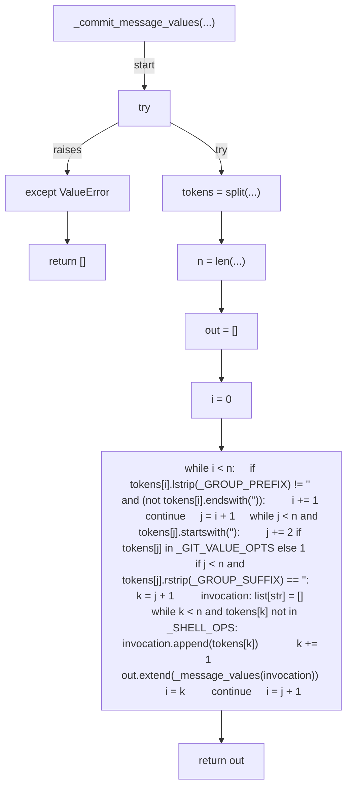
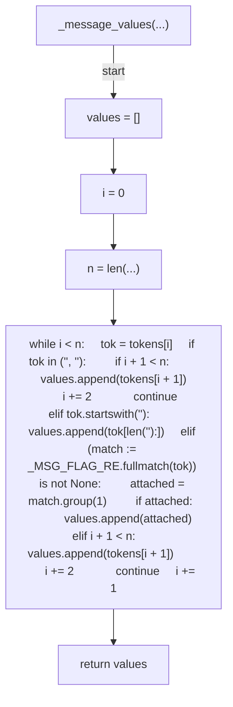
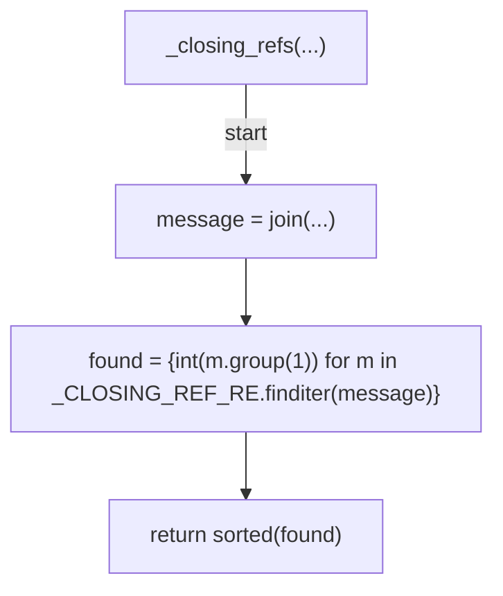
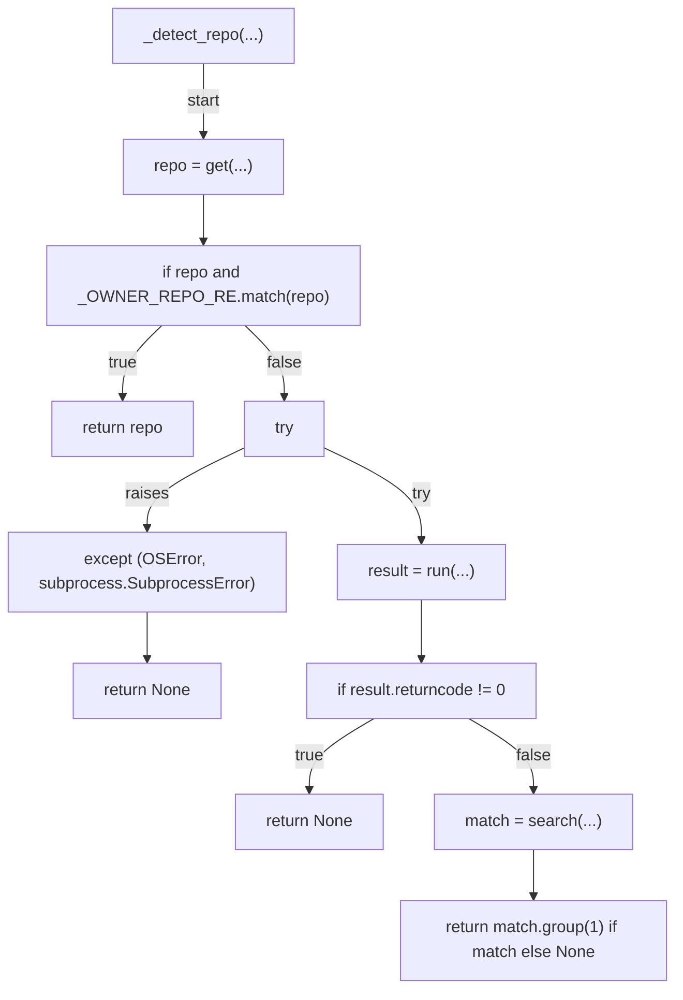
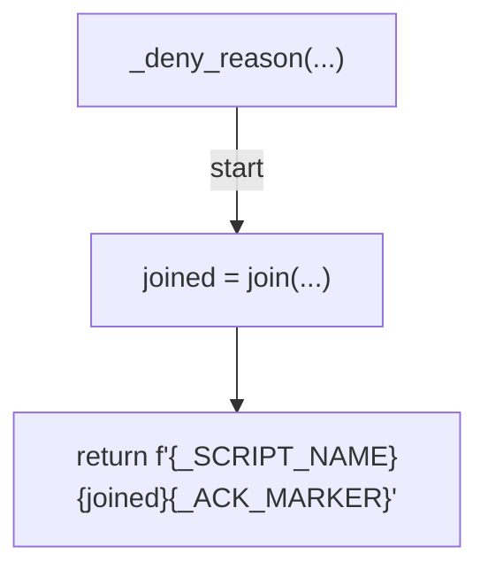
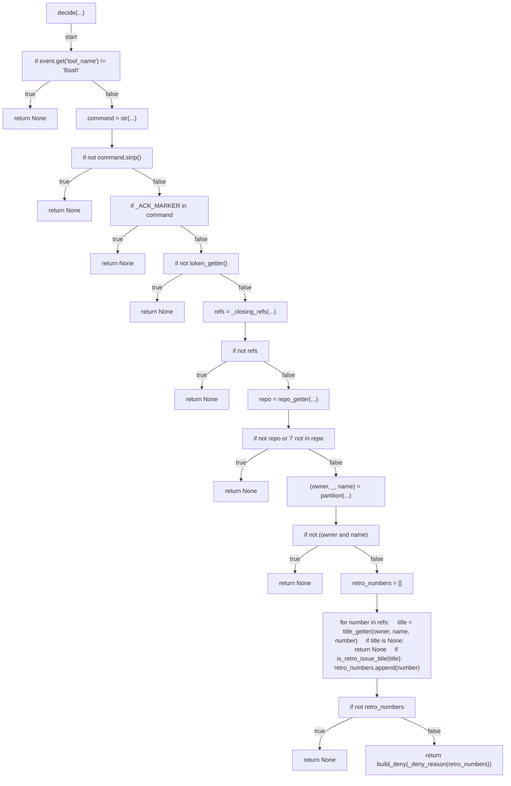
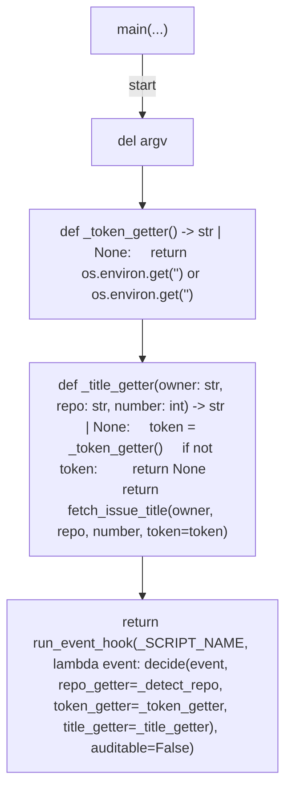

# AST graph: scripts/gate_retro_close_keyword_commit.py

This file is generated from `scripts/gate_retro_close_keyword_commit.py` by `python3 scripts/script_ast_graph.py all-doc`. Do not edit it by hand: content under `docs/generated/scripts/` is owned by the post-merge automation (refs #1540); update the source script instead.

## _commit_message_values(...)

## _message_values(...)

## _closing_refs(...)

## _detect_repo(...)

## _deny_reason(...)

## decide(...)

## main(...)

