# AST graph: scripts/gate_stop_pr_review_reply.py

This file is generated from `scripts/gate_stop_pr_review_reply.py` by `python3 scripts/script_ast_graph.py all-doc`. Do not edit it by hand: content under `docs/generated/scripts/` is owned by the post-merge automation (refs #1540); update the source script instead.

## _content_blocks(...)

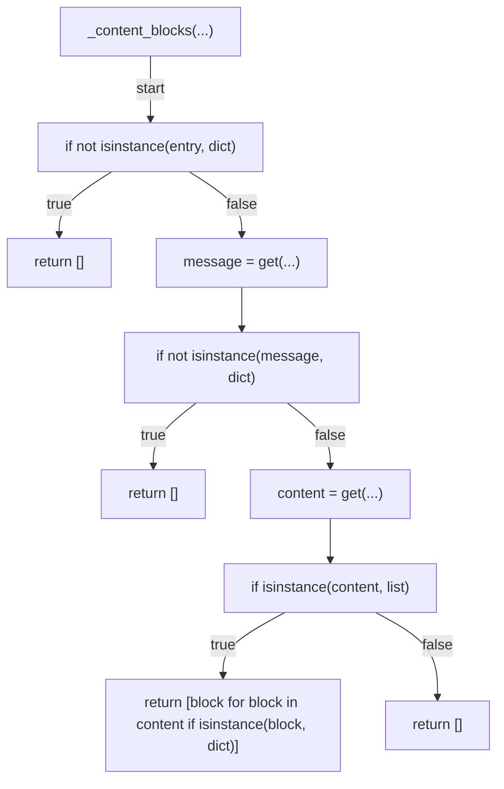

## _entry_role(...)

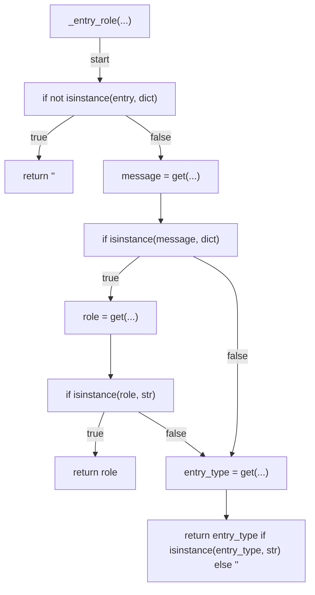

## _entry_text(...)

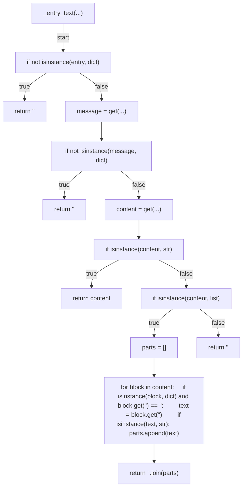

## is_review_webhook(...)

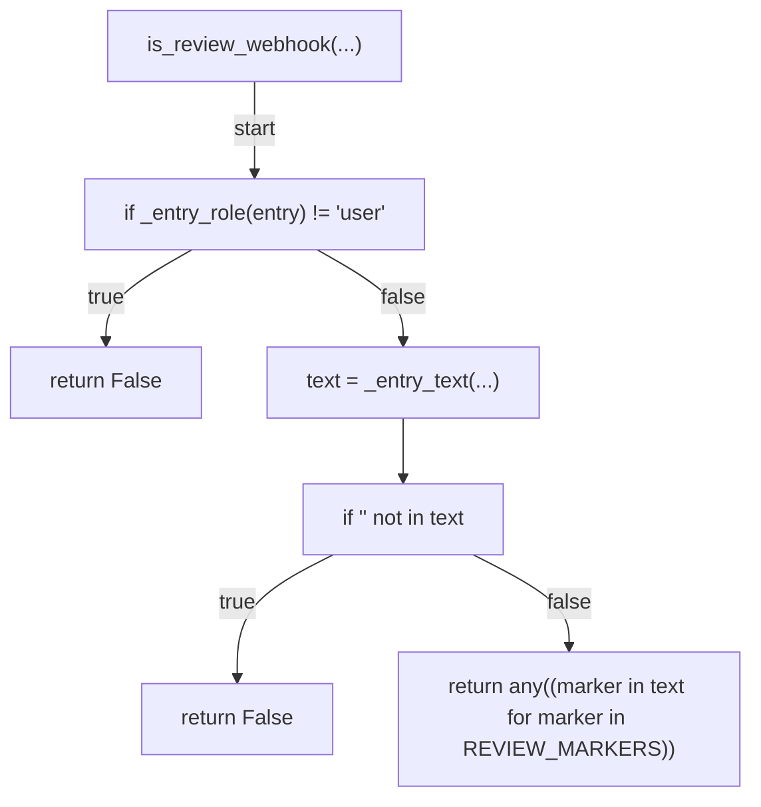

## _extract_session_login(...)

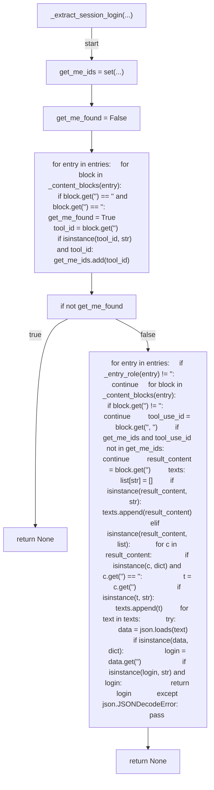

## _is_self_authored_webhook(...)

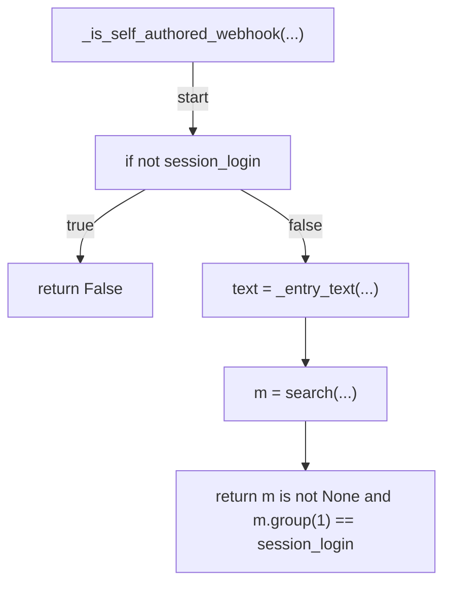

## has_reply_tool_call(...)

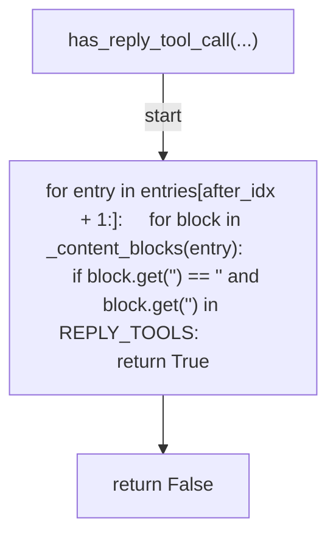

## find_unaddressed_review_webhooks(...)

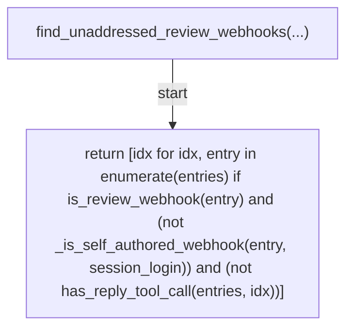

## evaluate(...)

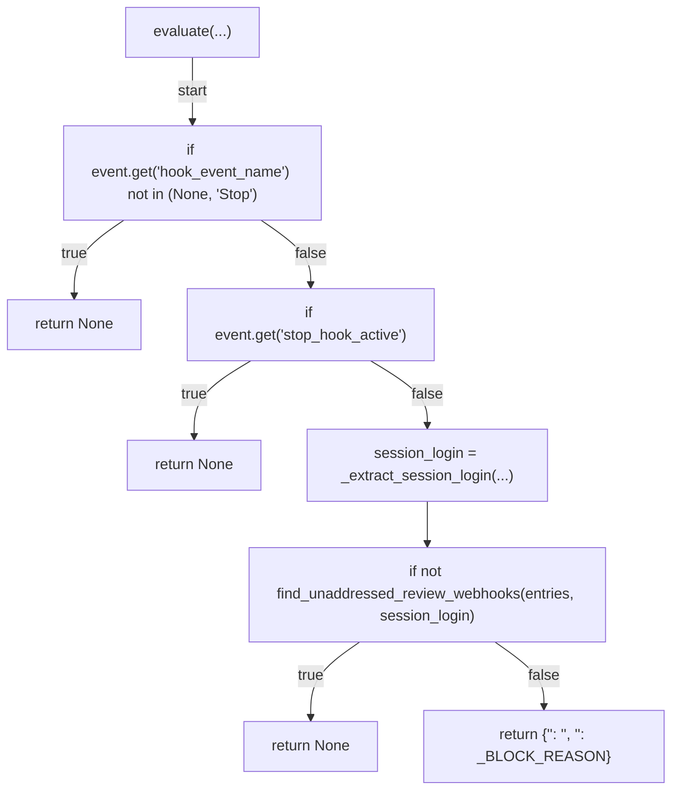

## load_transcript(...)

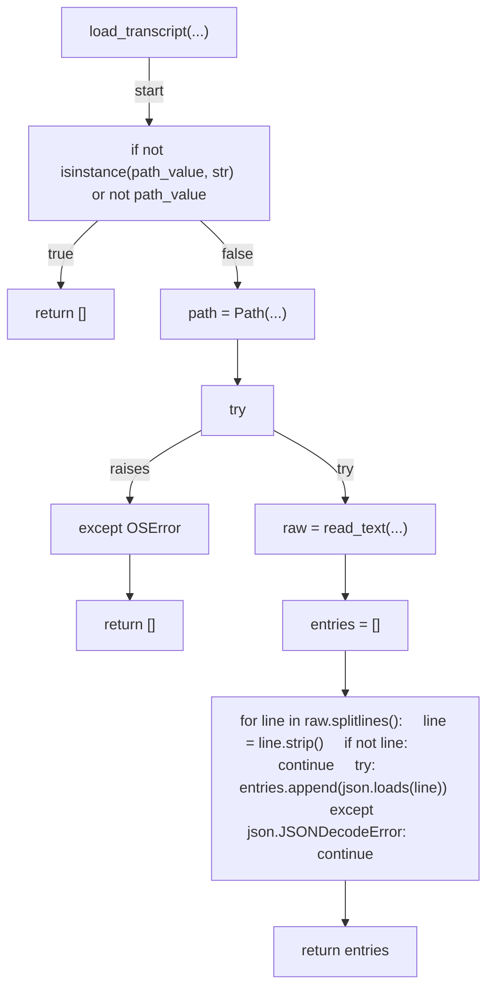

## main(...)

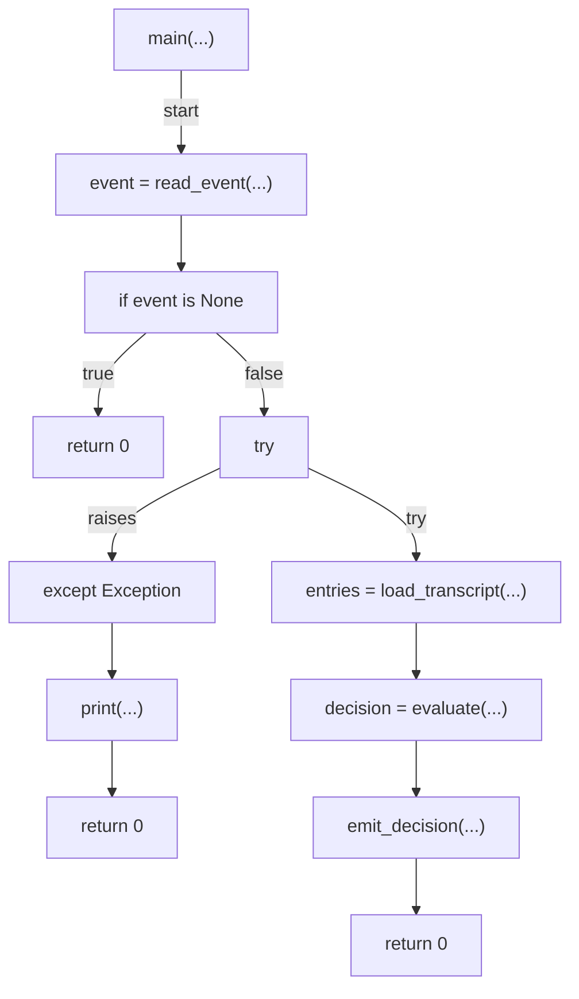
