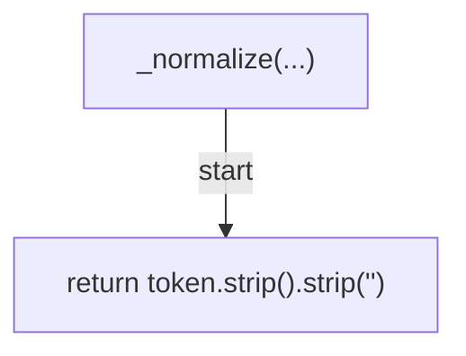
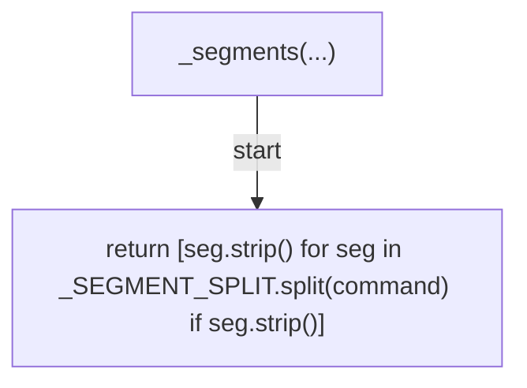
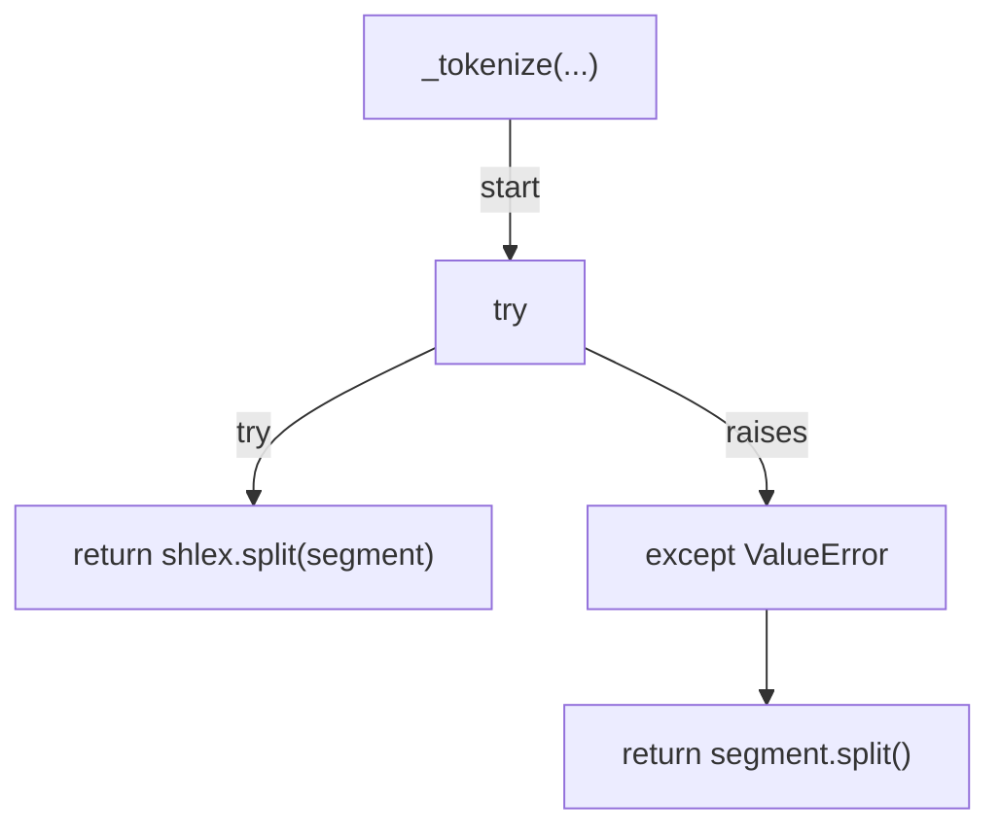
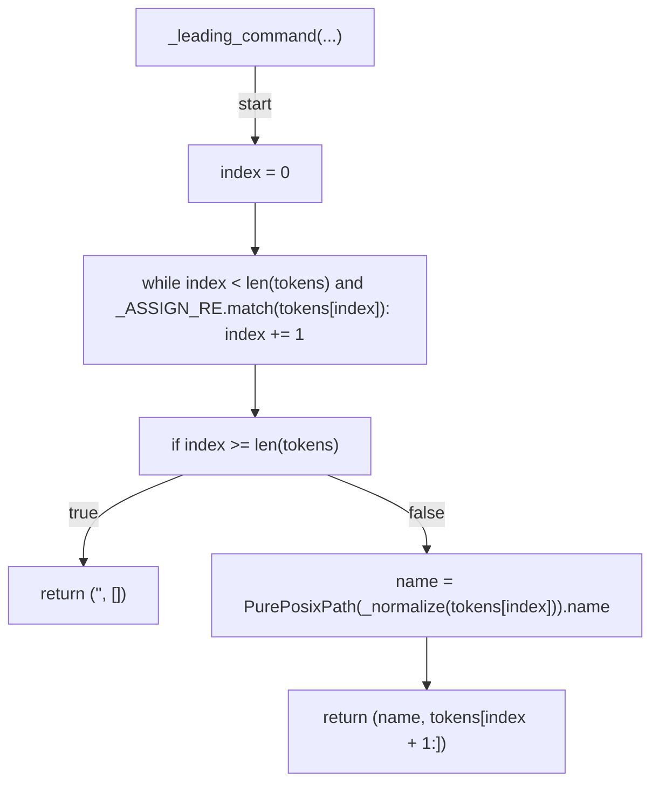
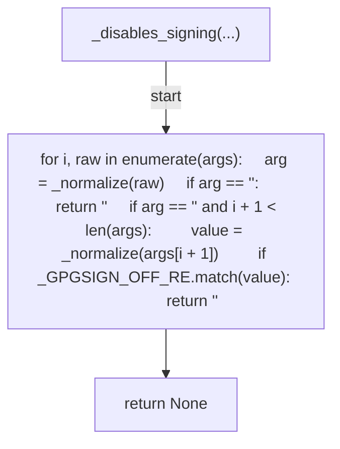
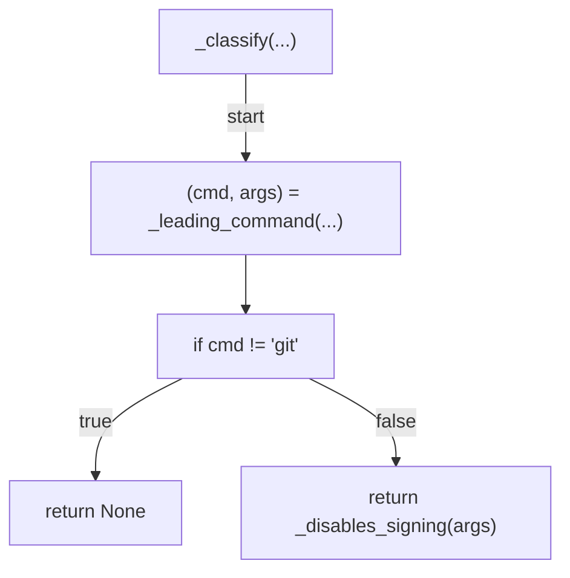
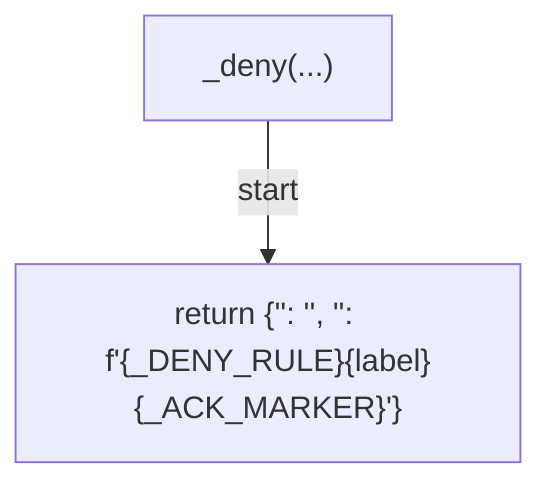
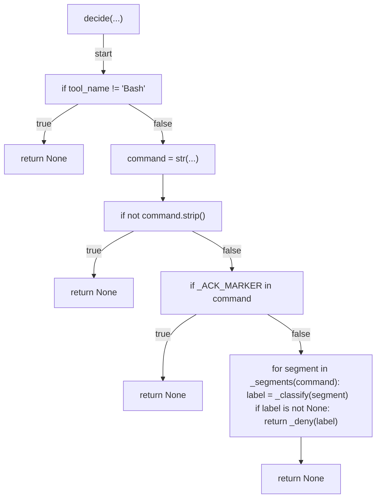
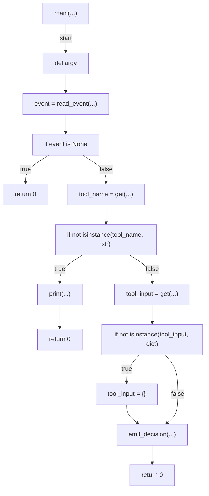

# AST graph: scripts/gate_unsigned_commit_bash.py

This file is generated from `scripts/gate_unsigned_commit_bash.py` by `python3 scripts/script_ast_graph.py all-doc`. Do not edit it by hand: content under `docs/generated/scripts/` is owned by the post-merge automation (refs #1540); update the source script instead.

## _normalize(...)

## _segments(...)

## _tokenize(...)

## _leading_command(...)

## _disables_signing(...)

## _classify(...)

## _deny(...)

## decide(...)

## main(...)

