# AST graph: scripts/gen_agent_hooks.py

This file is generated from `scripts/gen_agent_hooks.py` by `python3 scripts/script_ast_graph.py all-doc`. Do not edit it by hand: content under `docs/generated/scripts/` is owned by the post-merge automation (refs #1540); update the source script instead.

## _validate_permission_intent(...)

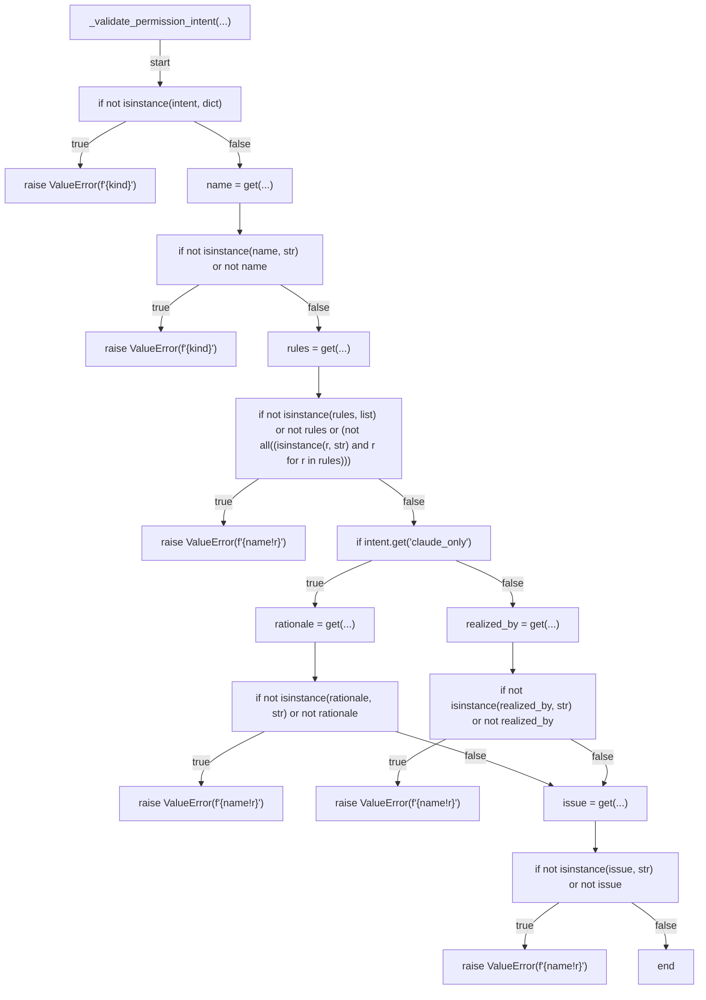

## build_claude_permissions(...)

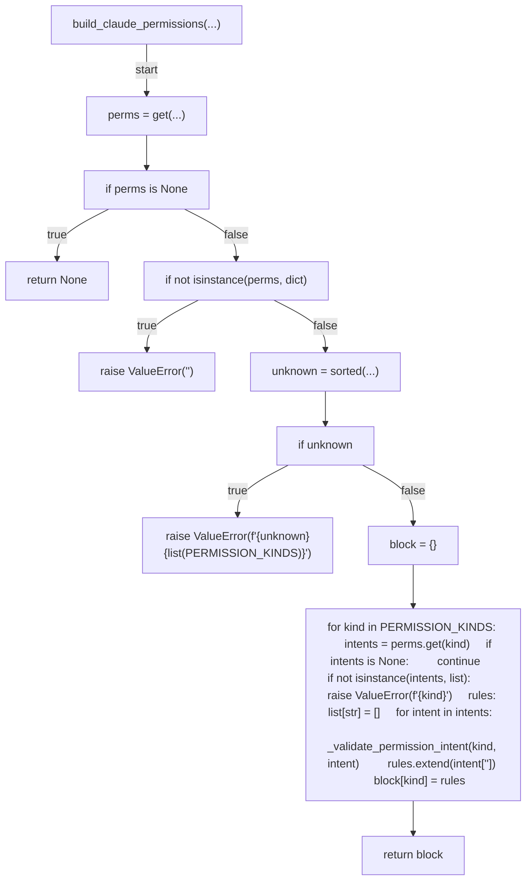

## verify_permission_parity(...)

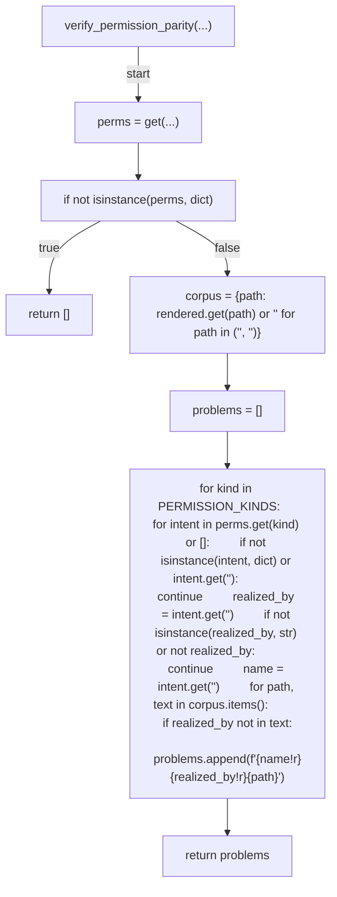

## command_needs_wrap(...)

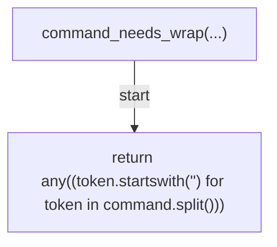

## wrap_command(...)

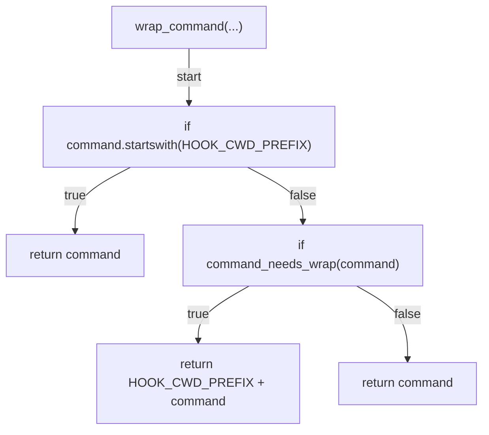

## unwrap_command(...)

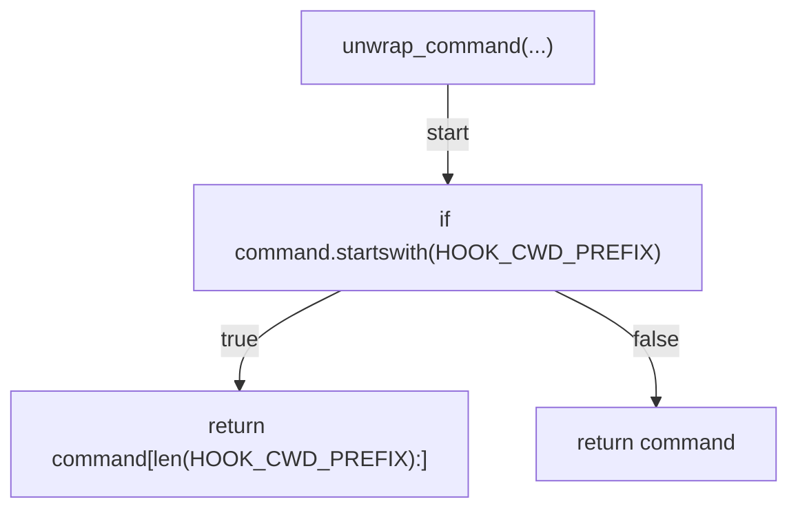

## _wrap_config(...)

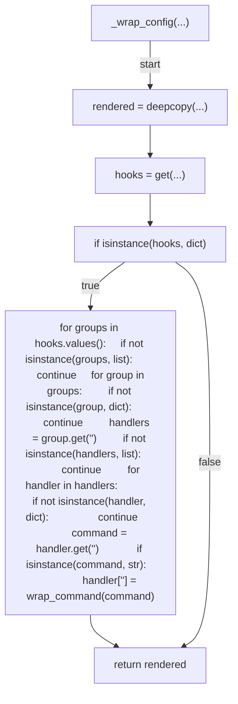

## _serialise(...)

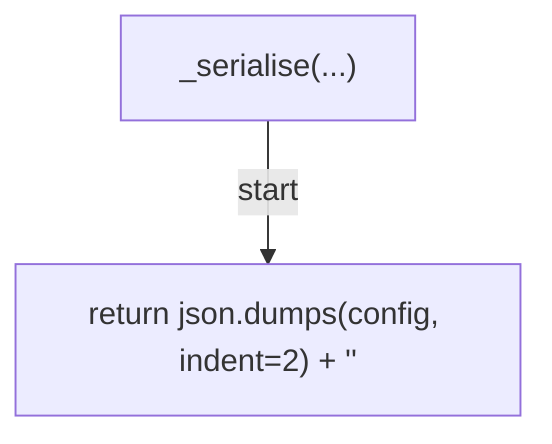

## _with_permissions(...)

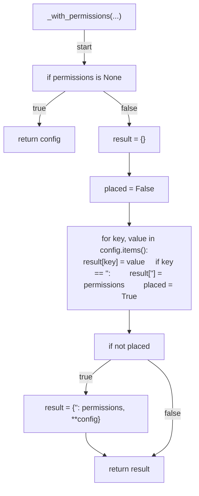

## render_targets(...)

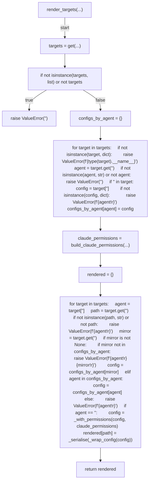

## _load_source(...)

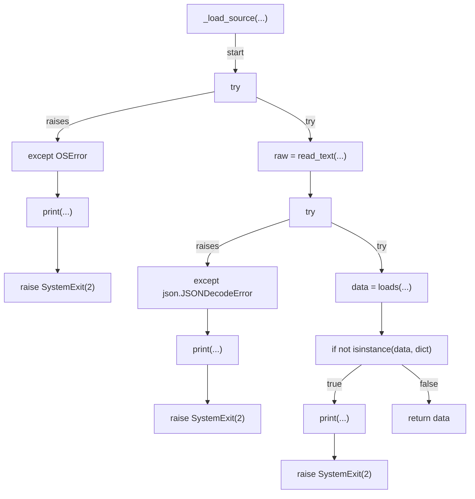

## main(...)

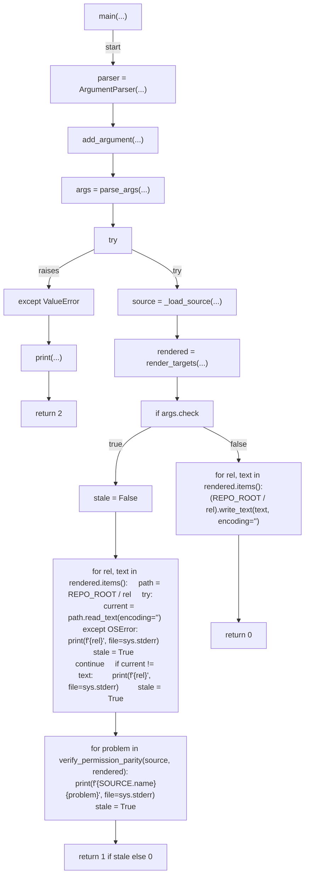
