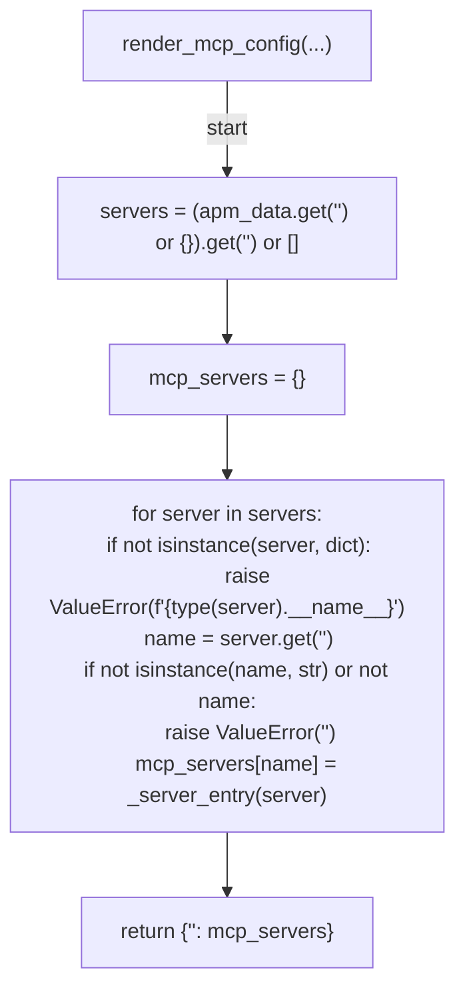
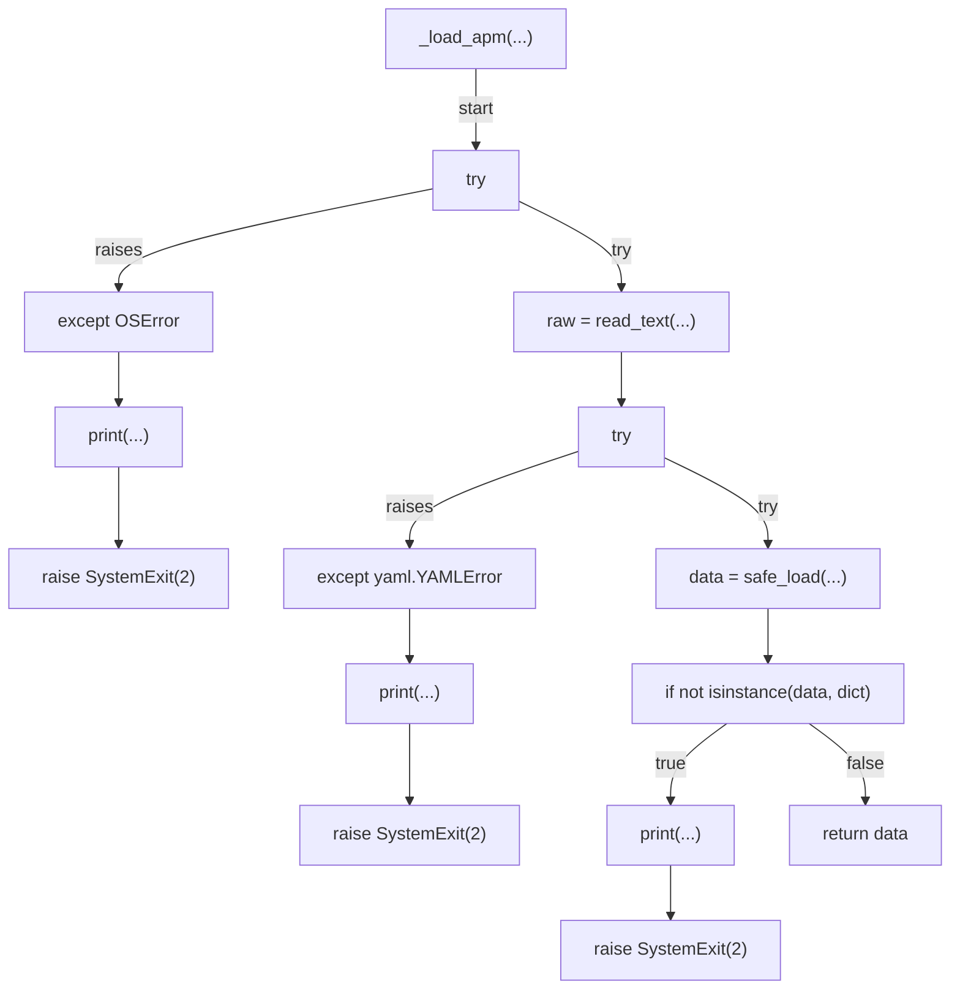
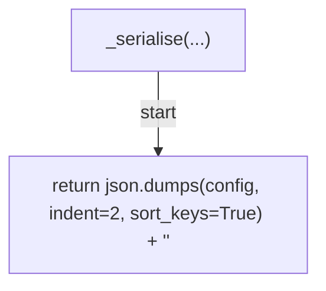
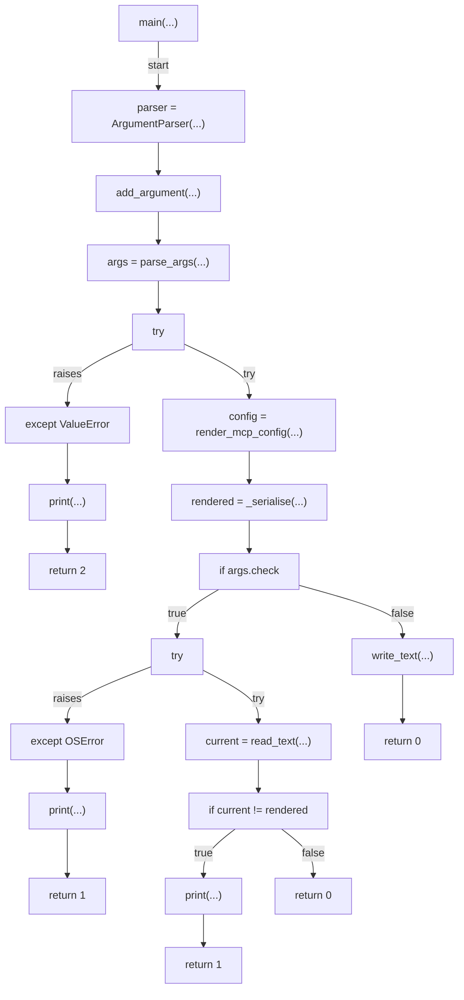

# AST graph: scripts/gen_mcp_json.py

This file is generated from `scripts/gen_mcp_json.py` by `python3 scripts/script_ast_graph.py all-doc`. Do not edit it by hand: content under `docs/generated/scripts/` is owned by the post-merge automation (refs #1540) -- update the source script instead.

## _server_entry(...)

```mermaid
flowchart TD
    N001["_server_entry(...)"]
    N002["transport = get(...)"]
    N003["if transport in ('http', 'sse')"]
    N004["url = get(...)"]
    N005["if not isinstance(url, str) or not url"]
    N006["raise ValueError(f\"<str>{server.get('<str>')!r}<str>{transport}<str>\")"]
    N007["return {'<str>': transport, '<str>': url}"]
    N008["if transport == 'stdio'"]
    N009["command = get(...)"]
    N010["if not isinstance(command, str) or not command"]
    N011["raise ValueError(f\"<str>{server.get('<str>')!r}<str>\")"]
    N012["entry = {'<str>': '<str>', '<str>': command}"]
    N013["args = get(...)"]
    N014["if args is not None"]
    N015["entry['<str>'] = args"]
    N016["return entry"]
    N017["raise ValueError(f\"<str>{server.get('<str>')!r}<str>{transport!r}\")"]
    N001 -->|"start"| N002
    N002 --> N003
    N003 -->|"true"| N004
    N004 --> N005
    N005 -->|"true"| N006
    N005 -->|"false"| N007
    N003 -->|"false"| N008
    N008 -->|"true"| N009
    N009 --> N010
    N010 -->|"true"| N011
    N010 -->|"false"| N012
    N012 --> N013
    N013 --> N014
    N014 -->|"true"| N015
    N015 --> N016
    N014 -->|"false"| N016
    N008 -->|"false"| N017
```

## render_mcp_config(...)



## _load_apm(...)



## _serialise(...)



## main(...)


