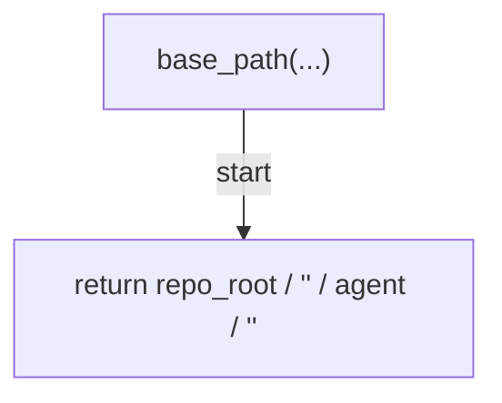
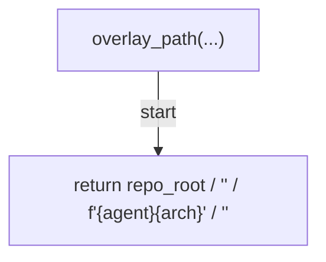
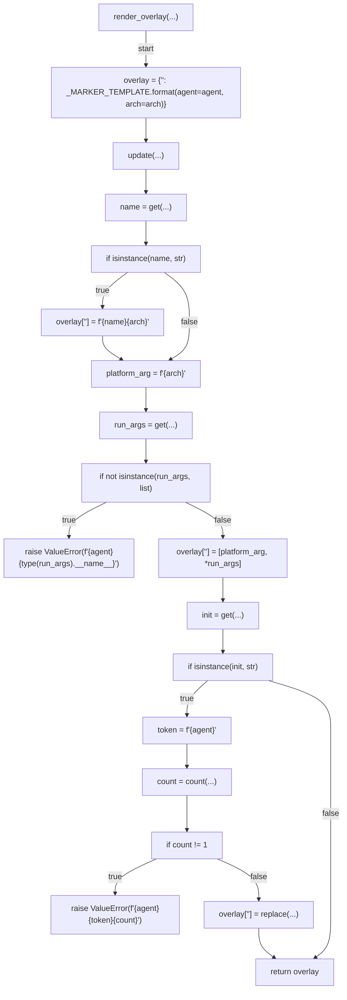
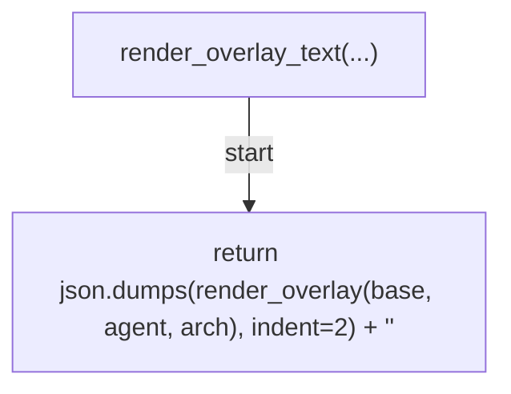
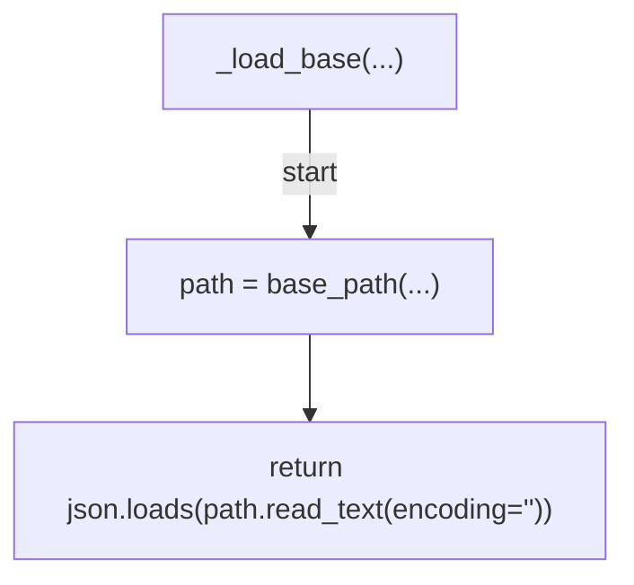
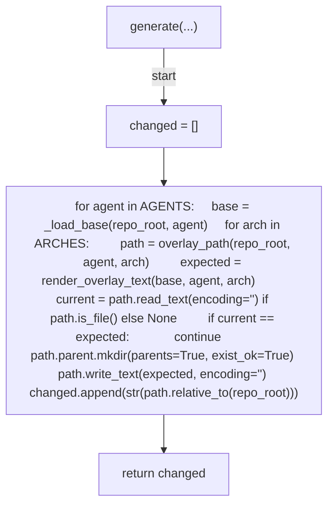
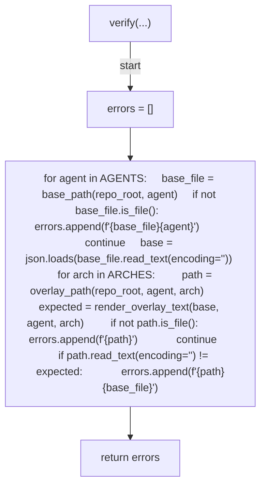
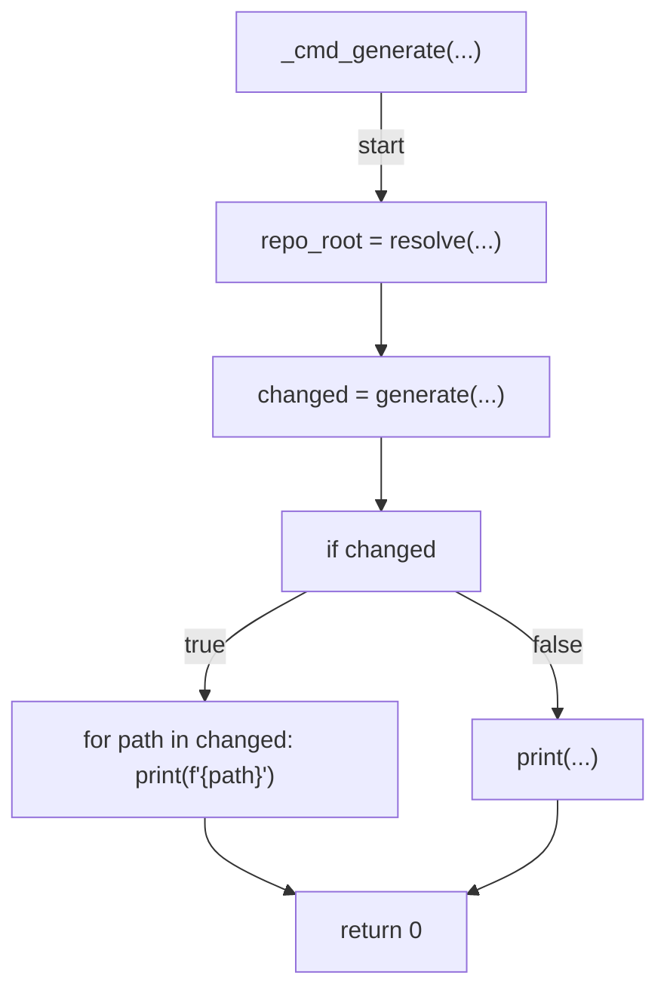
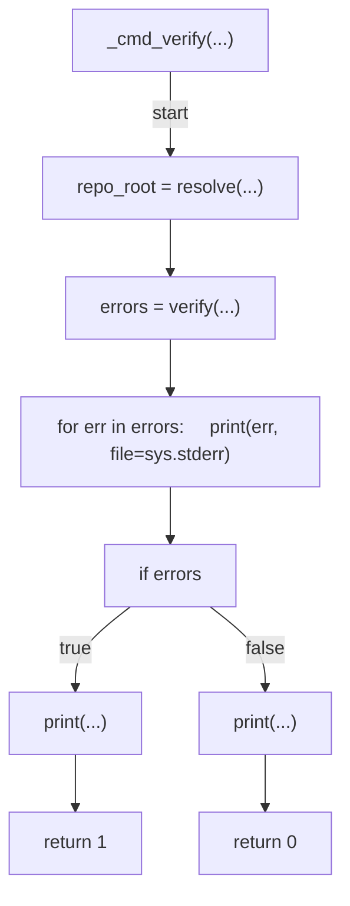
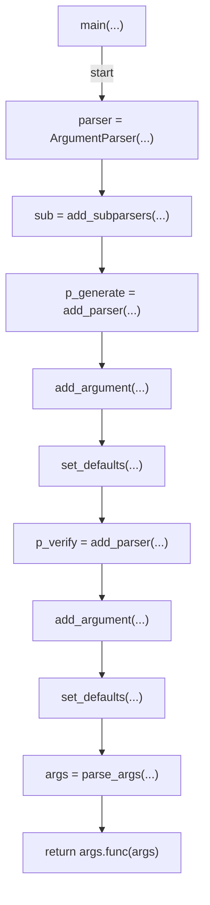

# AST graph: scripts/generate_devcontainer_arch_overlays.py

This file is generated from `scripts/generate_devcontainer_arch_overlays.py` by `python3 scripts/script_ast_graph.py all-doc`. Do not edit it by hand: content under `docs/generated/scripts/` is owned by the post-merge automation (refs #1540) -- update the source script instead.

## base_path(...)

## overlay_path(...)

## render_overlay(...)

## render_overlay_text(...)

## _load_base(...)

## generate(...)

## verify(...)

## _cmd_generate(...)

## _cmd_verify(...)

## main(...)

