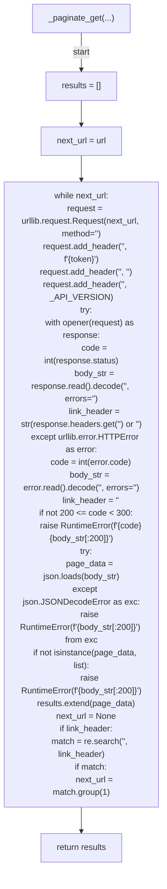
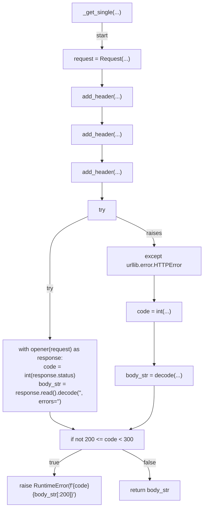
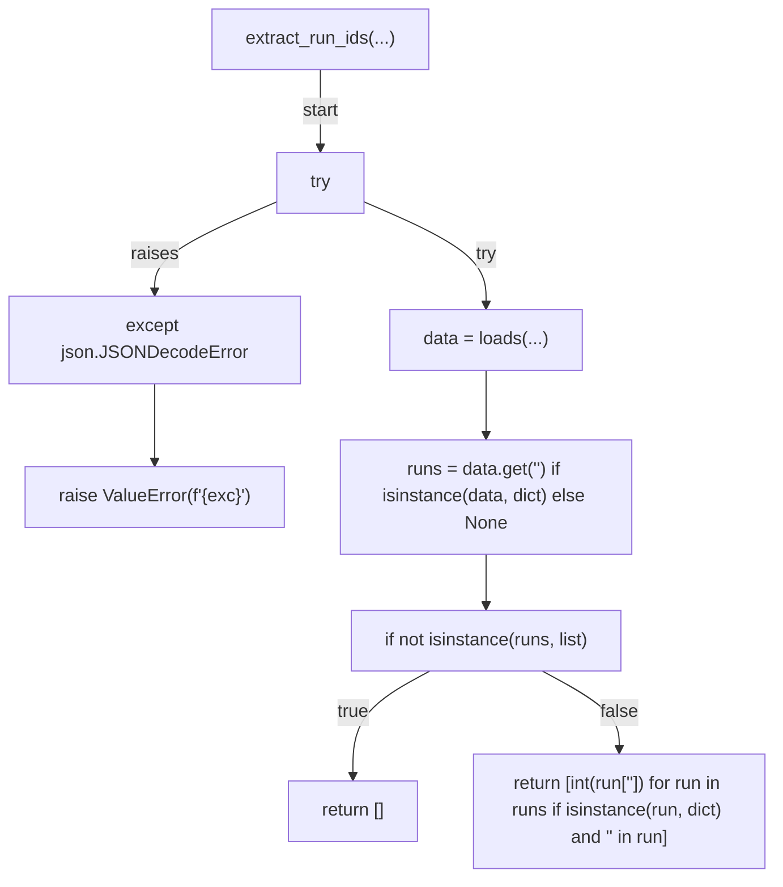
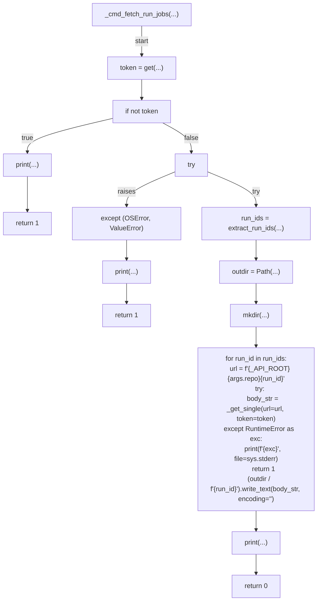
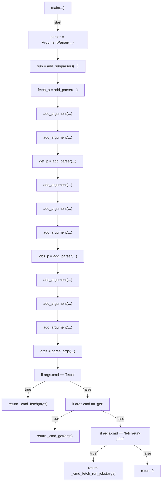

# AST graph: scripts/github_paginate.py

This file is generated from `scripts/github_paginate.py` by `python3 scripts/script_ast_graph.py all-doc`. Do not edit it by hand: content under `docs/generated/scripts/` is owned by the post-merge automation (refs #1540) -- update the source script instead.

## _paginate_get(...)



## _get_single(...)



## _cmd_get(...)

```mermaid
flowchart TD
    N001["_cmd_get(...)"]
    N002["token = get(...)"]
    N003["if not token"]
    N004["print(...)"]
    N005["return 1"]
    N006["if not args.output and (not args.field)"]
    N007["print(...)"]
    N008["return 1"]
    N009["url = f\"{_API_ROOT}<str>{args.path.lstrip('<str>')}\""]
    N010["try"]
    N011["body_str = _get_single(...)"]
    N012["except RuntimeError"]
    N013["print(...)"]
    N014["return 1"]
    N015["if args.output"]
    N016["write_text(...)"]
    N017["if args.field"]
    N018["try"]
    N019["data = loads(...)"]
    N020["except json.JSONDecodeError"]
    N021["print(...)"]
    N022["return 1"]
    N023["value = get(...)"]
    N024["if value is None"]
    N025["print(...)"]
    N026["return 1"]
    N027["print(...)"]
    N028["return 0"]
    N001 -->|"start"| N002
    N002 --> N003
    N003 -->|"true"| N004
    N004 --> N005
    N003 -->|"false"| N006
    N006 -->|"true"| N007
    N007 --> N008
    N006 -->|"false"| N009
    N009 --> N010
    N010 -->|"try"| N011
    N010 -->|"raises"| N012
    N012 --> N013
    N013 --> N014
    N011 --> N015
    N015 -->|"true"| N016
    N016 --> N017
    N015 -->|"false"| N017
    N017 -->|"true"| N018
    N018 -->|"try"| N019
    N018 -->|"raises"| N020
    N020 --> N021
    N021 --> N022
    N019 --> N023
    N023 --> N024
    N024 -->|"true"| N025
    N025 --> N026
    N024 -->|"false"| N027
    N027 --> N028
    N017 -->|"false"| N028
```

## extract_run_ids(...)



## _cmd_fetch_run_jobs(...)



## _cmd_fetch(...)

```mermaid
flowchart TD
    N001["_cmd_fetch(...)"]
    N002["token = get(...)"]
    N003["if not token"]
    N004["print(...)"]
    N005["return 1"]
    N006["url = f\"{_API_ROOT}<str>{args.path.lstrip('<str>')}\""]
    N007["try"]
    N008["data = _paginate_get(...)"]
    N009["except RuntimeError"]
    N010["print(...)"]
    N011["return 1"]
    N012["write_text(...)"]
    N013["print(...)"]
    N014["return 0"]
    N001 -->|"start"| N002
    N002 --> N003
    N003 -->|"true"| N004
    N004 --> N005
    N003 -->|"false"| N006
    N006 --> N007
    N007 -->|"try"| N008
    N007 -->|"raises"| N009
    N009 --> N010
    N010 --> N011
    N008 --> N012
    N012 --> N013
    N013 --> N014
```

## main(...)


