# AST graph: scripts/issue_link.py

This file is generated from `scripts/issue_link.py` by `python3 scripts/script_ast_graph.py all-doc`. Do not edit it by hand: content under `docs/generated/scripts/` is owned by the post-merge automation (refs #1540) -- update the source script instead.

## strip_html_comments(...)

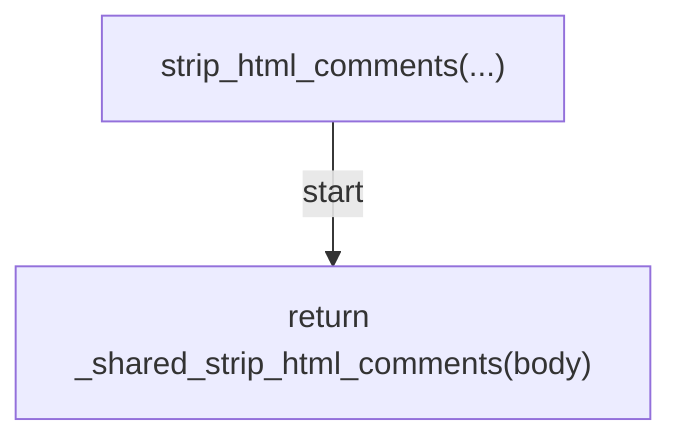

## extract_refs(...)

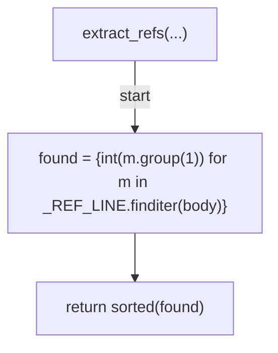

## classify_refs(...)

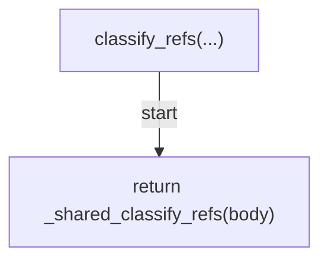

## body_has_partial_marker(...)

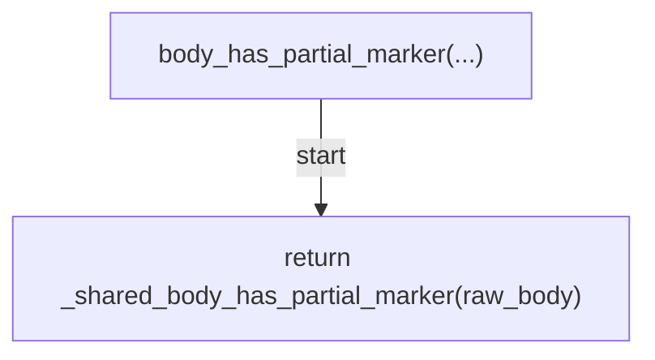

## verify_ref_exists(...)

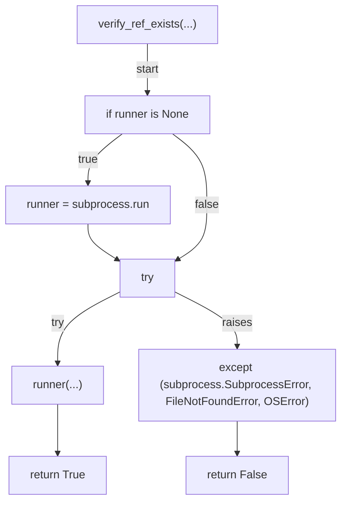

## issue_exists(...)

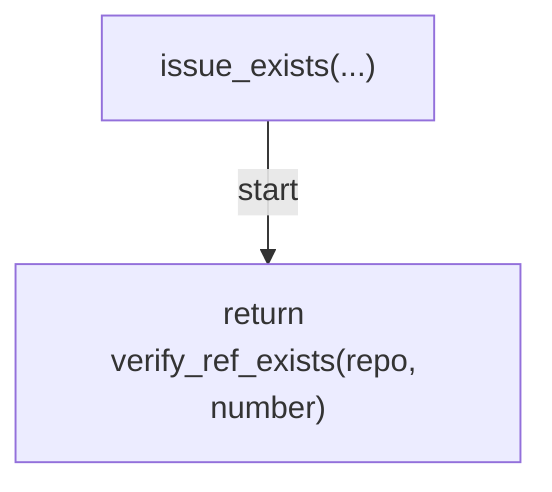

## get_issue_labels(...)

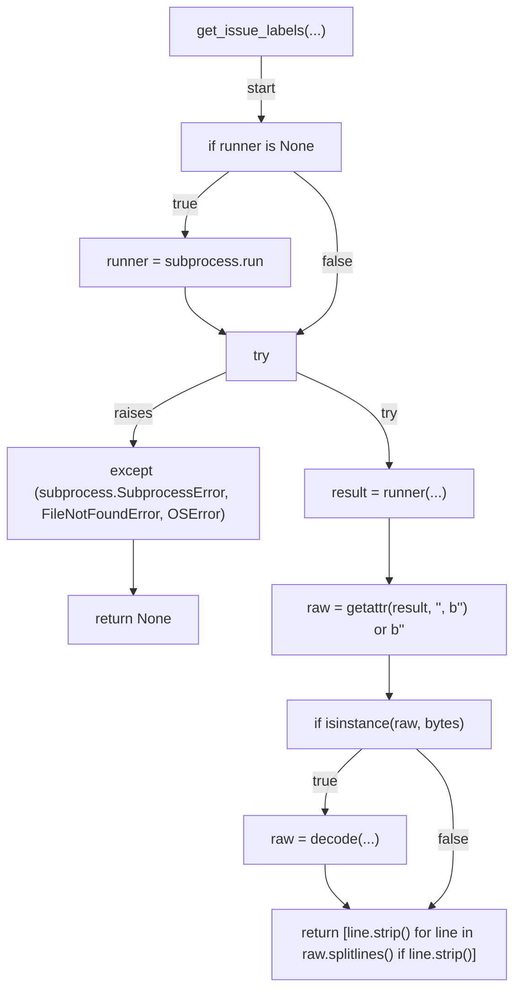

## _format_no_closing_keyword_msg(...)

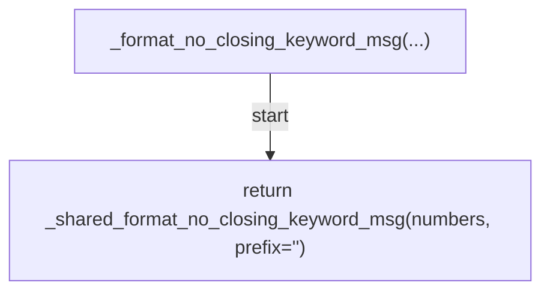

## _verify(...)

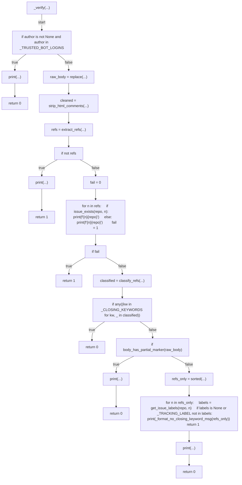

## _cmd_verify(...)

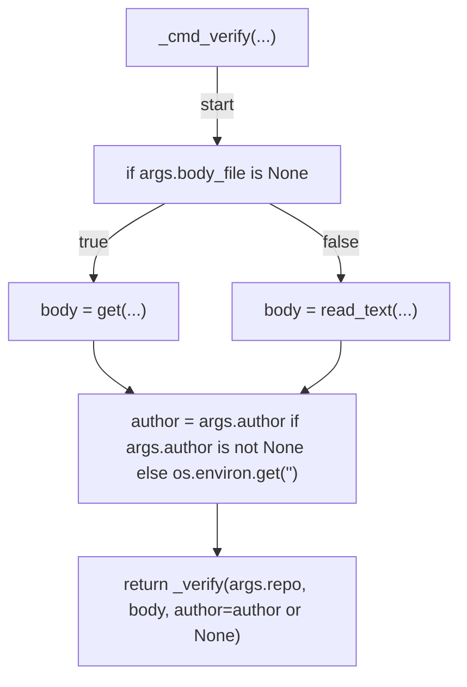

## main(...)

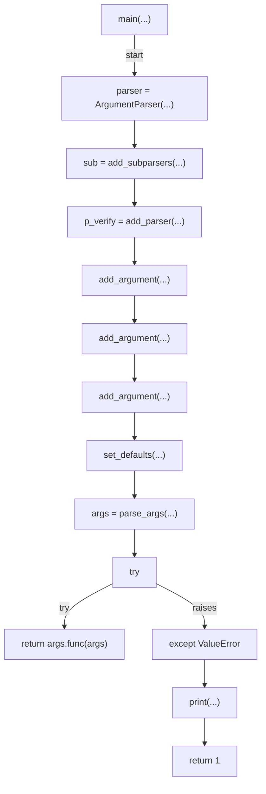
