# AST graph: scripts/labels_apply.py

This file is generated from `scripts/labels_apply.py` by `python3 scripts/script_ast_graph.py all-doc`. Do not edit it by hand: content under `docs/generated/scripts/` is owned by the post-merge automation (refs #1540) -- update the source script instead.

## validate_sot(...)

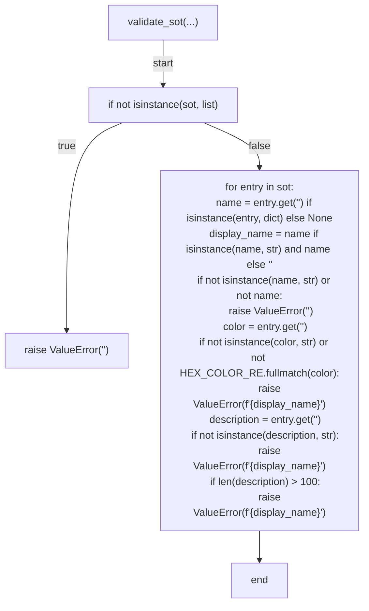

## decide_label_action(...)

```mermaid
flowchart TD
    N001["decide_label_action(...)"]
    N002["name = str(...)"]
    N003["color = str(...)"]
    N004["description = str(...)"]
    N005["if live_entry is None"]
    N006["return {'<str>': '<str>', '<str>': '<str>', '<str>': '<str>', '<str>': {'<str>': name, '<str>': color, '<str>': description}, '<str>': False, '<str>': False}"]
    N007["color_changed = live_entry.get('<str>') != color"]
    N008["desc_changed = (live_entry.get('<str>') or '<str>') != description"]
    N009["if not color_changed and (not desc_changed)"]
    N010["return {'<str>': '<str>', '<str>': '<str>', '<str>': '<str>', '<str>': None, '<str>': False, '<str>': False}"]
    N011["return {'<str>': '<str>', '<str>': '<str>', '<str>': f\"<str>{urllib.parse.quote(name, safe='<str>')}\", '<str>': {'<str>': color, '<str>': description}, '<str>': color_changed, '<str>': desc_changed}"]
    N001 -->|"start"| N002
    N002 --> N003
    N003 --> N004
    N004 --> N005
    N005 -->|"true"| N006
    N005 -->|"false"| N007
    N007 --> N008
    N008 --> N009
    N009 -->|"true"| N010
    N009 -->|"false"| N011
```

## decide_prune_action(...)

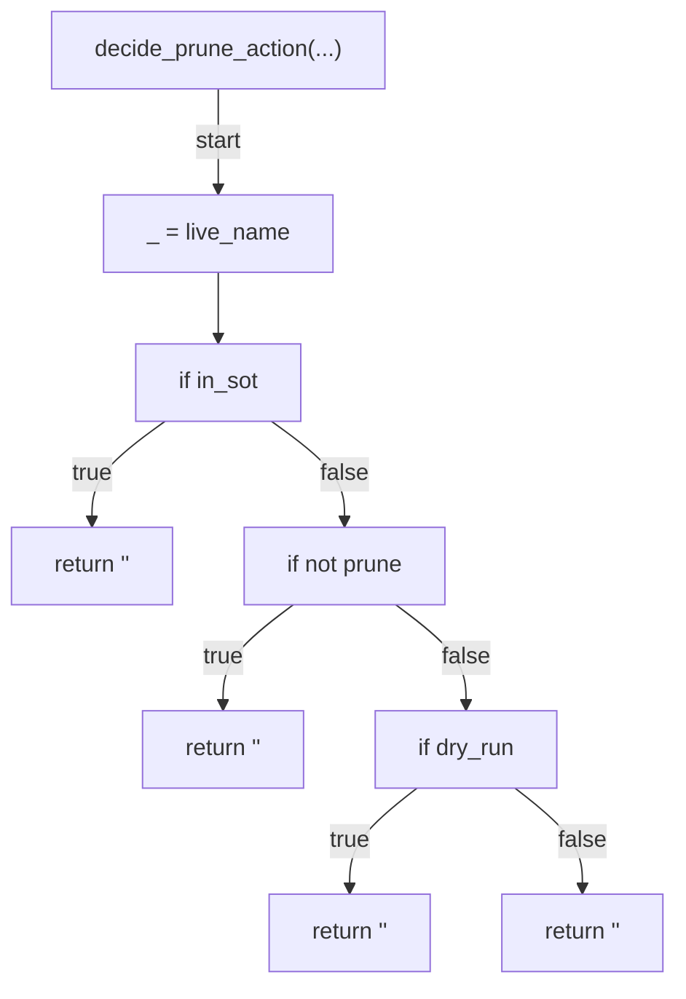

## render_action_row(...)

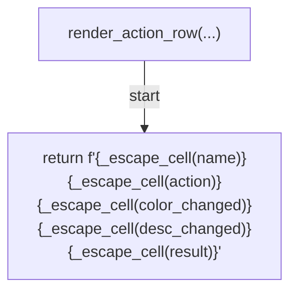

## fetch_live_labels(...)

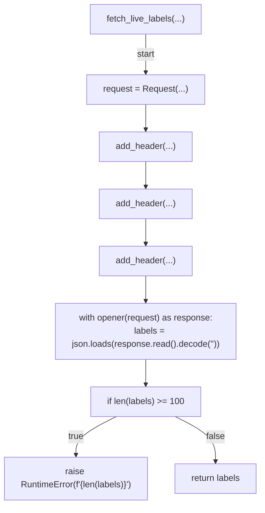

## load_sot(...)

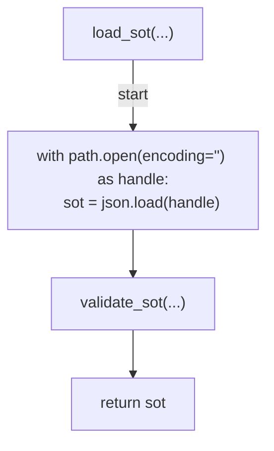

## run(...)

```mermaid
flowchart TD
    N001["run(...)"]
    N002["sot = load_sot(...)"]
    N003["live = live_labels if live_labels is not None else fetch_live_labels(repo, token)"]
    N004["live_by_name = {str(entry.get('<str>')): entry for entry in live}"]
    N005["sot_names = {str(entry['<str>']) for entry in sot}"]
    N006["rows = []"]
    N007["_write_summary_header(...)"]
    N008["for entry in sot:
    name = str(entry['<str>'])
    decision = decide_label_action(sot_entry=entry, live_entry=live_by_name.get(name))
    action = str(decision['<str>'])
    if action == '<str>':
        rows.append(render_action_row(name, '<str>', '<str>', '<str>', '<str>'))
        continue
    color_changed = _changed_cell(decision['<str>'], is_post=action == '<str>')
    desc_changed = _changed_cell(decision['<str>'], is_post=action == '<str>')
    if mode == '<str>' or dry_run:
        rows.append(render_action_row(name, f'<str>{action}<str>', color_changed, desc_changed, '<str>'))
        continue
    code, body = apply_call(method=str(decision['<str>']), url=f\"{API_ROOT}<str>{repo}{decision['<str>']}\", payload=decision['<str>'], token=token)
    if not 200 <= code < 300:
        _append_rows(summary_file, rows)
        _append_error(summary_file, f\"<str>{name}<str>{decision['<str>']}<str>{_format_code(code)}<str>\", body)
        print(f\"<str>{decision['<str>']}<str>{name}<str>{_format_code(code)}<str>\")
        return 1
    rows.append(render_action_row(name, f'{action}<str>', color_changed, desc_changed, f'<str>{code}'))"]
    N009["for live_entry in live:
    live_name = str(live_entry.get('<str>'))
    prune_action = decide_prune_action(live_name=live_name, in_sot=live_name in sot_names, prune=prune, dry_run=mode == '<str>' or dry_run)
    if prune_action == '<str>':
        continue
    if prune_action == '<str>':
        rows.append(render_action_row(live_name, '<str>', '<str>', '<str>', '<str>'))
        continue
    if prune_action == '<str>':
        rows.append(render_action_row(live_name, '<str>', '<str>', '<str>', '<str>'))
        continue
    code, body = apply_call(method='<str>', url=f\"{API_ROOT}<str>{repo}<str>{urllib.parse.quote(live_name, safe='<str>')}\", payload=None, token=token)
    if not 200 <= code < 300:
        _append_rows(summary_file, rows)
        _append_error(summary_file, f'<str>{live_name}<str>{_format_code(code)}<str>', body)
        print(f'<str>{live_name}<str>{_format_code(code)}<str>')
        return 1
    rows.append(render_action_row(live_name, '<str>', '<str>', '<str>', f'<str>{code}'))"]
    N010["_append_rows(...)"]
    N011["return 0"]
    N001 -->|"start"| N002
    N002 --> N003
    N003 --> N004
    N004 --> N005
    N005 --> N006
    N006 --> N007
    N007 --> N008
    N008 --> N009
    N009 --> N010
    N010 --> N011
```

## main(...)

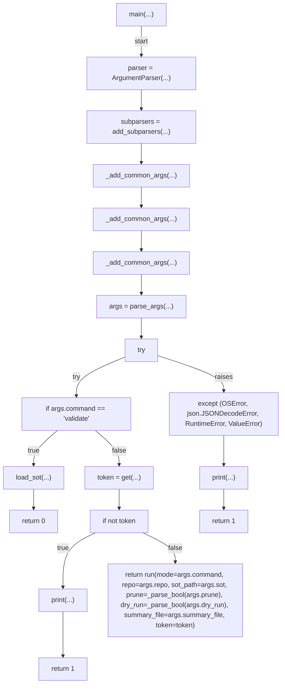

## _add_common_args(...)

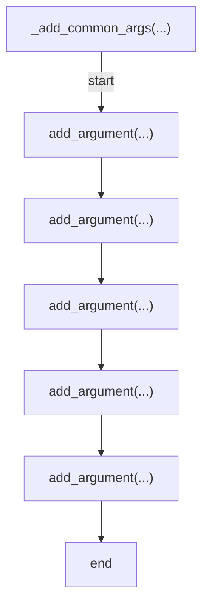

## _write_summary_header(...)

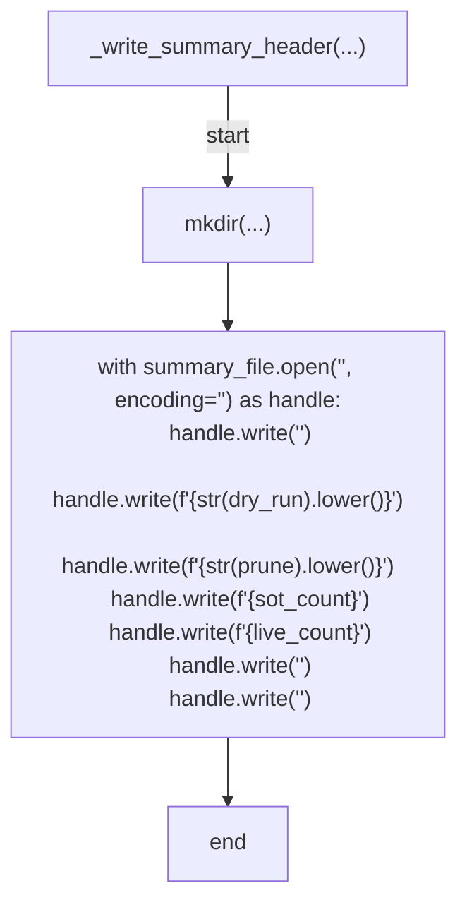

## _append_rows(...)

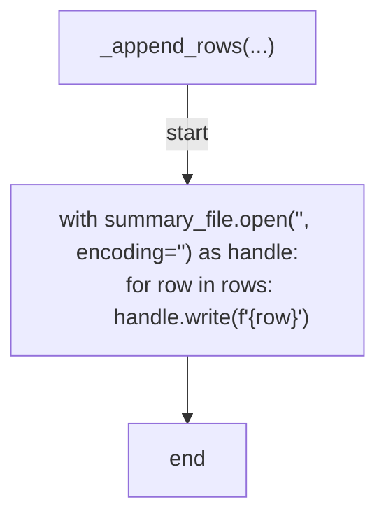

## _append_error(...)

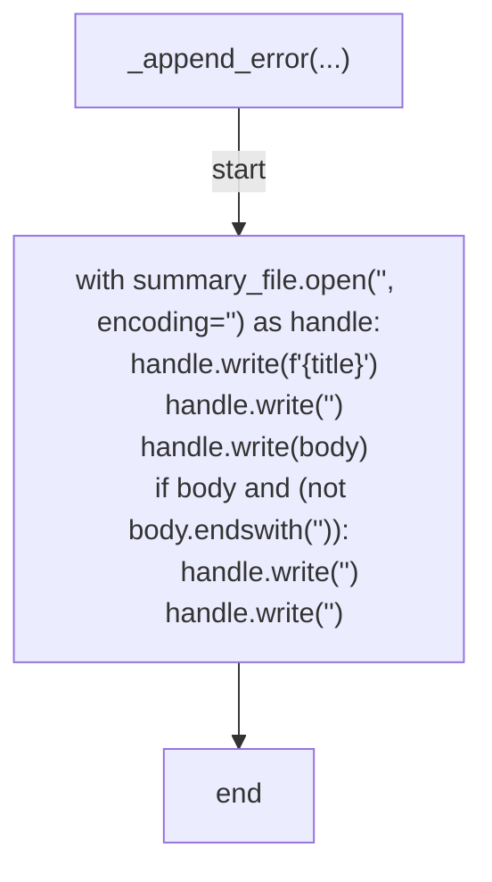

## _parse_bool(...)

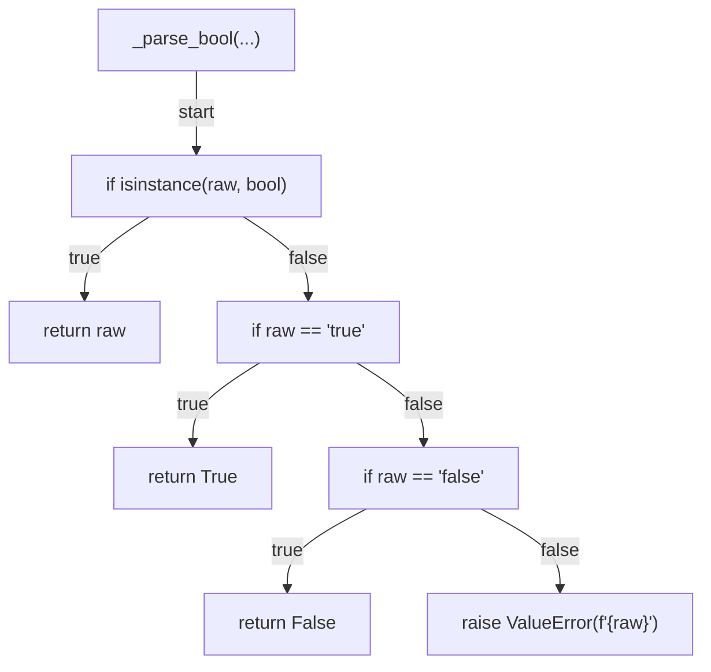

## _changed_cell(...)

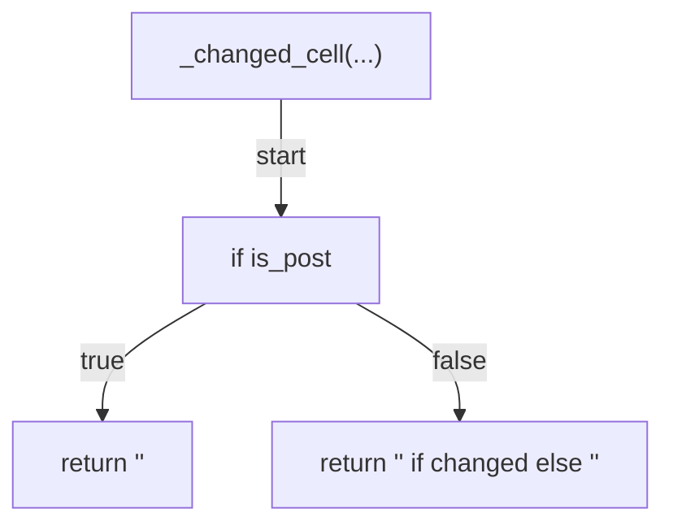

## _escape_cell(...)

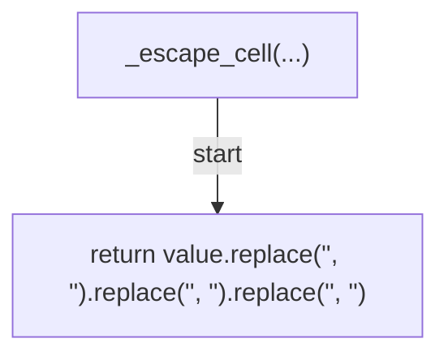

## _format_code(...)

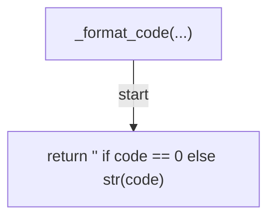
