# AST graph: scripts/measure_devcontainer_startup.py

This file is generated from `scripts/measure_devcontainer_startup.py` by `python3 scripts/script_ast_graph.py all-doc`. Do not edit it by hand: content under `docs/generated/scripts/` is owned by the post-merge automation (refs #1540) -- update the source script instead.

## _run(...)

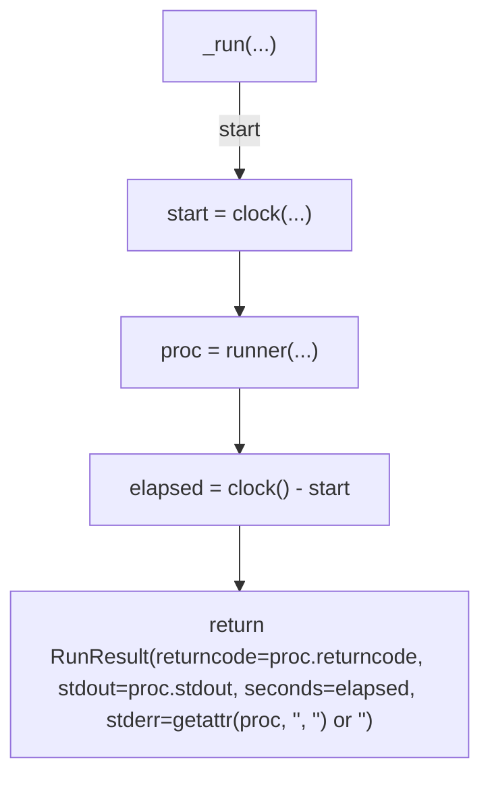

## resolve_runtime(...)

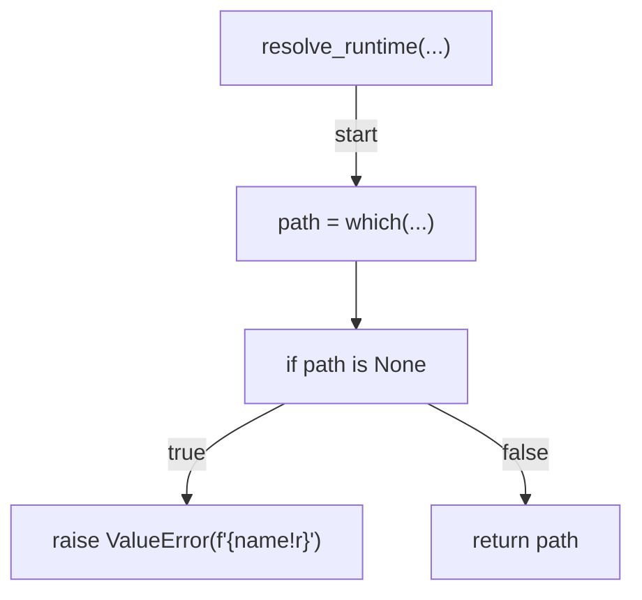

## load_config(...)

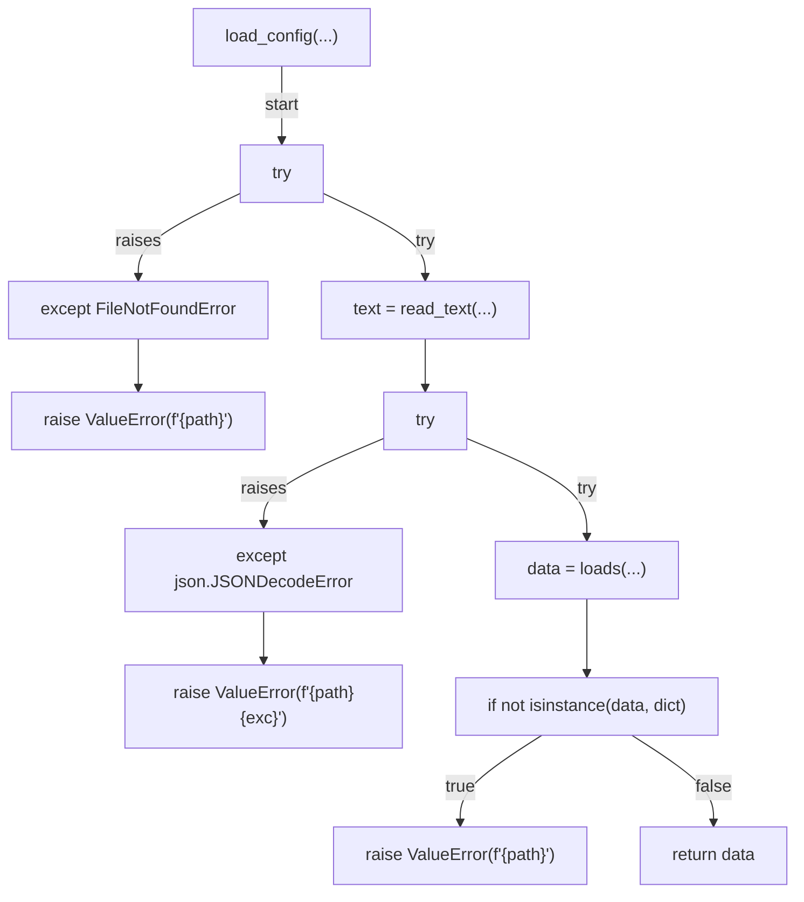

## reject_mutable_tag(...)

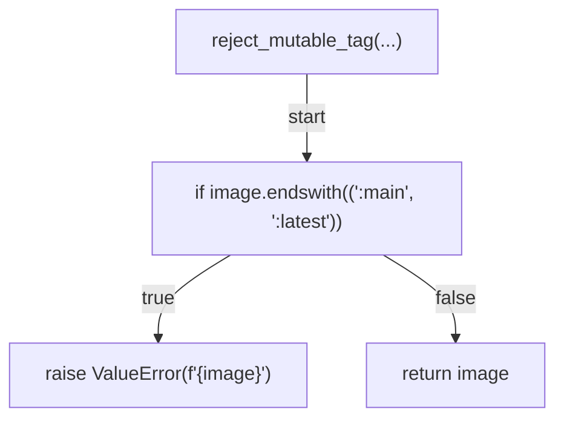

## get_image(...)

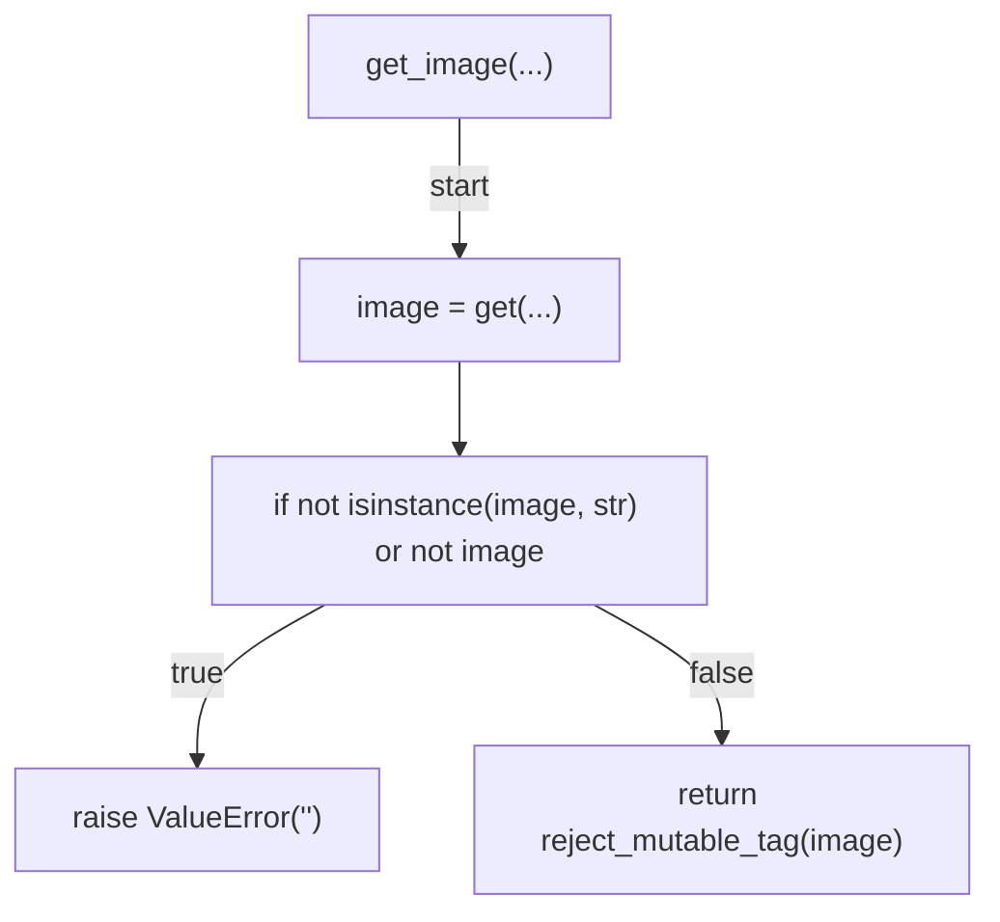

## split_segments(...)

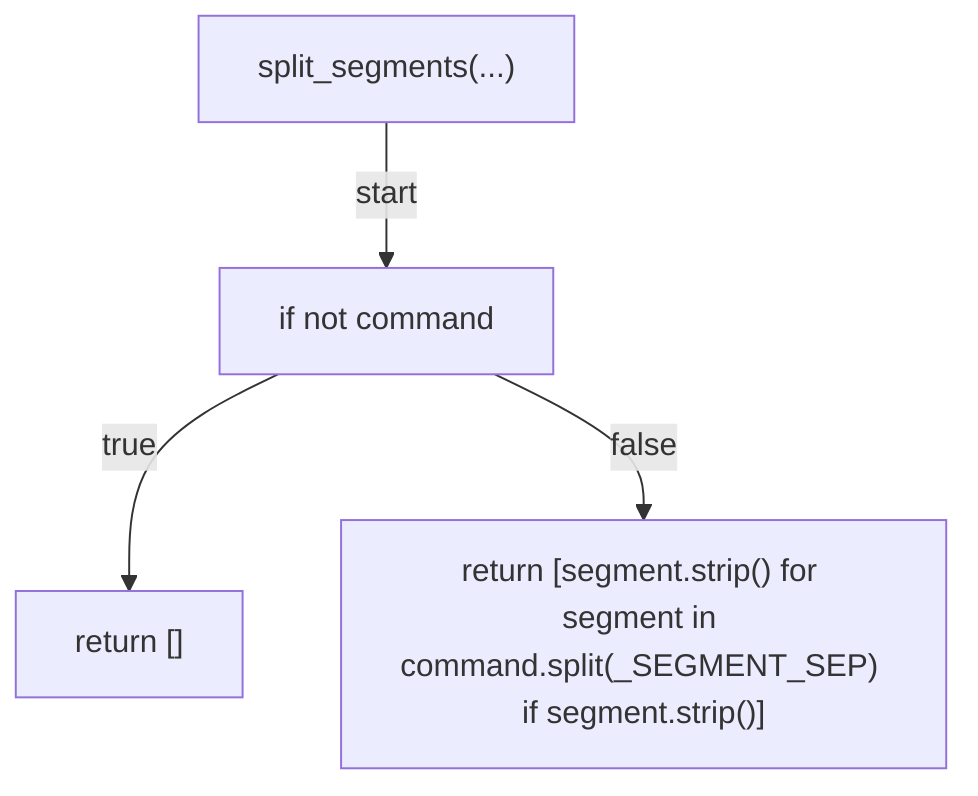

## _parse_du(...)

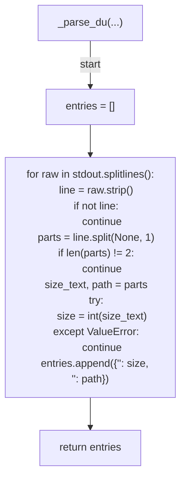

## probe_composition(...)

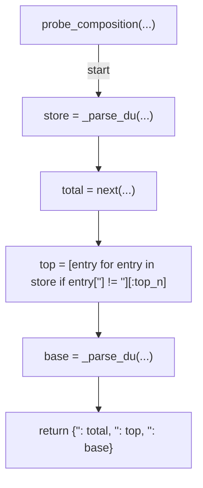

## _stderr_tail(...)

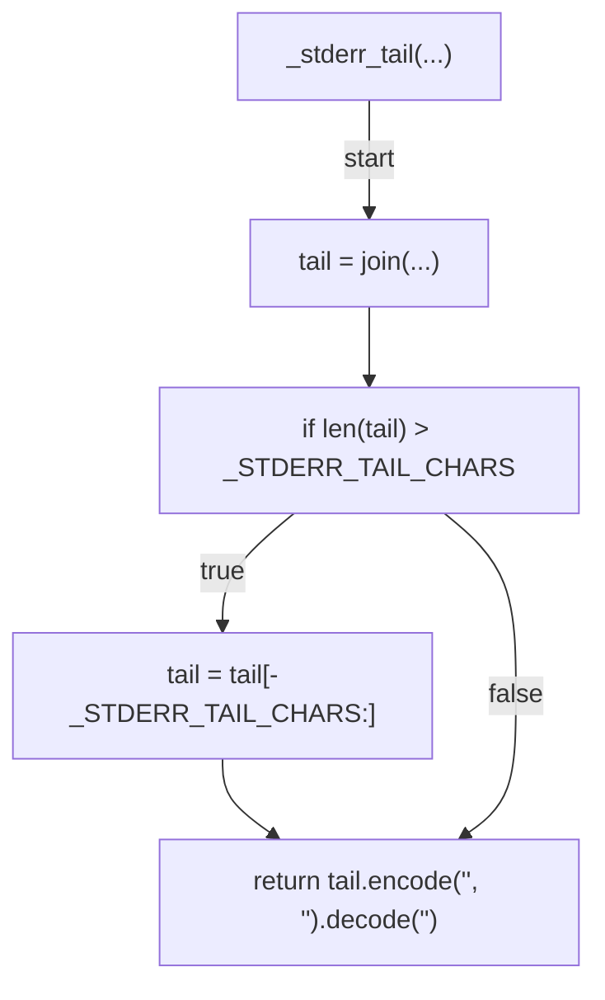

## measure(...)

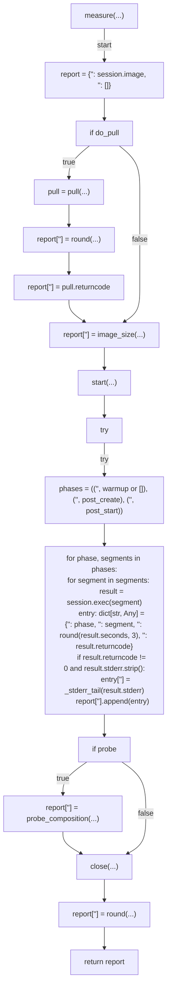

## _human_size(...)

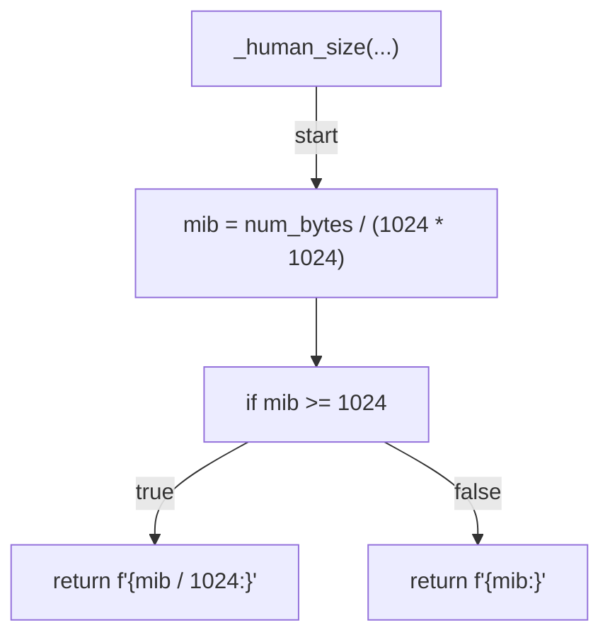

## format_summary(...)

```mermaid
flowchart TD
    N001["format_summary(...)"]
    N002["lines = ['<str>', '<str>', f'<str>{report['<str>']}<str>', f'<str>{_human_size(report['<str>'])}<str>{report['<str>']}<str>']"]
    N003["if 'pull_seconds' in report"]
    N004["flag = '<str>' if report['<str>'] == 0 else '<str>'"]
    N005["append(...)"]
    N006["lines += [f'<str>{report['<str>']:<str>}<str>', '<str>', '<str>', '<str>']"]
    N007["for entry in report['<str>']:
    command = entry['<str>']
    if len(command) > 70:
        command = command[:67] + '<str>'
    lines.append(f'<str>{entry['<str>']}<str>{entry['<str>']:<str>}<str>{entry['<str>']}<str>{command}<str>')"]
    N008["failures = [entry for entry in report['<str>'] if entry.get('<str>')]"]
    N009["if failures"]
    N010["lines += ['<str>', '<str>', '<str>']"]
    N011["for entry in failures:
    lines += [f'<str>{entry['<str>']}<str>{entry['<str>']}<str>{entry['<str>']}<str>', '<str>', '<str>', entry['<str>'], '<str>', '<str>']"]
    N012["composition = get(...)"]
    N013["if composition"]
    N014["lines += ['<str>', '<str>', '<str>', f'<str>{_human_size(composition['<str>'])}<str>{composition['<str>']}<str>', '<str>', '<str>', '<str>']"]
    N015["lines += [f'<str>{entry['<str>']}<str>{_human_size(entry['<str>'])}<str>' for entry in composition['<str>']]"]
    N016["lines += ['<str>', '<str>', '<str>']"]
    N017["lines += [f'<str>{entry['<str>']}<str>{_human_size(entry['<str>'])}<str>' for entry in composition['<str>']]"]
    N018["return '<str>'.join(lines) + '<str>'"]
    N001 -->|"start"| N002
    N002 --> N003
    N003 -->|"true"| N004
    N004 --> N005
    N005 --> N006
    N003 -->|"false"| N006
    N006 --> N007
    N007 --> N008
    N008 --> N009
    N009 -->|"true"| N010
    N010 --> N011
    N011 --> N012
    N009 -->|"false"| N012
    N012 --> N013
    N013 -->|"true"| N014
    N014 --> N015
    N015 --> N016
    N016 --> N017
    N017 --> N018
    N013 -->|"false"| N018
```

## run(...)

```mermaid
flowchart TD
    N001["run(...)"]
    N002["parser = ArgumentParser(...)"]
    N003["add_argument(...)"]
    N004["add_argument(...)"]
    N005["add_argument(...)"]
    N006["add_argument(...)"]
    N007["add_argument(...)"]
    N008["add_argument(...)"]
    N009["add_argument(...)"]
    N010["add_argument(...)"]
    N011["add_argument(...)"]
    N012["add_argument(...)"]
    N013["add_argument(...)"]
    N014["add_argument(...)"]
    N015["args = parse_args(...)"]
    N016["config = load_config(...)"]
    N017["image = reject_mutable_tag(args.image) if args.image else get_image(config)"]
    N018["post_create = split_segments(...)"]
    N019["post_start = split_segments(...)"]
    N020["runtime = resolve_runtime(...)"]
    N021["session = session_factory(...)"]
    N022["report = measure(...)"]
    N023["payload = dumps(...)"]
    N024["if args.output is not None"]
    N025["write_text(...)"]
    N026["print(...)"]
    N027["print(...)"]
    N028["return 0"]
    N001 -->|"start"| N002
    N002 --> N003
    N003 --> N004
    N004 --> N005
    N005 --> N006
    N006 --> N007
    N007 --> N008
    N008 --> N009
    N009 --> N010
    N010 --> N011
    N011 --> N012
    N012 --> N013
    N013 --> N014
    N014 --> N015
    N015 --> N016
    N016 --> N017
    N017 --> N018
    N018 --> N019
    N019 --> N020
    N020 --> N021
    N021 --> N022
    N022 --> N023
    N023 --> N024
    N024 -->|"true"| N025
    N025 --> N026
    N024 -->|"false"| N026
    N026 --> N027
    N027 --> N028
```
