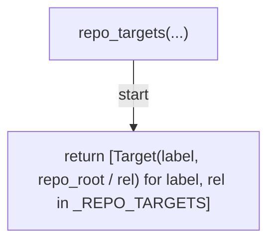
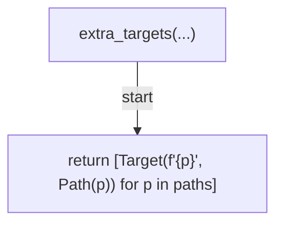
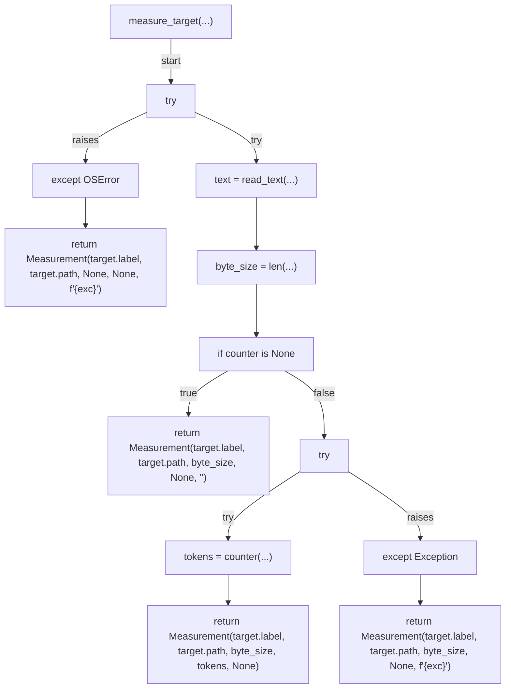
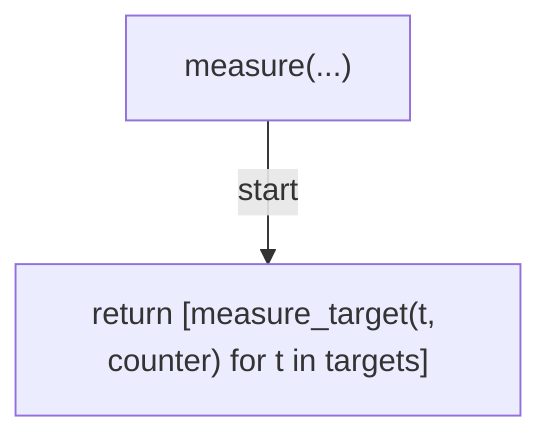
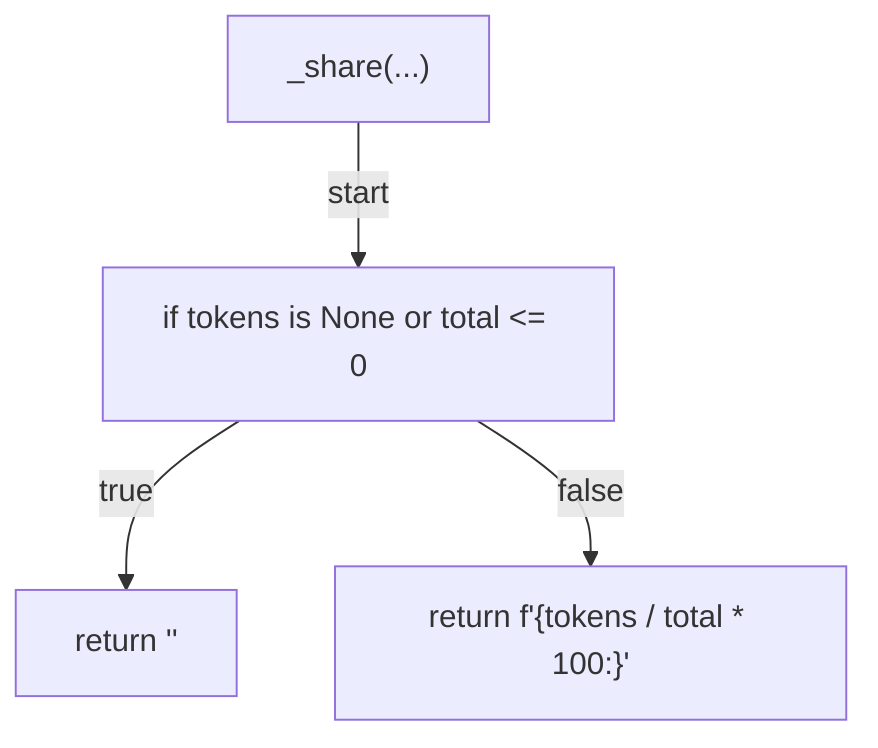
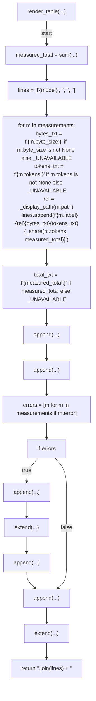
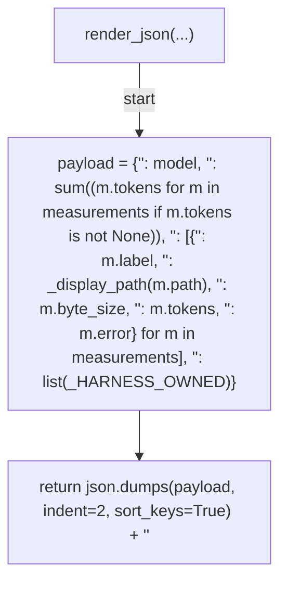
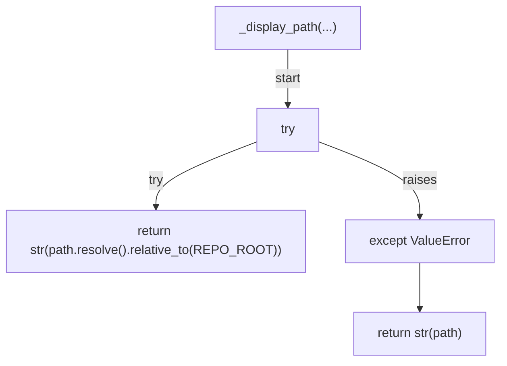
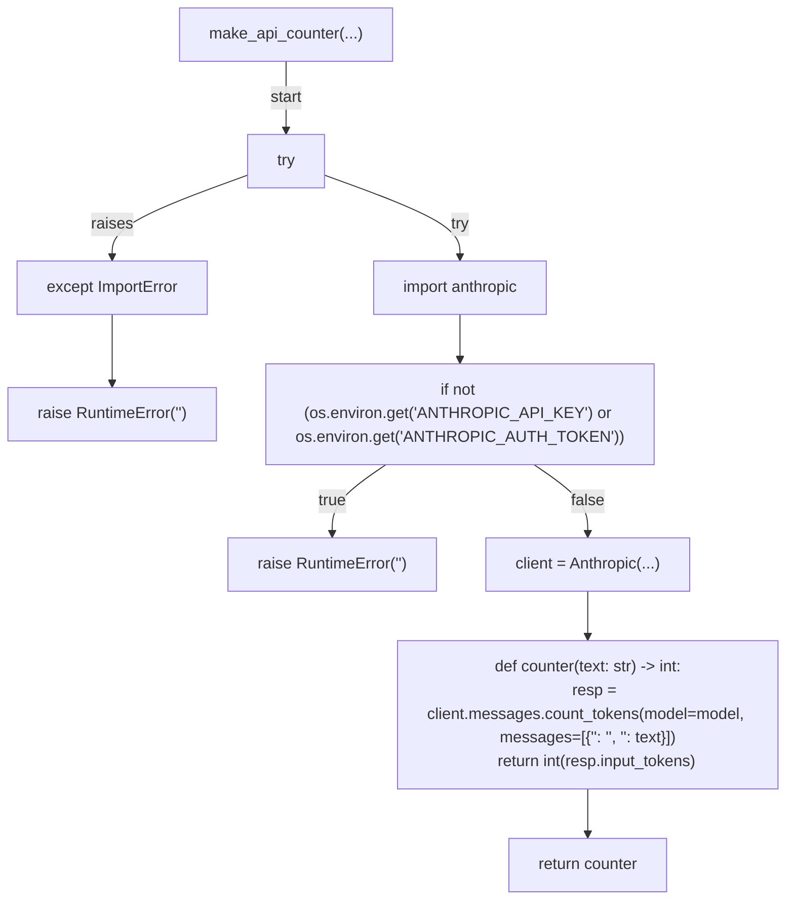
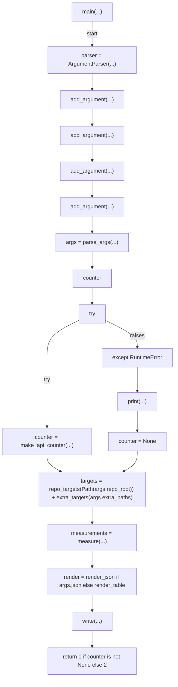

# AST graph: scripts/measure_prefix_tokens.py

This file is generated from `scripts/measure_prefix_tokens.py` by `python3 scripts/script_ast_graph.py all-doc`. Do not edit it by hand: content under `docs/generated/scripts/` is owned by the post-merge automation (refs #1540) -- update the source script instead.

## repo_targets(...)

## extra_targets(...)

## measure_target(...)

## measure(...)

## _share(...)

## render_table(...)

## render_json(...)

## _display_path(...)

## make_api_counter(...)

## main(...)

