# AST graph: scripts/measure_tool_overlap.py

This file is generated from `scripts/measure_tool_overlap.py` by `python3 scripts/script_ast_graph.py all-doc`. Do not edit it by hand: content under `docs/generated/scripts/` is owned by the post-merge automation (refs #1540) -- update the source script instead.

## parse_zizmor(...)

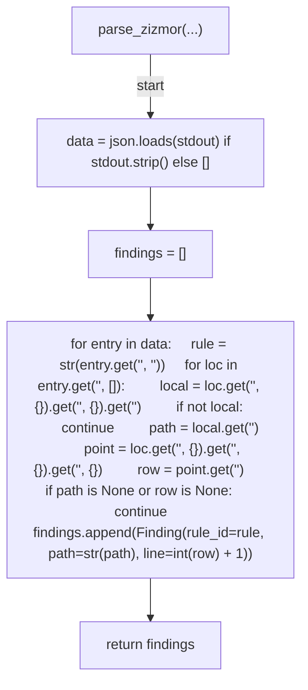

## parse_lychee(...)

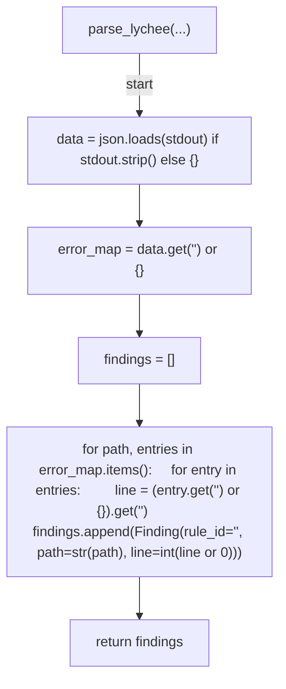

## parse_betterleaks(...)

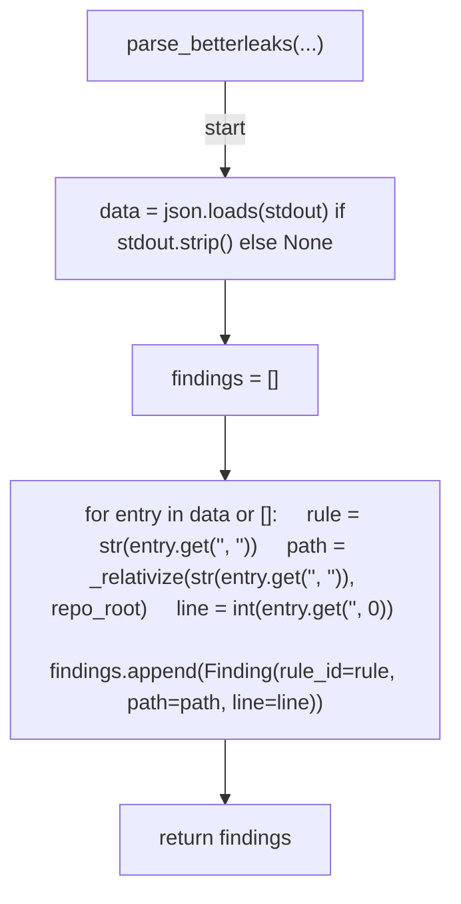

## _relativize(...)

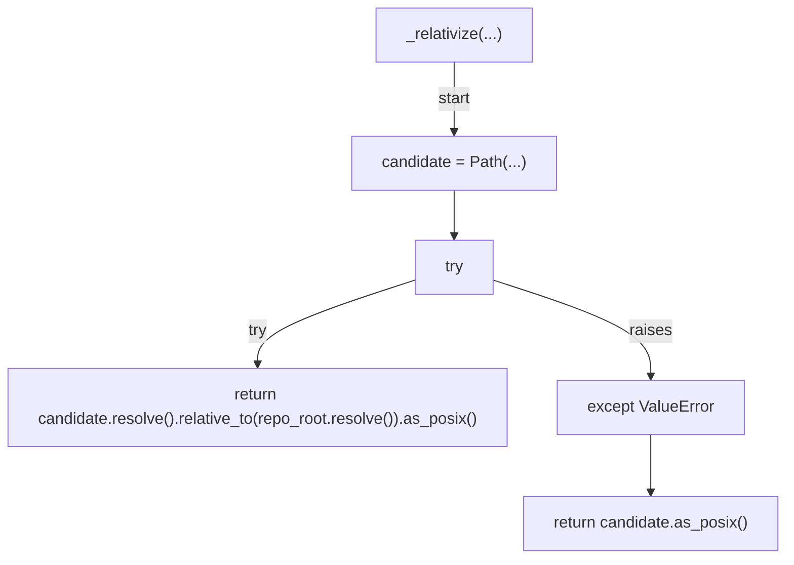

## diff_findings(...)

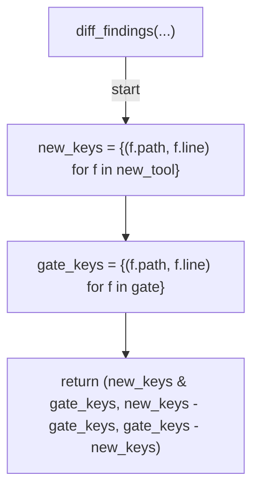

## build_record(...)

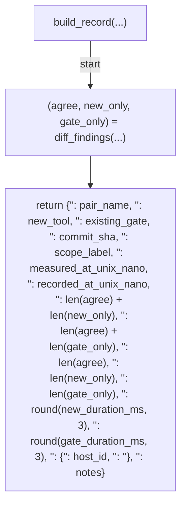

## _format_locations(...)

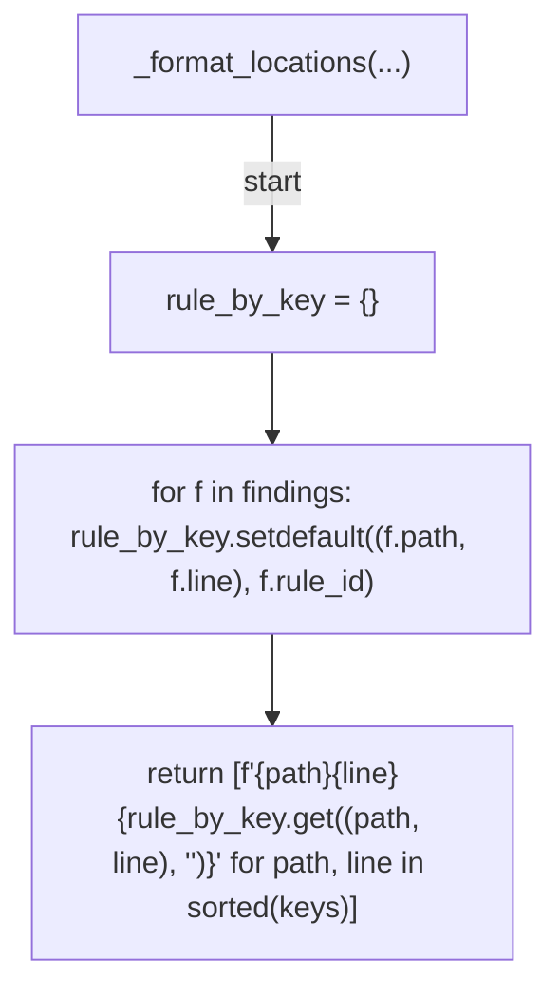

## render_markdown(...)

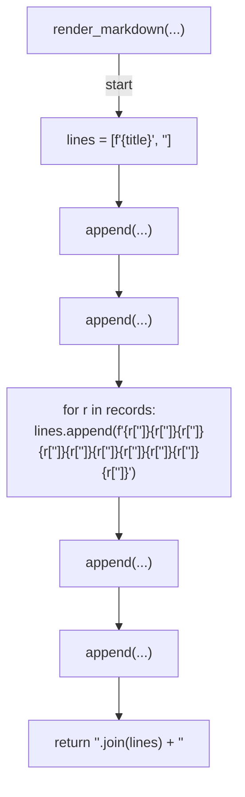

## render_detail(...)

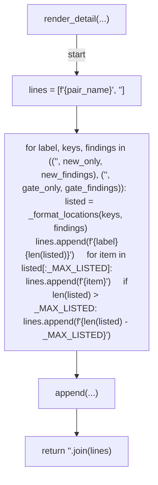

## collect_workflow_static_gate(...)

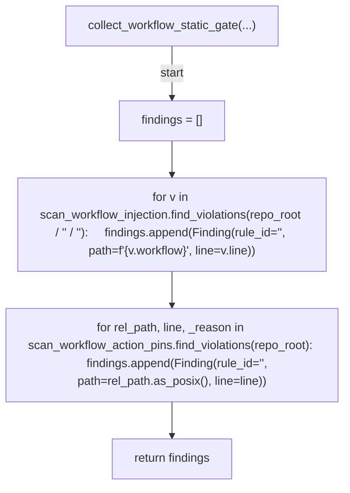

## collect_markdown_links_gate(...)

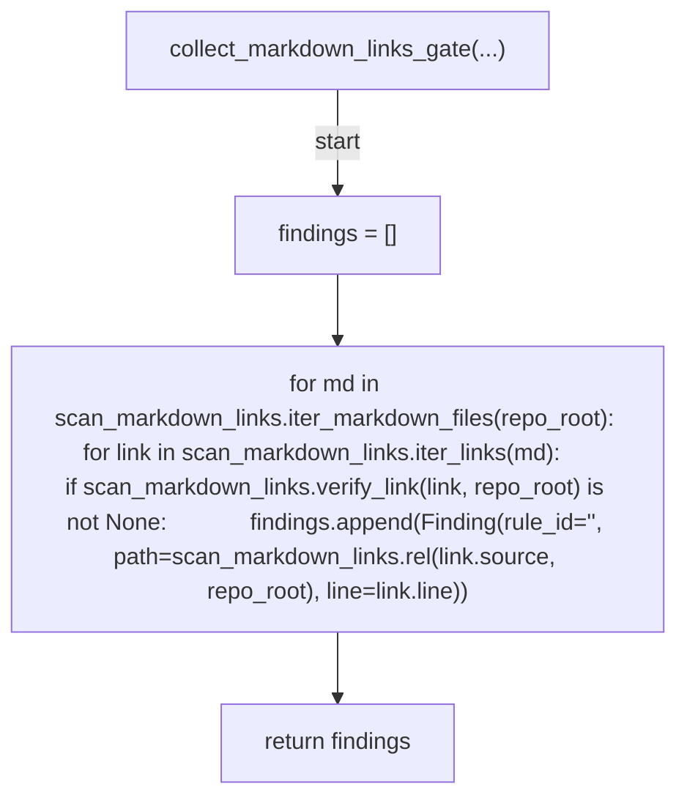

## collect_secrets_gate(...)

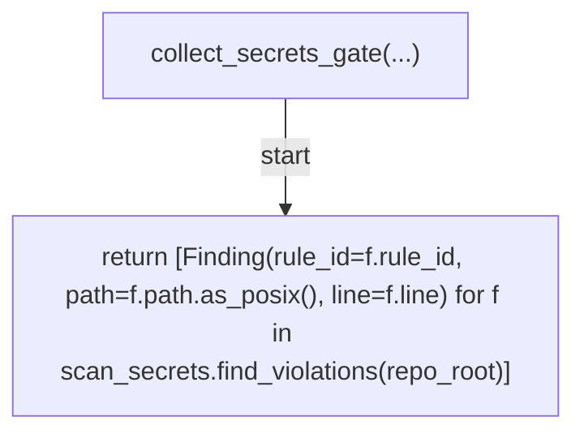

## _run(...)

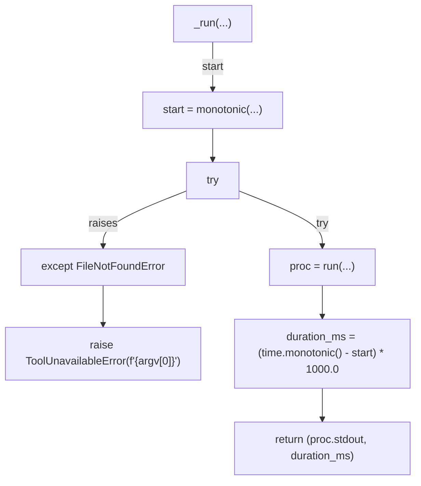

## zizmor_argv(...)

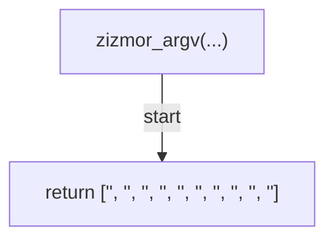

## lychee_argv(...)

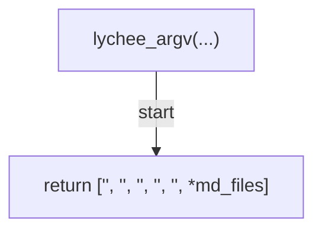

## betterleaks_argv(...)

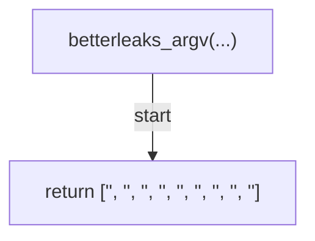

## run_zizmor(...)

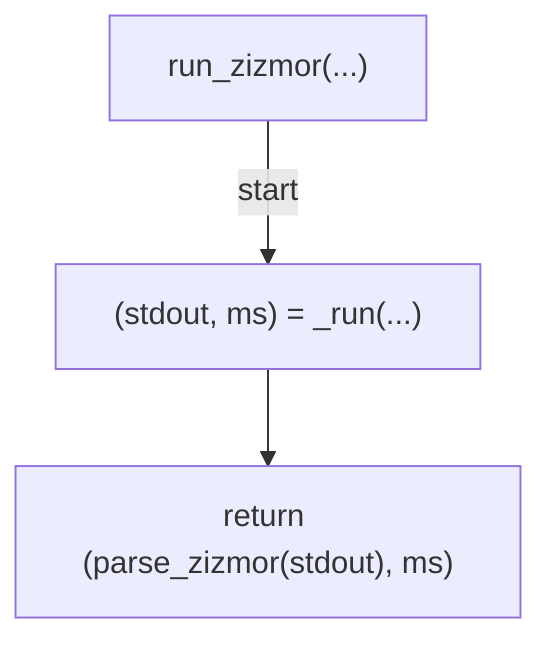

## run_lychee(...)

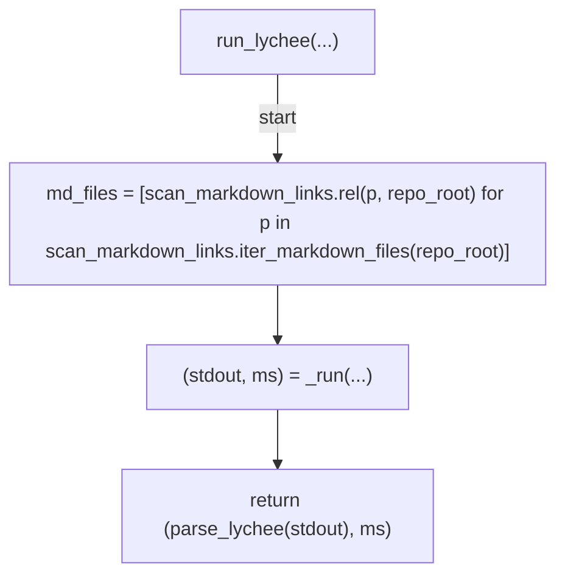

## run_betterleaks(...)

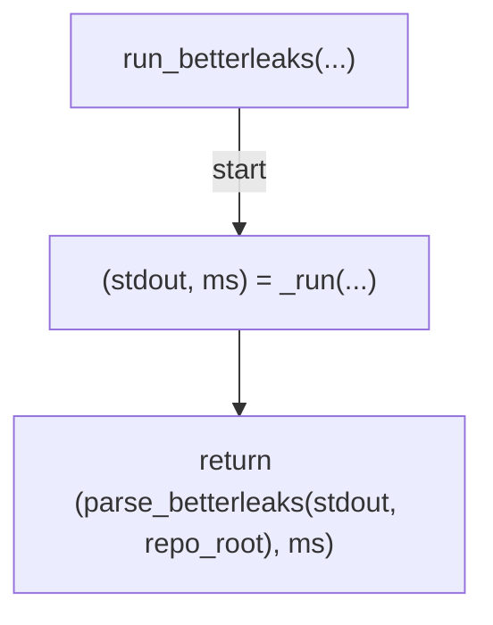

## _zizmor_smoke_argv(...)

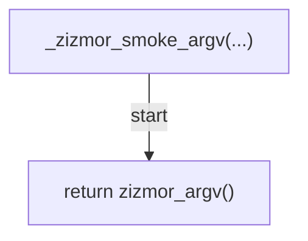

## _lychee_smoke_argv(...)

```mermaid
flowchart TD
    N001["_lychee_smoke_argv(...)"]
    N002["md_files = [scan_markdown_links.rel(p, repo_root) for p in scan_markdown_links.iter_markdown_files(repo_root)]"]
    N003["return lychee_argv(md_files)"]
    N001 -->|"start"| N002
    N002 --> N003
```

## _betterleaks_smoke_argv(...)

```mermaid
flowchart TD
    N001["_betterleaks_smoke_argv(...)"]
    N002["return betterleaks_argv()"]
    N001 -->|"start"| N002
```

## measure_pair(...)

```mermaid
flowchart TD
    N001["measure_pair(...)"]
    N002["(new_findings, new_ms) = run_tool(...)"]
    N003["gate_start = monotonic(...)"]
    N004["gate_findings = collect_gate(...)"]
    N005["gate_ms = (time.monotonic() - gate_start) * 1000.0"]
    N006["measured = now_ns(...)"]
    N007["record = build_record(...)"]
    N008["return (record, new_findings, gate_findings)"]
    N001 -->|"start"| N002
    N002 --> N003
    N003 --> N004
    N004 --> N005
    N005 --> N006
    N006 --> N007
    N007 --> N008
```

## smoke_pair(...)

```mermaid
flowchart TD
    N001["smoke_pair(...)"]
    N002["if run is None"]
    N003["run = _run"]
    N004["if spec.argv_builder is None"]
    N005["return SmokeResult(spec.pair_name, spec.new_tool, '<str>', '<str>')"]
    N006["argv = argv_builder(...)"]
    N007["try"]
    N008["(stdout, _ms) = run(...)"]
    N009["except ToolUnavailableError"]
    N010["return SmokeResult(spec.pair_name, spec.new_tool, '<str>', str(exc))"]
    N011["if not stdout.strip()"]
    N012["return SmokeResult(spec.pair_name, spec.new_tool, '<str>', f'{spec.new_tool}<str>{argv!r}<str>')"]
    N013["try"]
    N014["loads(...)"]
    N015["except json.JSONDecodeError"]
    N016["return SmokeResult(spec.pair_name, spec.new_tool, '<str>', f'{spec.new_tool}<str>{argv!r}<str>{exc}')"]
    N017["return SmokeResult(spec.pair_name, spec.new_tool, '<str>', f'{spec.new_tool}<str>')"]
    N001 -->|"start"| N002
    N002 -->|"true"| N003
    N003 --> N004
    N002 -->|"false"| N004
    N004 -->|"true"| N005
    N004 -->|"false"| N006
    N006 --> N007
    N007 -->|"try"| N008
    N007 -->|"raises"| N009
    N009 --> N010
    N008 --> N011
    N011 -->|"true"| N012
    N011 -->|"false"| N013
    N013 -->|"try"| N014
    N013 -->|"raises"| N015
    N015 --> N016
    N014 --> N017
```

## cmd_smoke(...)

```mermaid
flowchart TD
    N001["cmd_smoke(...)"]
    N002["failed = False"]
    N003["for spec in specs:     result = smoke_pair(spec, repo_root)     if result.status == '<str>':         failed = True         print(f'<str>{result.pair_name}<str>{result.tool}<str>{result.detail}', file=sys.stderr)     else:         print(f'<str>{result.pair_name}<str>{result.tool}<str>{result.status}<str>{result.detail}')"]
    N004["return 1 if failed else 0"]
    N001 -->|"start"| N002
    N002 --> N003
    N003 --> N004
```

## _resolve_commit(...)

```mermaid
flowchart TD
    N001["_resolve_commit(...)"]
    N002["if explicit"]
    N003["return explicit"]
    N004["try"]
    N005["out = run(...)"]
    N006["except FileNotFoundError"]
    N007["return '<str>'"]
    N008["sha = strip(...)"]
    N009["return sha or '<str>'"]
    N001 -->|"start"| N002
    N002 -->|"true"| N003
    N002 -->|"false"| N004
    N004 -->|"try"| N005
    N004 -->|"raises"| N006
    N006 --> N007
    N005 --> N008
    N008 --> N009
```

## _select_pairs(...)

```mermaid
flowchart TD
    N001["_select_pairs(...)"]
    N002["if name is None"]
    N003["return PAIRS"]
    N004["selected = tuple(...)"]
    N005["if not selected"]
    N006["valid = join(...)"]
    N007["raise ValueError(f'<str>{name}<str>{valid}')"]
    N008["return selected"]
    N001 -->|"start"| N002
    N002 -->|"true"| N003
    N002 -->|"false"| N004
    N004 --> N005
    N005 -->|"true"| N006
    N006 --> N007
    N005 -->|"false"| N008
```

## build_parser(...)

```mermaid
flowchart TD
    N001["build_parser(...)"]
    N002["parser = ArgumentParser(...)"]
    N003["add_argument(...)"]
    N004["add_argument(...)"]
    N005["add_argument(...)"]
    N006["add_argument(...)"]
    N007["add_argument(...)"]
    N008["add_argument(...)"]
    N009["add_argument(...)"]
    N010["add_argument(...)"]
    N011["add_argument(...)"]
    N012["return parser"]
    N001 -->|"start"| N002
    N002 --> N003
    N003 --> N004
    N004 --> N005
    N005 --> N006
    N006 --> N007
    N007 --> N008
    N008 --> N009
    N009 --> N010
    N010 --> N011
    N011 --> N012
```

## main(...)

```mermaid
flowchart TD
    N001["main(...)"]
    N002["import os"]
    N003["args = parse_args(...)"]
    N004["repo_root = resolve(...)"]
    N005["specs = _select_pairs(...)"]
    N006["if args.smoke"]
    N007["return cmd_smoke(specs, repo_root)"]
    N008["commit_sha = _resolve_commit(...)"]
    N009["host_id = args.host_id or os.environ.get('<str>', '<str>')"]
    N010["records = []"]
    N011["details = []"]
    N012["for spec in specs:     record, new_findings, gate_findings = measure_pair(spec, repo_root, commit_sha=commit_sha, host_id=host_id, notes=args.notes)     records.append(record)     _agree, new_only, gate_only = diff_findings(new_findings, gate_findings)     details.append(render_detail(spec.pair_name, new_only, gate_only, new_findings, gate_findings))"]
    N013["report = render_markdown(records, args.title) + '<str>' + '<str>'.join(details)"]
    N014["if args.output"]
    N015["write_text(...)"]
    N016["if args.report"]
    N017["write_text(...)"]
    N018["write(...)"]
    N019["return 0"]
    N001 -->|"start"| N002
    N002 --> N003
    N003 --> N004
    N004 --> N005
    N005 --> N006
    N006 -->|"true"| N007
    N006 -->|"false"| N008
    N008 --> N009
    N009 --> N010
    N010 --> N011
    N011 --> N012
    N012 --> N013
    N013 --> N014
    N014 -->|"true"| N015
    N015 --> N016
    N014 -->|"false"| N016
    N016 -->|"true"| N017
    N016 -->|"false"| N018
    N017 --> N019
    N018 --> N019
```
