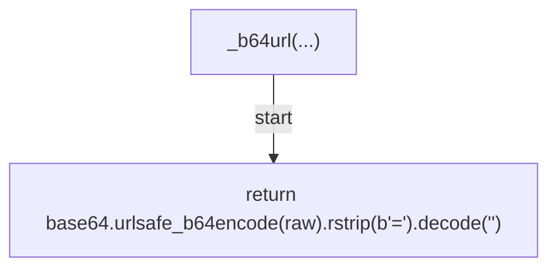
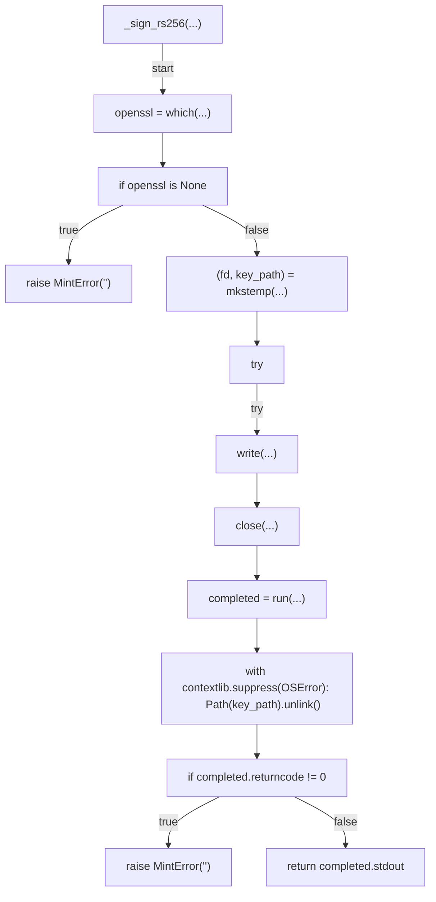
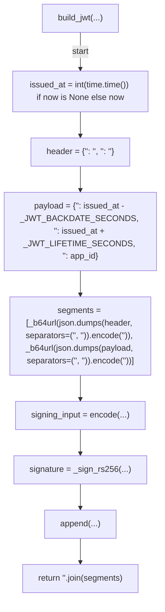
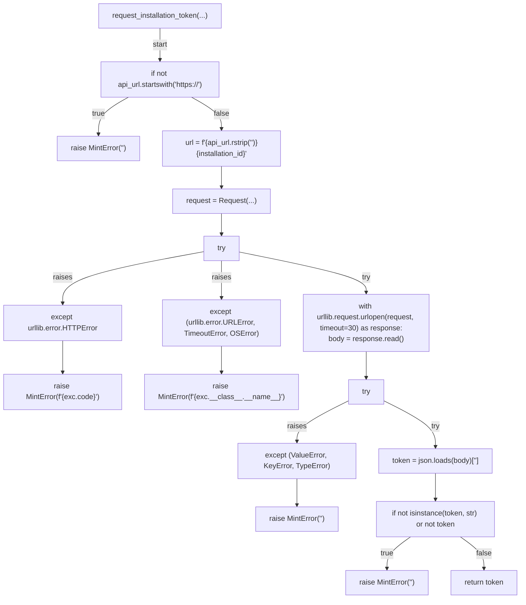
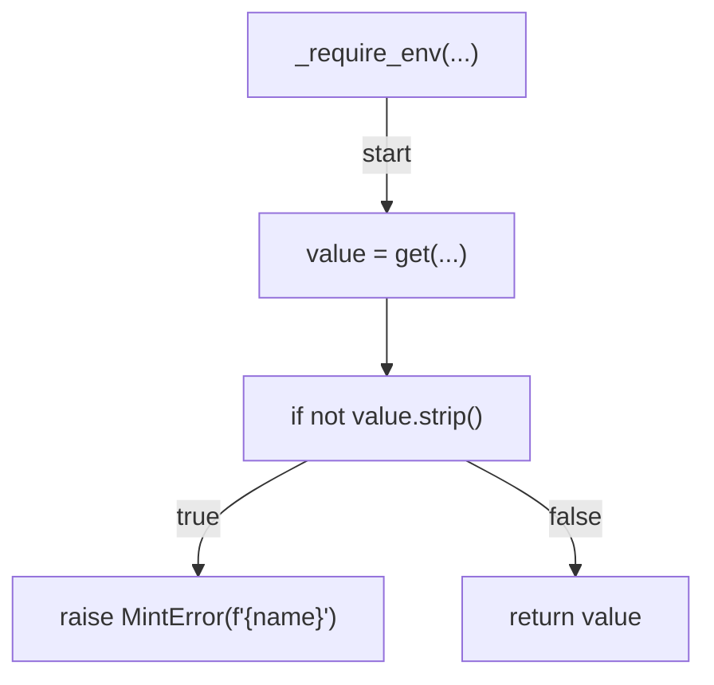
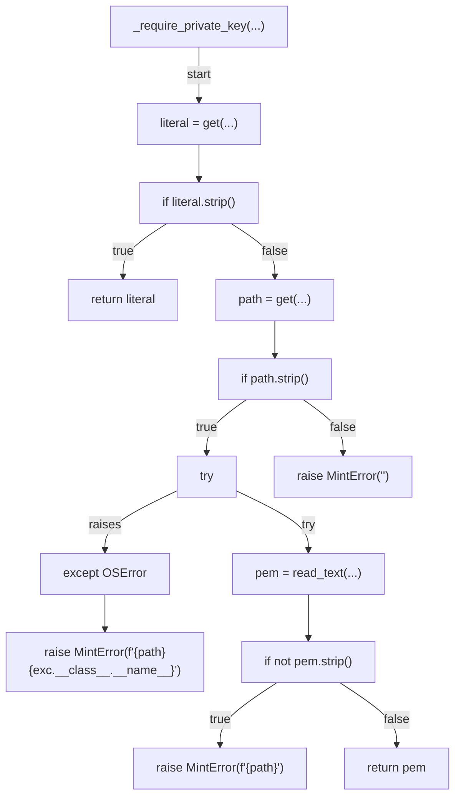
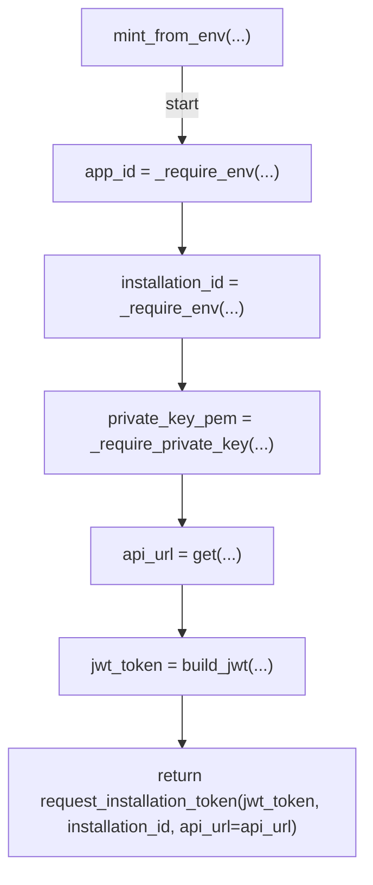
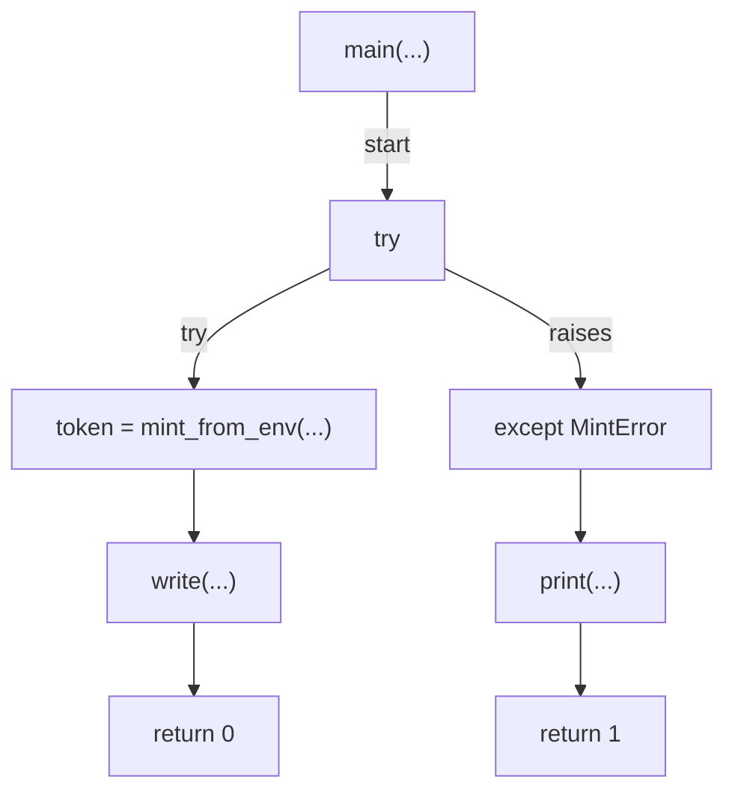

# AST graph: scripts/mint_github_app_token.py

This file is generated from `scripts/mint_github_app_token.py` by `python3 scripts/script_ast_graph.py all-doc`. Do not edit it by hand: content under `docs/generated/scripts/` is owned by the post-merge automation (refs #1540); update the source script instead.

## _b64url(...)

## _sign_rs256(...)

## build_jwt(...)

## request_installation_token(...)

## _require_env(...)

## _require_private_key(...)

## mint_from_env(...)

## main(...)

