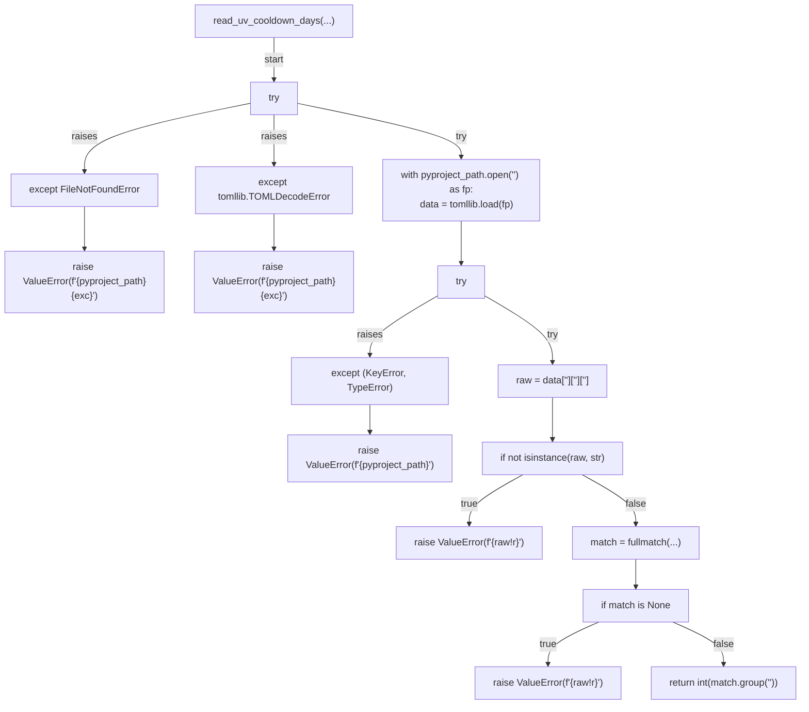
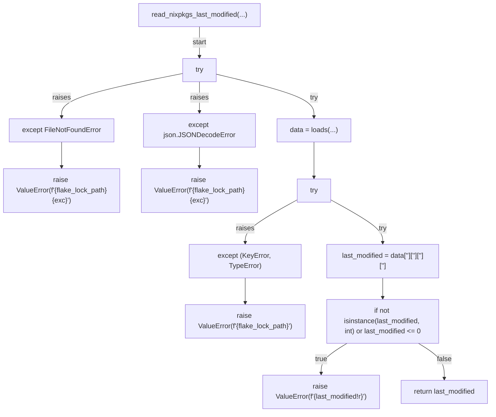
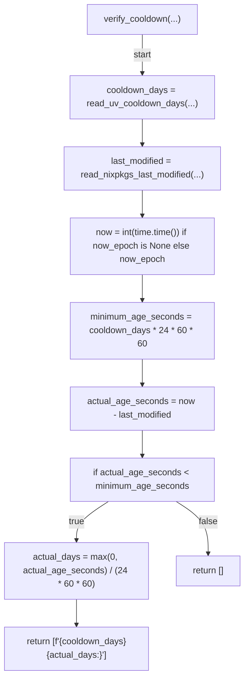
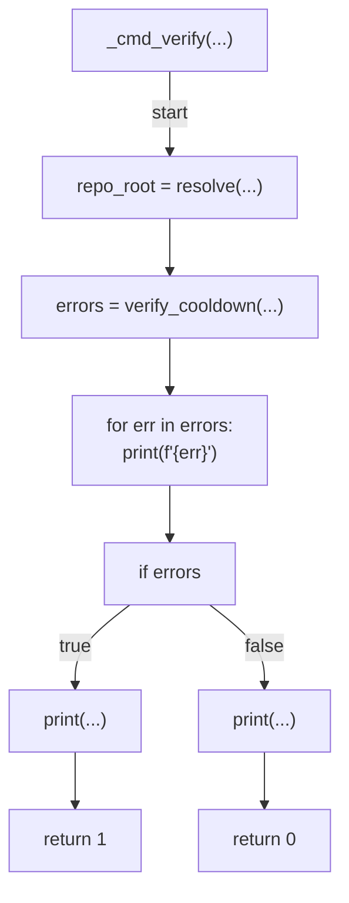
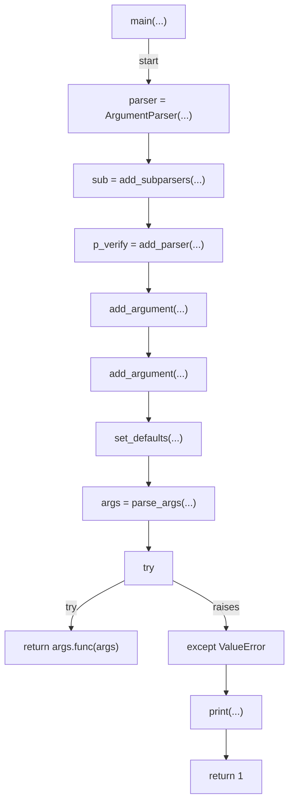

# AST graph: scripts/nixpkgs_cooldown.py

This file is generated from `scripts/nixpkgs_cooldown.py` by `python3 scripts/script_ast_graph.py all-doc`. Do not edit it by hand: content under `docs/generated/scripts/` is owned by the post-merge automation (refs #1540) -- update the source script instead.

## read_uv_cooldown_days(...)

## read_nixpkgs_last_modified(...)

## verify_cooldown(...)

## _cmd_verify(...)

## main(...)

