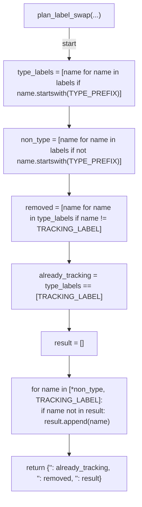
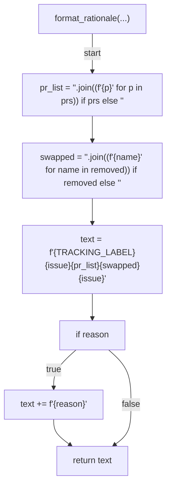
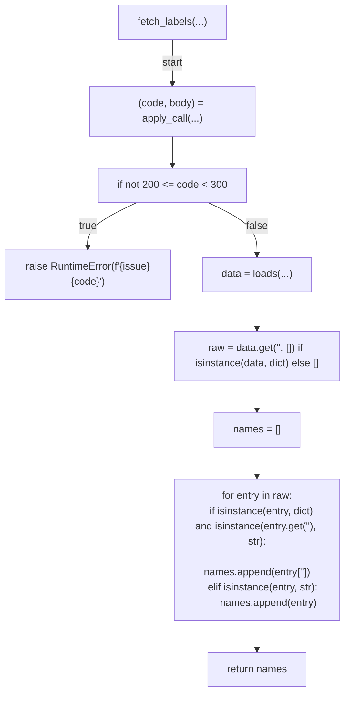
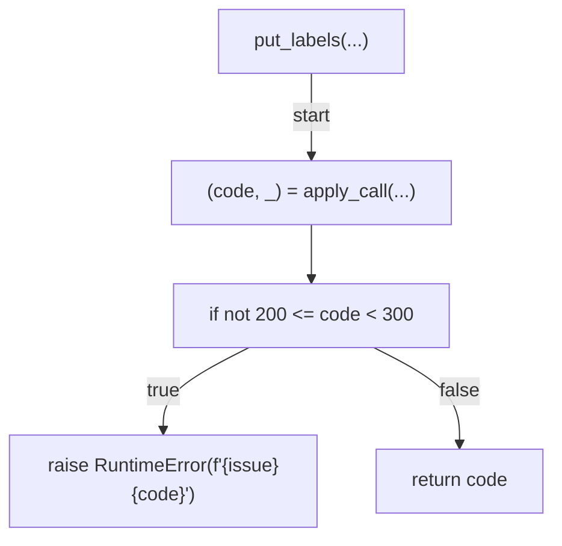
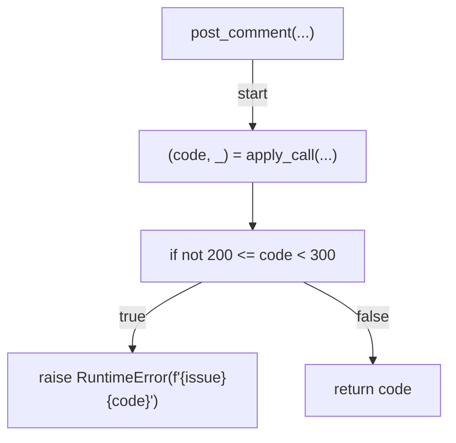
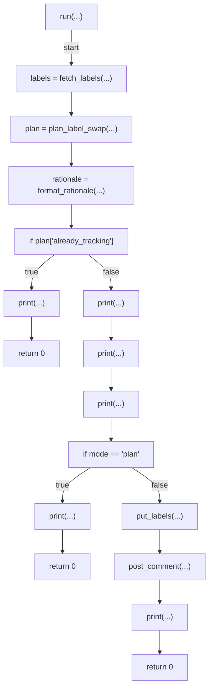
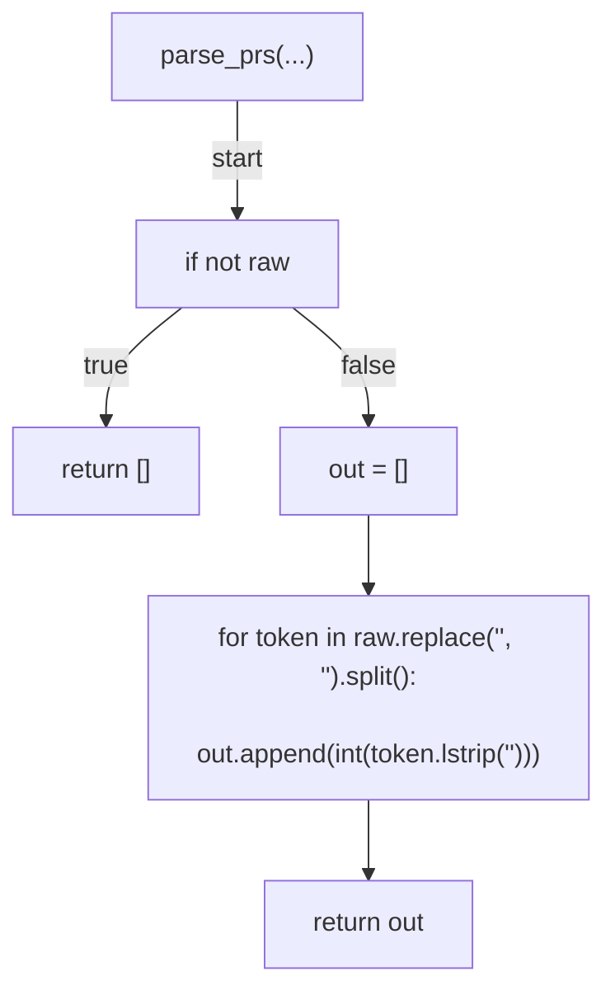
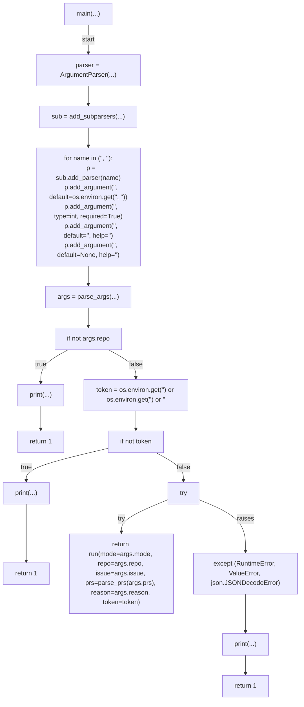

# AST graph: scripts/np_strategy_tracking.py

This file is generated from `scripts/np_strategy_tracking.py` by `python3 scripts/script_ast_graph.py all-doc`. Do not edit it by hand: content under `docs/generated/scripts/` is owned by the post-merge automation (refs #1540) -- update the source script instead.

## plan_label_swap(...)

## format_rationale(...)

## fetch_labels(...)

## put_labels(...)

## post_comment(...)

## run(...)

## parse_prs(...)

## main(...)

