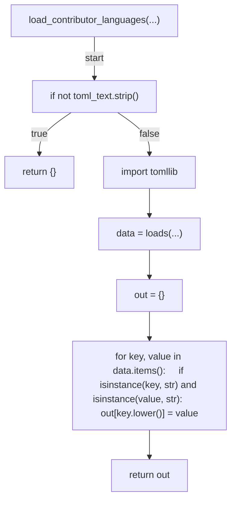
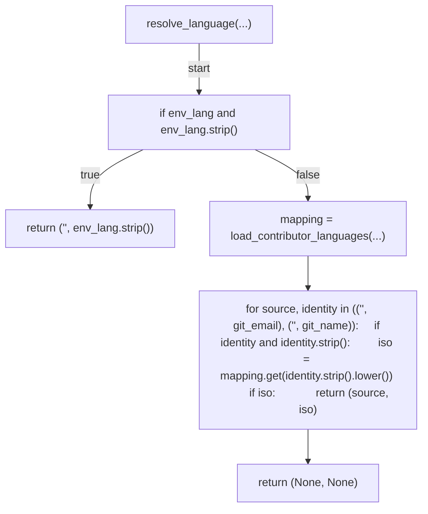
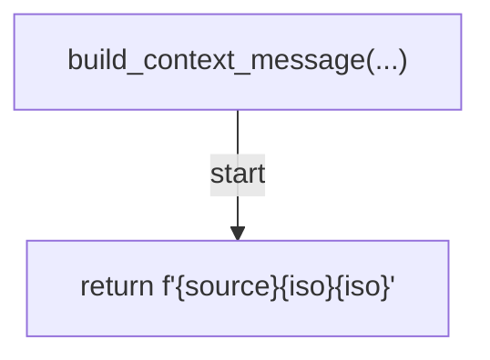
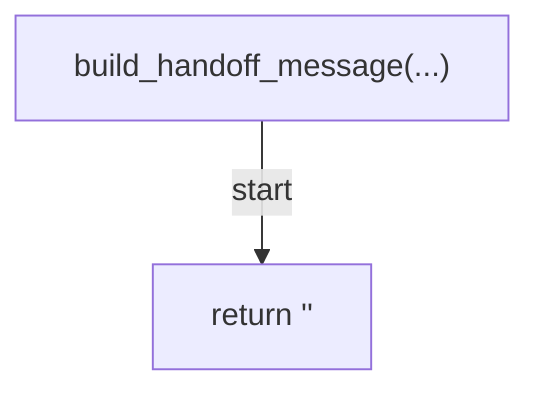
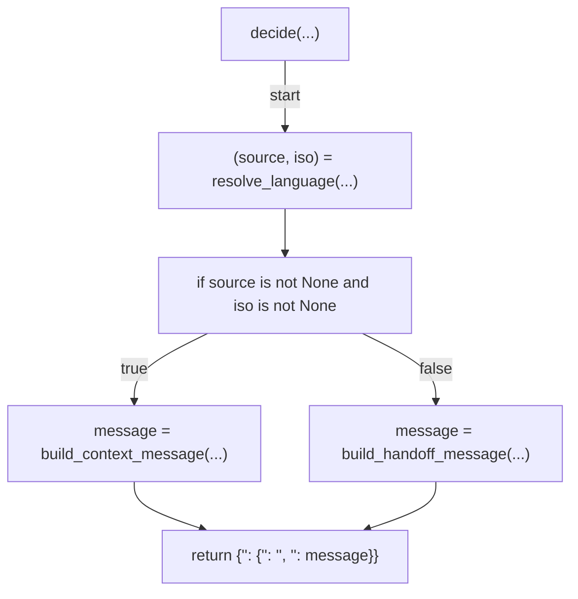
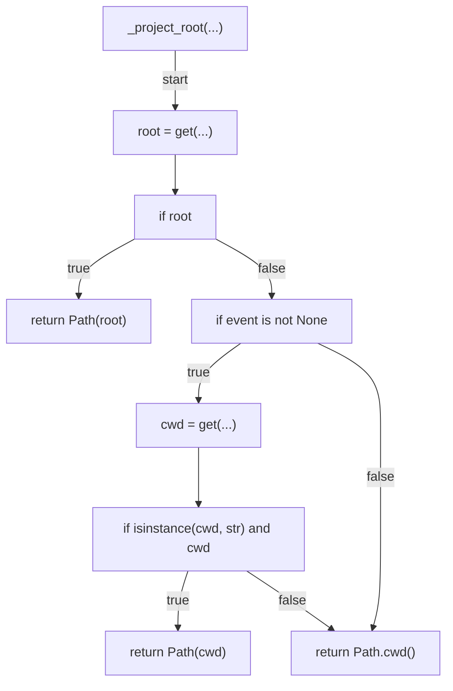
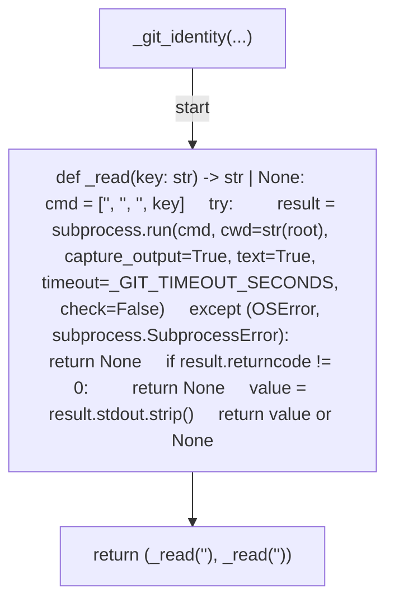
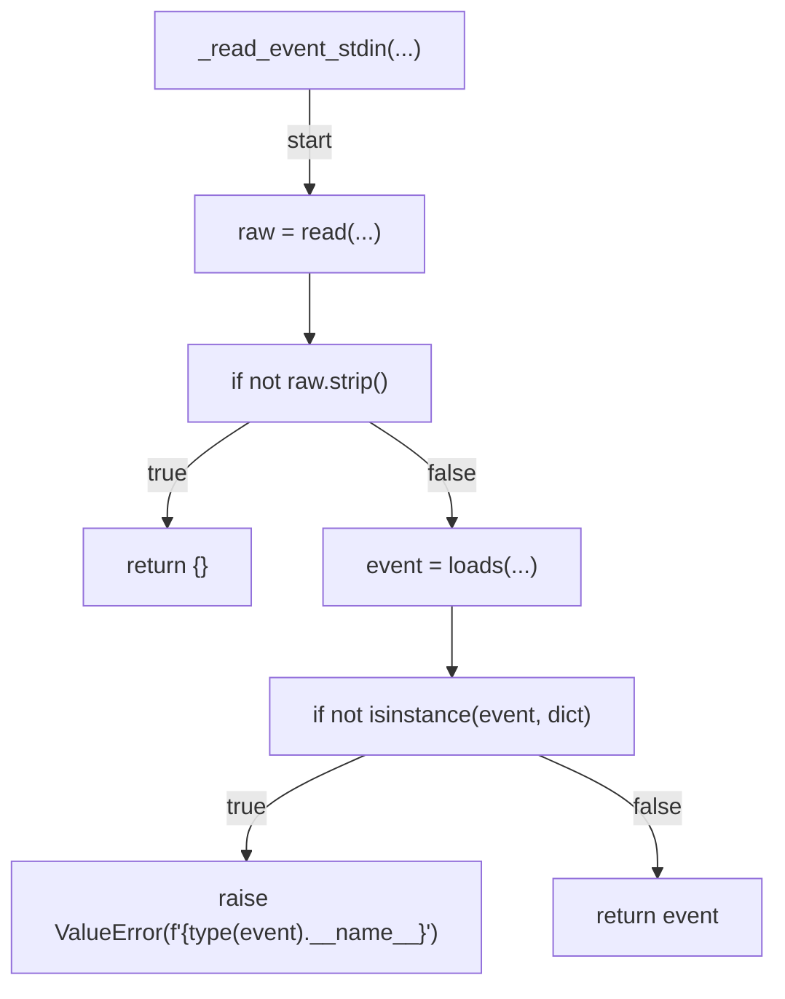
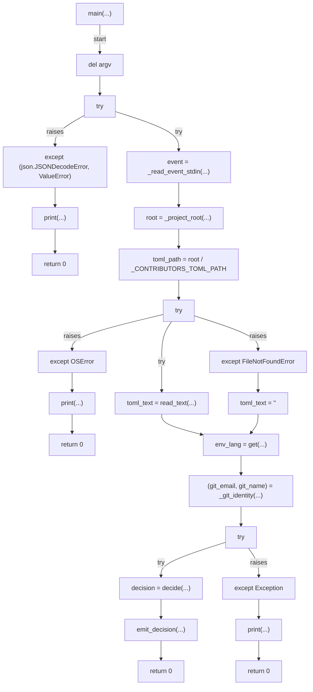

# AST graph: scripts/plan_language_context.py

This file is generated from `scripts/plan_language_context.py` by `python3 scripts/script_ast_graph.py all-doc`. Do not edit it by hand: content under `docs/generated/scripts/` is owned by the post-merge automation (refs #1540); update the source script instead.

## load_contributor_languages(...)

## resolve_language(...)

## build_context_message(...)

## build_handoff_message(...)

## decide(...)

## _project_root(...)

## _git_identity(...)

## _read_event_stdin(...)

## main(...)

