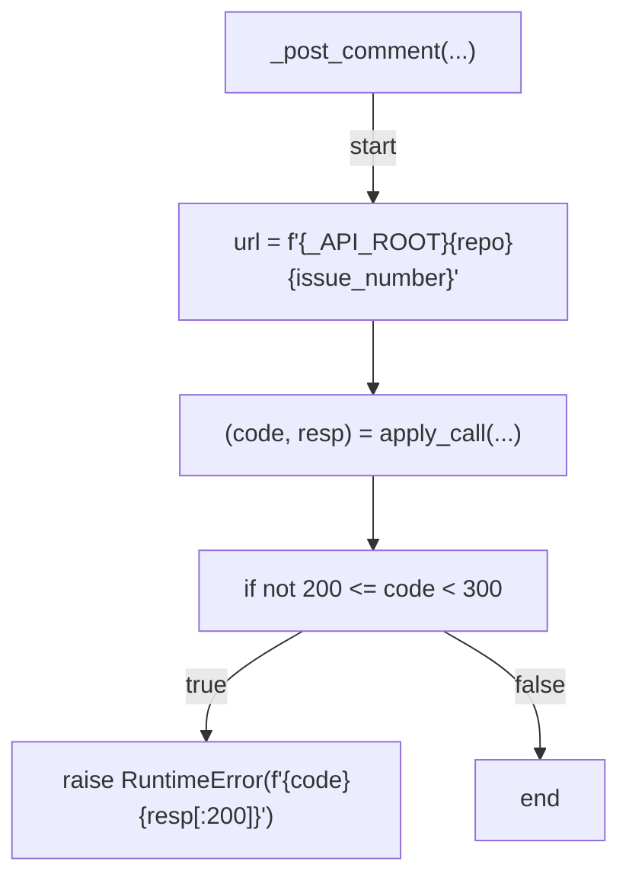
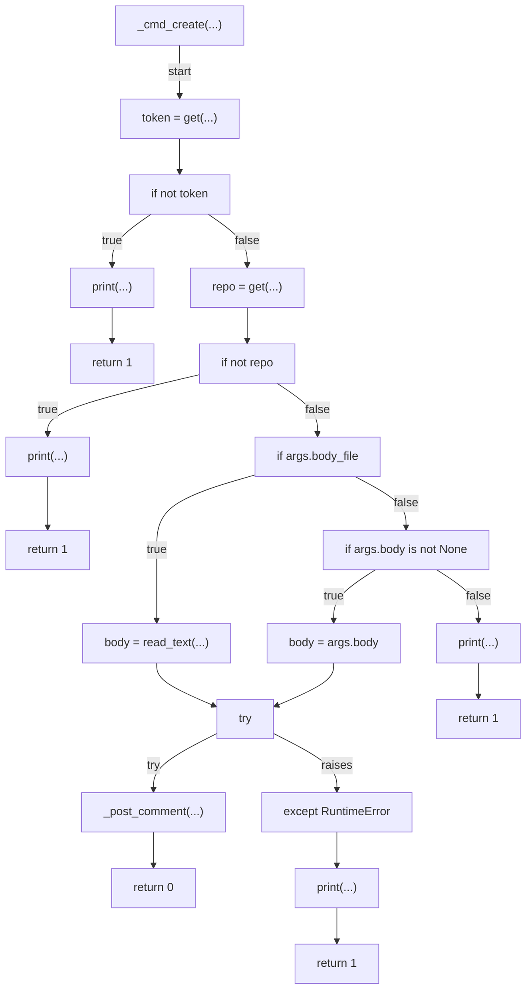
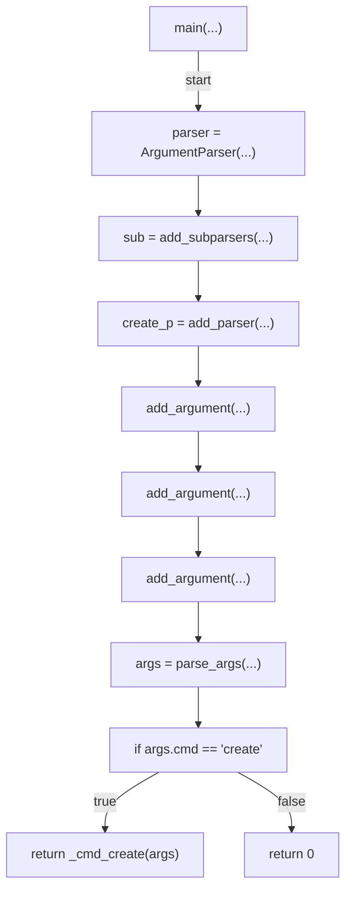

# AST graph: scripts/post_issue_comment.py

This file is generated from `scripts/post_issue_comment.py` by `python3 scripts/script_ast_graph.py all-doc`. Do not edit it by hand: content under `docs/generated/scripts/` is owned by the post-merge automation (refs #1540); update the source script instead.

## _post_comment(...)

## _cmd_create(...)

## main(...)

