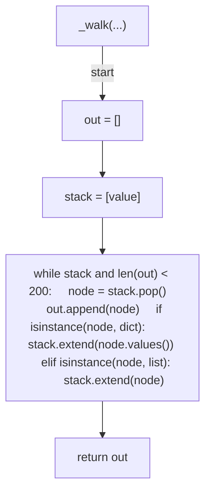
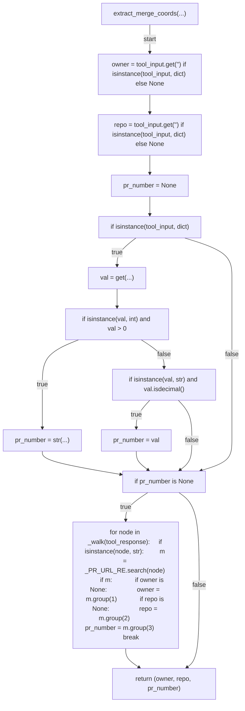
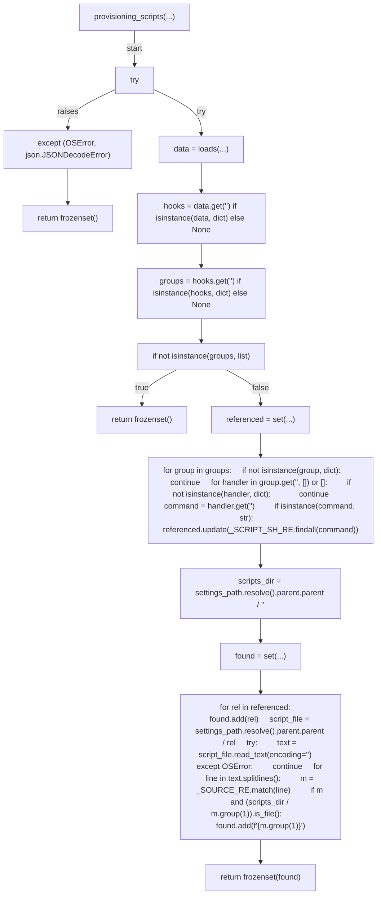
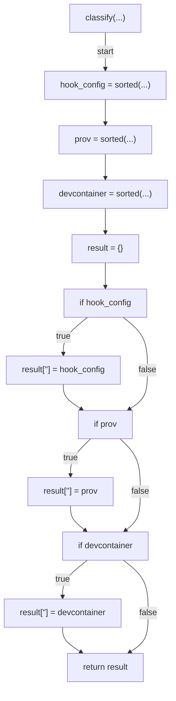
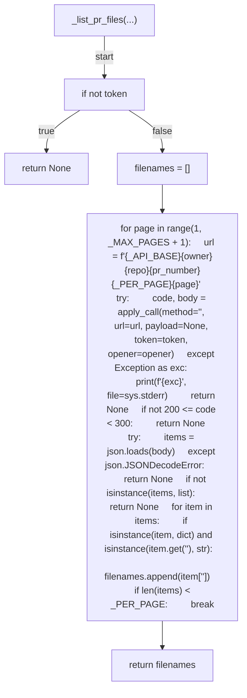
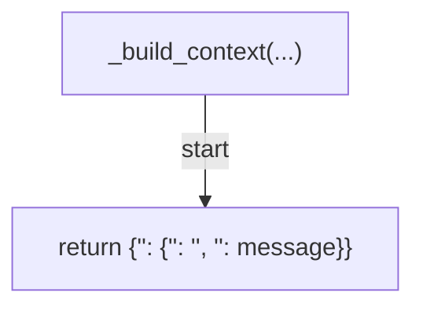
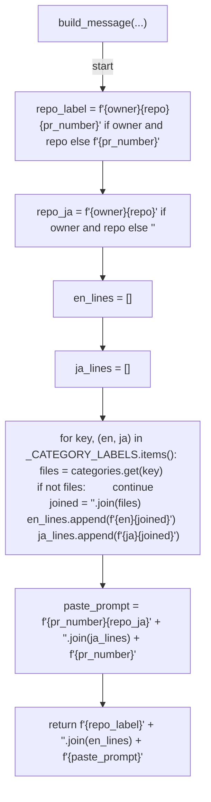
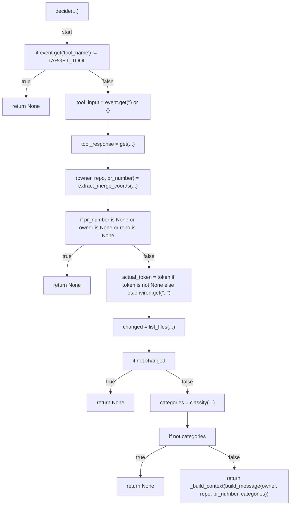
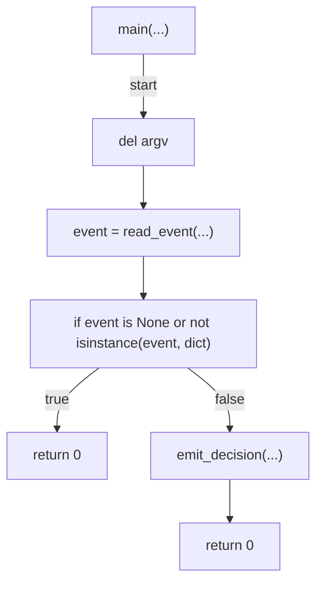

# AST graph: scripts/post_merge_new_session_prompt.py

This file is generated from `scripts/post_merge_new_session_prompt.py` by `python3 scripts/script_ast_graph.py all-doc`. Do not edit it by hand: content under `docs/generated/scripts/` is owned by the post-merge automation (refs #1540); update the source script instead.

## _walk(...)

## extract_merge_coords(...)

## provisioning_scripts(...)

## classify(...)

## _list_pr_files(...)

## _build_context(...)

## build_message(...)

## decide(...)

## main(...)

