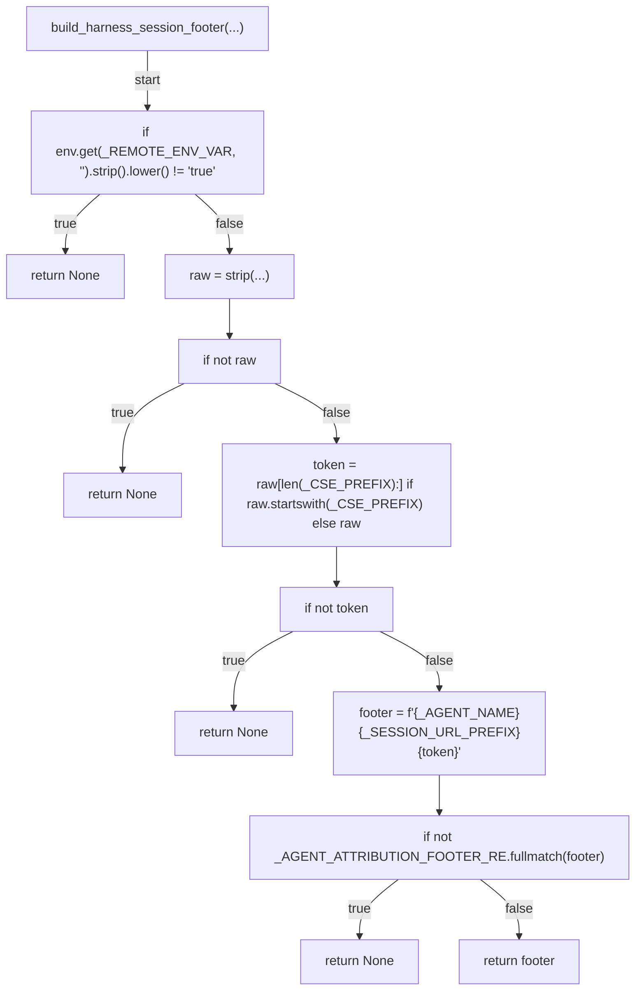
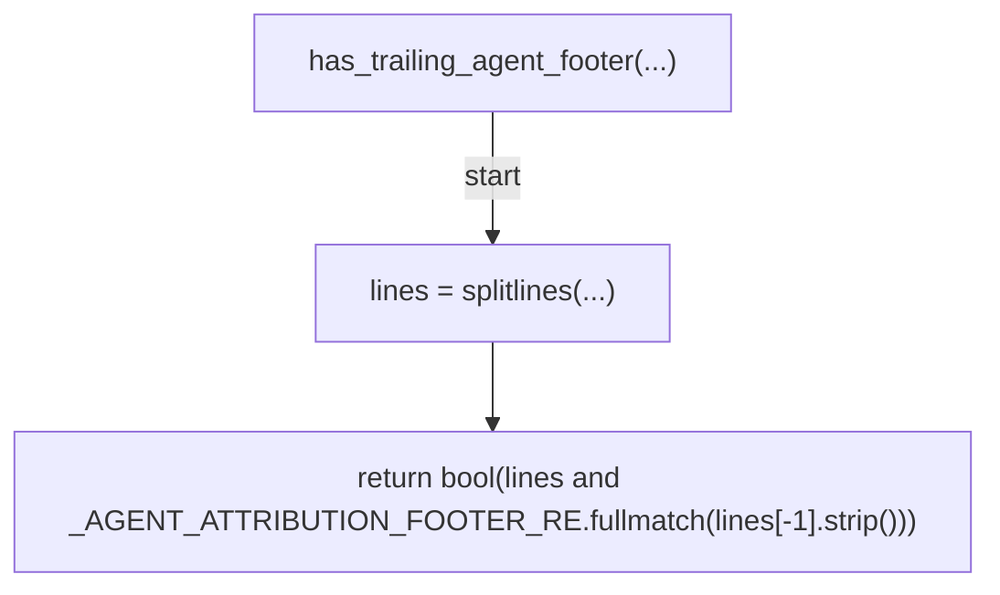
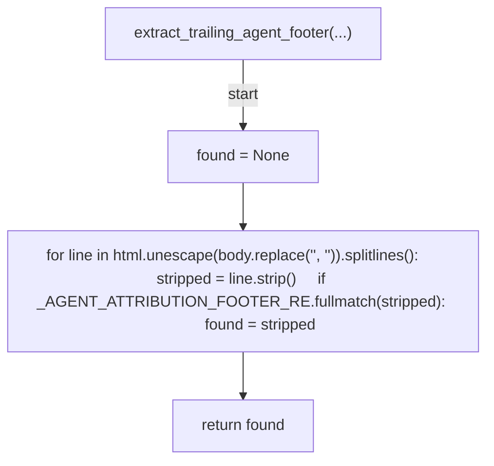
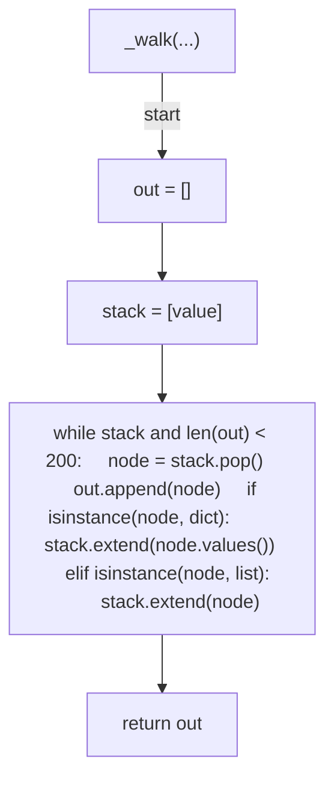
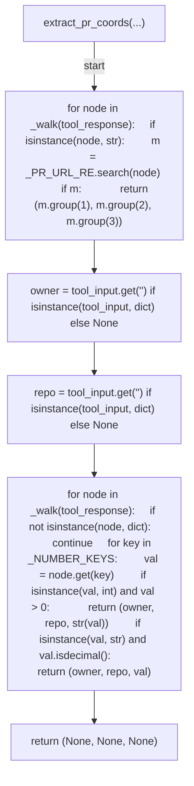
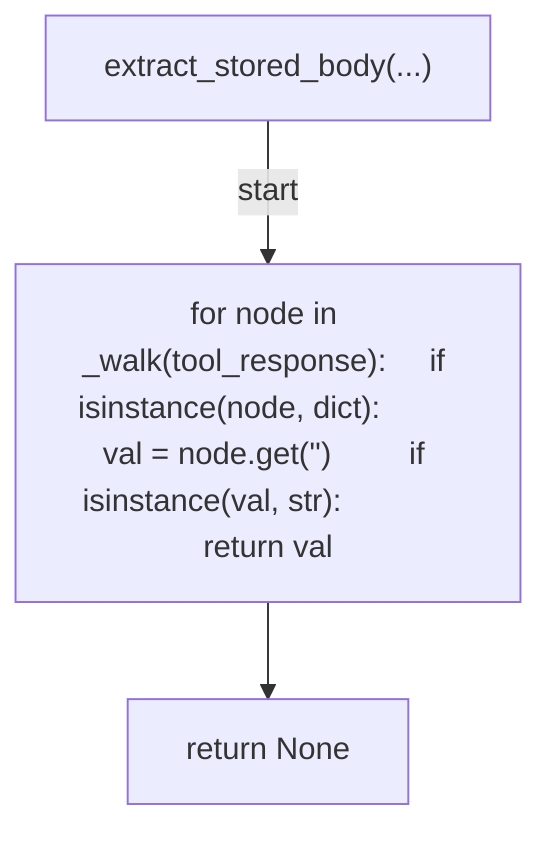
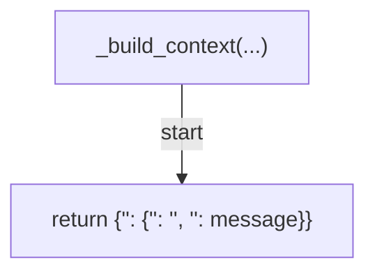
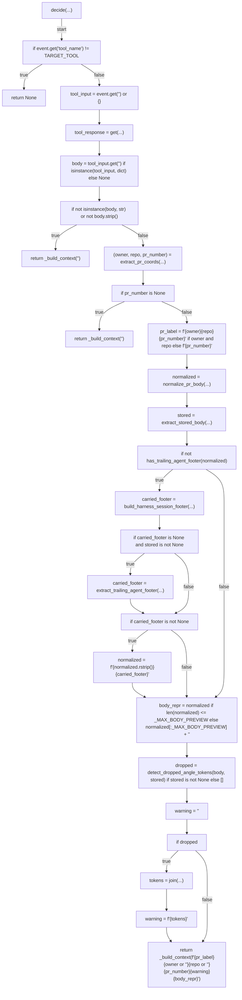
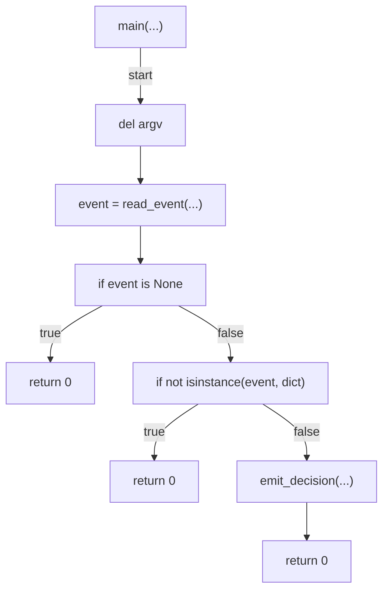

# AST graph: scripts/post_pr_create_body_fix.py

This file is generated from `scripts/post_pr_create_body_fix.py` by `python3 scripts/script_ast_graph.py all-doc`. Do not edit it by hand: content under `docs/generated/scripts/` is owned by the post-merge automation (refs #1540); update the source script instead.

## build_harness_session_footer(...)

## has_trailing_agent_footer(...)

## extract_trailing_agent_footer(...)

## _walk(...)

## extract_pr_coords(...)

## extract_stored_body(...)

## _build_context(...)

## decide(...)

## main(...)

