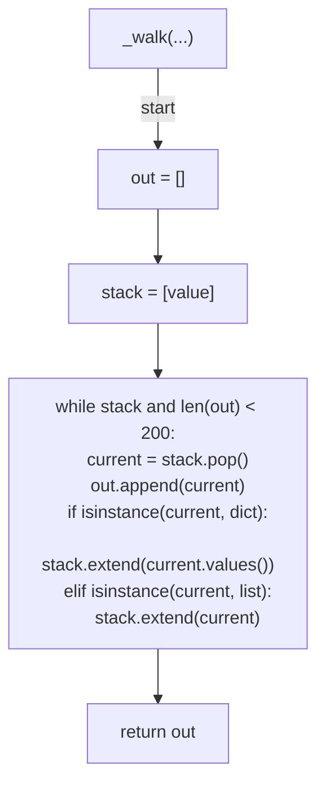
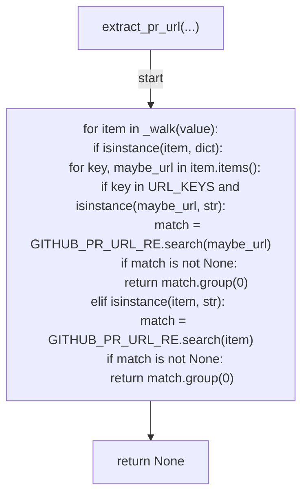
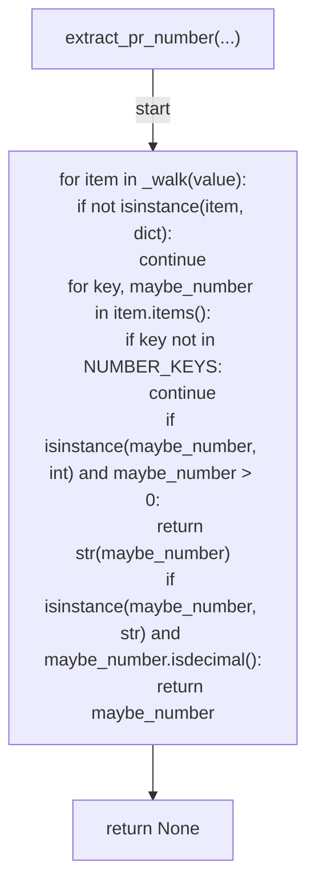
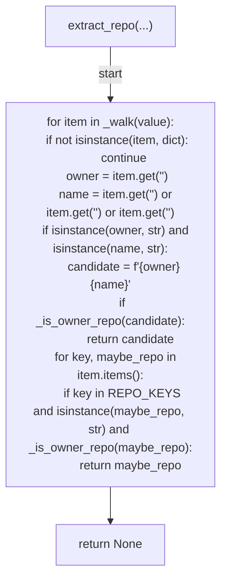
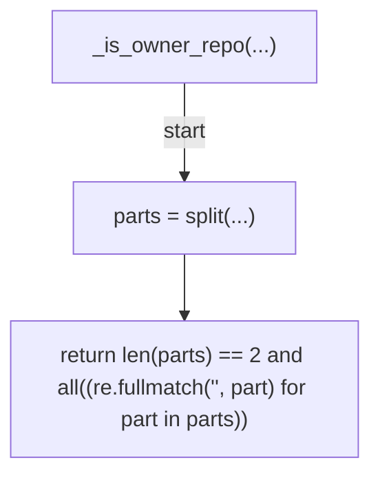
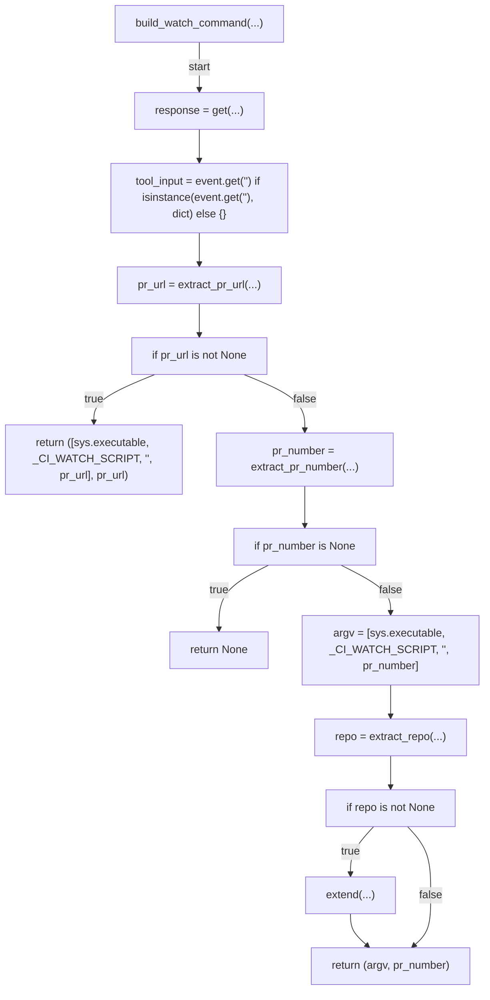
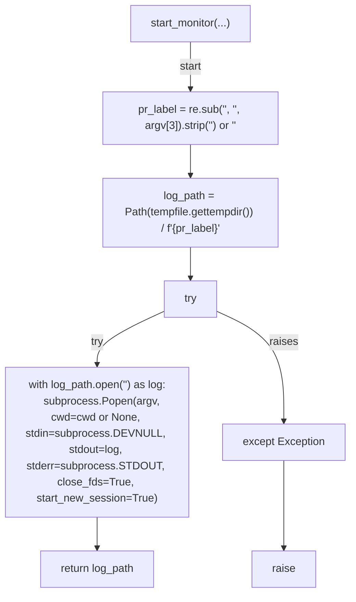
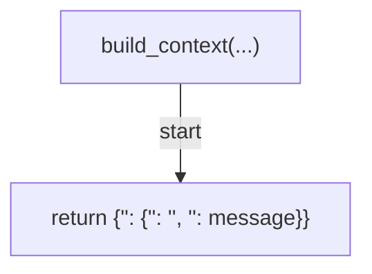
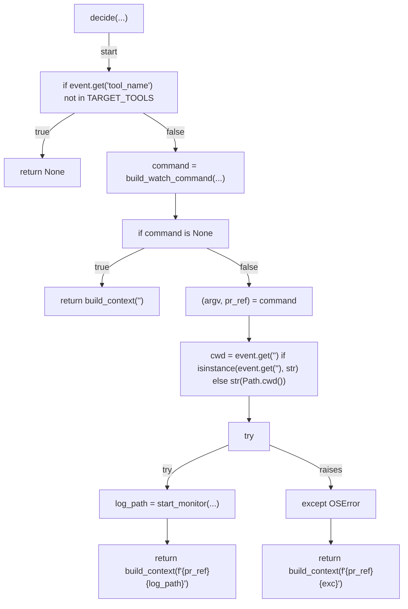
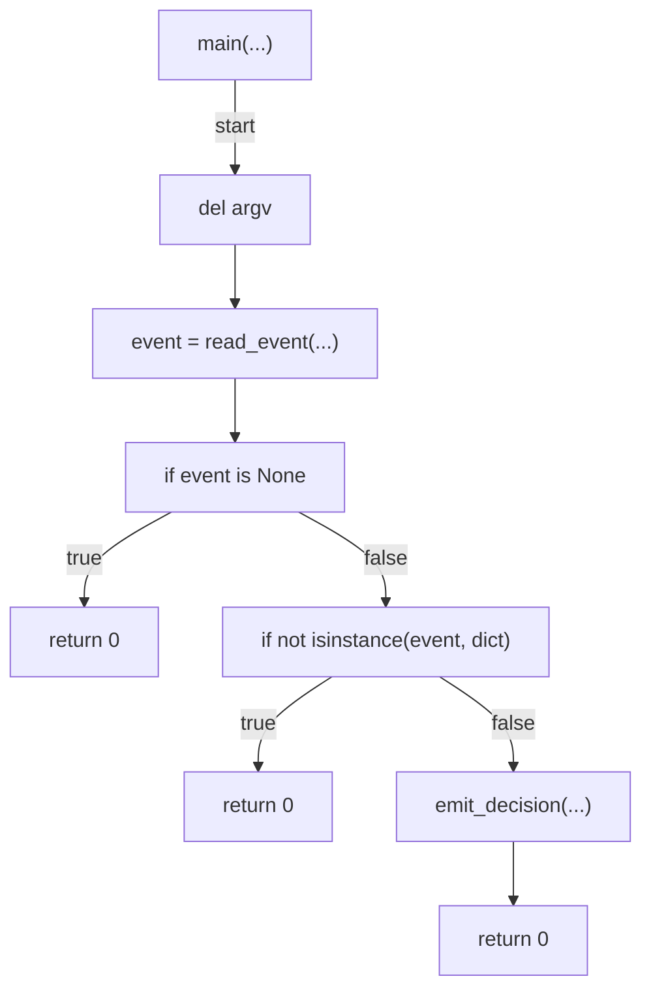

# AST graph: scripts/post_pr_create_ci_monitor.py

This file is generated from `scripts/post_pr_create_ci_monitor.py` by `python3 scripts/script_ast_graph.py all-doc`. Do not edit it by hand: content under `docs/generated/scripts/` is owned by the post-merge automation (refs #1540) -- update the source script instead.

## _walk(...)

## extract_pr_url(...)

## extract_pr_number(...)

## extract_repo(...)

## _is_owner_repo(...)

## build_watch_command(...)

## start_monitor(...)

## build_context(...)

## decide(...)

## main(...)

