# AST graph: scripts/pr_upsert.py

This file is generated from `scripts/pr_upsert.py` by `python3 scripts/script_ast_graph.py all-doc`. Do not edit it by hand: content under `docs/generated/scripts/` is owned by the post-merge automation (refs #1540) -- update the source script instead.

## _list_open_prs(...)

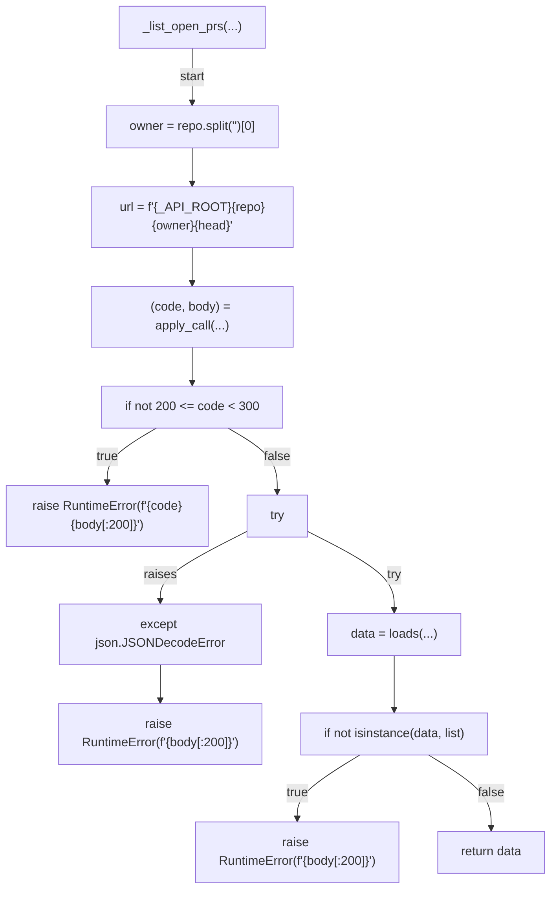
```mermaid
flowchart TD
    N001["_list_open_prs(...)"]
    N002["owner = repo.split('<str>')[0]"]
    N003["url = f'{_API_ROOT}<str>{repo}<str>{owner}<str>{head}<str>'"]
    N004["(code, body) = apply_call(...)"]
    N005["if not 200 <= code < 300"]
    N006["raise RuntimeError(f'<str>{code}<str>{body[:200]}')"]
    N007["try"]
    N008["data = loads(...)"]
    N009["except json.JSONDecodeError"]
    N010["raise RuntimeError(f'<str>{body[:200]}')"]
    N011["if not isinstance(data, list)"]
    N012["raise RuntimeError(f'<str>{body[:200]}')"]
    N013["return data"]
    N001 -->|"start"| N002
    N002 --> N003
    N003 --> N004
    N004 --> N005
    N005 -->|"true"| N006
    N005 -->|"false"| N007
    N007 -->|"try"| N008
    N007 -->|"raises"| N009
    N009 --> N010
    N008 --> N011
    N011 -->|"true"| N012
    N011 -->|"false"| N013
```

## _list_open_prs_by_prefix(...)

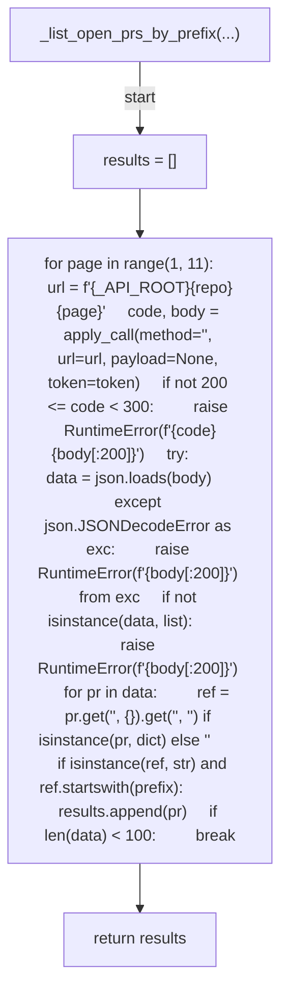
```mermaid
flowchart TD
    N001["_list_open_prs_by_prefix(...)"]
    N002["results = []"]
    N003["for page in range(1, 11):     url = f'{_API_ROOT}<str>{repo}<str>{page}'     code, body = apply_call(method='<str>', url=url, payload=None, token=token)     if not 200 <= code < 300:         raise RuntimeError(f'<str>{code}<str>{body[:200]}')     try:         data = json.loads(body)     except json.JSONDecodeError as exc:         raise RuntimeError(f'<str>{body[:200]}') from exc     if not isinstance(data, list):         raise RuntimeError(f'<str>{body[:200]}')     for pr in data:         ref = pr.get('<str>', {}).get('<str>', '<str>') if isinstance(pr, dict) else '<str>'         if isinstance(ref, str) and ref.startswith(prefix):             results.append(pr)     if len(data) < 100:         break"]
    N004["return results"]
    N001 -->|"start"| N002
    N002 --> N003
    N003 --> N004
```

## _compare_behind(...)

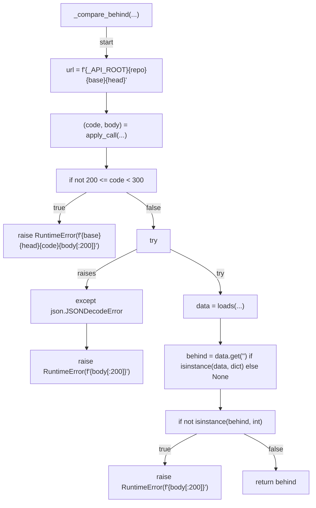
```mermaid
flowchart TD
    N001["_compare_behind(...)"]
    N002["url = f'{_API_ROOT}<str>{repo}<str>{base}<str>{head}'"]
    N003["(code, body) = apply_call(...)"]
    N004["if not 200 <= code < 300"]
    N005["raise RuntimeError(f'<str>{base}<str>{head}<str>{code}<str>{body[:200]}')"]
    N006["try"]
    N007["data = loads(...)"]
    N008["except json.JSONDecodeError"]
    N009["raise RuntimeError(f'<str>{body[:200]}')"]
    N010["behind = data.get('<str>') if isinstance(data, dict) else None"]
    N011["if not isinstance(behind, int)"]
    N012["raise RuntimeError(f'<str>{body[:200]}')"]
    N013["return behind"]
    N001 -->|"start"| N002
    N002 --> N003
    N003 --> N004
    N004 -->|"true"| N005
    N004 -->|"false"| N006
    N006 -->|"try"| N007
    N006 -->|"raises"| N008
    N008 --> N009
    N007 --> N010
    N010 --> N011
    N011 -->|"true"| N012
    N011 -->|"false"| N013
```

## _get_pr(...)

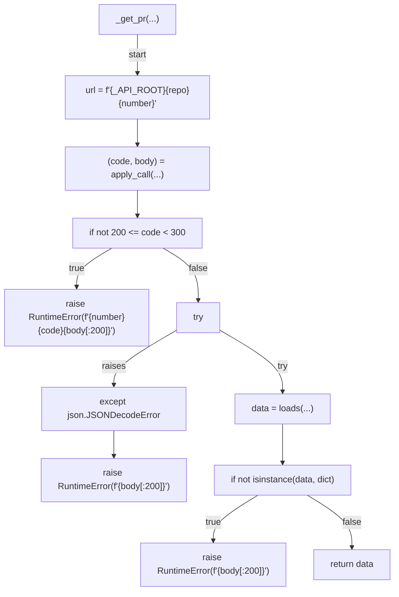
```mermaid
flowchart TD
    N001["_get_pr(...)"]
    N002["url = f'{_API_ROOT}<str>{repo}<str>{number}'"]
    N003["(code, body) = apply_call(...)"]
    N004["if not 200 <= code < 300"]
    N005["raise RuntimeError(f'<str>{number}<str>{code}<str>{body[:200]}')"]
    N006["try"]
    N007["data = loads(...)"]
    N008["except json.JSONDecodeError"]
    N009["raise RuntimeError(f'<str>{body[:200]}')"]
    N010["if not isinstance(data, dict)"]
    N011["raise RuntimeError(f'<str>{body[:200]}')"]
    N012["return data"]
    N001 -->|"start"| N002
    N002 --> N003
    N003 --> N004
    N004 -->|"true"| N005
    N004 -->|"false"| N006
    N006 -->|"try"| N007
    N006 -->|"raises"| N008
    N008 --> N009
    N007 --> N010
    N010 -->|"true"| N011
    N010 -->|"false"| N012
```

## _get_ref_sha(...)

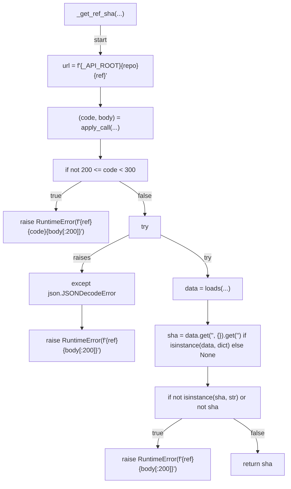
```mermaid
flowchart TD
    N001["_get_ref_sha(...)"]
    N002["url = f'{_API_ROOT}<str>{repo}<str>{ref}'"]
    N003["(code, body) = apply_call(...)"]
    N004["if not 200 <= code < 300"]
    N005["raise RuntimeError(f'<str>{ref}<str>{code}<str>{body[:200]}')"]
    N006["try"]
    N007["data = loads(...)"]
    N008["except json.JSONDecodeError"]
    N009["raise RuntimeError(f'<str>{ref}<str>{body[:200]}')"]
    N010["sha = data.get('<str>', {}).get('<str>') if isinstance(data, dict) else None"]
    N011["if not isinstance(sha, str) or not sha"]
    N012["raise RuntimeError(f'<str>{ref}<str>{body[:200]}')"]
    N013["return sha"]
    N001 -->|"start"| N002
    N002 --> N003
    N003 --> N004
    N004 -->|"true"| N005
    N004 -->|"false"| N006
    N006 -->|"try"| N007
    N006 -->|"raises"| N008
    N008 --> N009
    N007 --> N010
    N010 --> N011
    N011 -->|"true"| N012
    N011 -->|"false"| N013
```

## _create_branch_ref(...)

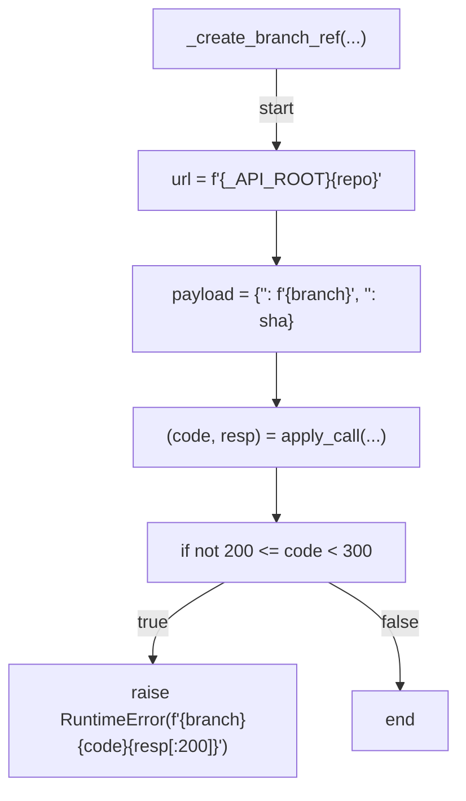
```mermaid
flowchart TD
    N001["_create_branch_ref(...)"]
    N002["url = f'{_API_ROOT}<str>{repo}<str>'"]
    N003["payload = {'<str>': f'<str>{branch}', '<str>': sha}"]
    N004["(code, resp) = apply_call(...)"]
    N005["if not 200 <= code < 300"]
    N006["raise RuntimeError(f'<str>{branch}<str>{code}<str>{resp[:200]}')"]
    N007["end"]
    N001 -->|"start"| N002
    N002 --> N003
    N003 --> N004
    N004 --> N005
    N005 -->|"true"| N006
    N005 -->|"false"| N007
```

## _get_branch_head_oid(...)

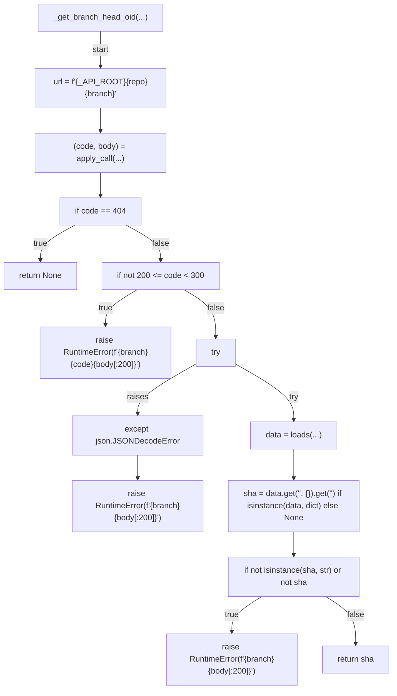
```mermaid
flowchart TD
    N001["_get_branch_head_oid(...)"]
    N002["url = f'{_API_ROOT}<str>{repo}<str>{branch}'"]
    N003["(code, body) = apply_call(...)"]
    N004["if code == 404"]
    N005["return None"]
    N006["if not 200 <= code < 300"]
    N007["raise RuntimeError(f'<str>{branch}<str>{code}<str>{body[:200]}')"]
    N008["try"]
    N009["data = loads(...)"]
    N010["except json.JSONDecodeError"]
    N011["raise RuntimeError(f'<str>{branch}<str>{body[:200]}')"]
    N012["sha = data.get('<str>', {}).get('<str>') if isinstance(data, dict) else None"]
    N013["if not isinstance(sha, str) or not sha"]
    N014["raise RuntimeError(f'<str>{branch}<str>{body[:200]}')"]
    N015["return sha"]
    N001 -->|"start"| N002
    N002 --> N003
    N003 --> N004
    N004 -->|"true"| N005
    N004 -->|"false"| N006
    N006 -->|"true"| N007
    N006 -->|"false"| N008
    N008 -->|"try"| N009
    N008 -->|"raises"| N010
    N010 --> N011
    N009 --> N012
    N012 --> N013
    N013 -->|"true"| N014
    N013 -->|"false"| N015
```

## _get_file_bytes(...)

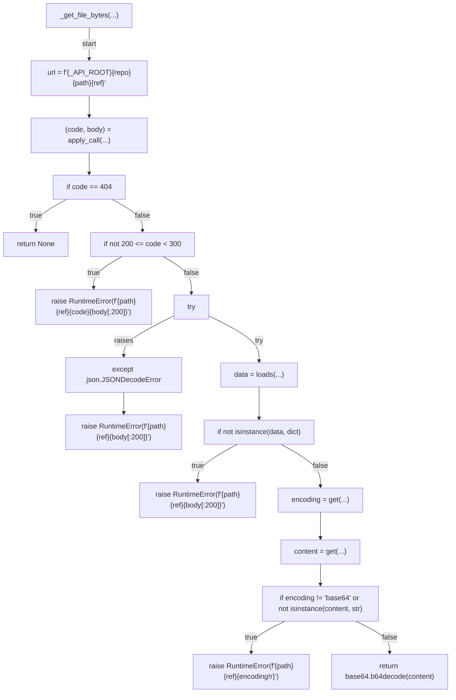
```mermaid
flowchart TD
    N001["_get_file_bytes(...)"]
    N002["url = f'{_API_ROOT}<str>{repo}<str>{path}<str>{ref}'"]
    N003["(code, body) = apply_call(...)"]
    N004["if code == 404"]
    N005["return None"]
    N006["if not 200 <= code < 300"]
    N007["raise RuntimeError(f'<str>{path}<str>{ref}<str>{code}<str>{body[:200]}')"]
    N008["try"]
    N009["data = loads(...)"]
    N010["except json.JSONDecodeError"]
    N011["raise RuntimeError(f'<str>{path}<str>{ref}<str>{body[:200]}')"]
    N012["if not isinstance(data, dict)"]
    N013["raise RuntimeError(f'<str>{path}<str>{ref}<str>{body[:200]}')"]
    N014["encoding = get(...)"]
    N015["content = get(...)"]
    N016["if encoding != 'base64' or not isinstance(content, str)"]
    N017["raise RuntimeError(f'<str>{path}<str>{ref}<str>{encoding!r}')"]
    N018["return base64.b64decode(content)"]
    N001 -->|"start"| N002
    N002 --> N003
    N003 --> N004
    N004 -->|"true"| N005
    N004 -->|"false"| N006
    N006 -->|"true"| N007
    N006 -->|"false"| N008
    N008 -->|"try"| N009
    N008 -->|"raises"| N010
    N010 --> N011
    N009 --> N012
    N012 -->|"true"| N013
    N012 -->|"false"| N014
    N014 --> N015
    N015 --> N016
    N016 -->|"true"| N017
    N016 -->|"false"| N018
```

## upsert_files_pr(...)

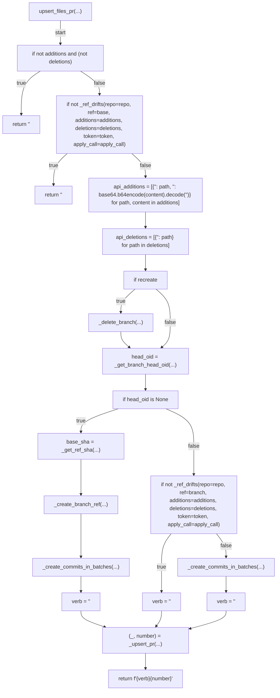
```mermaid
flowchart TD
    N001["upsert_files_pr(...)"]
    N002["if not additions and (not deletions)"]
    N003["return '<str>'"]
    N004["if not _ref_drifts(repo=repo, ref=base, additions=additions, deletions=deletions, token=token, apply_call=apply_call)"]
    N005["return '<str>'"]
    N006["api_additions = [{'<str>': path, '<str>': base64.b64encode(content).decode('<str>')} for path, content in additions]"]
    N007["api_deletions = [{'<str>': path} for path in deletions]"]
    N008["if recreate"]
    N009["_delete_branch(...)"]
    N010["head_oid = _get_branch_head_oid(...)"]
    N011["if head_oid is None"]
    N012["base_sha = _get_ref_sha(...)"]
    N013["_create_branch_ref(...)"]
    N014["_create_commits_in_batches(...)"]
    N015["verb = '<str>'"]
    N016["if not _ref_drifts(repo=repo, ref=branch, additions=additions, deletions=deletions, token=token, apply_call=apply_call)"]
    N017["verb = '<str>'"]
    N018["_create_commits_in_batches(...)"]
    N019["verb = '<str>'"]
    N020["(_, number) = _upsert_pr(...)"]
    N021["return f'{verb}<str>{number}'"]
    N001 -->|"start"| N002
    N002 -->|"true"| N003
    N002 -->|"false"| N004
    N004 -->|"true"| N005
    N004 -->|"false"| N006
    N006 --> N007
    N007 --> N008
    N008 -->|"true"| N009
    N009 --> N010
    N008 -->|"false"| N010
    N010 --> N011
    N011 -->|"true"| N012
    N012 --> N013
    N013 --> N014
    N014 --> N015
    N011 -->|"false"| N016
    N016 -->|"true"| N017
    N016 -->|"false"| N018
    N018 --> N019
    N015 --> N020
    N017 --> N020
    N019 --> N020
    N020 --> N021
```

## _ref_drifts(...)

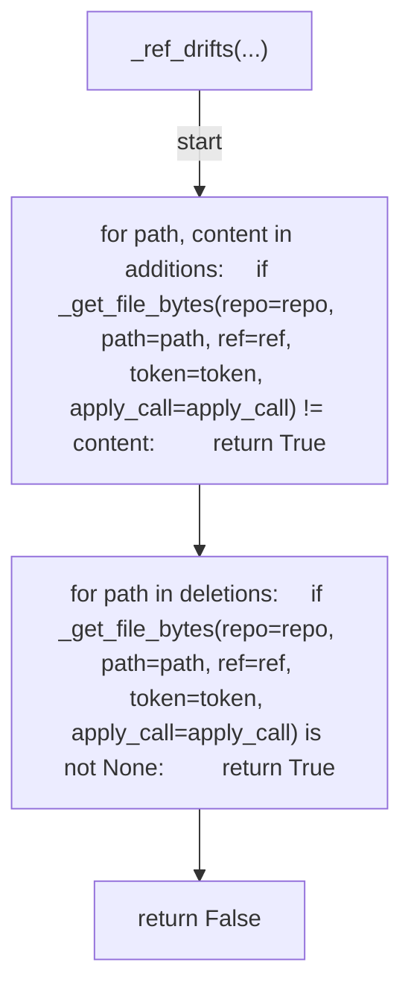
```mermaid
flowchart TD
    N001["_ref_drifts(...)"]
    N002["for path, content in additions:     if _get_file_bytes(repo=repo, path=path, ref=ref, token=token, apply_call=apply_call) != content:         return True"]
    N003["for path in deletions:     if _get_file_bytes(repo=repo, path=path, ref=ref, token=token, apply_call=apply_call) is not None:         return True"]
    N004["return False"]
    N001 -->|"start"| N002
    N002 --> N003
    N003 --> N004
```

## upsert_single_file_pr(...)

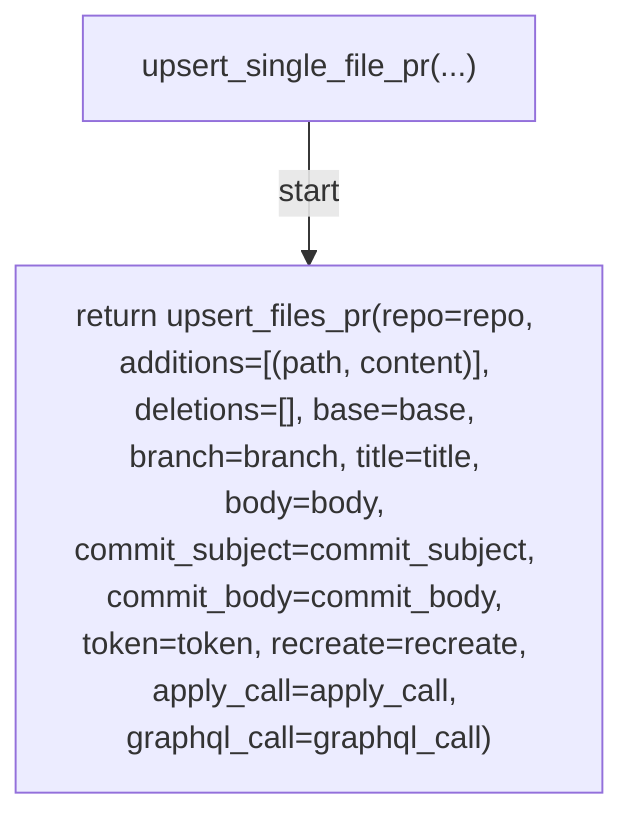
```mermaid
flowchart TD
    N001["upsert_single_file_pr(...)"]
    N002["return upsert_files_pr(repo=repo, additions=[(path, content)], deletions=[], base=base, branch=branch, title=title, body=body, commit_subject=commit_subject, commit_body=commit_body, token=token, recreate=recreate, apply_call=apply_call, graphql_call=graphql_call)"]
    N001 -->|"start"| N002
```

## _merge_pr(...)

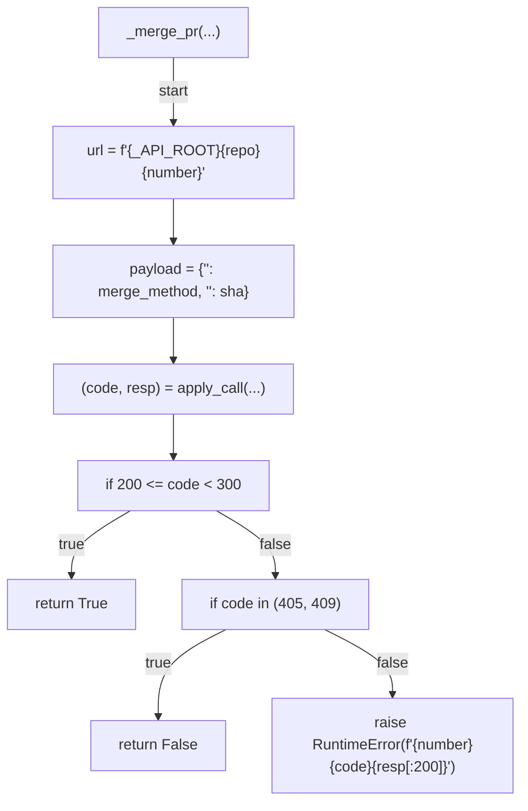
```mermaid
flowchart TD
    N001["_merge_pr(...)"]
    N002["url = f'{_API_ROOT}<str>{repo}<str>{number}<str>'"]
    N003["payload = {'<str>': merge_method, '<str>': sha}"]
    N004["(code, resp) = apply_call(...)"]
    N005["if 200 <= code < 300"]
    N006["return True"]
    N007["if code in (405, 409)"]
    N008["return False"]
    N009["raise RuntimeError(f'<str>{number}<str>{code}<str>{resp[:200]}')"]
    N001 -->|"start"| N002
    N002 --> N003
    N003 --> N004
    N004 --> N005
    N005 -->|"true"| N006
    N005 -->|"false"| N007
    N007 -->|"true"| N008
    N007 -->|"false"| N009
```

## _close_pr(...)

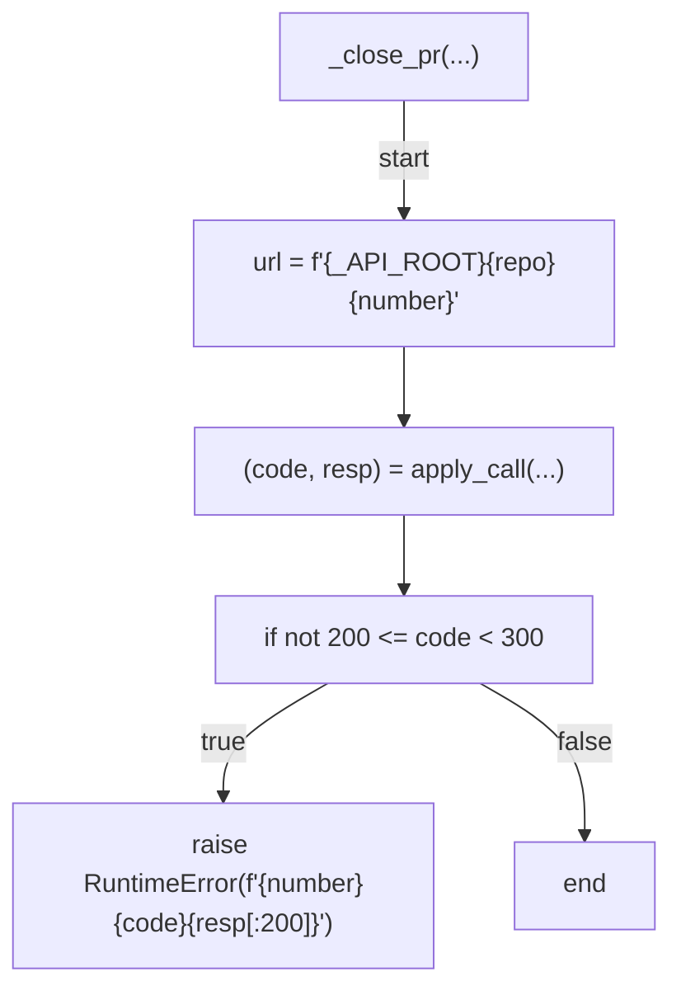
```mermaid
flowchart TD
    N001["_close_pr(...)"]
    N002["url = f'{_API_ROOT}<str>{repo}<str>{number}'"]
    N003["(code, resp) = apply_call(...)"]
    N004["if not 200 <= code < 300"]
    N005["raise RuntimeError(f'<str>{number}<str>{code}<str>{resp[:200]}')"]
    N006["end"]
    N001 -->|"start"| N002
    N002 --> N003
    N003 --> N004
    N004 -->|"true"| N005
    N004 -->|"false"| N006
```

## _delete_branch(...)

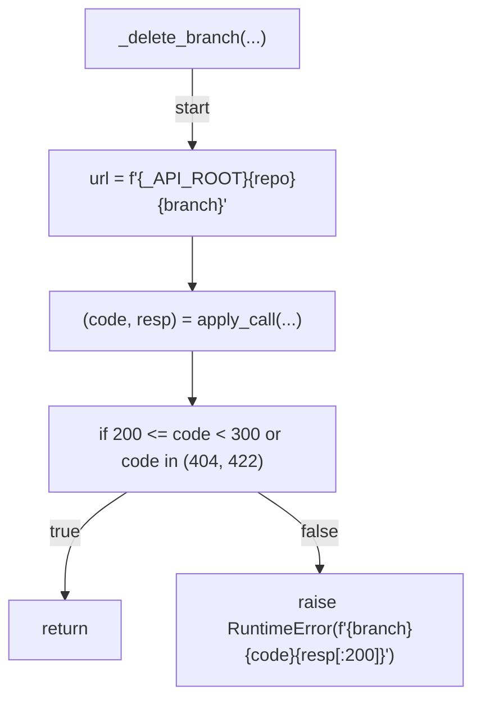
```mermaid
flowchart TD
    N001["_delete_branch(...)"]
    N002["url = f'{_API_ROOT}<str>{repo}<str>{branch}'"]
    N003["(code, resp) = apply_call(...)"]
    N004["if 200 <= code < 300 or code in (404, 422)"]
    N005["return"]
    N006["raise RuntimeError(f'<str>{branch}<str>{code}<str>{resp[:200]}')"]
    N001 -->|"start"| N002
    N002 --> N003
    N003 --> N004
    N004 -->|"true"| N005
    N004 -->|"false"| N006
```

## _comment_pr(...)

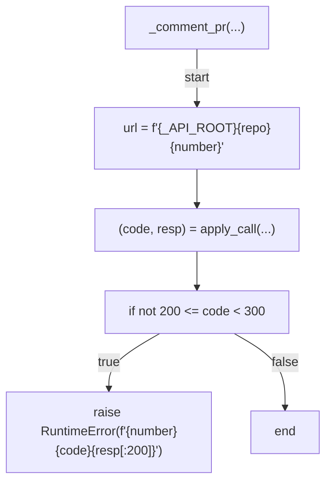
```mermaid
flowchart TD
    N001["_comment_pr(...)"]
    N002["url = f'{_API_ROOT}<str>{repo}<str>{number}<str>'"]
    N003["(code, resp) = apply_call(...)"]
    N004["if not 200 <= code < 300"]
    N005["raise RuntimeError(f'<str>{number}<str>{code}<str>{resp[:200]}')"]
    N006["end"]
    N001 -->|"start"| N002
    N002 --> N003
    N003 --> N004
    N004 -->|"true"| N005
    N004 -->|"false"| N006
```

## _create_pr(...)

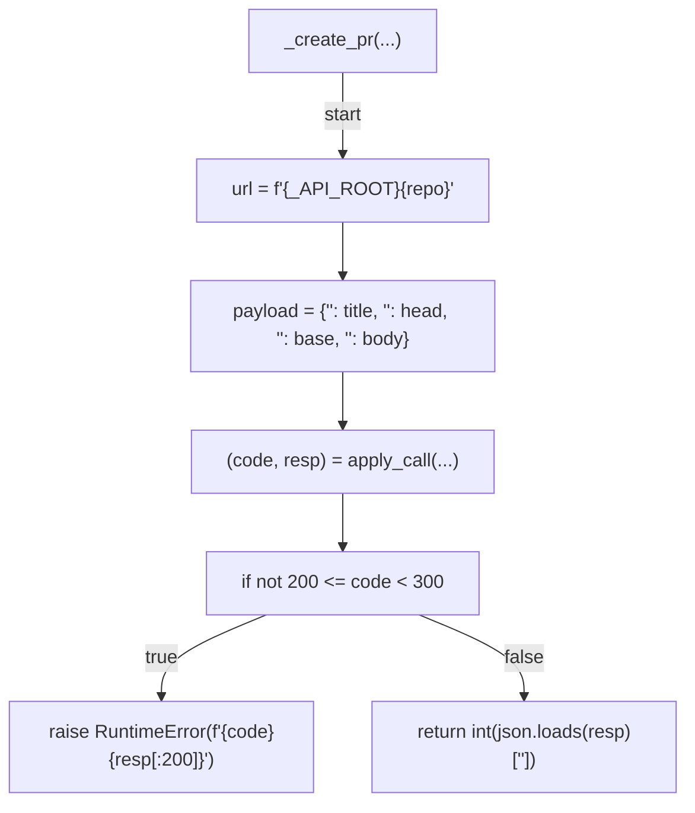
```mermaid
flowchart TD
    N001["_create_pr(...)"]
    N002["url = f'{_API_ROOT}<str>{repo}<str>'"]
    N003["payload = {'<str>': title, '<str>': head, '<str>': base, '<str>': body}"]
    N004["(code, resp) = apply_call(...)"]
    N005["if not 200 <= code < 300"]
    N006["raise RuntimeError(f'<str>{code}<str>{resp[:200]}')"]
    N007["return int(json.loads(resp)['<str>'])"]
    N001 -->|"start"| N002
    N002 --> N003
    N003 --> N004
    N004 --> N005
    N005 -->|"true"| N006
    N005 -->|"false"| N007
```

## _update_pr(...)

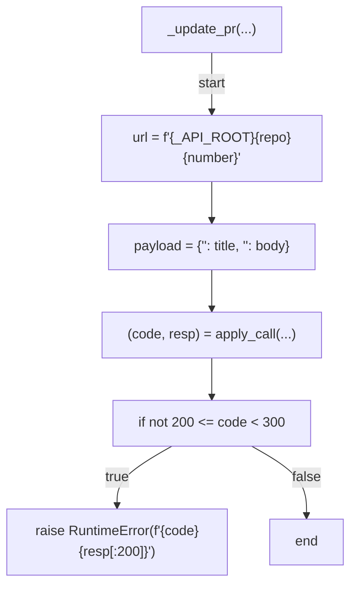
```mermaid
flowchart TD
    N001["_update_pr(...)"]
    N002["url = f'{_API_ROOT}<str>{repo}<str>{number}'"]
    N003["payload = {'<str>': title, '<str>': body}"]
    N004["(code, resp) = apply_call(...)"]
    N005["if not 200 <= code < 300"]
    N006["raise RuntimeError(f'<str>{code}<str>{resp[:200]}')"]
    N007["end"]
    N001 -->|"start"| N002
    N002 --> N003
    N003 --> N004
    N004 --> N005
    N005 -->|"true"| N006
    N005 -->|"false"| N007
```

## _upsert_pr(...)

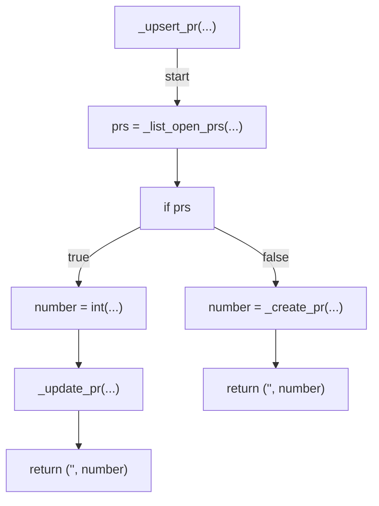
```mermaid
flowchart TD
    N001["_upsert_pr(...)"]
    N002["prs = _list_open_prs(...)"]
    N003["if prs"]
    N004["number = int(...)"]
    N005["_update_pr(...)"]
    N006["return ('<str>', number)"]
    N007["number = _create_pr(...)"]
    N008["return ('<str>', number)"]
    N001 -->|"start"| N002
    N002 --> N003
    N003 -->|"true"| N004
    N004 --> N005
    N005 --> N006
    N003 -->|"false"| N007
    N007 --> N008
```

## _cmd_upsert(...)

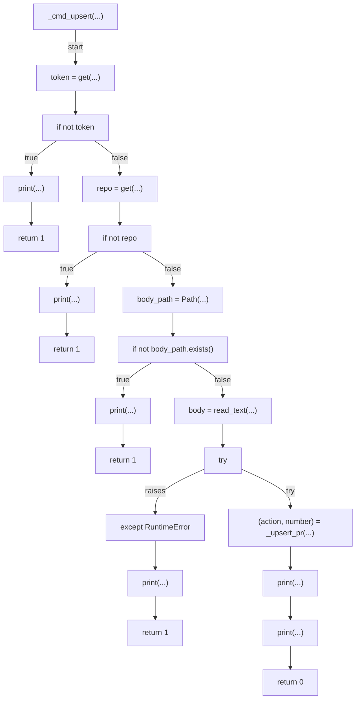
```mermaid
flowchart TD
    N001["_cmd_upsert(...)"]
    N002["token = get(...)"]
    N003["if not token"]
    N004["print(...)"]
    N005["return 1"]
    N006["repo = get(...)"]
    N007["if not repo"]
    N008["print(...)"]
    N009["return 1"]
    N010["body_path = Path(...)"]
    N011["if not body_path.exists()"]
    N012["print(...)"]
    N013["return 1"]
    N014["body = read_text(...)"]
    N015["try"]
    N016["(action, number) = _upsert_pr(...)"]
    N017["except RuntimeError"]
    N018["print(...)"]
    N019["return 1"]
    N020["print(...)"]
    N021["print(...)"]
    N022["return 0"]
    N001 -->|"start"| N002
    N002 --> N003
    N003 -->|"true"| N004
    N004 --> N005
    N003 -->|"false"| N006
    N006 --> N007
    N007 -->|"true"| N008
    N008 --> N009
    N007 -->|"false"| N010
    N010 --> N011
    N011 -->|"true"| N012
    N012 --> N013
    N011 -->|"false"| N014
    N014 --> N015
    N015 -->|"try"| N016
    N015 -->|"raises"| N017
    N017 --> N018
    N018 --> N019
    N016 --> N020
    N020 --> N021
    N021 --> N022
```

## _cmd_find(...)

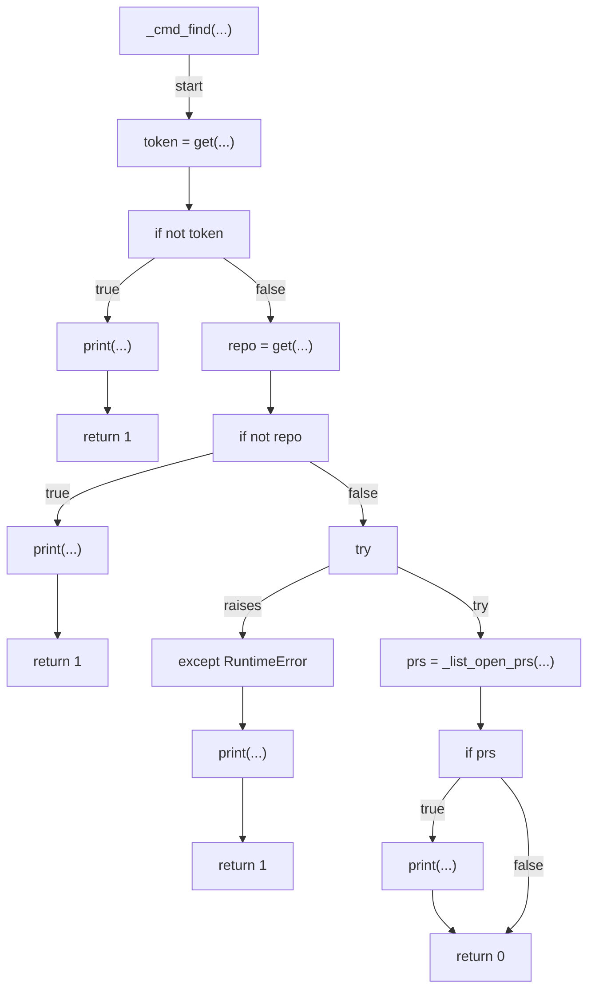
```mermaid
flowchart TD
    N001["_cmd_find(...)"]
    N002["token = get(...)"]
    N003["if not token"]
    N004["print(...)"]
    N005["return 1"]
    N006["repo = get(...)"]
    N007["if not repo"]
    N008["print(...)"]
    N009["return 1"]
    N010["try"]
    N011["prs = _list_open_prs(...)"]
    N012["except RuntimeError"]
    N013["print(...)"]
    N014["return 1"]
    N015["if prs"]
    N016["print(...)"]
    N017["return 0"]
    N001 -->|"start"| N002
    N002 --> N003
    N003 -->|"true"| N004
    N004 --> N005
    N003 -->|"false"| N006
    N006 --> N007
    N007 -->|"true"| N008
    N008 --> N009
    N007 -->|"false"| N010
    N010 -->|"try"| N011
    N010 -->|"raises"| N012
    N012 --> N013
    N013 --> N014
    N011 --> N015
    N015 -->|"true"| N016
    N016 --> N017
    N015 -->|"false"| N017
```

## _collect_worktree_changes(...)

```mermaid
flowchart TD
    N001["_collect_worktree_changes(...)"]
    N002["additions = {}"]
    N003["deletions = set(...)"]
    N004["for path in adds:     p = Path(path)     if not p.is_file():         raise RuntimeError(f'<str>{path}')     additions[path] = p.read_bytes()"]
    N005["for prefix in diff_prefixes:     result = run_git(['<str>', '<str>', '<str>', prefix])     if result.returncode != 0:         raise RuntimeError(f'<str>{prefix!r}<str>{result.stderr.strip()}')     for line in result.stdout.splitlines():         if not line.strip():             continue         path = line[3:].split('<str>', 1)[-1].strip()         if path in additions:             continue         candidate = Path(path)         if candidate.is_file():             additions[path] = candidate.read_bytes()             deletions.discard(path)         elif candidate.is_dir():             ls_result = run_git(['<str>', '<str>', '<str>', path])             if ls_result.returncode == 0:                 for sub_path in sorted(ls_result.stdout.splitlines()):                     sub_path = sub_path.strip()                     if sub_path and sub_path not in additions:                         additions[sub_path] = Path(sub_path).read_bytes()                         deletions.discard(sub_path)         else:             deletions.add(path)"]
    N006["return (list(additions.items()), sorted(deletions))"]
    N001 -->|"start"| N002
    N002 --> N003
    N003 --> N004
    N004 --> N005
    N005 --> N006
```

## _cmd_upsert_files(...)

```mermaid
flowchart TD
    N001["_cmd_upsert_files(...)"]
    N002["token = get(...)"]
    N003["if not token"]
    N004["print(...)"]
    N005["return 1"]
    N006["repo = get(...)"]
    N007["if not repo"]
    N008["print(...)"]
    N009["return 1"]
    N010["body_path = Path(...)"]
    N011["if not body_path.exists()"]
    N012["print(...)"]
    N013["return 1"]
    N014["body = read_text(...)"]
    N015["try"]
    N016["(additions, deletions) = _collect_worktree_changes(...)"]
    N017["except RuntimeError"]
    N018["print(...)"]
    N019["return 1"]
    N020["if not additions and (not deletions)"]
    N021["print(...)"]
    N022["return 0"]
    N023["try"]
    N024["result = upsert_files_pr(...)"]
    N025["except RuntimeError"]
    N026["print(...)"]
    N027["return 1"]
    N028["print(...)"]
    N029["return 0"]
    N001 -->|"start"| N002
    N002 --> N003
    N003 -->|"true"| N004
    N004 --> N005
    N003 -->|"false"| N006
    N006 --> N007
    N007 -->|"true"| N008
    N008 --> N009
    N007 -->|"false"| N010
    N010 --> N011
    N011 -->|"true"| N012
    N012 --> N013
    N011 -->|"false"| N014
    N014 --> N015
    N015 -->|"try"| N016
    N015 -->|"raises"| N017
    N017 --> N018
    N018 --> N019
    N016 --> N020
    N020 -->|"true"| N021
    N021 --> N022
    N020 -->|"false"| N023
    N023 -->|"try"| N024
    N023 -->|"raises"| N025
    N025 --> N026
    N026 --> N027
    N024 --> N028
    N028 --> N029
```

## main(...)

```mermaid
flowchart TD
    N001["main(...)"]
    N002["parser = ArgumentParser(...)"]
    N003["sub = add_subparsers(...)"]
    N004["upsert_p = add_parser(...)"]
    N005["add_argument(...)"]
    N006["add_argument(...)"]
    N007["add_argument(...)"]
    N008["add_argument(...)"]
    N009["find_p = add_parser(...)"]
    N010["add_argument(...)"]
    N011["files_p = add_parser(...)"]
    N012["add_argument(...)"]
    N013["add_argument(...)"]
    N014["add_argument(...)"]
    N015["add_argument(...)"]
    N016["add_argument(...)"]
    N017["add_argument(...)"]
    N018["add_argument(...)"]
    N019["add_argument(...)"]
    N020["add_argument(...)"]
    N021["args = parse_args(...)"]
    N022["if args.cmd == 'upsert'"]
    N023["return _cmd_upsert(args)"]
    N024["if args.cmd == 'find'"]
    N025["return _cmd_find(args)"]
    N026["if args.cmd == 'upsert-files'"]
    N027["return _cmd_upsert_files(args)"]
    N028["return 0"]
    N001 -->|"start"| N002
    N002 --> N003
    N003 --> N004
    N004 --> N005
    N005 --> N006
    N006 --> N007
    N007 --> N008
    N008 --> N009
    N009 --> N010
    N010 --> N011
    N011 --> N012
    N012 --> N013
    N013 --> N014
    N014 --> N015
    N015 --> N016
    N016 --> N017
    N017 --> N018
    N018 --> N019
    N019 --> N020
    N020 --> N021
    N021 --> N022
    N022 -->|"true"| N023
    N022 -->|"false"| N024
    N024 -->|"true"| N025
    N024 -->|"false"| N026
    N026 -->|"true"| N027
    N026 -->|"false"| N028
```
