# AST graph: scripts/preflight_all.py

This file is generated from `scripts/preflight_all.py` by `python3 scripts/script_ast_graph.py all-doc`. Do not edit it by hand: content under `docs/generated/scripts/` is owned by the post-merge automation (refs #1540); update the source script instead.

## missing_prereqs(...)

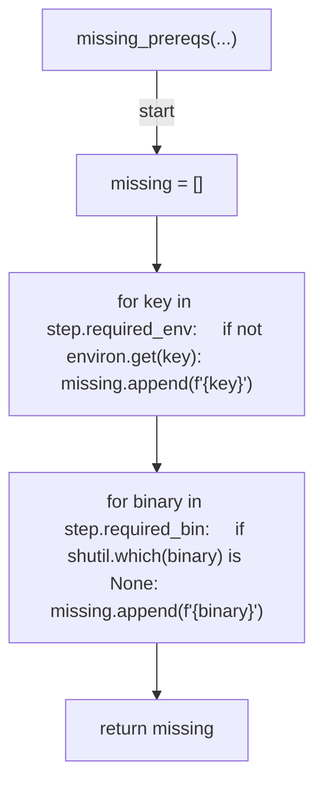

## run_step(...)

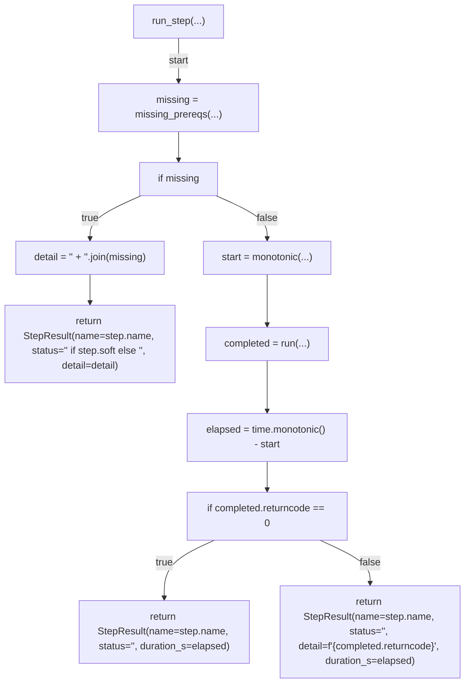

## _heavy_fingerprint(...)

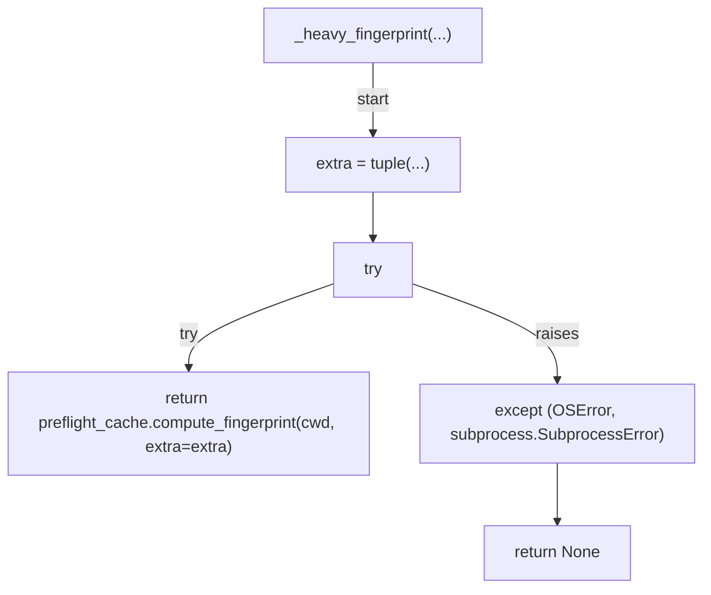

## _cheap_workers(...)

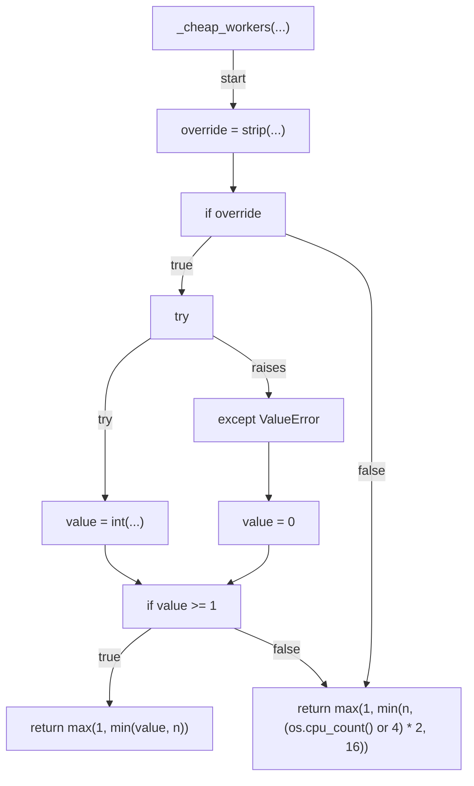

## _run_cheap(...)

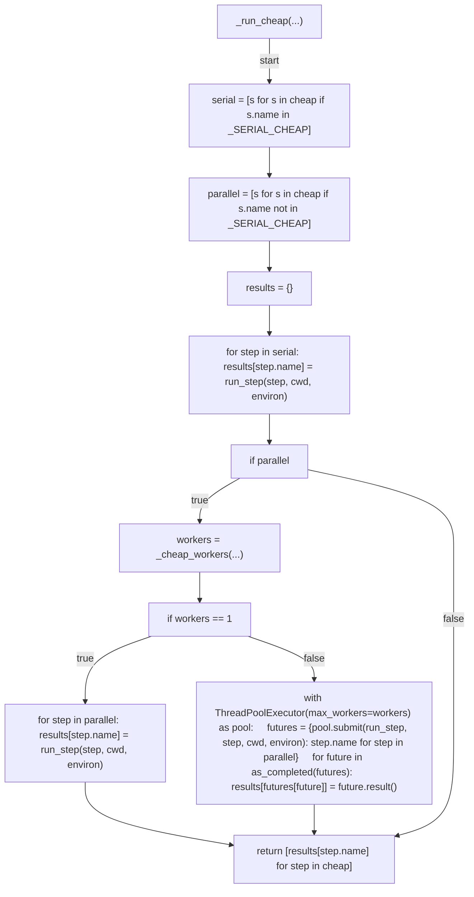

## run_all(...)

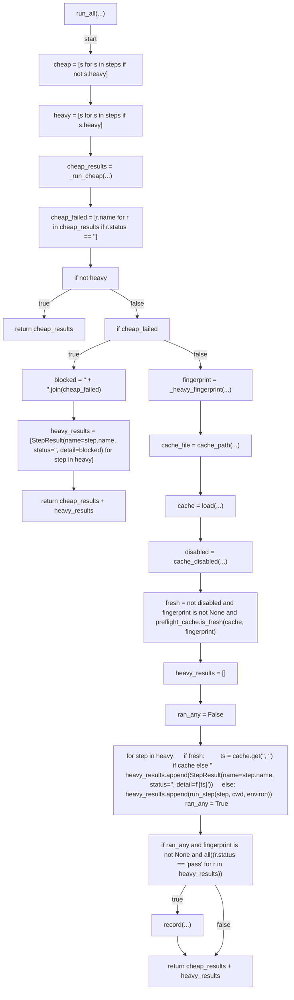

## emit_summary(...)

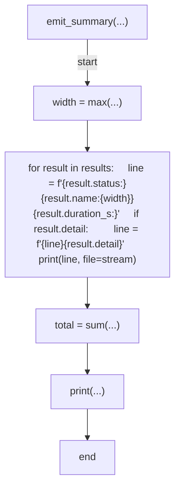

## emit_annotations(...)

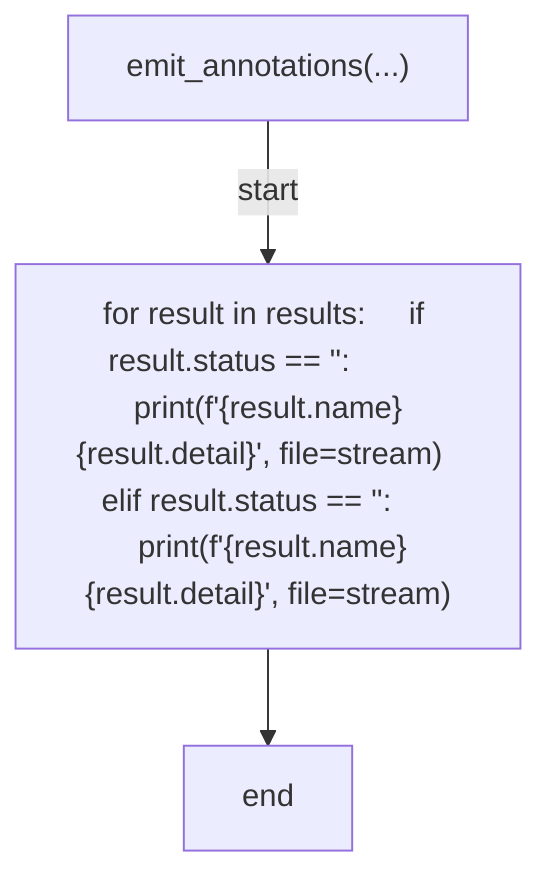

## resolve_skips(...)

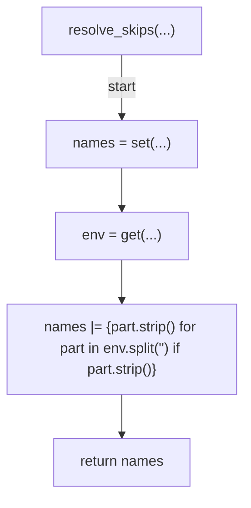

## partition_skips(...)

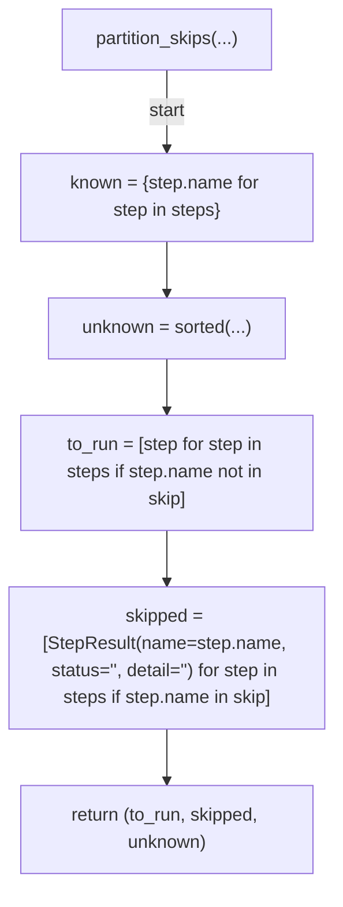

## list_manifest(...)

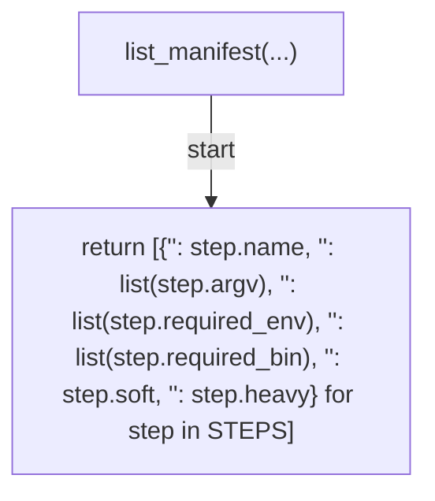

## main(...)

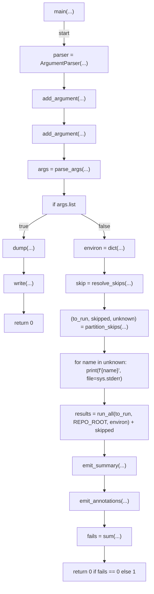
