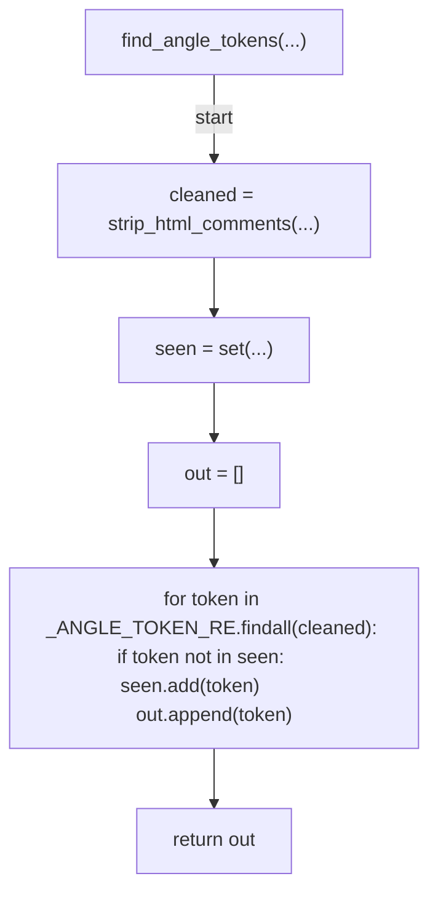
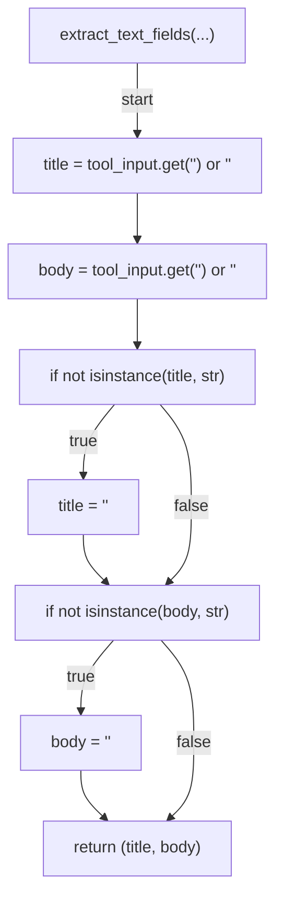
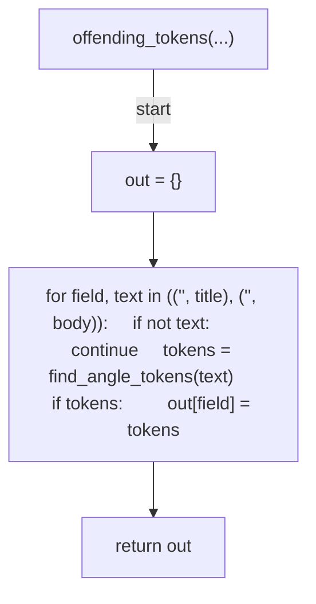
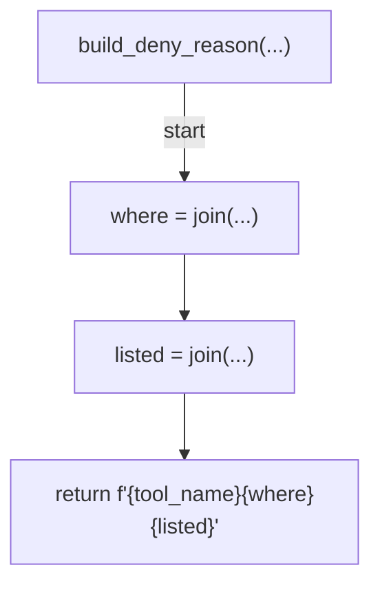
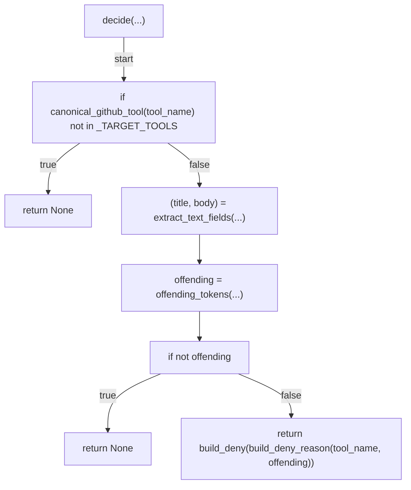
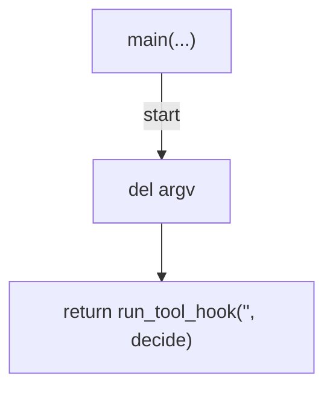

# AST graph: scripts/preflight_angle_token_drop.py

This file is generated from `scripts/preflight_angle_token_drop.py` by `python3 scripts/script_ast_graph.py all-doc`. Do not edit it by hand: content under `docs/generated/scripts/` is owned by the post-merge automation (refs #1540) -- update the source script instead.

## find_angle_tokens(...)

## extract_text_fields(...)

## offending_tokens(...)

## build_deny_reason(...)

## decide(...)

## main(...)

