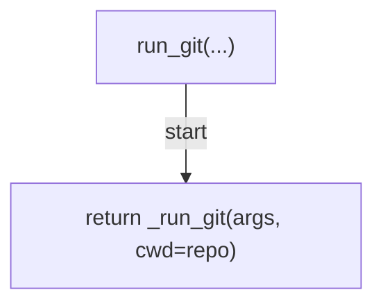
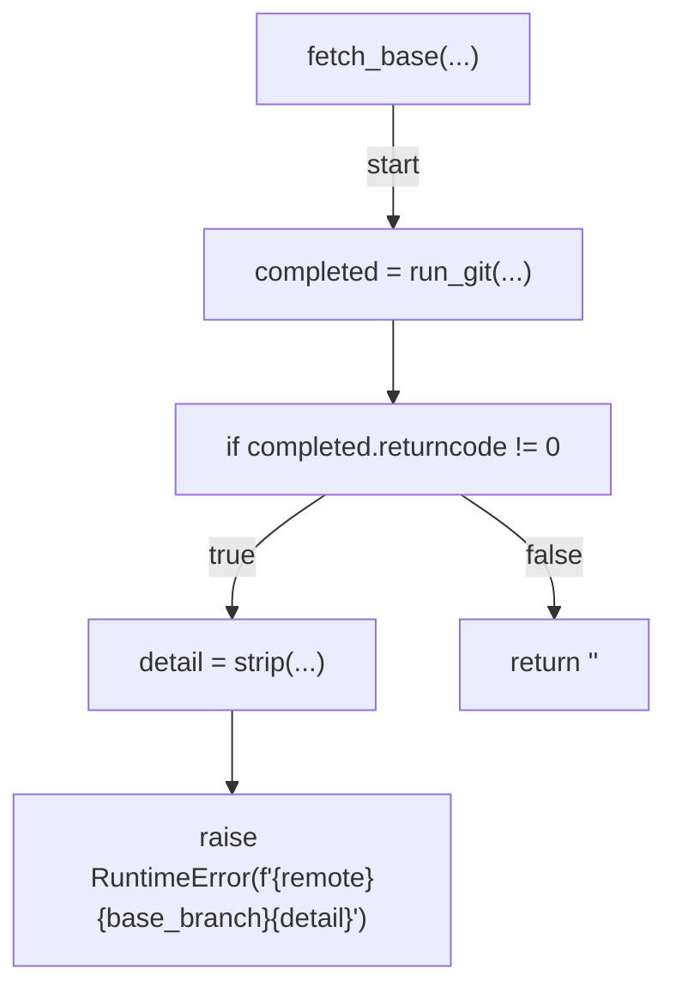
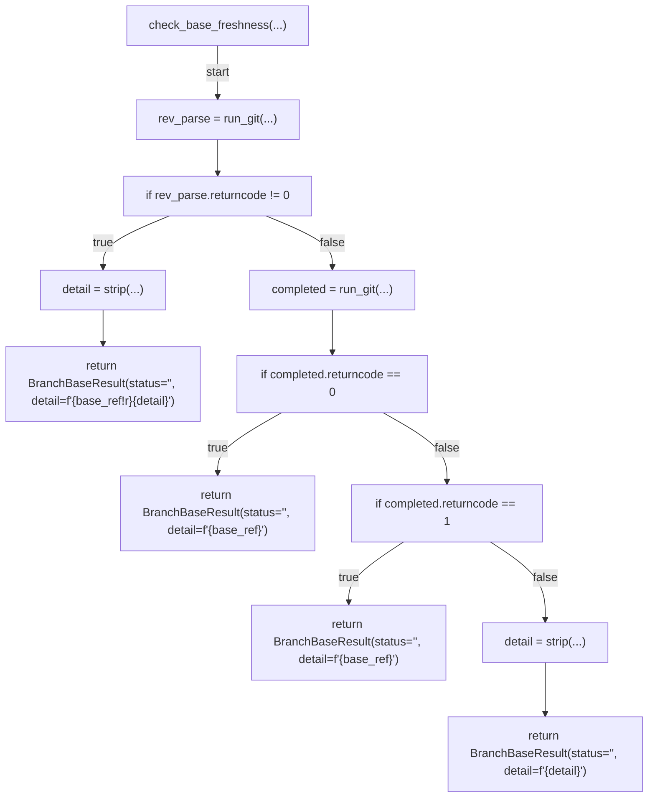
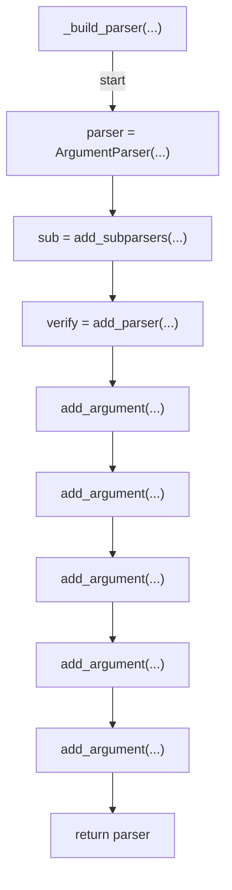
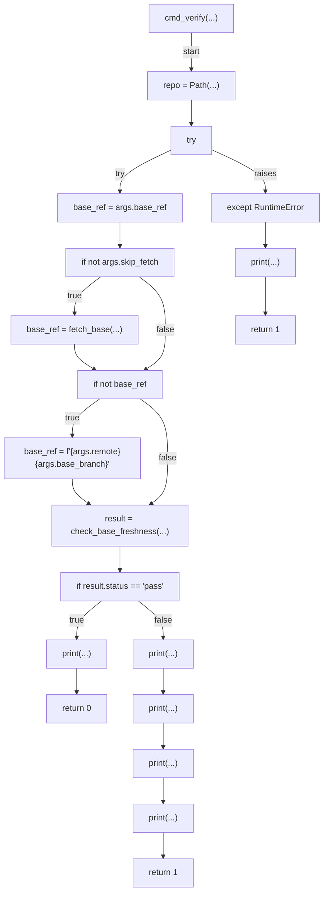
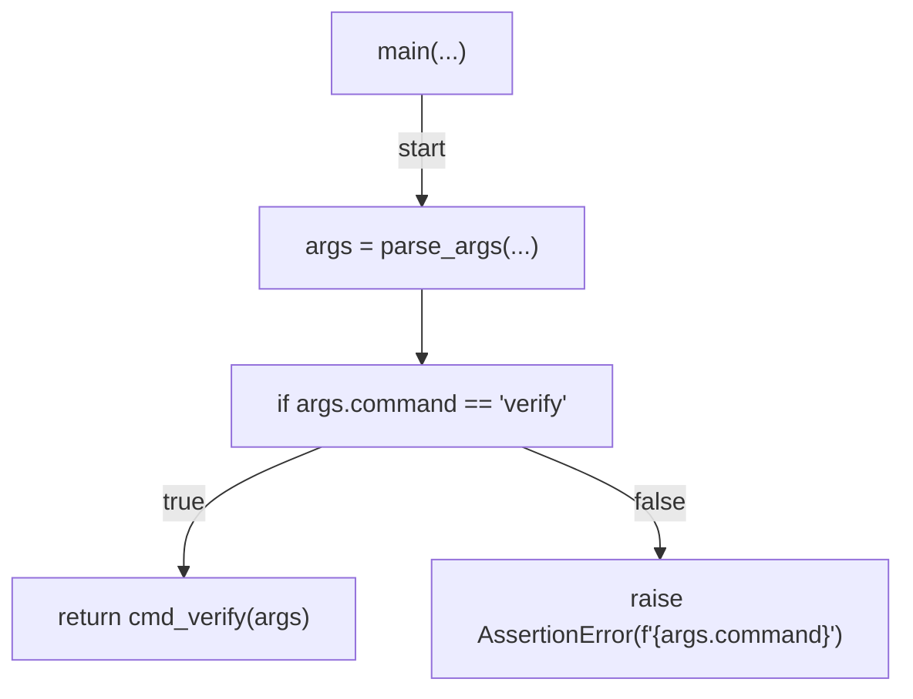

# AST graph: scripts/preflight_branch_base.py

This file is generated from `scripts/preflight_branch_base.py` by `python3 scripts/script_ast_graph.py all-doc`. Do not edit it by hand: content under `docs/generated/scripts/` is owned by the post-merge automation (refs #1540); update the source script instead.

## run_git(...)

## fetch_base(...)

## check_base_freshness(...)

## _build_parser(...)

## cmd_verify(...)

## main(...)

