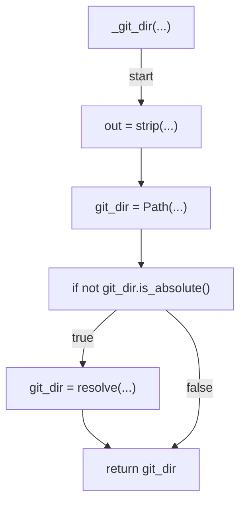
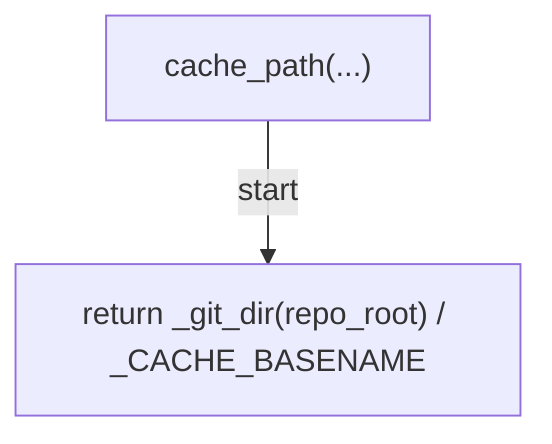
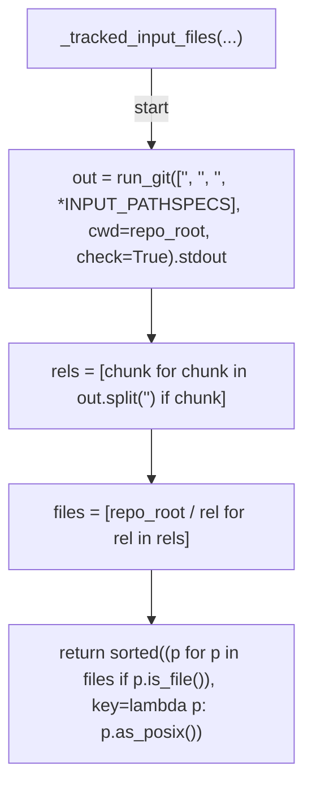
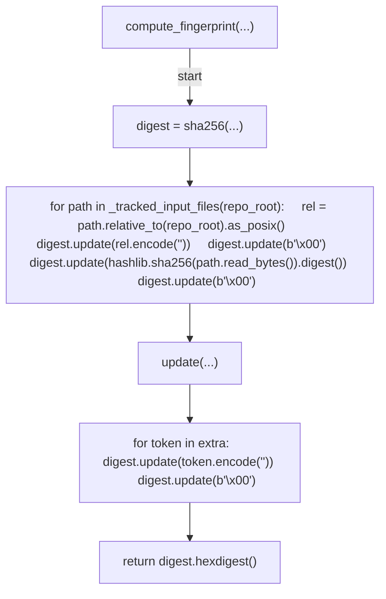
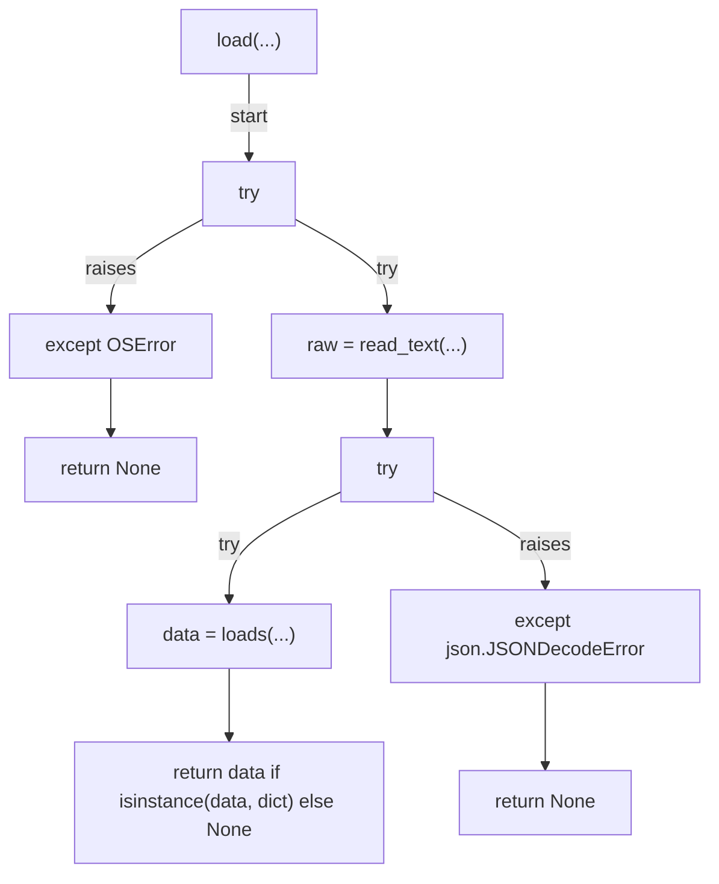
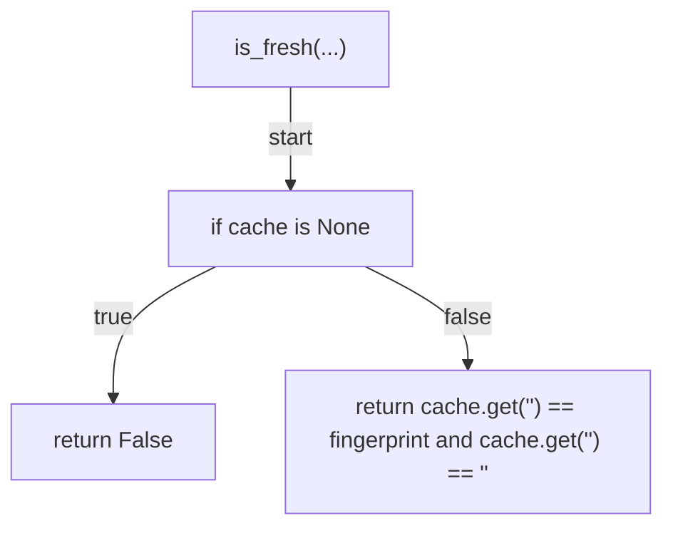
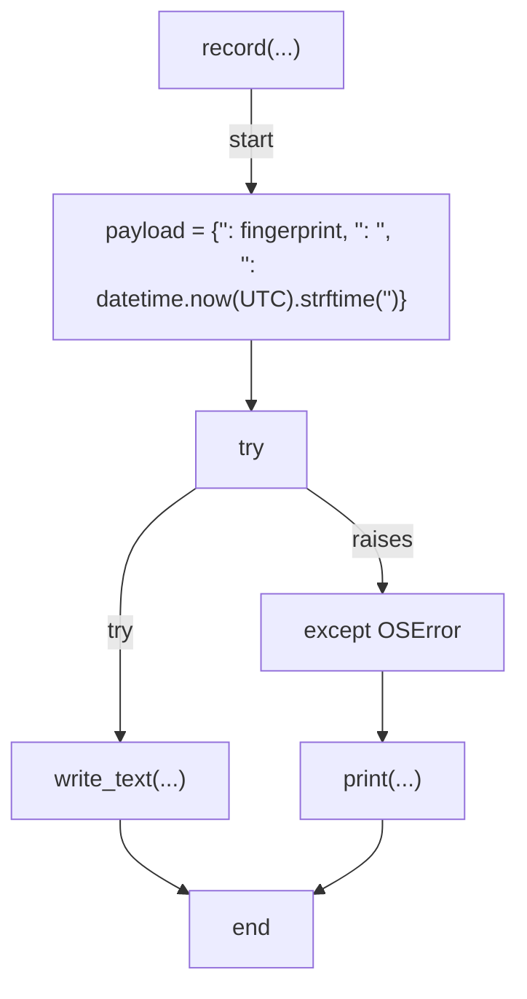
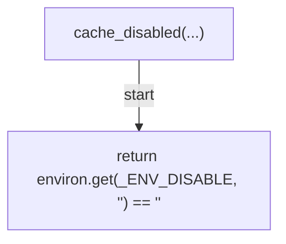
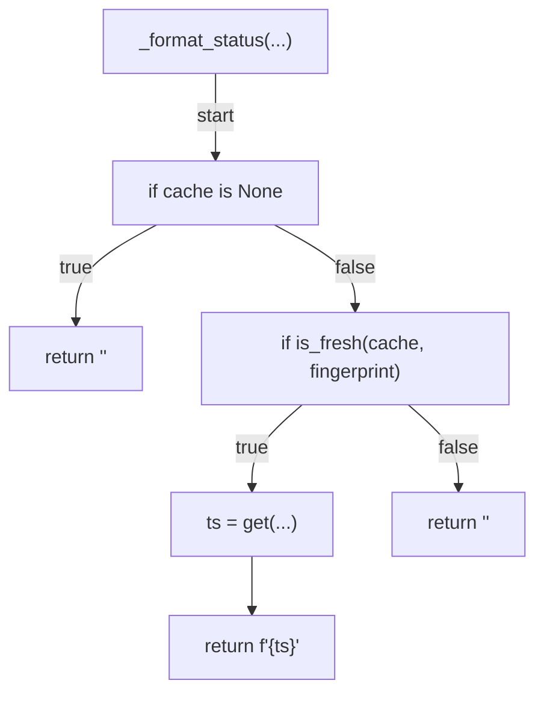
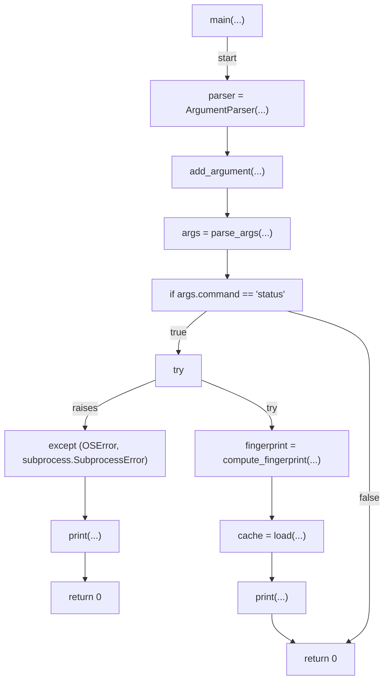

# AST graph: scripts/preflight_cache.py

This file is generated from `scripts/preflight_cache.py` by `python3 scripts/script_ast_graph.py all-doc`. Do not edit it by hand: content under `docs/generated/scripts/` is owned by the post-merge automation (refs #1540); update the source script instead.

## _git_dir(...)

## cache_path(...)

## _tracked_input_files(...)

## compute_fingerprint(...)

## load(...)

## is_fresh(...)

## record(...)

## cache_disabled(...)

## _format_status(...)

## main(...)

