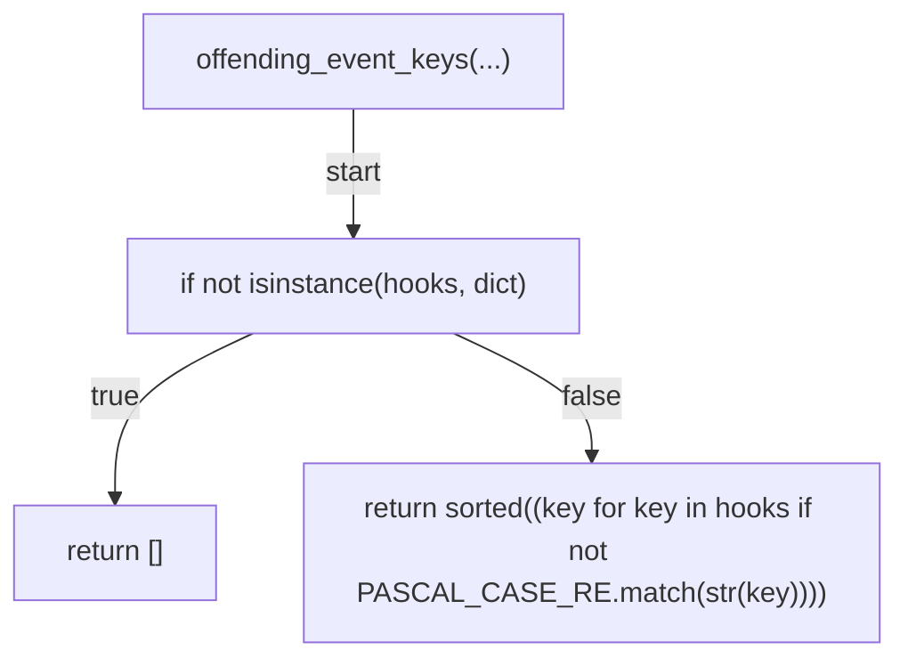
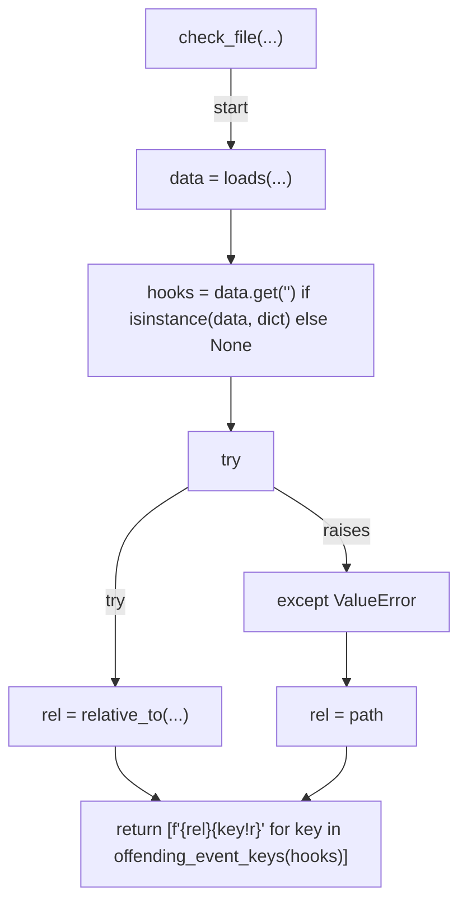
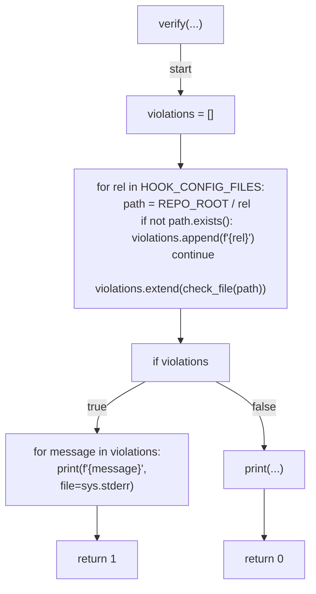
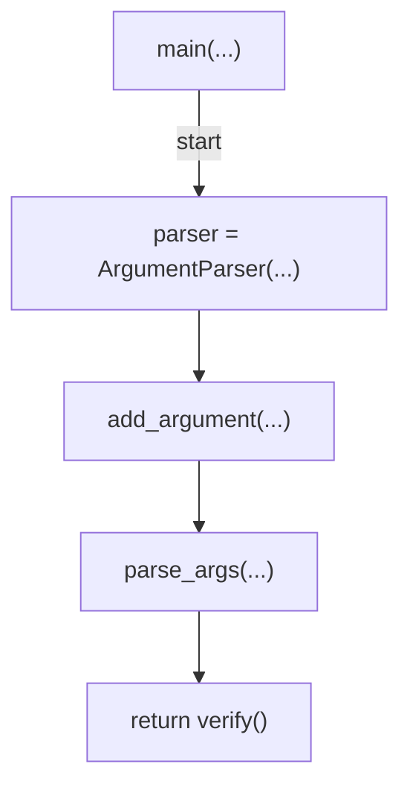

# AST graph: scripts/preflight_hook_event_keys.py

This file is generated from `scripts/preflight_hook_event_keys.py` by `python3 scripts/script_ast_graph.py all-doc`. Do not edit it by hand: content under `docs/generated/scripts/` is owned by the post-merge automation (refs #1540) -- update the source script instead.

## offending_event_keys(...)

## check_file(...)

## verify(...)

## main(...)

