# AST graph: scripts/preflight_main_freshness.py

This file is generated from `scripts/preflight_main_freshness.py` by `python3 scripts/script_ast_graph.py all-doc`. Do not edit it by hand: content under `docs/generated/scripts/` is owned by the post-merge automation (refs #1540) -- update the source script instead.

## _now_utc(...)

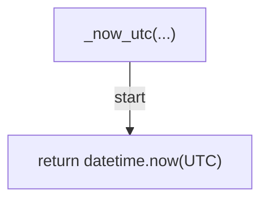

## read_stamp(...)

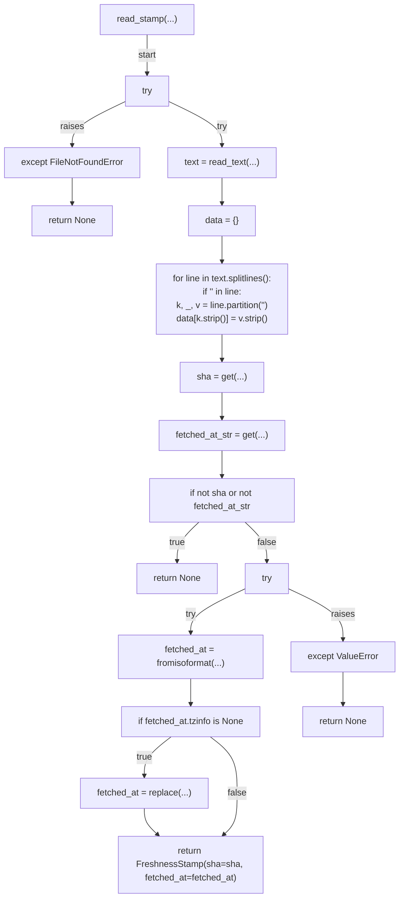

## write_stamp(...)

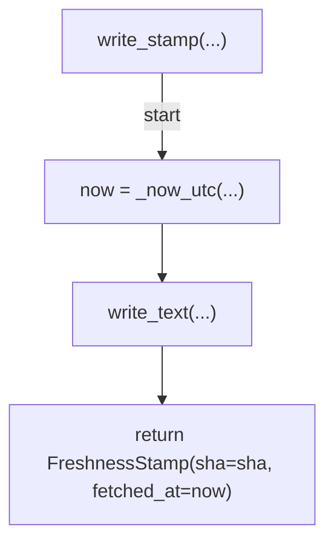

## check_freshness(...)

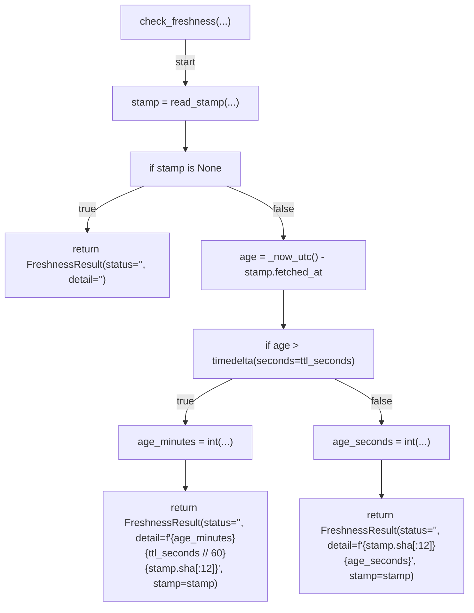

## fetch_and_record(...)

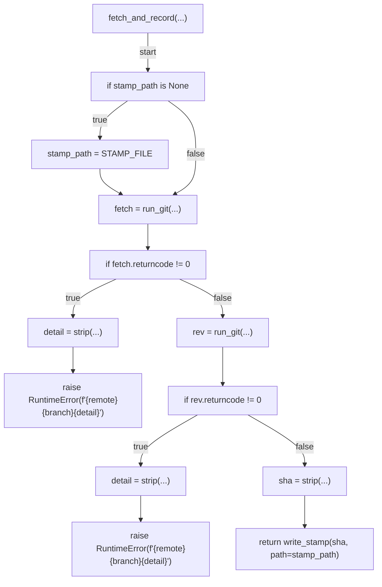

## build_deny_reason(...)

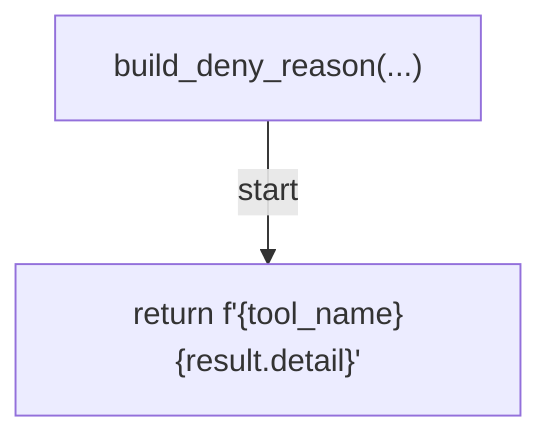

## decide(...)

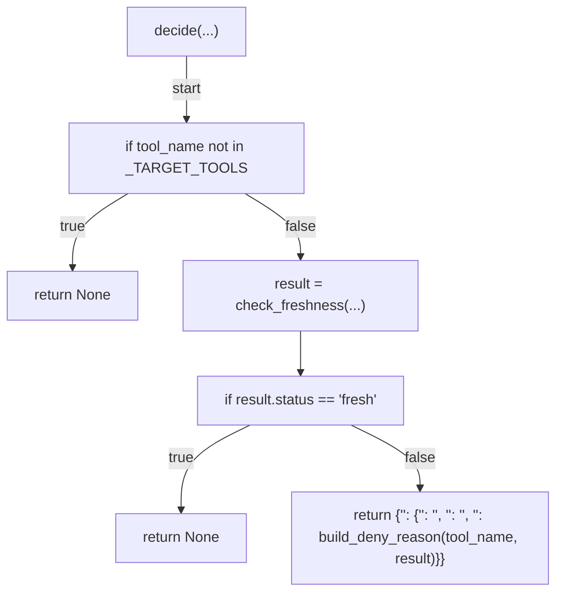

## _build_deny_dict(...)

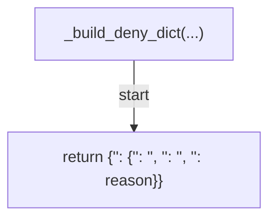

## _cmd_record(...)

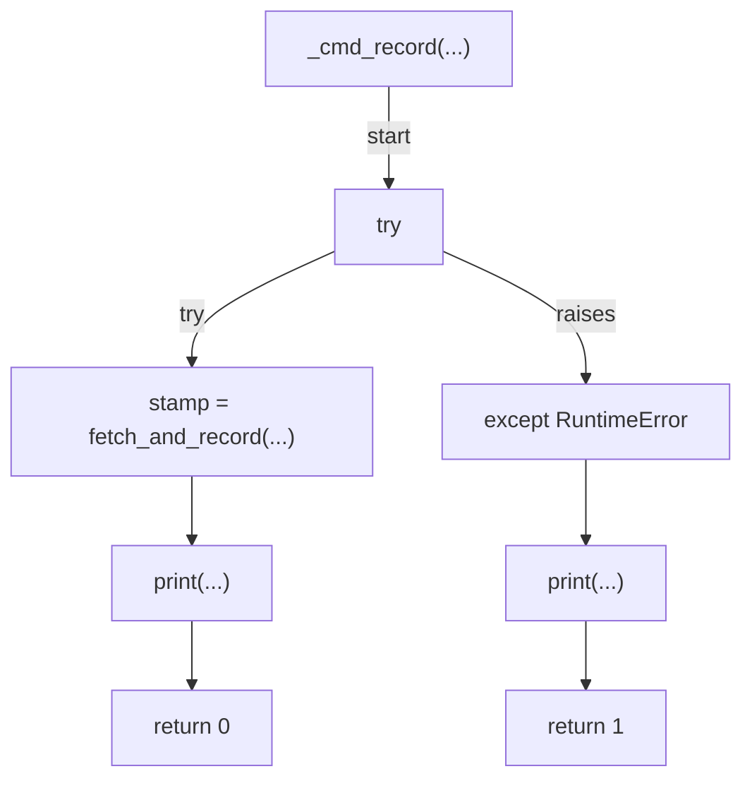

## _cmd_check(...)

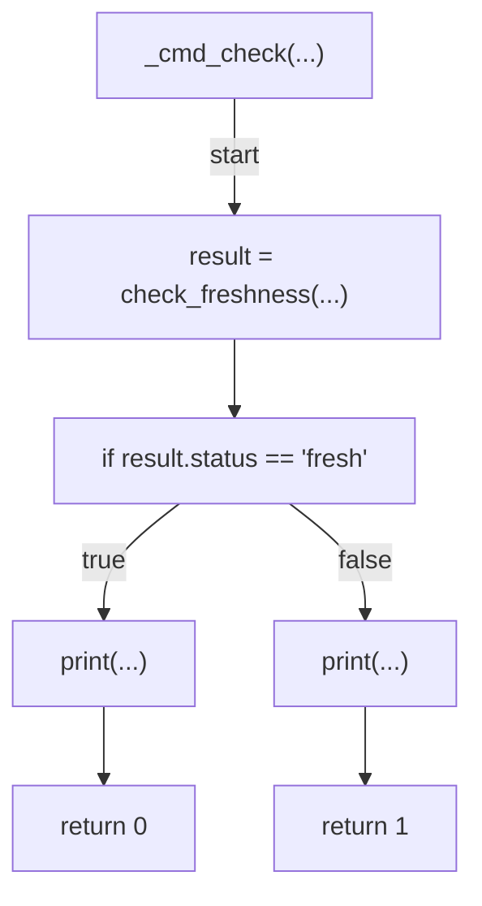

## _hook_mode(...)

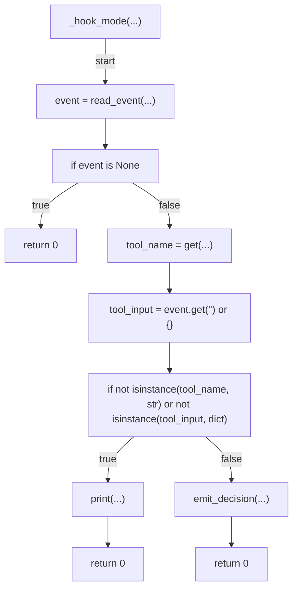

## main(...)

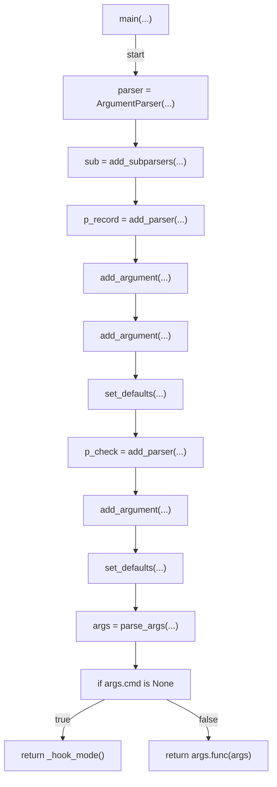
