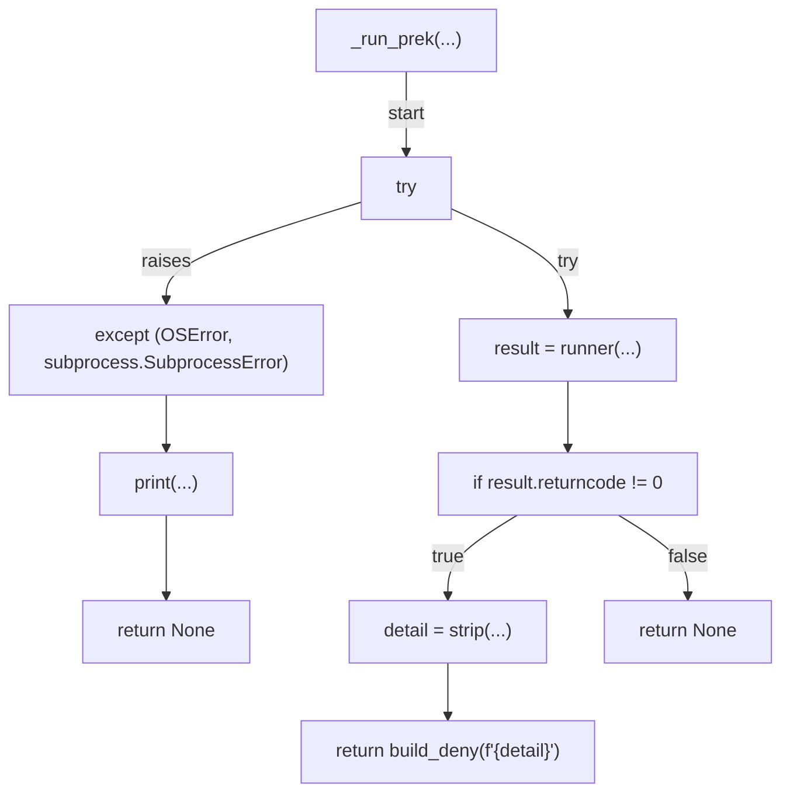
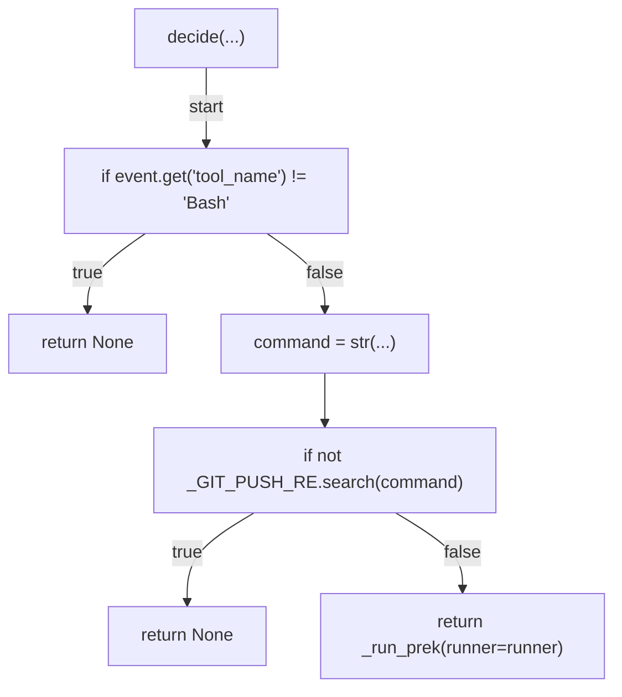
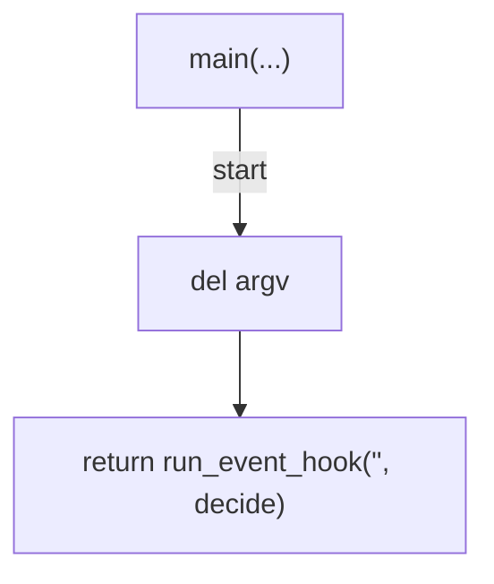

# AST graph: scripts/preflight_push_prek.py

This file is generated from `scripts/preflight_push_prek.py` by `python3 scripts/script_ast_graph.py all-doc`. Do not edit it by hand: content under `docs/generated/scripts/` is owned by the post-merge automation (refs #1540); update the source script instead.

## _run_prek(...)

## decide(...)

## main(...)

