# AST graph: scripts/preflight_push_unsigned_commits.py

This file is generated from `scripts/preflight_push_unsigned_commits.py` by `python3 scripts/script_ast_graph.py all-doc`. Do not edit it by hand: content under `docs/generated/scripts/` is owned by the post-merge automation (refs #1540); update the source script instead.

## _default_runner(...)

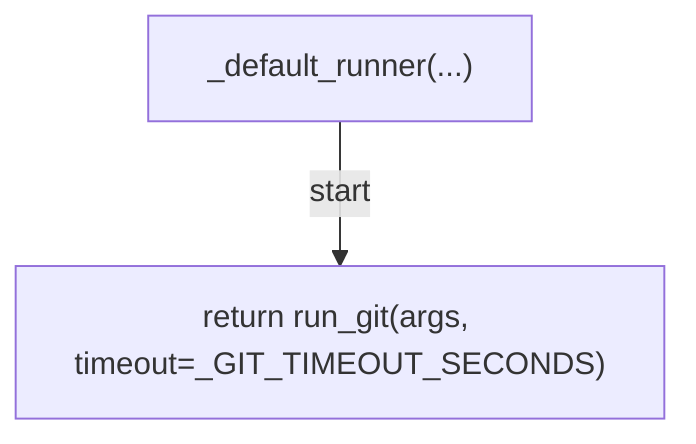

## _is_remote(...)

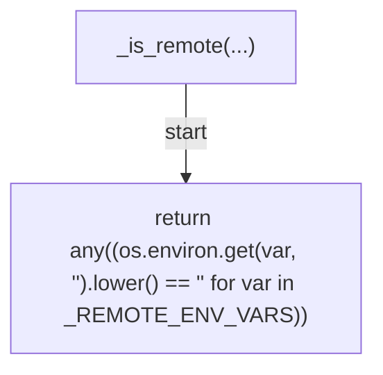

## _basename(...)

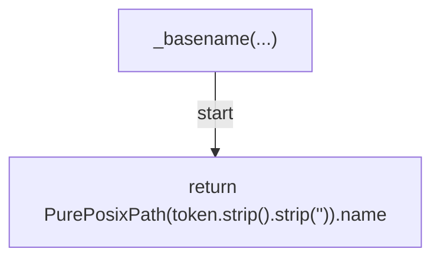

## _push_args_in_segment(...)

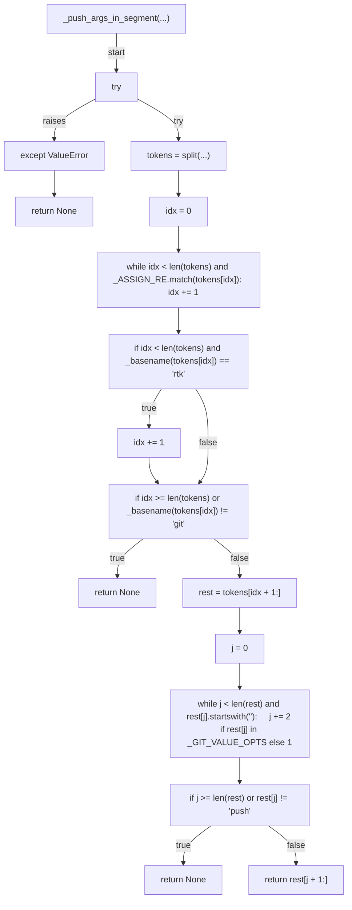

## _specs_from_push_args(...)

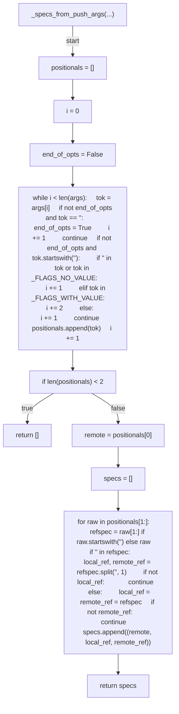

## _iter_push_specs(...)

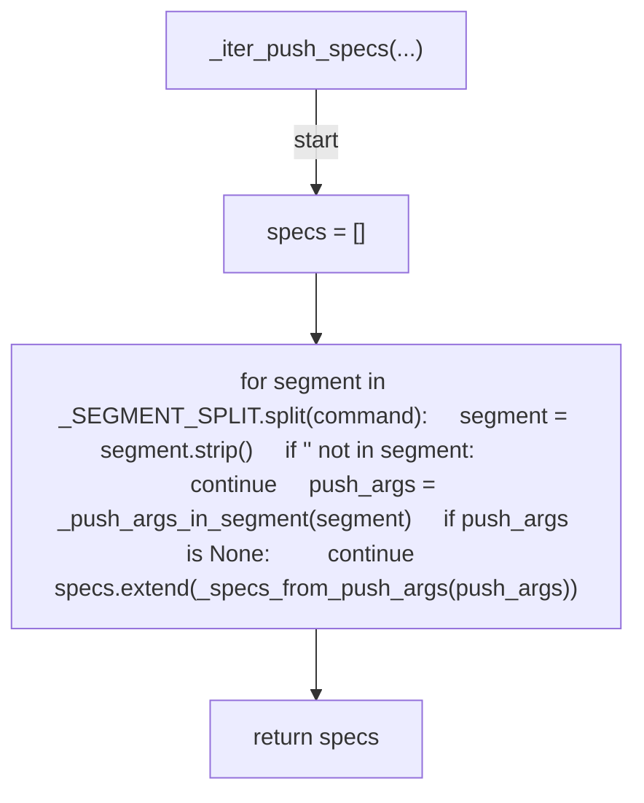

## _rev_parse(...)

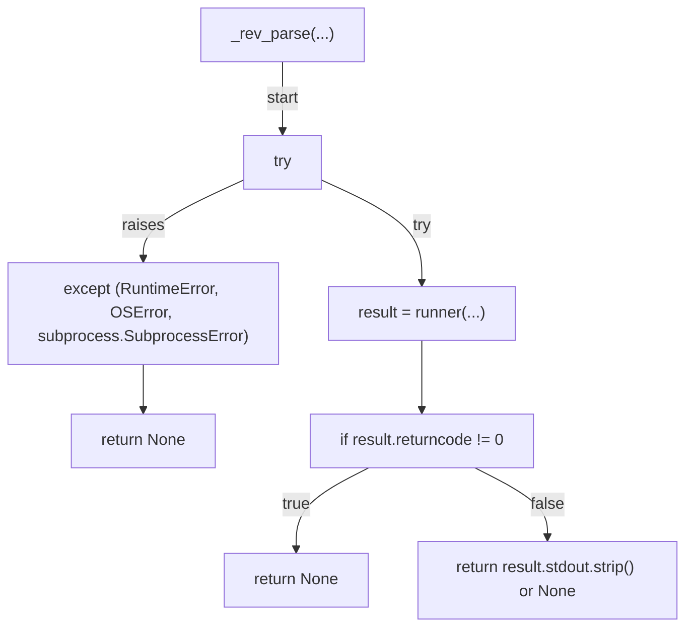

## _commits_for_spec(...)

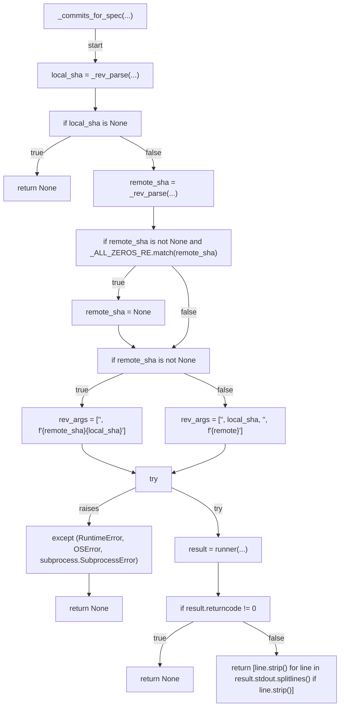

## _is_unsigned(...)

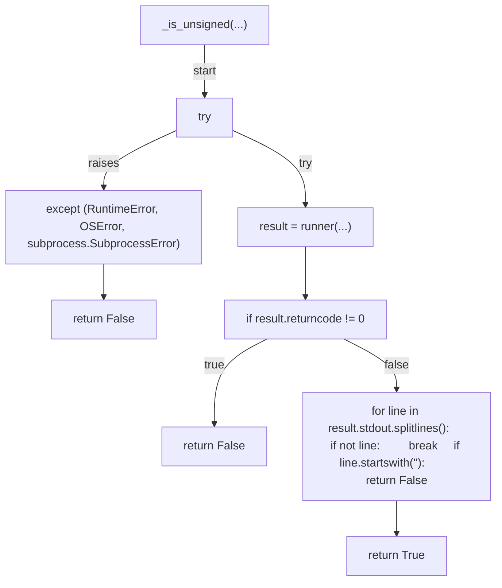

## _deny(...)

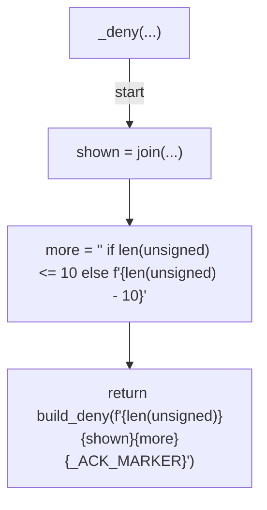

## decide(...)

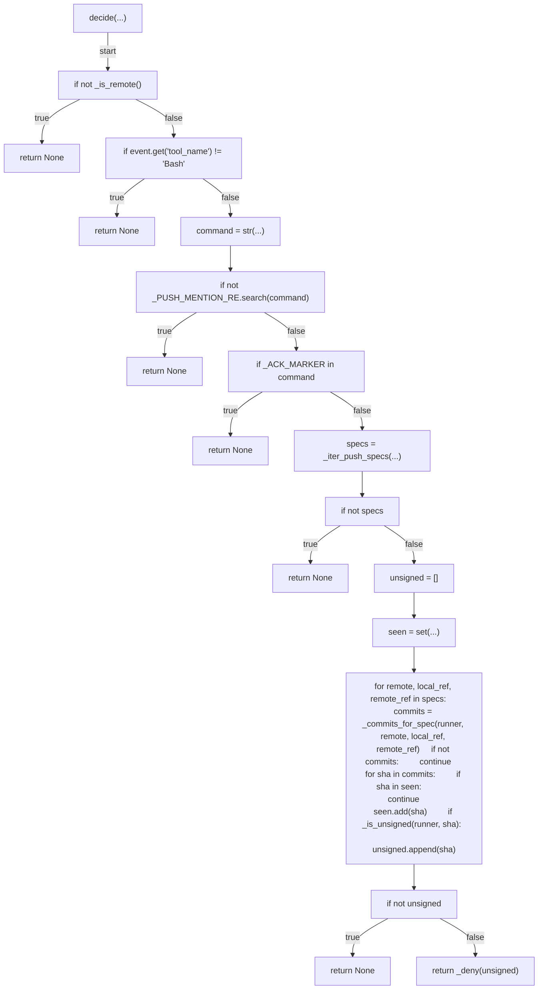

## main(...)

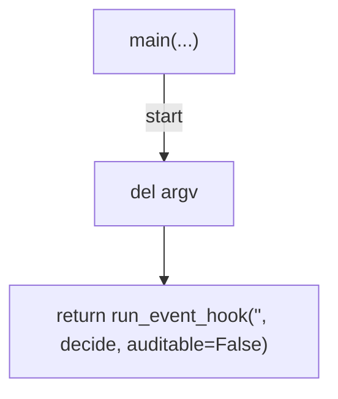
