# AST graph: scripts/preflight_replacement_pr.py

This file is generated from `scripts/preflight_replacement_pr.py` by `python3 scripts/script_ast_graph.py all-doc`. Do not edit it by hand: content under `docs/generated/scripts/` is owned by the post-merge automation (refs #1540) -- update the source script instead.

## parse_candidate(...)

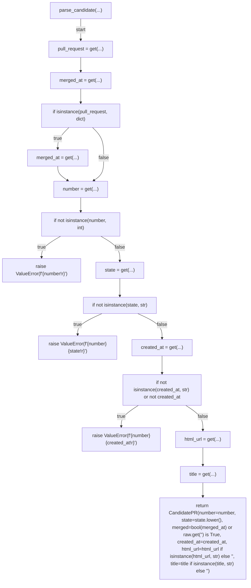

## parse_candidates(...)

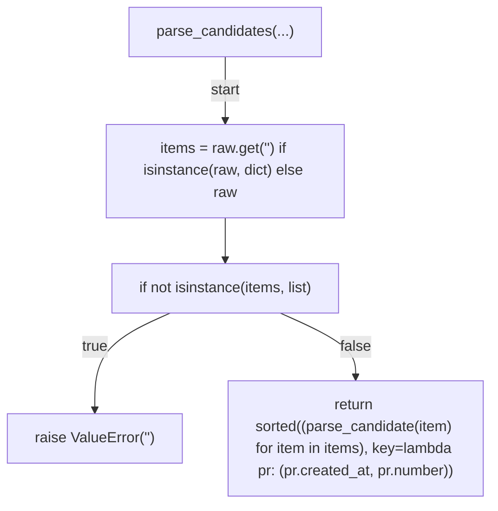

## has_complete_root_cause_note(...)

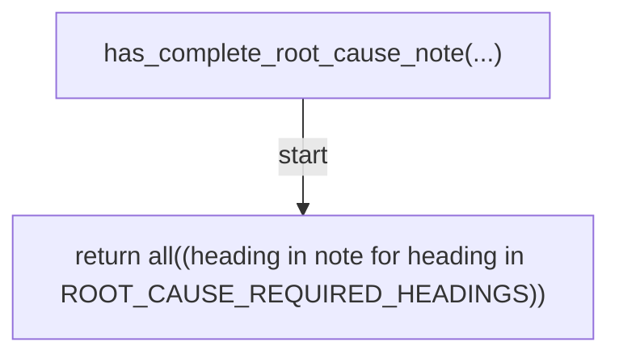

## compute_metrics(...)

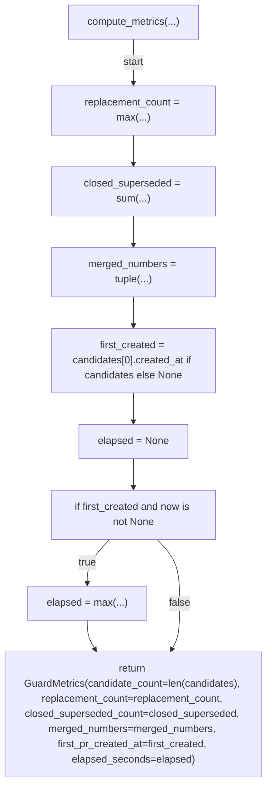

## decide_replacement(...)

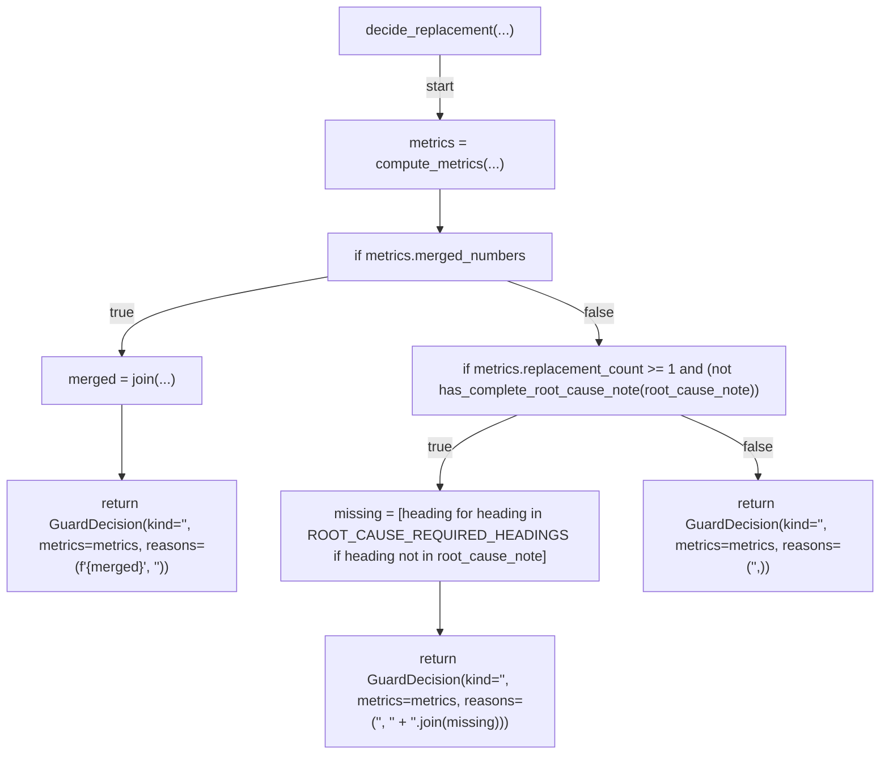

## format_close_marker(...)

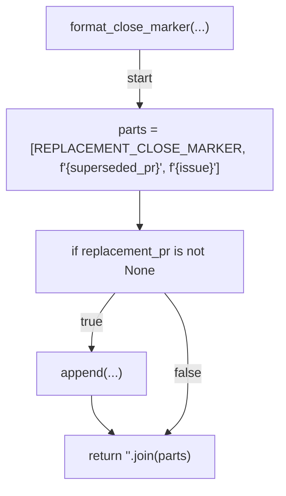

## render_report(...)

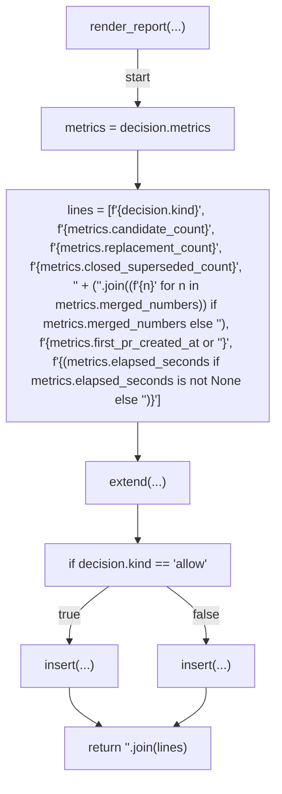

## load_root_cause_note(...)

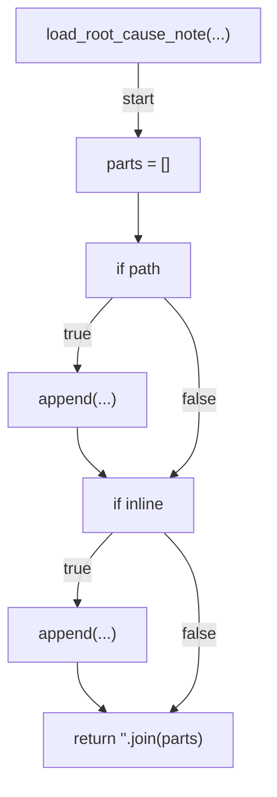

## load_candidates_from_file(...)

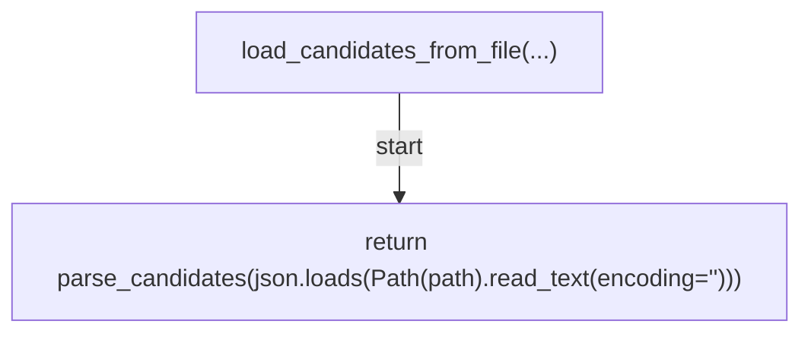

## fetch_candidates(...)

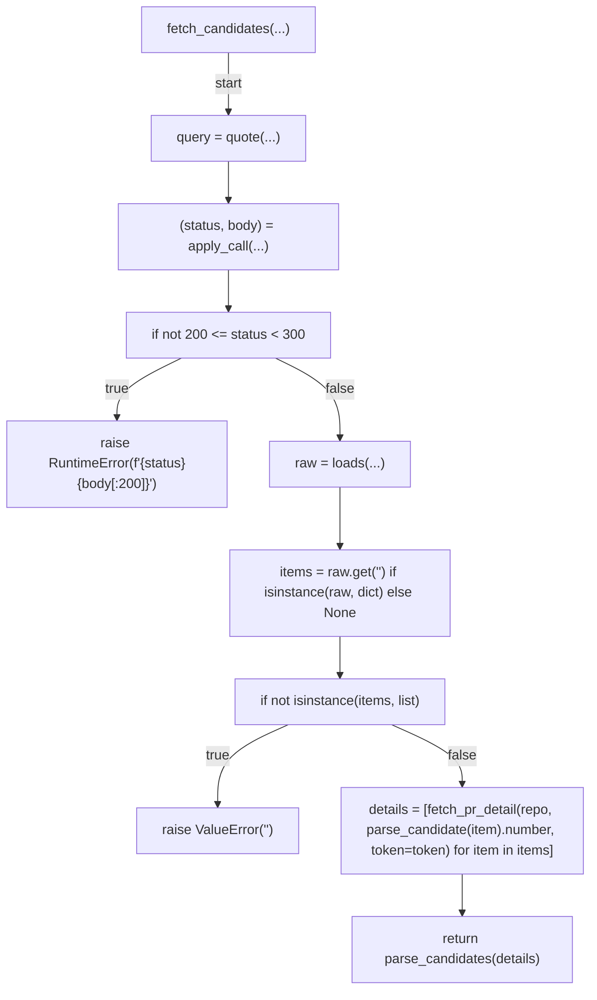

## fetch_pr_detail(...)

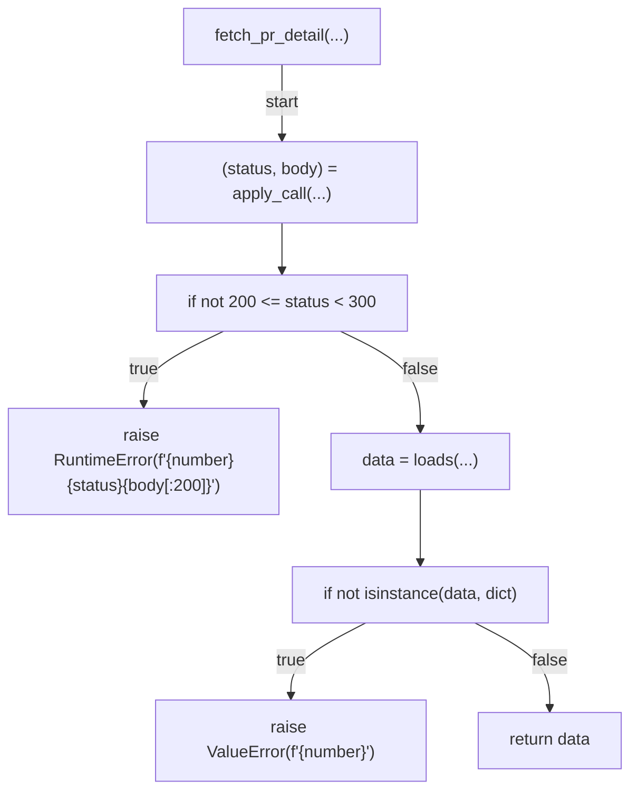

## parse_iso8601(...)

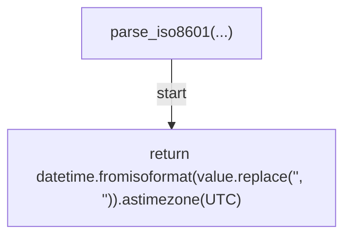

## parse_now(...)

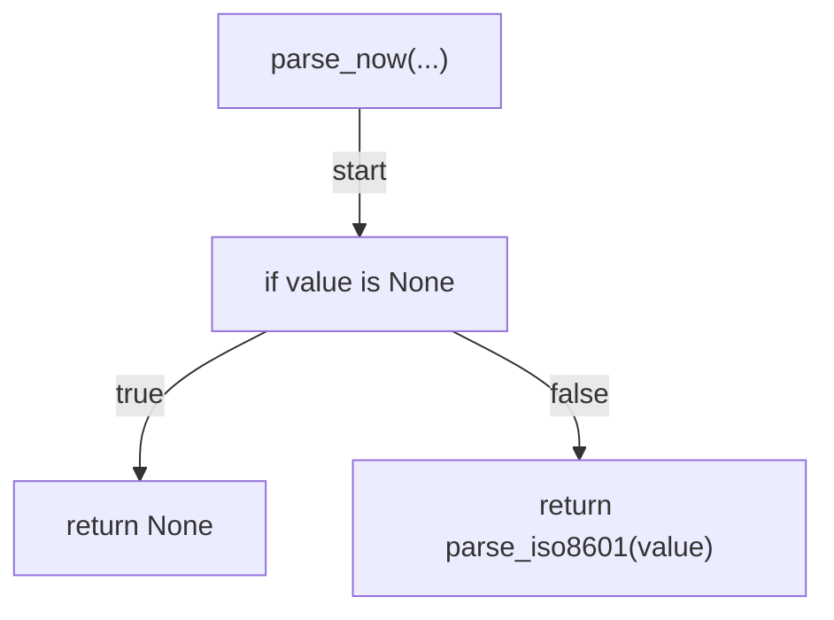

## _build_parser(...)

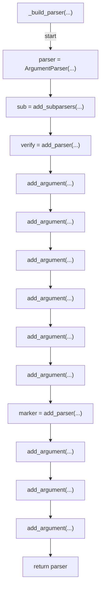

## main(...)

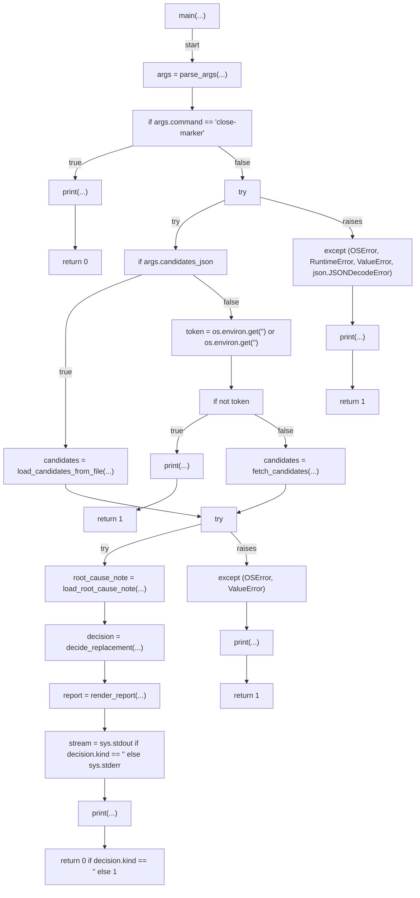
