# AST graph: scripts/preflight_session_base_freshness.py

This file is generated from `scripts/preflight_session_base_freshness.py` by `python3 scripts/script_ast_graph.py all-doc`. Do not edit it by hand: content under `docs/generated/scripts/` is owned by the post-merge automation (refs #1540); update the source script instead.

## _is_remote(...)

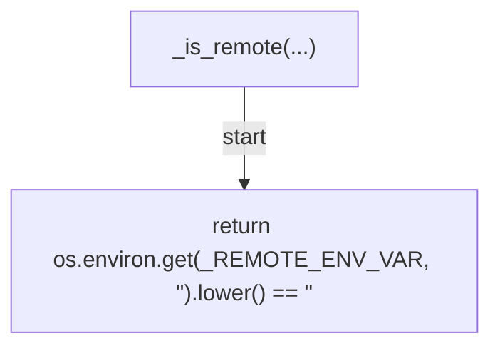

## _current_branch(...)

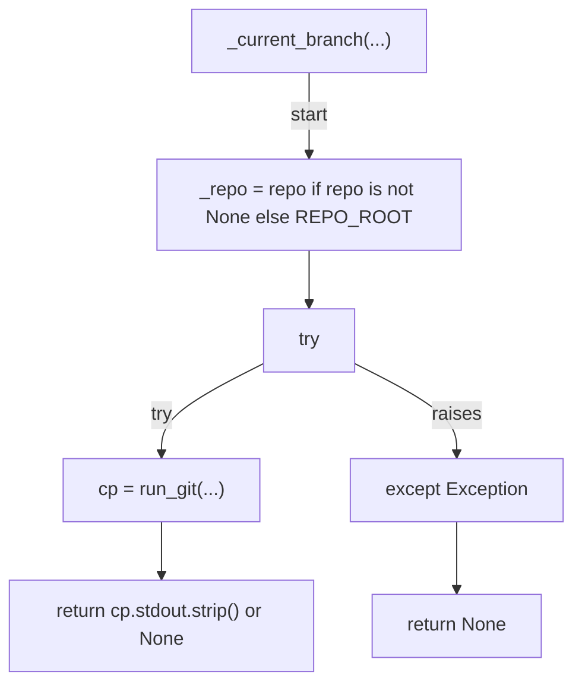

## _force_push_blocked(...)

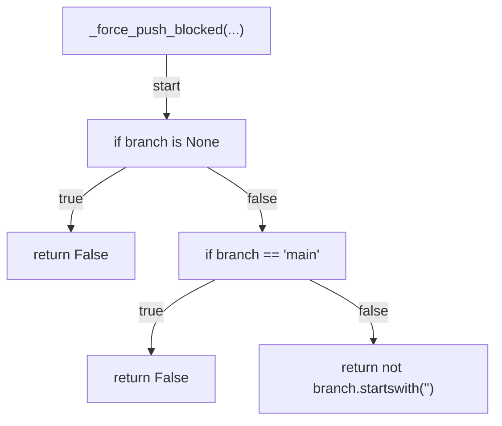

## base_is_stale(...)

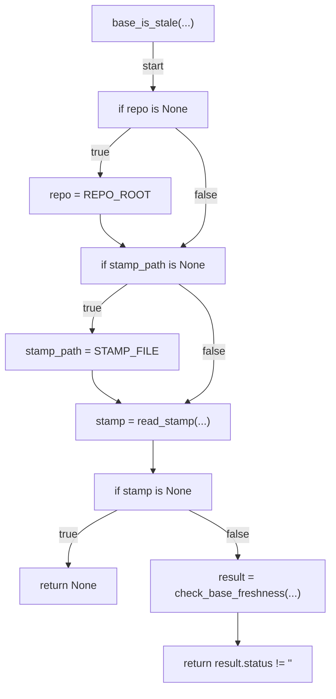

## _build_warning(...)

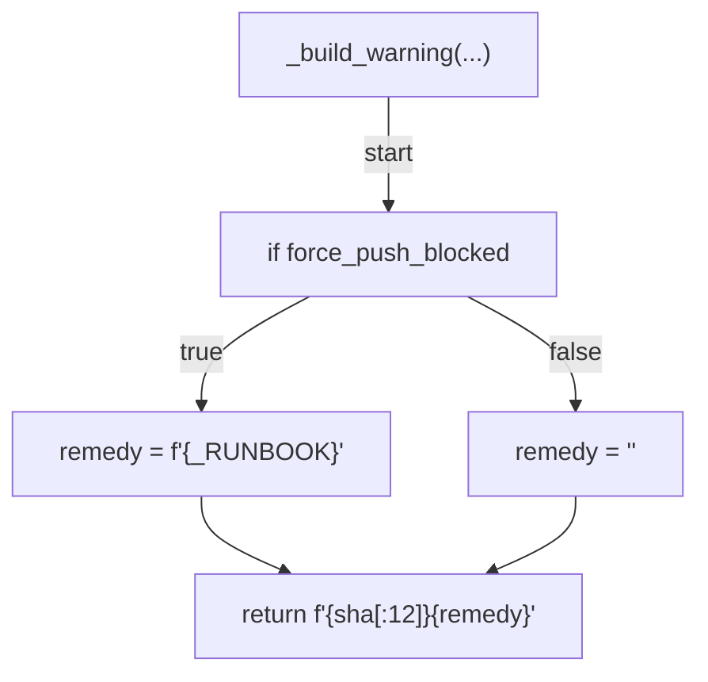

## _build_deny_reason(...)

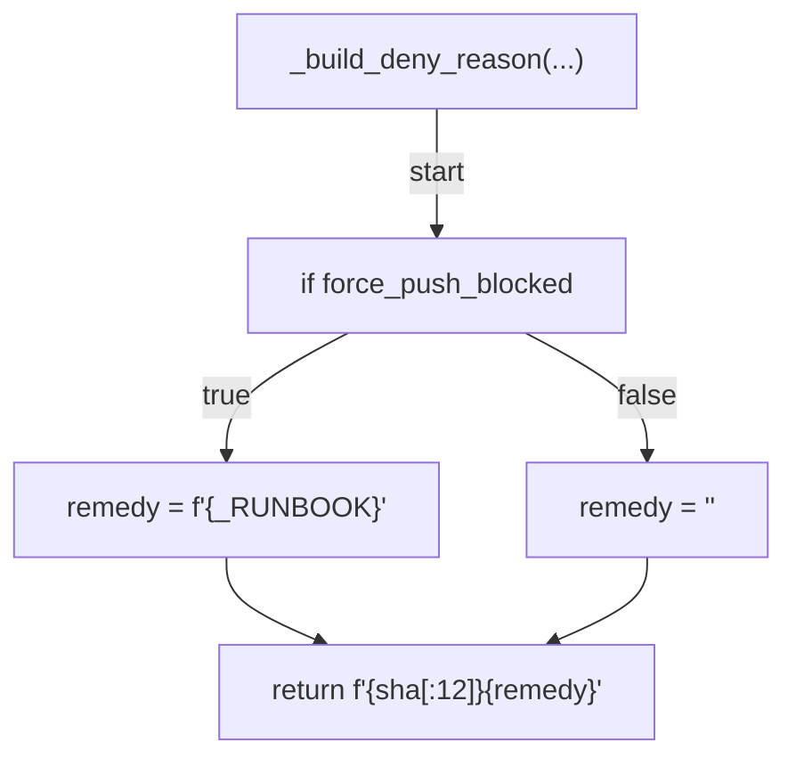

## _emit_context(...)

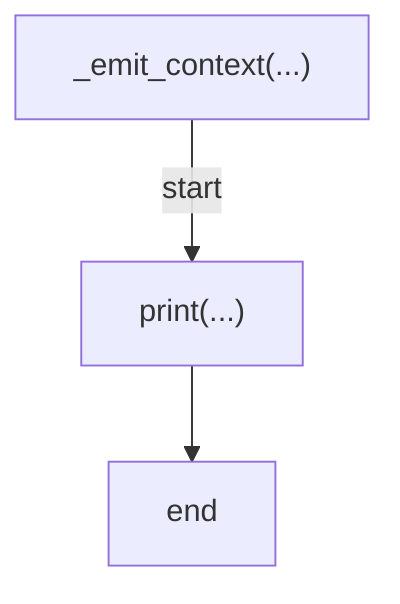

## _build_updated_notice(...)

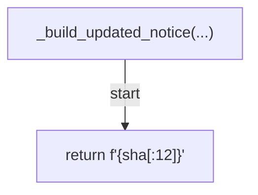

## _try_auto_update_base(...)

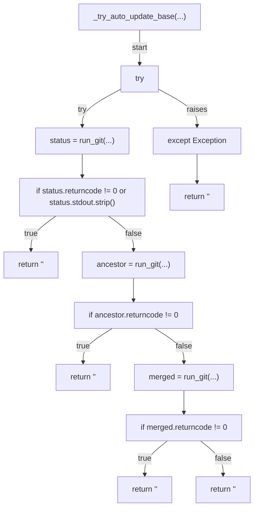

## cmd_session_start(...)

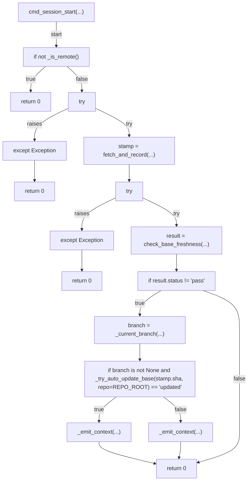

## decide(...)

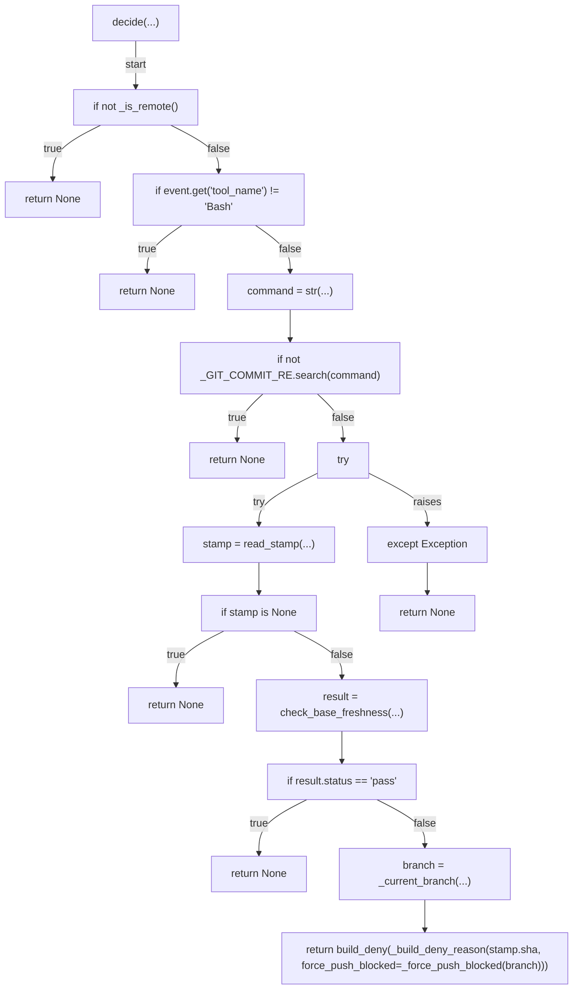

## cmd_check(...)

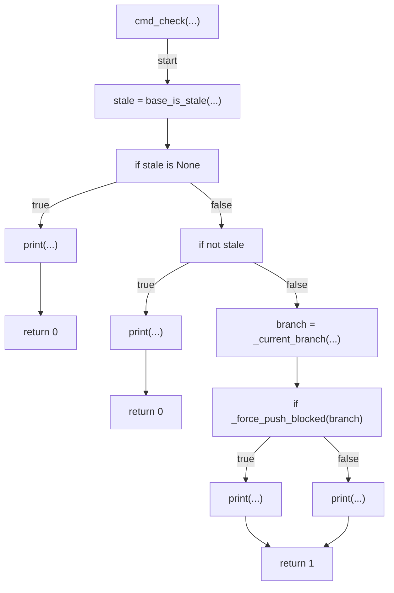

## main(...)

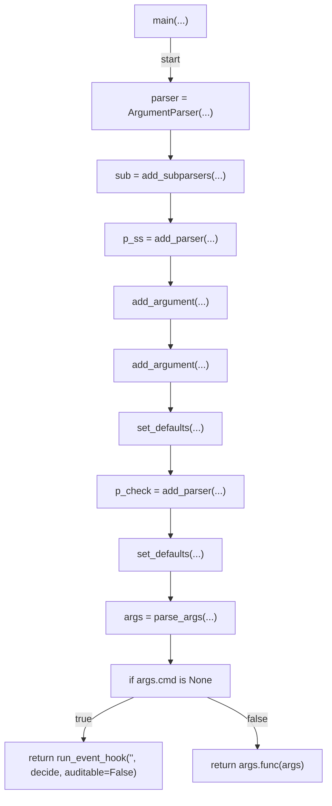
