# AST graph: scripts/preflight_session_branch_authz.py

This file is generated from `scripts/preflight_session_branch_authz.py` by `python3 scripts/script_ast_graph.py all-doc`. Do not edit it by hand: content under `docs/generated/scripts/` is owned by the post-merge automation (refs #1540) -- update the source script instead.

## _read_authorized_branches(...)

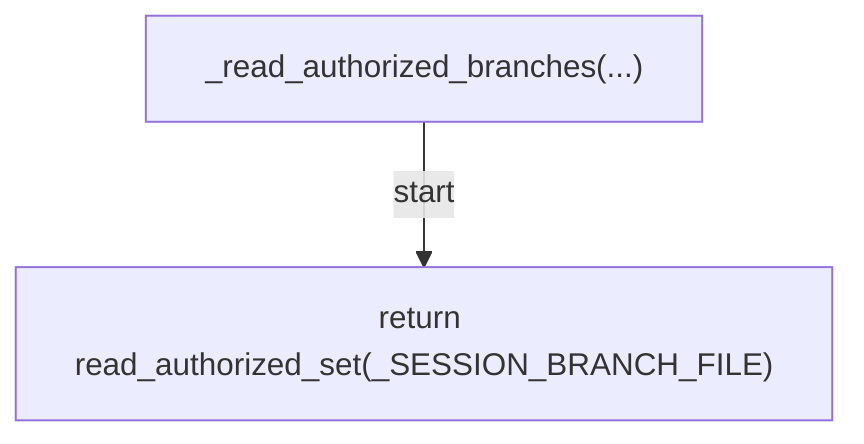

## _current_branch(...)

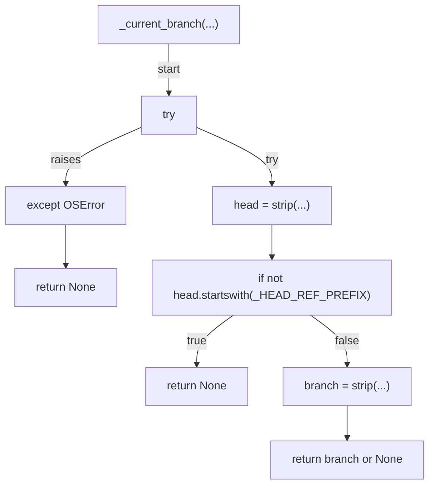

## _resolve_target(...)

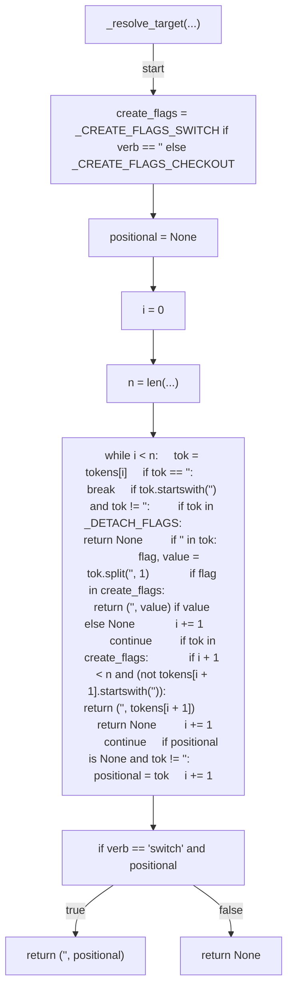

## _iter_branch_targets(...)

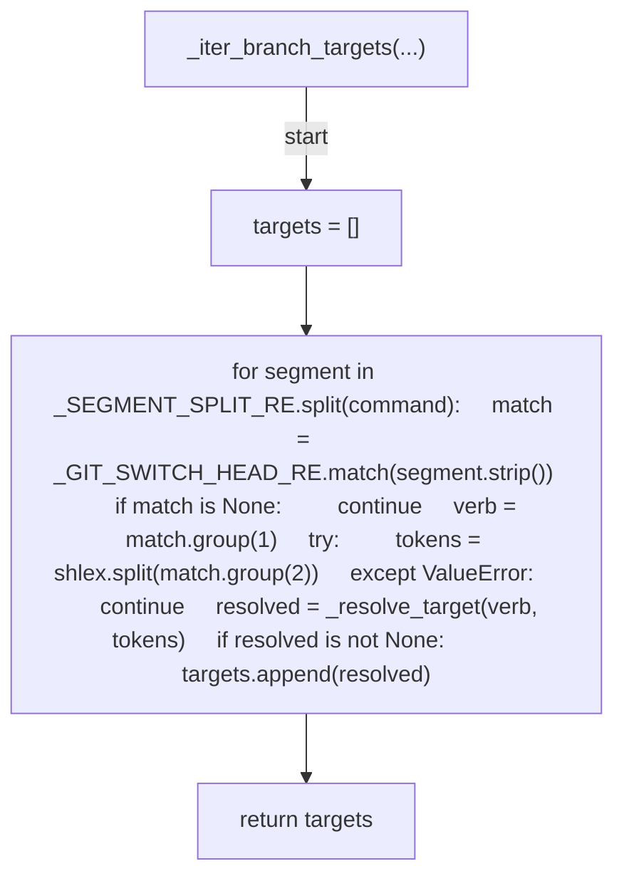

## _target_hint(...)

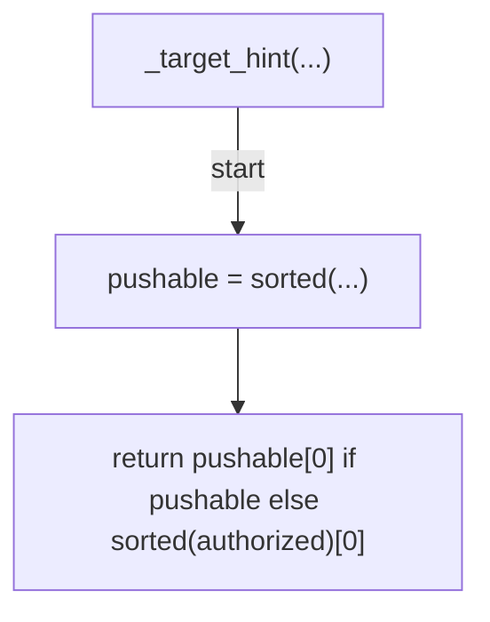

## _deny_switch(...)

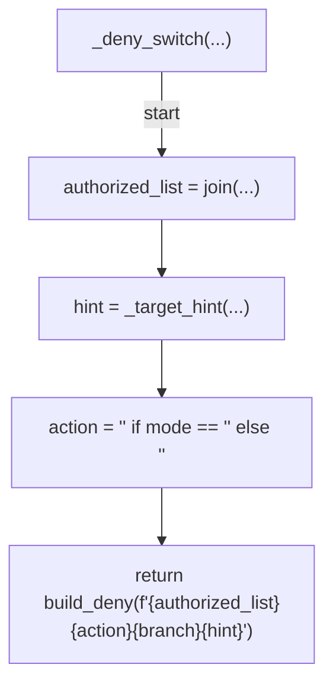

## _deny_edit(...)

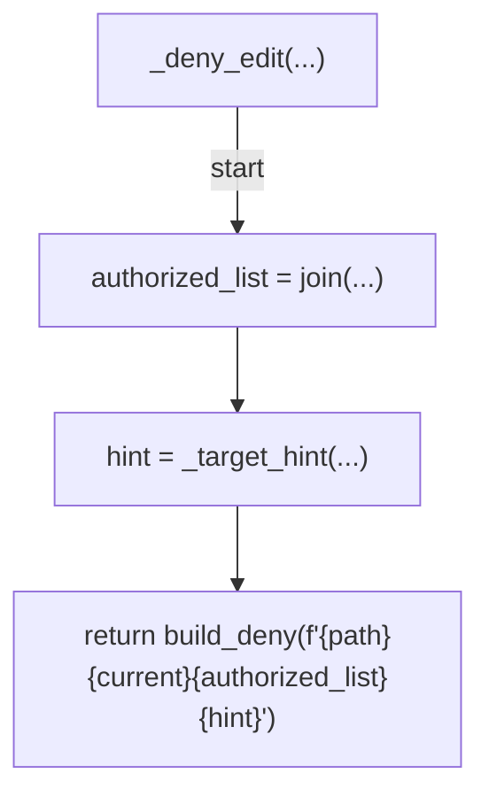

## _is_within_repo(...)

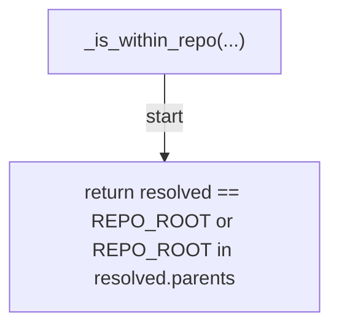

## _decide_bash(...)

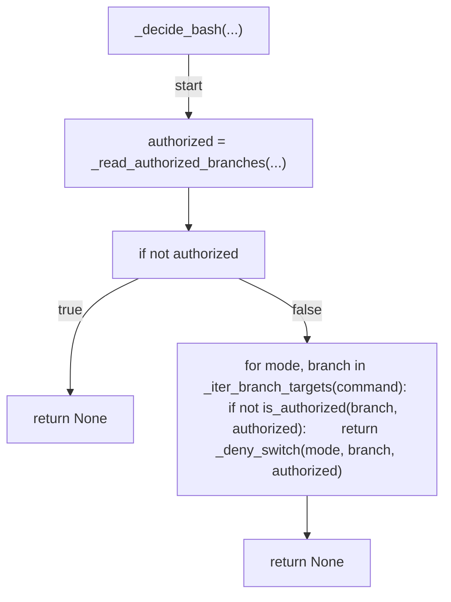

## _decide_edit(...)

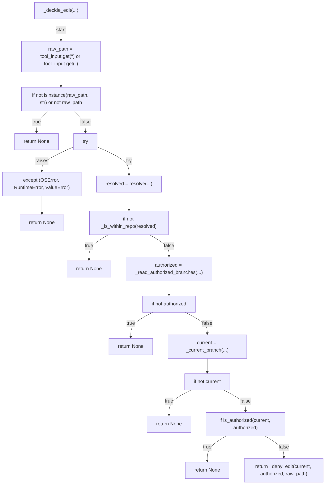

## decide(...)

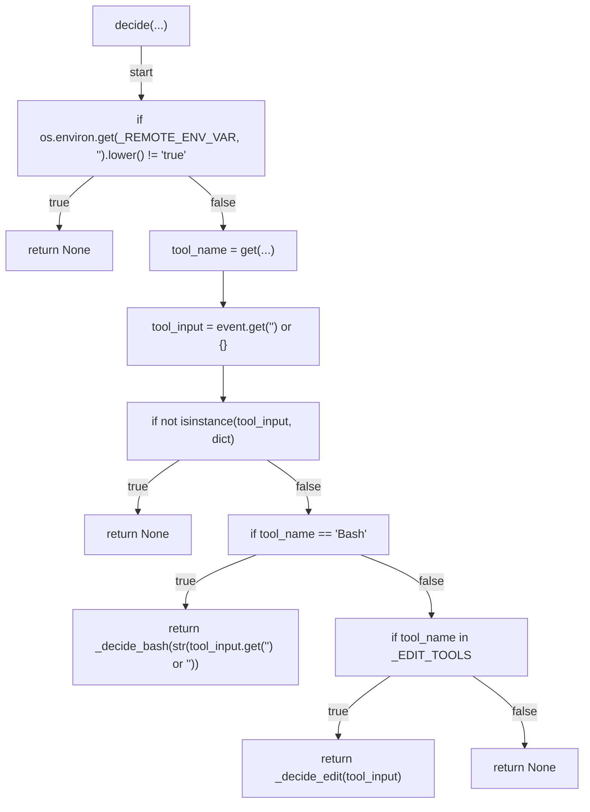

## main(...)

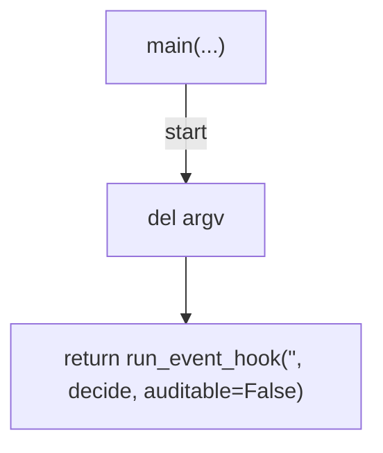
