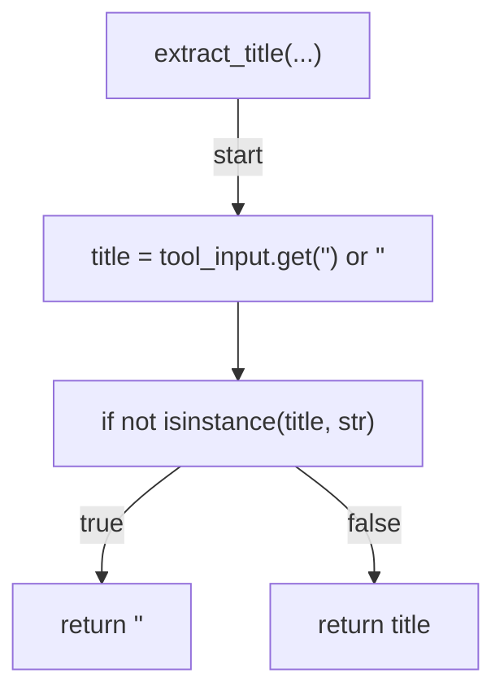
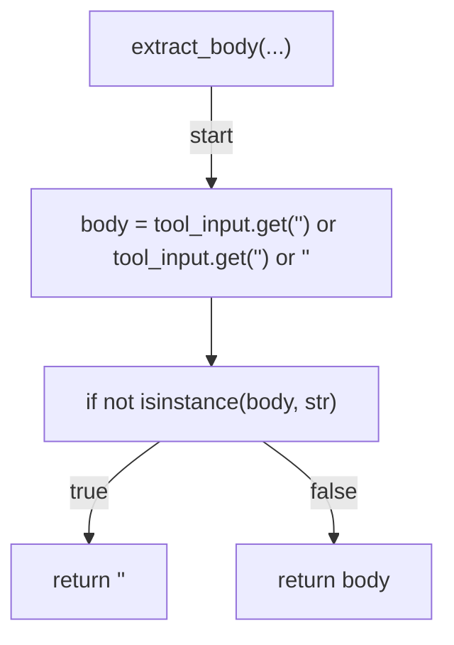
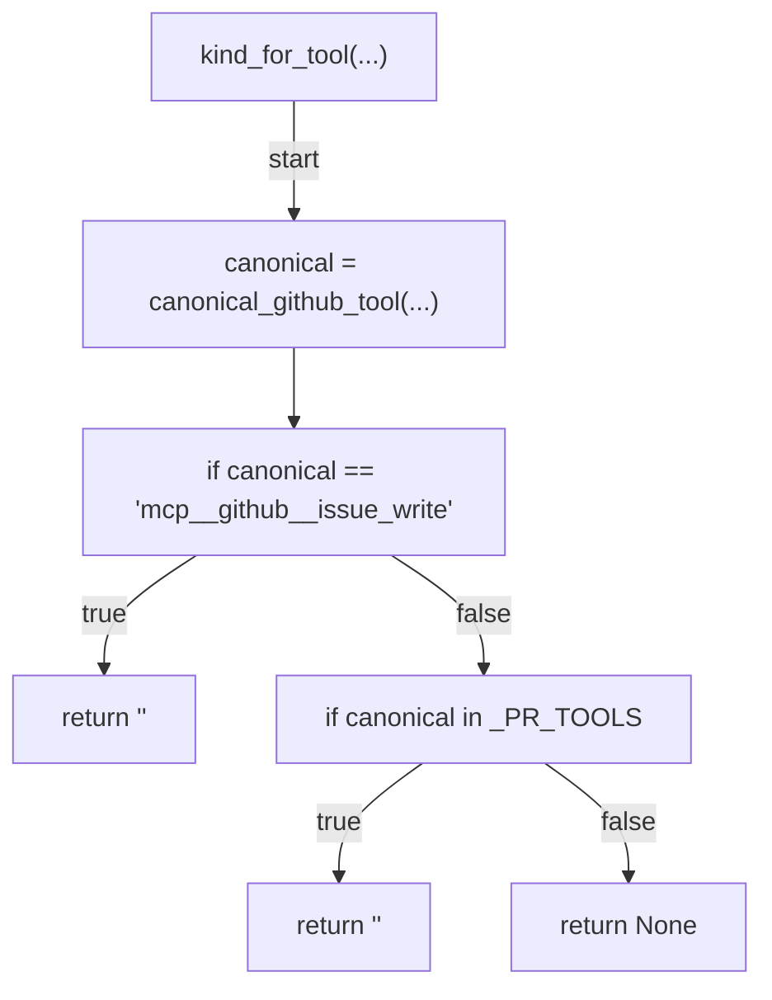
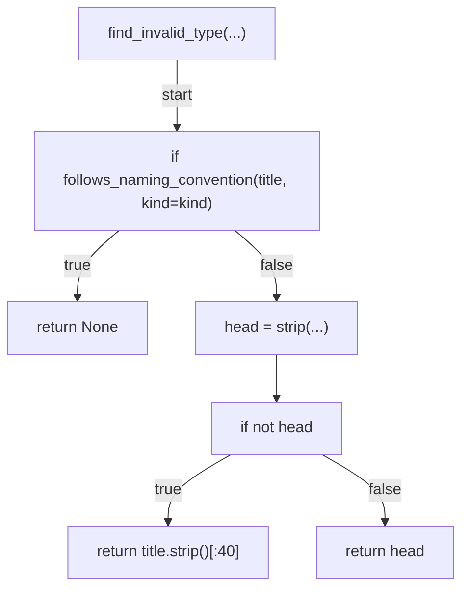
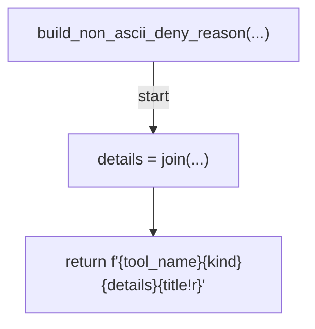
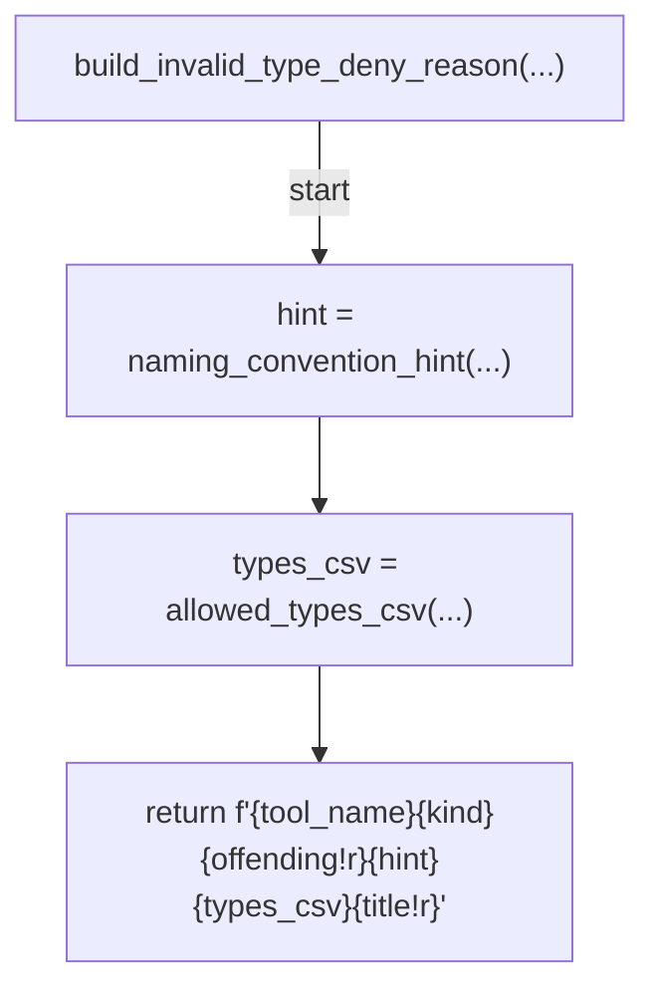
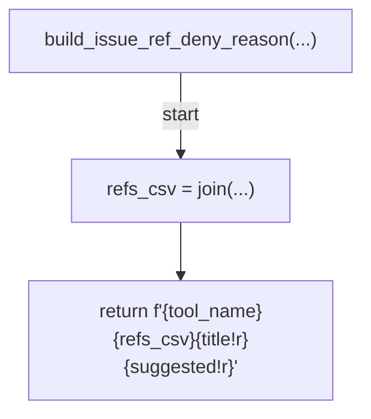
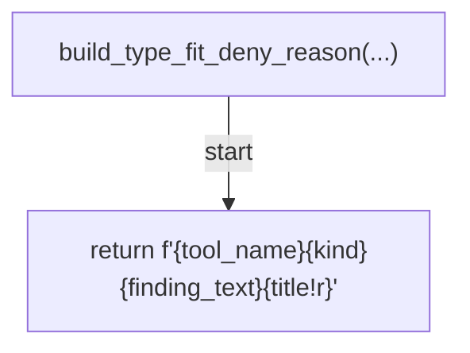
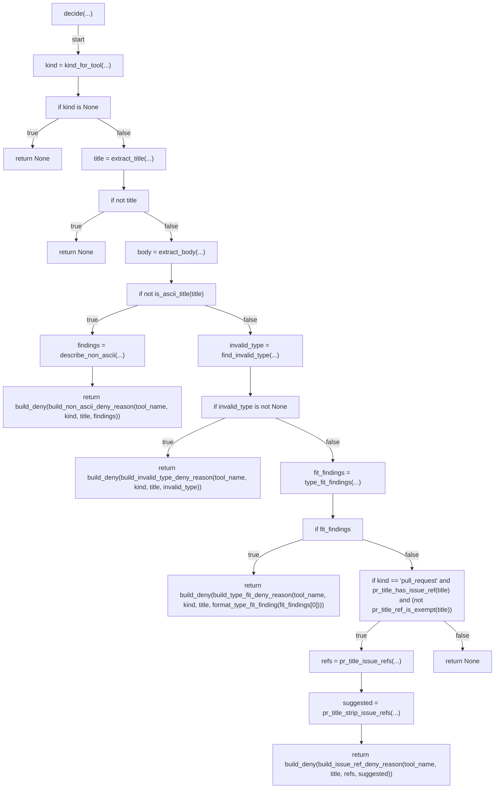
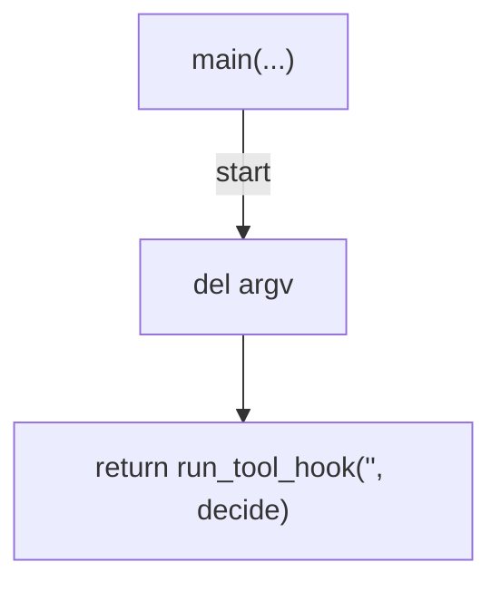

# AST graph: scripts/preflight_title_policy.py

This file is generated from `scripts/preflight_title_policy.py` by `python3 scripts/script_ast_graph.py all-doc`. Do not edit it by hand: content under `docs/generated/scripts/` is owned by the post-merge automation (refs #1540); update the source script instead.

## extract_title(...)

## extract_body(...)

## kind_for_tool(...)

## find_invalid_type(...)

## build_non_ascii_deny_reason(...)

## build_invalid_type_deny_reason(...)

## build_issue_ref_deny_reason(...)

## build_type_fit_deny_reason(...)

## decide(...)

## main(...)

