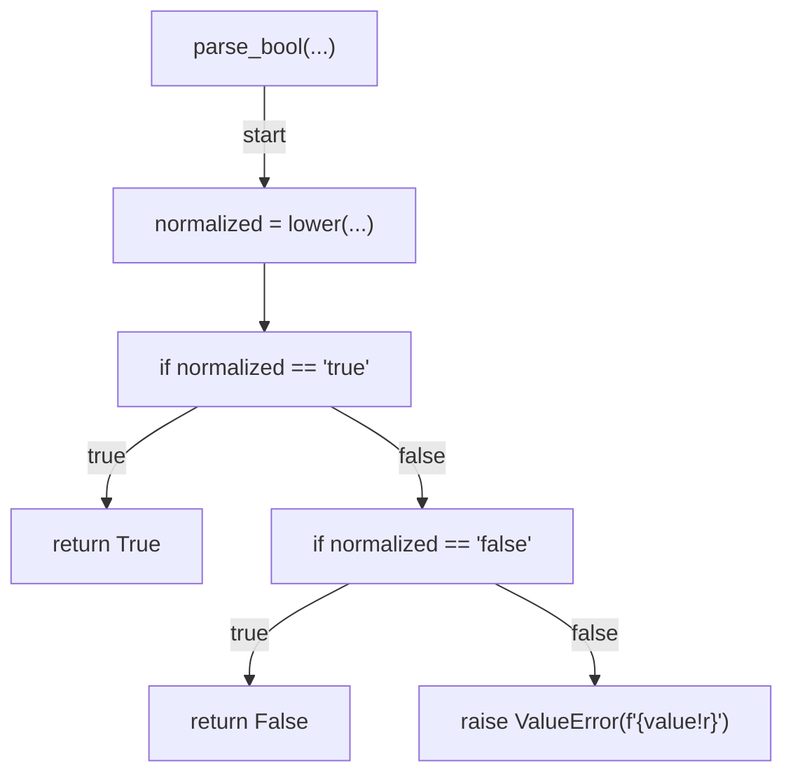
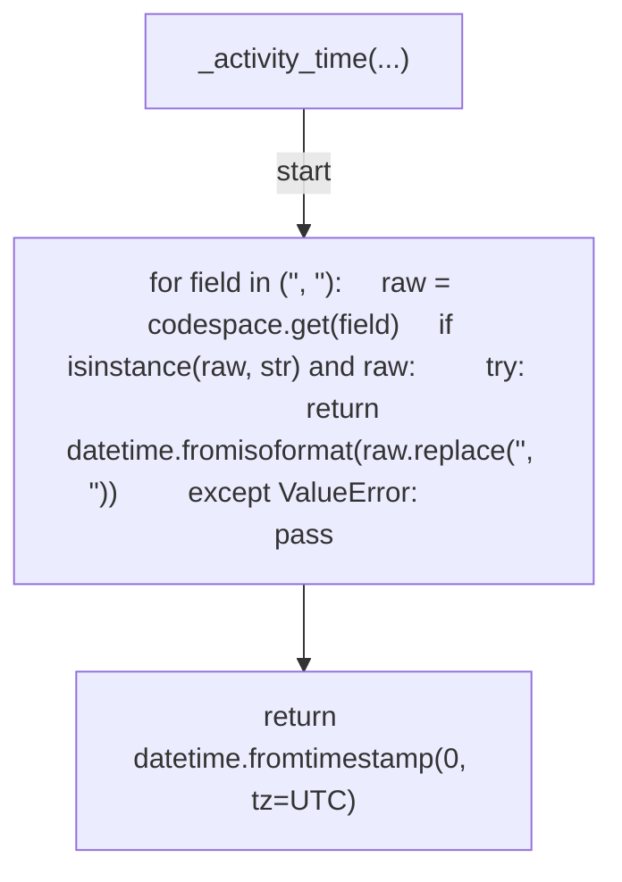
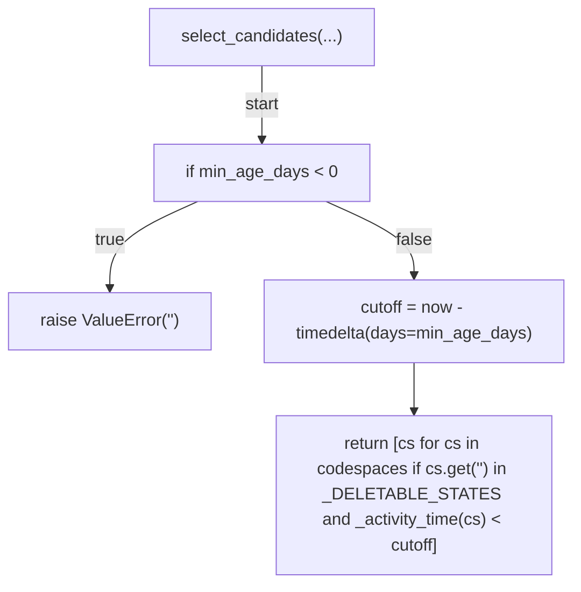
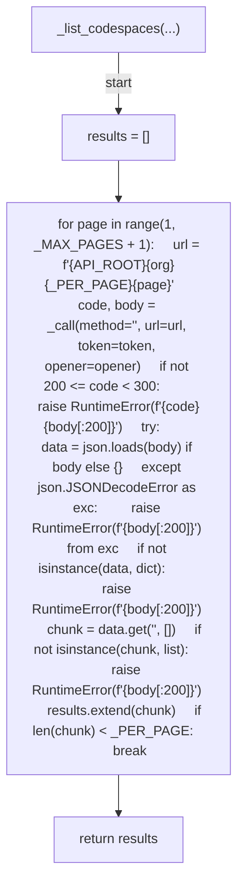
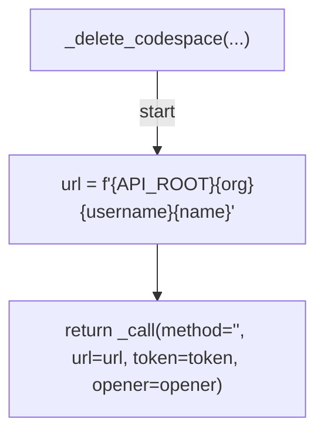
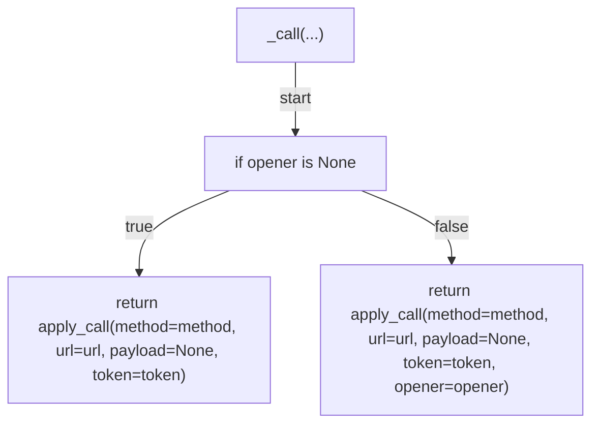
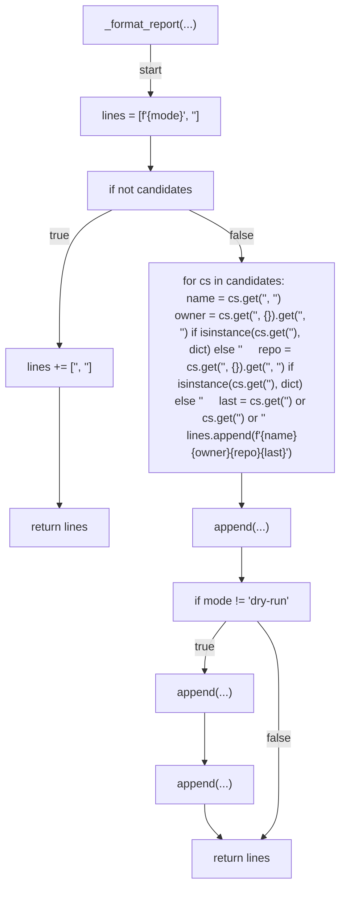
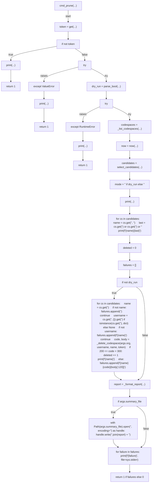
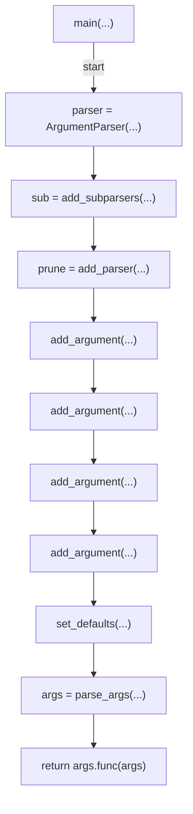

# AST graph: scripts/prune_codespaces.py

This file is generated from `scripts/prune_codespaces.py` by `python3 scripts/script_ast_graph.py all-doc`. Do not edit it by hand: content under `docs/generated/scripts/` is owned by the post-merge automation (refs #1540); update the source script instead.

## parse_bool(...)

## _activity_time(...)

## select_candidates(...)

## _list_codespaces(...)

## _delete_codespace(...)

## _call(...)

## _format_report(...)

## cmd_prune(...)

## main(...)

