# AST graph: scripts/prune_devcontainer_images.py

This file is generated from `scripts/prune_devcontainer_images.py` by `python3 scripts/script_ast_graph.py all-doc`. Do not edit it by hand: content under `docs/generated/scripts/` is owned by the post-merge automation (refs #1540) -- update the source script instead.

## parse_bool(...)

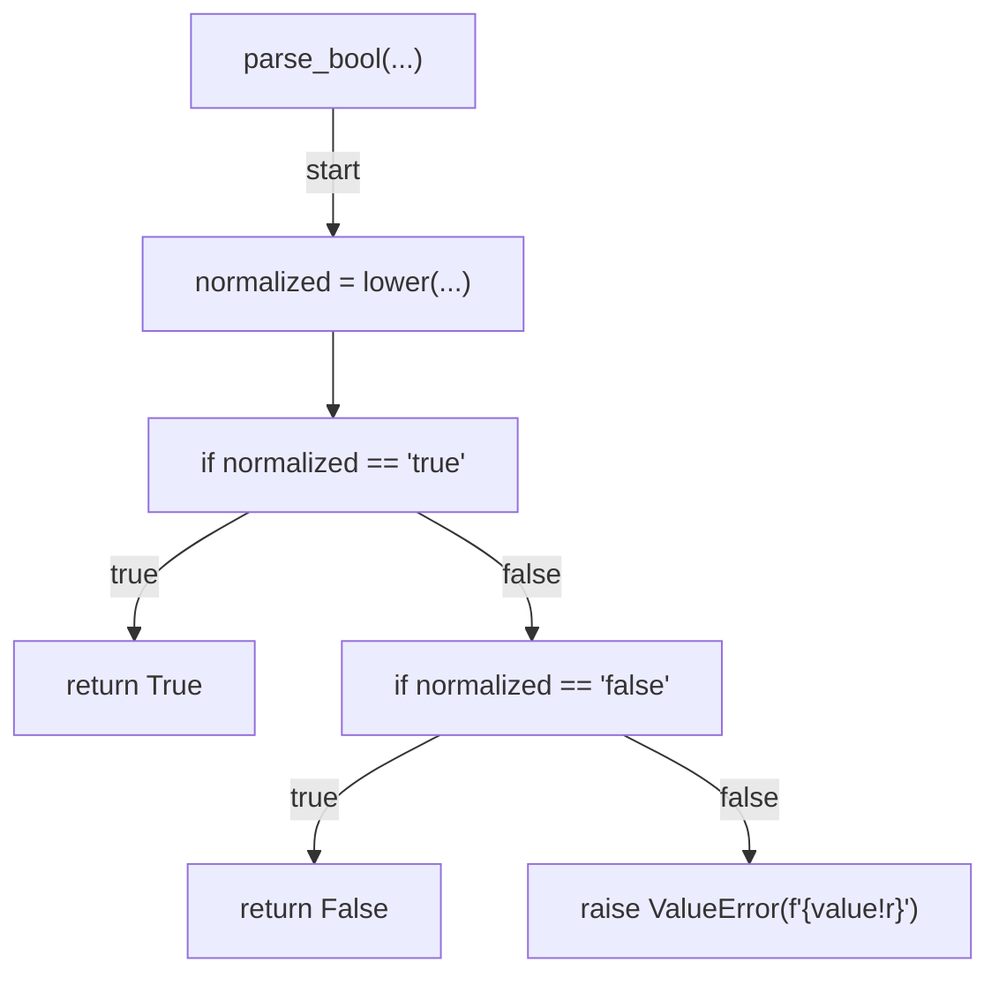

## parse_pinned_shas(...)

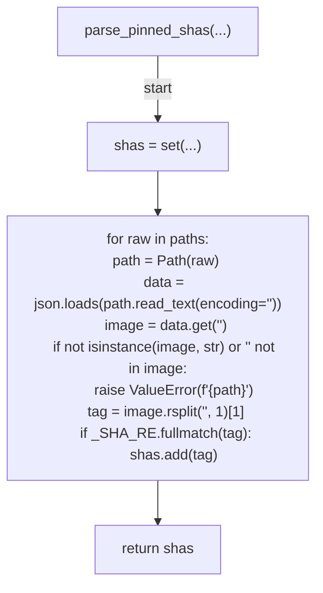

## is_protected_tag(...)

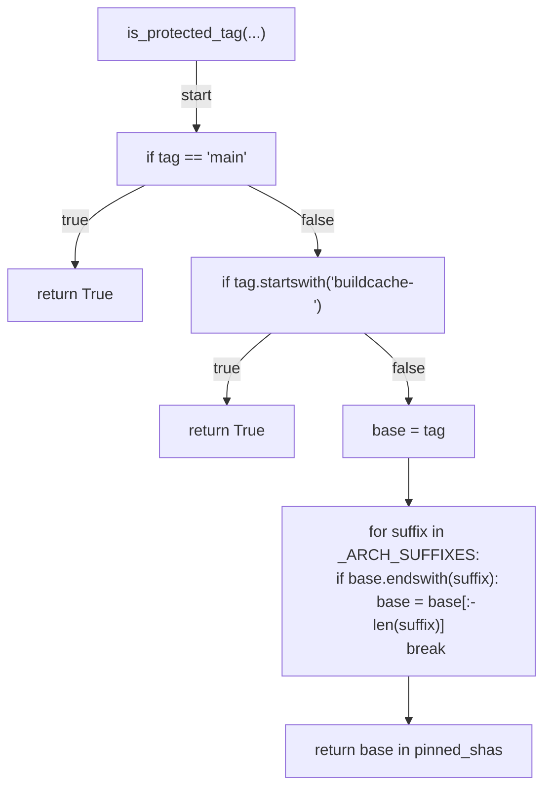

## version_tags(...)

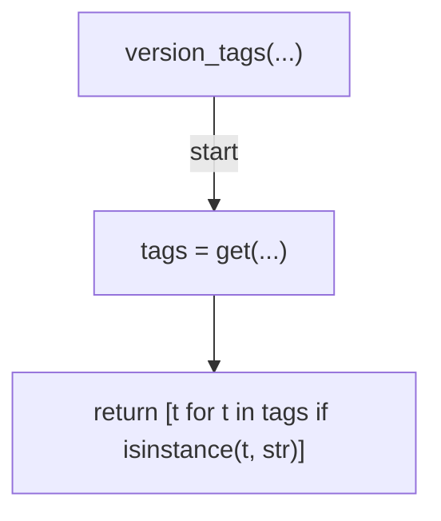

## _parse_created_at(...)

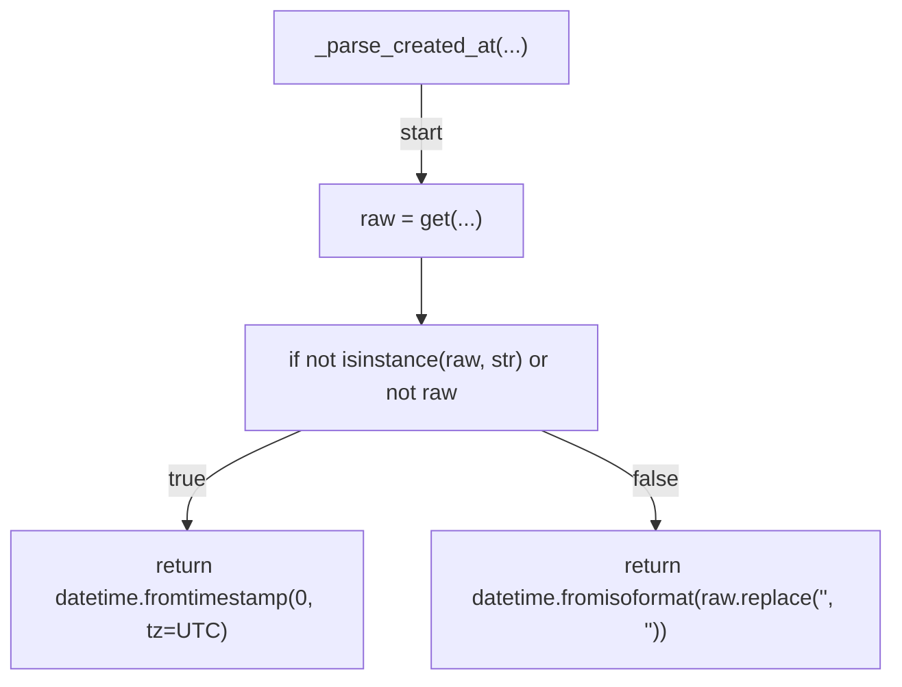

## _deletion_order_key(...)

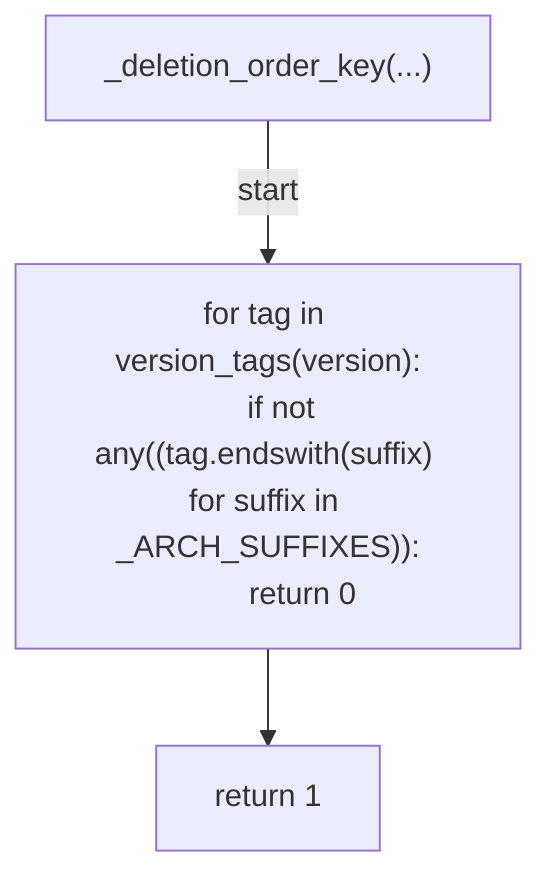

## select_versions_to_delete(...)

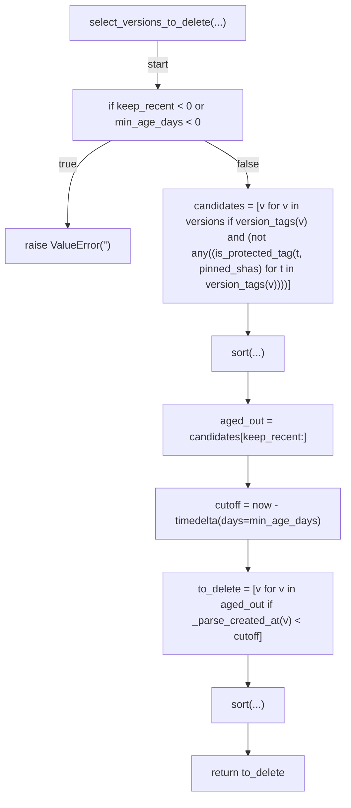

## _list_versions(...)

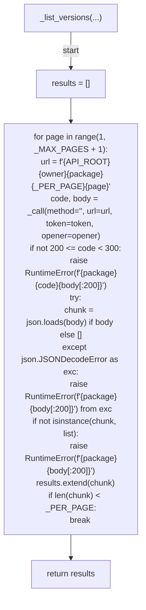

## _delete_version(...)

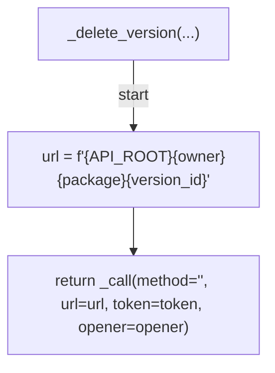

## _call(...)

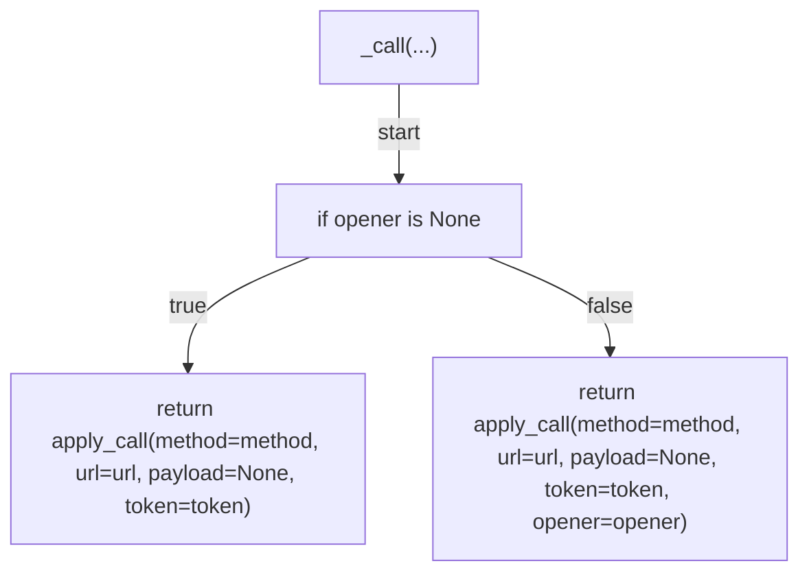

## _format_plan(...)

```mermaid
flowchart TD
    N001["_format_plan(...)"]
    N002["lines = [f'<str>{package}', '<str>']"]
    N003["if not to_delete"]
    N004["append(...)"]
    N005["append(...)"]
    N006["return lines"]
    N007["for version in to_delete:
    tags = '<str>'.join(version_tags(version)) or '<str>'
    created = version.get('<str>', '<str>')
    lines.append(f\"<str>{version.get('<str>')}<str>{created}<str>{tags}\")"]
    N008["append(...)"]
    N009["return lines"]
    N001 -->|"start"| N002
    N002 --> N003
    N003 -->|"true"| N004
    N004 --> N005
    N005 --> N006
    N003 -->|"false"| N007
    N007 --> N008
    N008 --> N009
```

## cmd_prune(...)

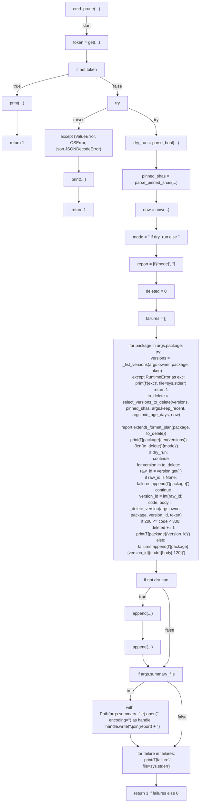

## main(...)

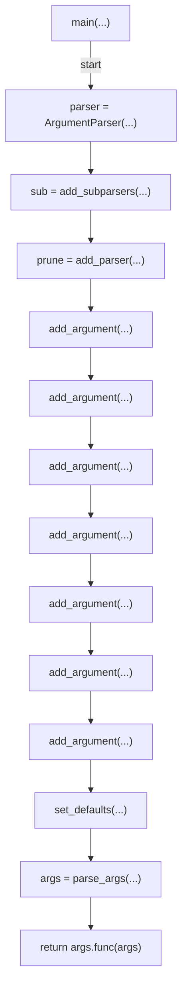
