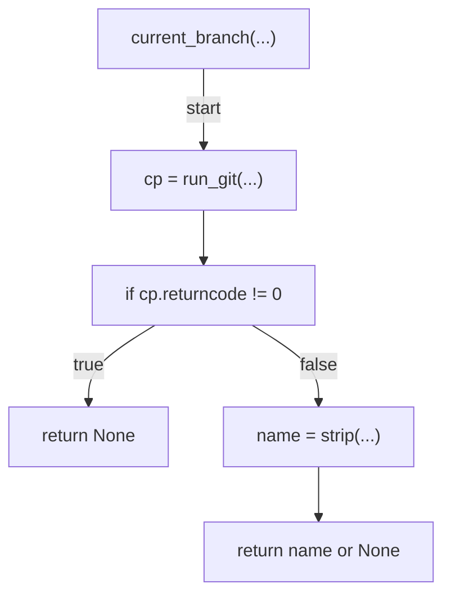
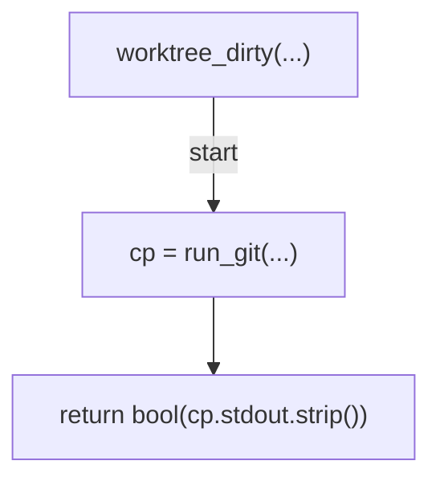
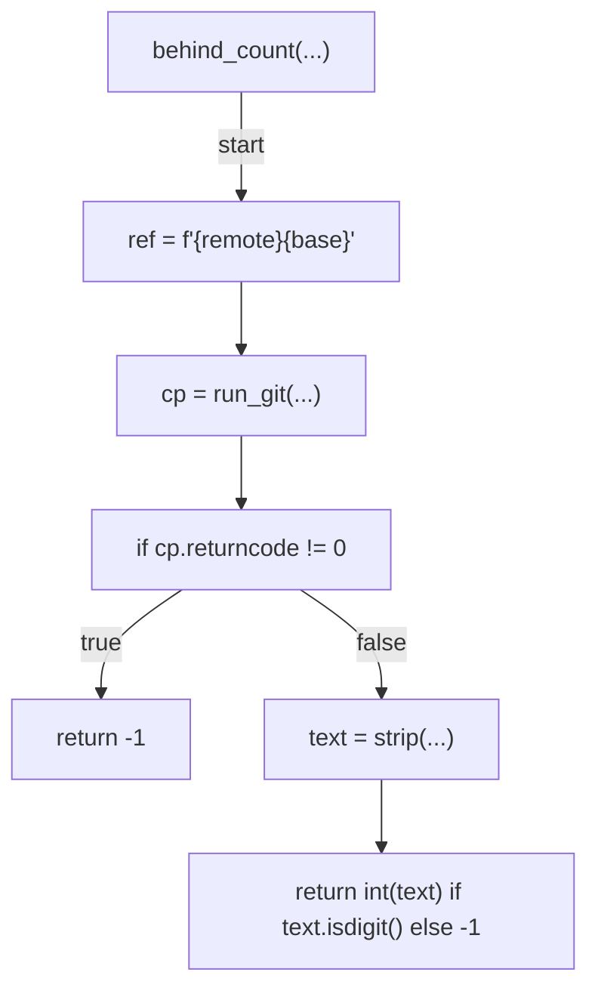
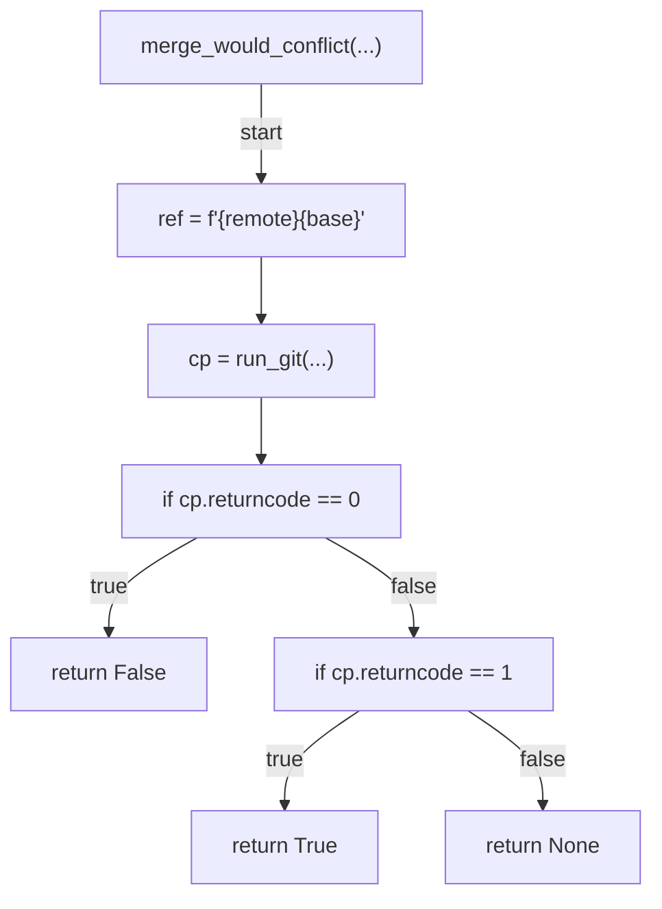
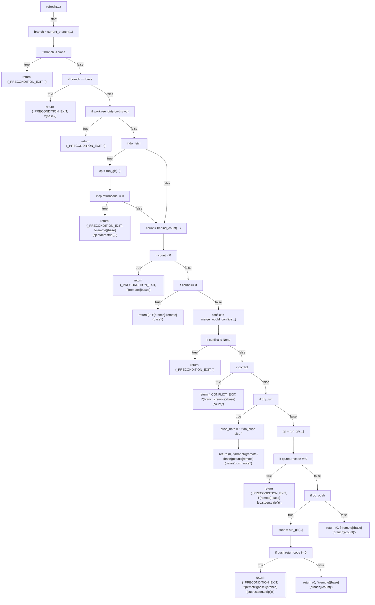
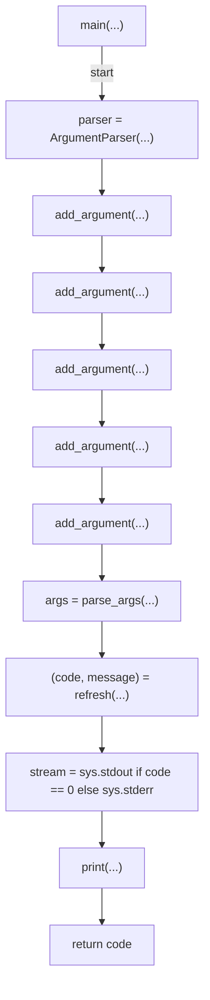

# AST graph: scripts/refresh_pr_branch.py

This file is generated from `scripts/refresh_pr_branch.py` by `python3 scripts/script_ast_graph.py all-doc`. Do not edit it by hand: content under `docs/generated/scripts/` is owned by the post-merge automation (refs #1540) -- update the source script instead.

## current_branch(...)

## worktree_dirty(...)

## behind_count(...)

## merge_would_conflict(...)

## refresh(...)

## main(...)

