# AST graph: scripts/ruleset_drift.py

This file is generated from `scripts/ruleset_drift.py` by `python3 scripts/script_ast_graph.py all-doc`. Do not edit it by hand: content under `docs/generated/scripts/` is owned by the post-merge automation (refs #1540) -- update the source script instead.

## _normalize_rule(...)

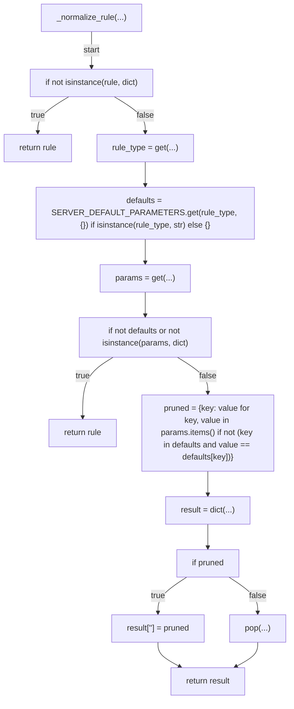

## _normalize_rules(...)

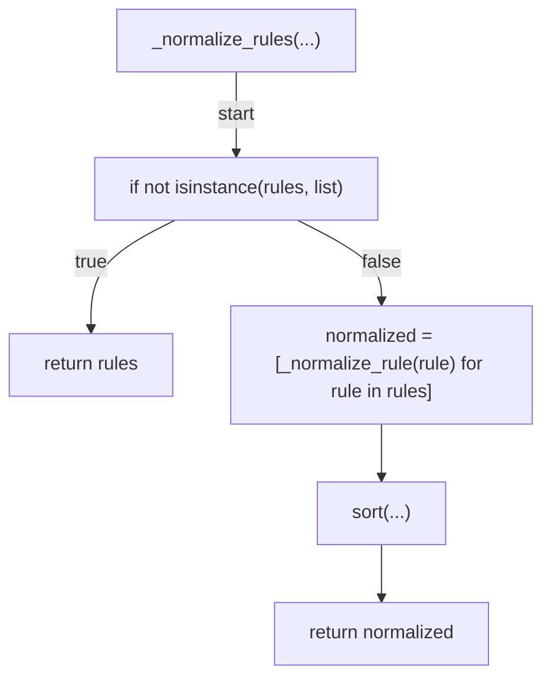

## canonical_projection(...)

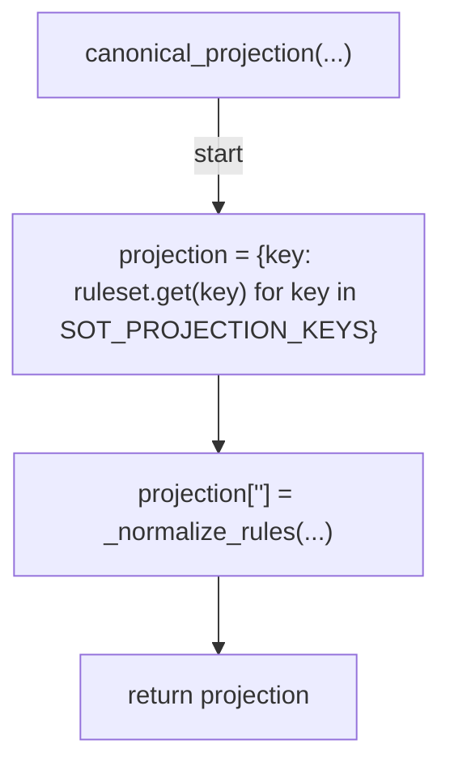

## canonical_json(...)

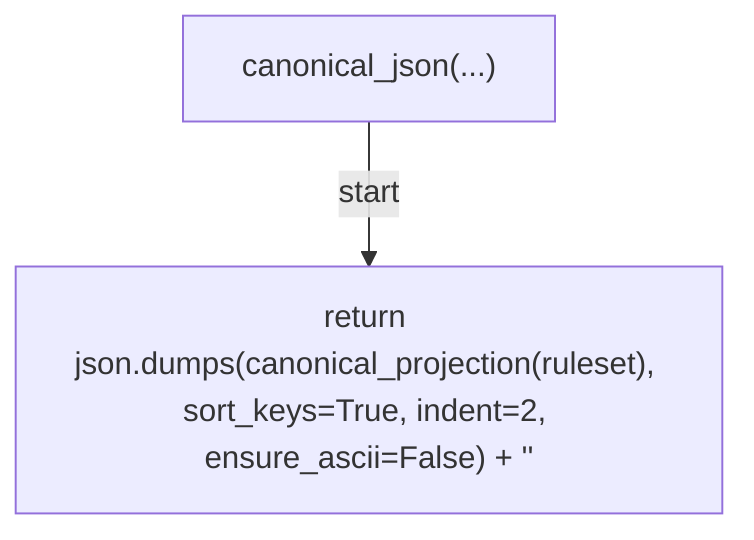

## classify(...)

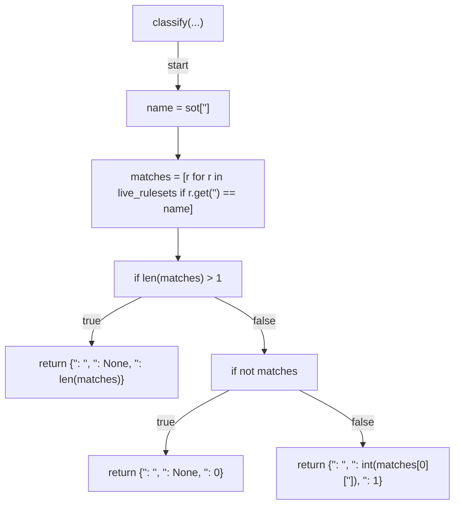

## diff_canonical(...)

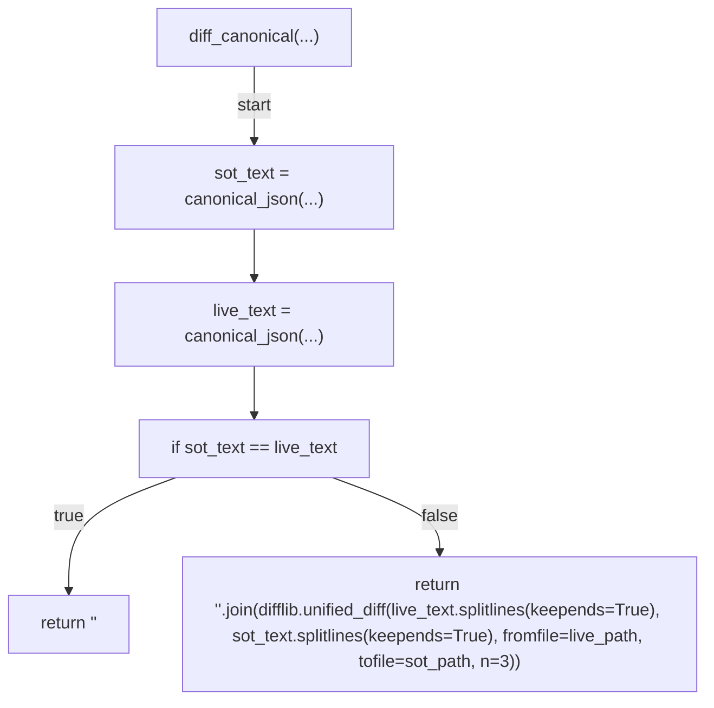

## find_unknown(...)

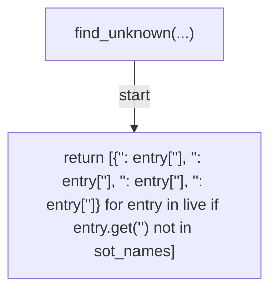

## drift_hash(...)

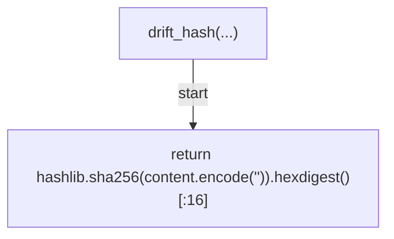

## embed_hash_marker(...)

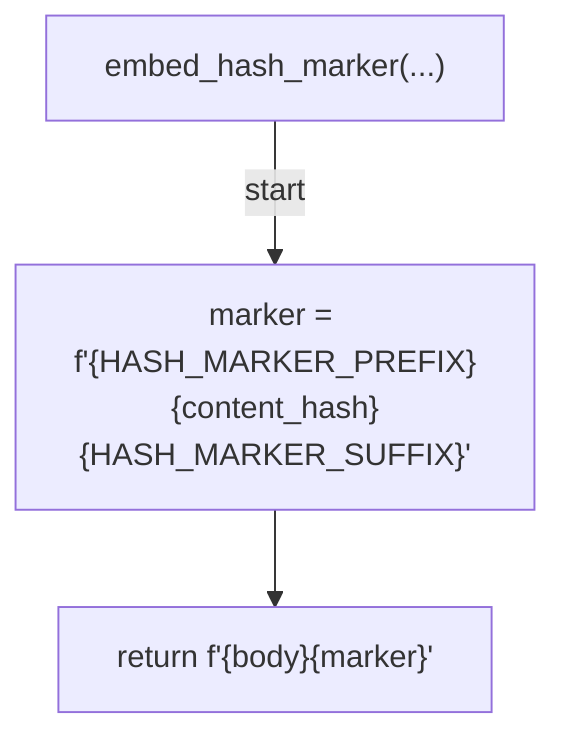

## extract_hash_marker(...)

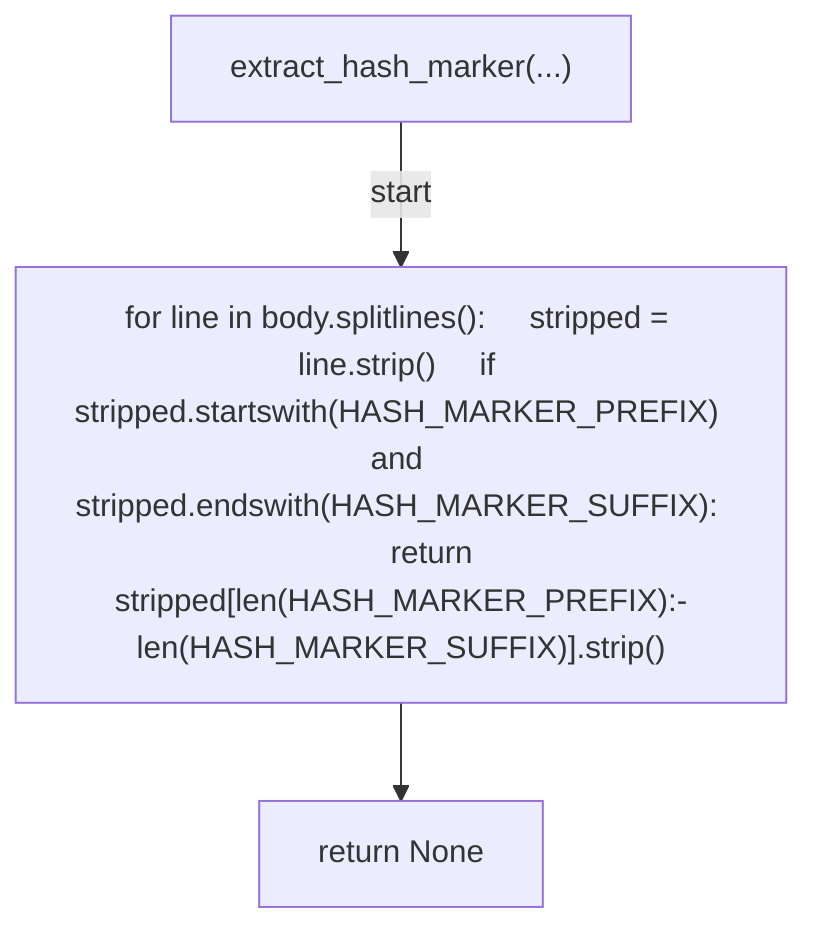

## decide_issue_action(...)

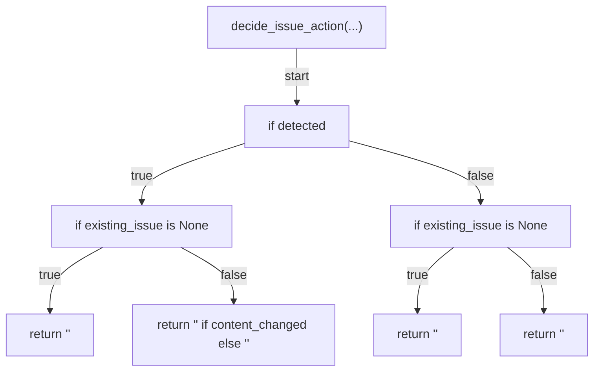

## render_summary_header(...)

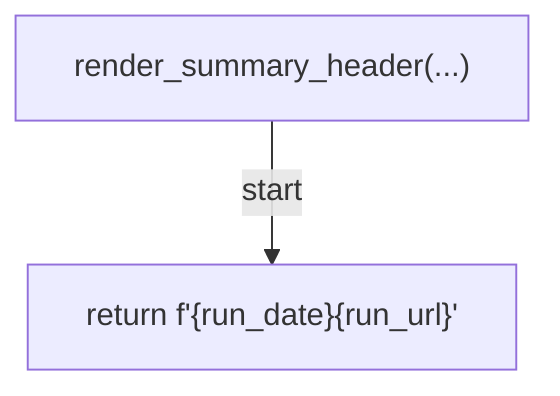

## render_sot_issue_header(...)

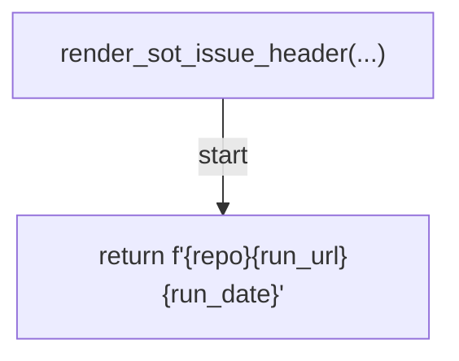

## render_status_row(...)

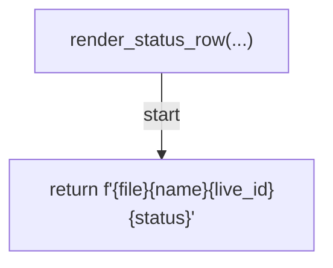

## render_diff_block(...)

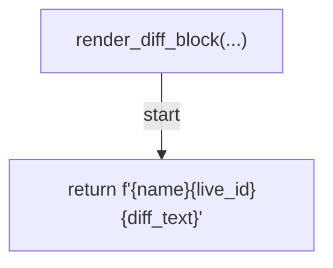

## render_sot_issue_remediation(...)

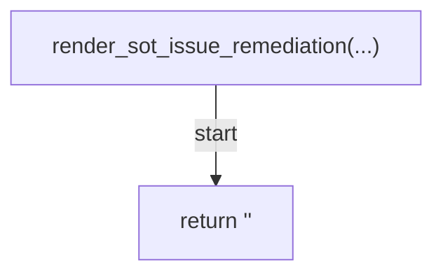

## render_unknown_summary_header(...)

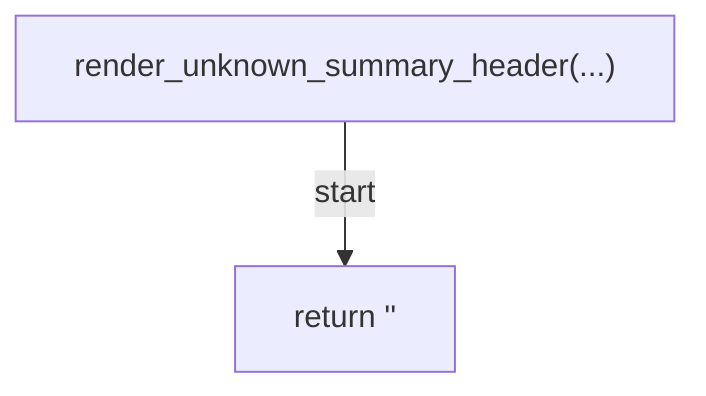

## render_unknown_table_header(...)

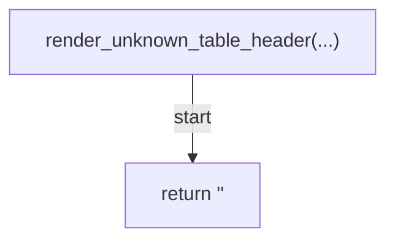

## render_unknown_row(...)

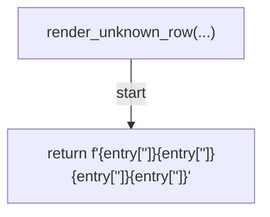

## render_unknown_issue_header(...)

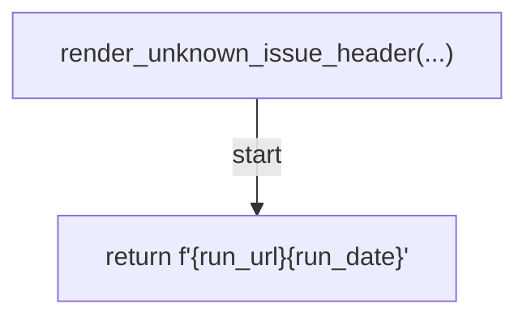

## render_unknown_issue_remediation(...)

```mermaid
flowchart TD
    N001["render_unknown_issue_remediation(...)"]
    N002["return f'<str>{repo}<str>'"]
    N001 -->|"start"| N002
```

## fetch_live_rulesets_list(...)

```mermaid
flowchart TD
    N001["fetch_live_rulesets_list(...)"]
    N002["request = Request(...)"]
    N003["add_header(...)"]
    N004["add_header(...)"]
    N005["add_header(...)"]
    N006["with opener(request) as response:     return json.loads(response.read().decode('<str>'))"]
    N007["end"]
    N001 -->|"start"| N002
    N002 --> N003
    N003 --> N004
    N004 --> N005
    N005 --> N006
    N006 --> N007
```

## fetch_live_ruleset(...)

```mermaid
flowchart TD
    N001["fetch_live_ruleset(...)"]
    N002["request = Request(...)"]
    N003["add_header(...)"]
    N004["add_header(...)"]
    N005["add_header(...)"]
    N006["with opener(request) as response:     return json.loads(response.read().decode('<str>'))"]
    N007["end"]
    N001 -->|"start"| N002
    N002 --> N003
    N003 --> N004
    N004 --> N005
    N005 --> N006
    N006 --> N007
```

## _run_gh(...)

```mermaid
flowchart TD
    N001["_run_gh(...)"]
    N002["return runner(cmd, capture_output=True, text=True, timeout=30, check=True)"]
    N001 -->|"start"| N002
```

## file_issue(...)

```mermaid
flowchart TD
    N001["file_issue(...)"]
    N002["cmd = ['<str>', '<str>', '<str>', '<str>', repo, '<str>', title, '<str>', str(body_file)]"]
    N003["for label in labels:     cmd.extend(['<str>', label])"]
    N004["_run_gh(...)"]
    N005["end"]
    N001 -->|"start"| N002
    N002 --> N003
    N003 --> N004
    N004 --> N005
```

## find_rolling_issue(...)

```mermaid
flowchart TD
    N001["find_rolling_issue(...)"]
    N002["result = _run_gh(...)"]
    N003["for issue in json.loads(result.stdout or '<str>'):     if issue.get('<str>') == title:         return {'<str>': int(issue['<str>']), '<str>': issue['<str>']}"]
    N004["return None"]
    N001 -->|"start"| N002
    N002 --> N003
    N003 --> N004
```

## fetch_issue_body(...)

```mermaid
flowchart TD
    N001["fetch_issue_body(...)"]
    N002["result = _run_gh(...)"]
    N003["return str(result.stdout)"]
    N001 -->|"start"| N002
    N002 --> N003
```

## comment_on_issue(...)

```mermaid
flowchart TD
    N001["comment_on_issue(...)"]
    N002["_run_gh(...)"]
    N003["end"]
    N001 -->|"start"| N002
    N002 --> N003
```

## close_issue_with_comment(...)

```mermaid
flowchart TD
    N001["close_issue_with_comment(...)"]
    N002["_run_gh(...)"]
    N003["end"]
    N001 -->|"start"| N002
    N002 --> N003
```

## detect(...)

```mermaid
flowchart TD
    N001["detect(...)"]
    N002["list_fn = list_fetcher or (lambda r, t: fetch_live_rulesets_list(r, t))"]
    N003["one_fn = ruleset_fetcher or (lambda r, i, t: fetch_live_ruleset(r, i, t))"]
    N004["live = list_fn(...)"]
    N005["sot_entries = []"]
    N006["sot_names = set(...)"]
    N007["for filename in sot_files:     path = sot_dir / filename     with path.open(encoding='<str>') as handle:         entry = json.load(handle)     sot_entries.append((filename, entry))     sot_names.add(entry['<str>'])"]
    N008["summary_chunks = [render_summary_header(run_date=run_date, run_url=run_url)]"]
    N009["sot_body_chunks = [render_sot_issue_header(run_date=run_date, run_url=run_url, repo=repo)]"]
    N010["diff_blocks = []"]
    N011["sot_rows = []"]
    N012["drift_count = 0"]
    N013["for filename, sot_entry in sot_entries:     name = sot_entry['<str>']     decision = classify(sot_entry, live)     if decision['<str>'] == '<str>':         ambiguous_row = render_status_row(file=filename, name=name, live_id='<str>', status='<str>')         summary_chunks.append(ambiguous_row)         _append(summary_file, '<str>'.join(summary_chunks))         raise RuntimeError(f'<str>{name}<str>{decision['<str>']}<str>')     if decision['<str>'] == '<str>':         row = render_status_row(file=filename, name=name, live_id='<str>', status='<str>')         summary_chunks.append(row)         sot_body_chunks.append(row)         sot_rows.append(row)         drift_count += 1         continue     live_id = int(decision['<str>'])     live_entry = one_fn(repo, live_id, token)     diff_text = diff_canonical(sot=sot_entry, live=live_entry, sot_path=f'<str>{filename}', live_path=f'<str>{filename}')     if not diff_text:         summary_chunks.append(render_status_row(file=filename, name=name, live_id=live_id, status='<str>'))         continue     row = render_status_row(file=filename, name=name, live_id=live_id, status='<str>')     summary_chunks.append(row)     sot_body_chunks.append(row)     sot_rows.append(row)     drift_count += 1     block = render_diff_block(name=name, live_id=live_id, diff_text=diff_text)     summary_chunks.append(block)     diff_blocks.append(block)"]
    N014["if drift_count > 0"]
    N015["append(...)"]
    N016["extend(...)"]
    N017["append(...)"]
    N018["unknown = find_unknown(...)"]
    N019["append(...)"]
    N020["if not unknown"]
    N021["append(...)"]
    N022["append(...)"]
    N023["extend(...)"]
    N024["_write(...)"]
    N025["if drift_count > 0"]
    N026["sot_hash = drift_hash(...)"]
    N027["_write(...)"]
    N028["if unknown"]
    N029["unknown_chunks = [render_unknown_issue_header(run_date=run_date, run_url=run_url)]"]
    N030["unknown_rows = [render_unknown_row(entry) for entry in unknown]"]
    N031["extend(...)"]
    N032["append(...)"]
    N033["unknown_hash = drift_hash(...)"]
    N034["_write(...)"]
    N035["return (drift_count, len(unknown))"]
    N001 -->|"start"| N002
    N002 --> N003
    N003 --> N004
    N004 --> N005
    N005 --> N006
    N006 --> N007
    N007 --> N008
    N008 --> N009
    N009 --> N010
    N010 --> N011
    N011 --> N012
    N012 --> N013
    N013 --> N014
    N014 -->|"true"| N015
    N015 --> N016
    N016 --> N017
    N017 --> N018
    N014 -->|"false"| N018
    N018 --> N019
    N019 --> N020
    N020 -->|"true"| N021
    N020 -->|"false"| N022
    N022 --> N023
    N021 --> N024
    N023 --> N024
    N024 --> N025
    N025 -->|"true"| N026
    N026 --> N027
    N027 --> N028
    N025 -->|"false"| N028
    N028 -->|"true"| N029
    N029 --> N030
    N030 --> N031
    N031 --> N032
    N032 --> N033
    N033 --> N034
    N034 --> N035
    N028 -->|"false"| N035
```

## reconcile(...)

```mermaid
flowchart TD
    N001["reconcile(...)"]
    N002["current_hash = extract_hash_marker(body_file.read_text(encoding='<str>')) if detected and body_file.exists() else None"]
    N003["existing = find_rolling_issue(...)"]
    N004["content_changed = True"]
    N005["if existing is not None and current_hash is not None"]
    N006["content_changed = extract_hash_marker(fetch_issue_body(repo, existing['<str>'])) != current_hash"]
    N007["action = decide_issue_action(...)"]
    N008["if action == 'create'"]
    N009["file_issue(...)"]
    N010["if action == 'append'"]
    N011["assert existing is not None"]
    N012["comment_on_issue(...)"]
    N013["if action == 'close'"]
    N014["assert existing is not None"]
    N015["close_issue_with_comment(...)"]
    N016["return action"]
    N001 -->|"start"| N002
    N002 --> N003
    N003 --> N004
    N004 --> N005
    N005 -->|"true"| N006
    N006 --> N007
    N005 -->|"false"| N007
    N007 --> N008
    N008 -->|"true"| N009
    N008 -->|"false"| N010
    N010 -->|"true"| N011
    N011 --> N012
    N010 -->|"false"| N013
    N013 -->|"true"| N014
    N014 --> N015
    N009 --> N016
    N012 --> N016
    N015 --> N016
    N013 -->|"false"| N016
```

## _cmd_detect(...)

```mermaid
flowchart TD
    N001["_cmd_detect(...)"]
    N002["token = get(...)"]
    N003["if not token"]
    N004["print(...)"]
    N005["return 1"]
    N006["run_date = args.run_date or _utc_today()"]
    N007["sot_files = tuple(args.sot_files) if args.sot_files else DEFAULT_SOT_FILES"]
    N008["(drift_count, unknown_count) = detect(...)"]
    N009["print(...)"]
    N010["print(...)"]
    N011["print(...)"]
    N012["return 0"]
    N001 -->|"start"| N002
    N002 --> N003
    N003 -->|"true"| N004
    N004 --> N005
    N003 -->|"false"| N006
    N006 --> N007
    N007 --> N008
    N008 --> N009
    N009 --> N010
    N010 --> N011
    N011 --> N012
```

## _parse_detected(...)

```mermaid
flowchart TD
    N001["_parse_detected(...)"]
    N002["if raw == 'true'"]
    N003["return True"]
    N004["if raw == 'false'"]
    N005["return False"]
    N006["raise ValueError(f'<str>{raw}')"]
    N001 -->|"start"| N002
    N002 -->|"true"| N003
    N002 -->|"false"| N004
    N004 -->|"true"| N005
    N004 -->|"false"| N006
```

## _cmd_reconcile(...)

```mermaid
flowchart TD
    N001["_cmd_reconcile(...)"]
    N002["(title, close_comment) = _RECONCILE_KINDS[args.kind]"]
    N003["action = reconcile(...)"]
    N004["print(...)"]
    N005["return 0"]
    N001 -->|"start"| N002
    N002 --> N003
    N003 --> N004
    N004 --> N005
```

## main(...)

```mermaid
flowchart TD
    N001["main(...)"]
    N002["parser = ArgumentParser(...)"]
    N003["sub = add_subparsers(...)"]
    N004["p_detect = add_parser(...)"]
    N005["add_argument(...)"]
    N006["add_argument(...)"]
    N007["add_argument(...)"]
    N008["add_argument(...)"]
    N009["add_argument(...)"]
    N010["add_argument(...)"]
    N011["add_argument(...)"]
    N012["add_argument(...)"]
    N013["set_defaults(...)"]
    N014["p_reconcile = add_parser(...)"]
    N015["add_argument(...)"]
    N016["add_argument(...)"]
    N017["add_argument(...)"]
    N018["add_argument(...)"]
    N019["set_defaults(...)"]
    N020["args = parse_args(...)"]
    N021["try"]
    N022["return args.func(args)"]
    N023["except (OSError, json.JSONDecodeError, RuntimeError, ValueError, subprocess.CalledProcessError)"]
    N024["print(...)"]
    N025["return 1"]
    N001 -->|"start"| N002
    N002 --> N003
    N003 --> N004
    N004 --> N005
    N005 --> N006
    N006 --> N007
    N007 --> N008
    N008 --> N009
    N009 --> N010
    N010 --> N011
    N011 --> N012
    N012 --> N013
    N013 --> N014
    N014 --> N015
    N015 --> N016
    N016 --> N017
    N017 --> N018
    N018 --> N019
    N019 --> N020
    N020 --> N021
    N021 -->|"try"| N022
    N021 -->|"raises"| N023
    N023 --> N024
    N024 --> N025
```

## _utc_today(...)

```mermaid
flowchart TD
    N001["_utc_today(...)"]
    N002["return _dt.datetime.now(_dt.UTC).strftime('<str>')"]
    N001 -->|"start"| N002
```

## _write(...)

```mermaid
flowchart TD
    N001["_write(...)"]
    N002["mkdir(...)"]
    N003["with path.open('<str>', encoding='<str>') as handle:     handle.write(content)"]
    N004["end"]
    N001 -->|"start"| N002
    N002 --> N003
    N003 --> N004
```

## _append(...)

```mermaid
flowchart TD
    N001["_append(...)"]
    N002["mkdir(...)"]
    N003["with path.open('<str>', encoding='<str>') as handle:     handle.write(content)"]
    N004["end"]
    N001 -->|"start"| N002
    N002 --> N003
    N003 --> N004
```
