# AST graph: scripts/rulesets_apply.py

This file is generated from `scripts/rulesets_apply.py` by `python3 scripts/script_ast_graph.py all-doc`. Do not edit it by hand: content under `docs/generated/scripts/` is owned by the post-merge automation (refs #1540) -- update the source script instead.

## select_targets(...)

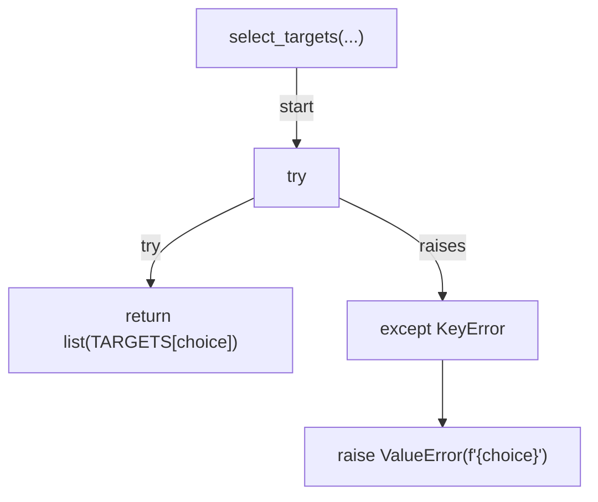
```mermaid
flowchart TD
    N001["select_targets(...)"]
    N002["try"]
    N003["return list(TARGETS[choice])"]
    N004["except KeyError"]
    N005["raise ValueError(f'<str>{choice}')"]
    N001 -->|"start"| N002
    N002 -->|"try"| N003
    N002 -->|"raises"| N004
    N004 --> N005
```

## decide_action(...)

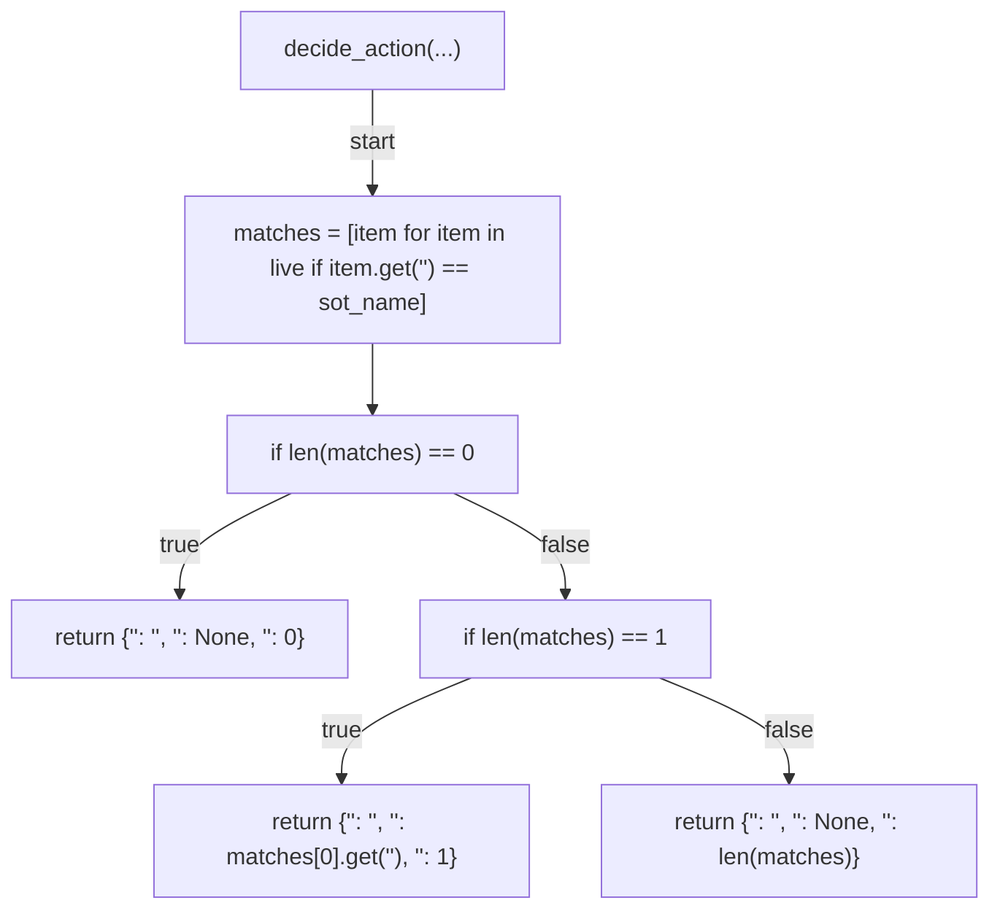
```mermaid
flowchart TD
    N001["decide_action(...)"]
    N002["matches = [item for item in live if item.get('<str>') == sot_name]"]
    N003["if len(matches) == 0"]
    N004["return {'<str>': '<str>', '<str>': None, '<str>': 0}"]
    N005["if len(matches) == 1"]
    N006["return {'<str>': '<str>', '<str>': matches[0].get('<str>'), '<str>': 1}"]
    N007["return {'<str>': '<str>', '<str>': None, '<str>': len(matches)}"]
    N001 -->|"start"| N002
    N002 --> N003
    N003 -->|"true"| N004
    N003 -->|"false"| N005
    N005 -->|"true"| N006
    N005 -->|"false"| N007
```

## canonical_projection(...)

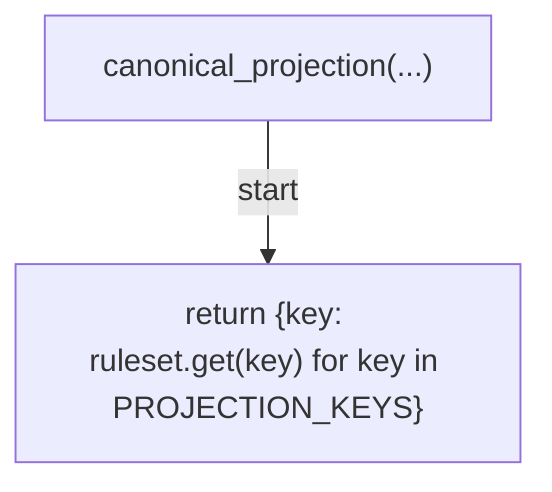
```mermaid
flowchart TD
    N001["canonical_projection(...)"]
    N002["return {key: ruleset.get(key) for key in PROJECTION_KEYS}"]
    N001 -->|"start"| N002
```

## render_diff_section(...)

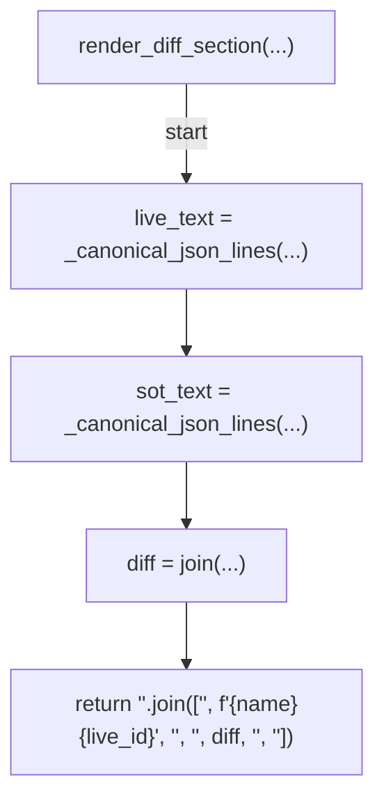
```mermaid
flowchart TD
    N001["render_diff_section(...)"]
    N002["live_text = _canonical_json_lines(...)"]
    N003["sot_text = _canonical_json_lines(...)"]
    N004["diff = join(...)"]
    N005["return '<str>'.join(['<str>', f'<str>{name}<str>{live_id}<str>', '<str>', '<str>', diff, '<str>', '<str>'])"]
    N001 -->|"start"| N002
    N002 --> N003
    N003 --> N004
    N004 --> N005
```

## render_summary_row(...)

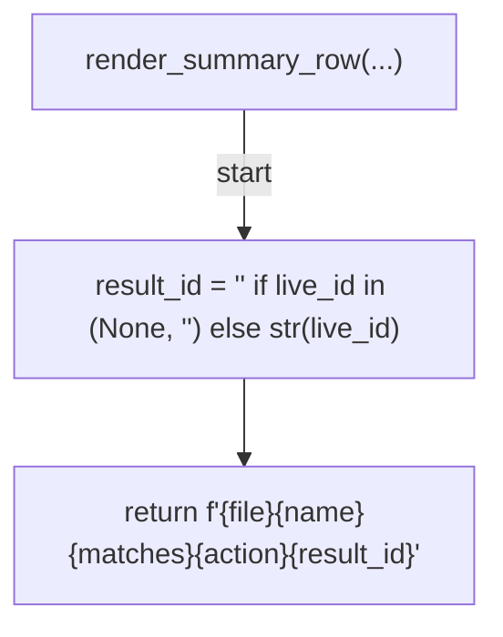
```mermaid
flowchart TD
    N001["render_summary_row(...)"]
    N002["result_id = '<str>' if live_id in (None, '<str>') else str(live_id)"]
    N003["return f'<str>{file}<str>{name}<str>{matches}<str>{action}<str>{result_id}<str>'"]
    N001 -->|"start"| N002
    N002 --> N003
```

## fetch_live_rulesets(...)

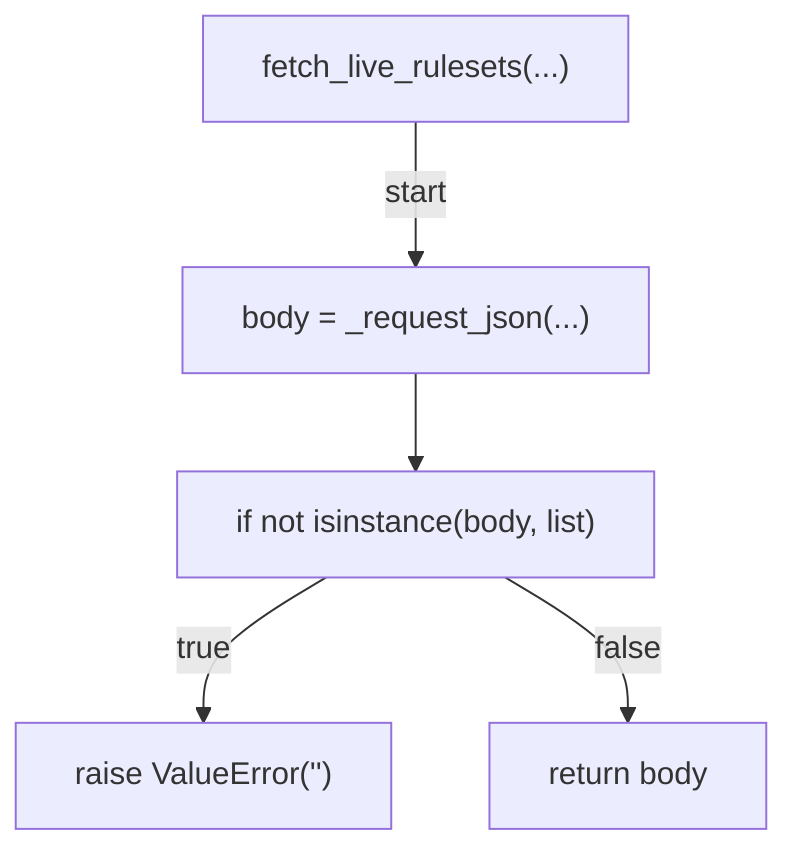
```mermaid
flowchart TD
    N001["fetch_live_rulesets(...)"]
    N002["body = _request_json(...)"]
    N003["if not isinstance(body, list)"]
    N004["raise ValueError('<str>')"]
    N005["return body"]
    N001 -->|"start"| N002
    N002 --> N003
    N003 -->|"true"| N004
    N003 -->|"false"| N005
```

## fetch_live_ruleset(...)

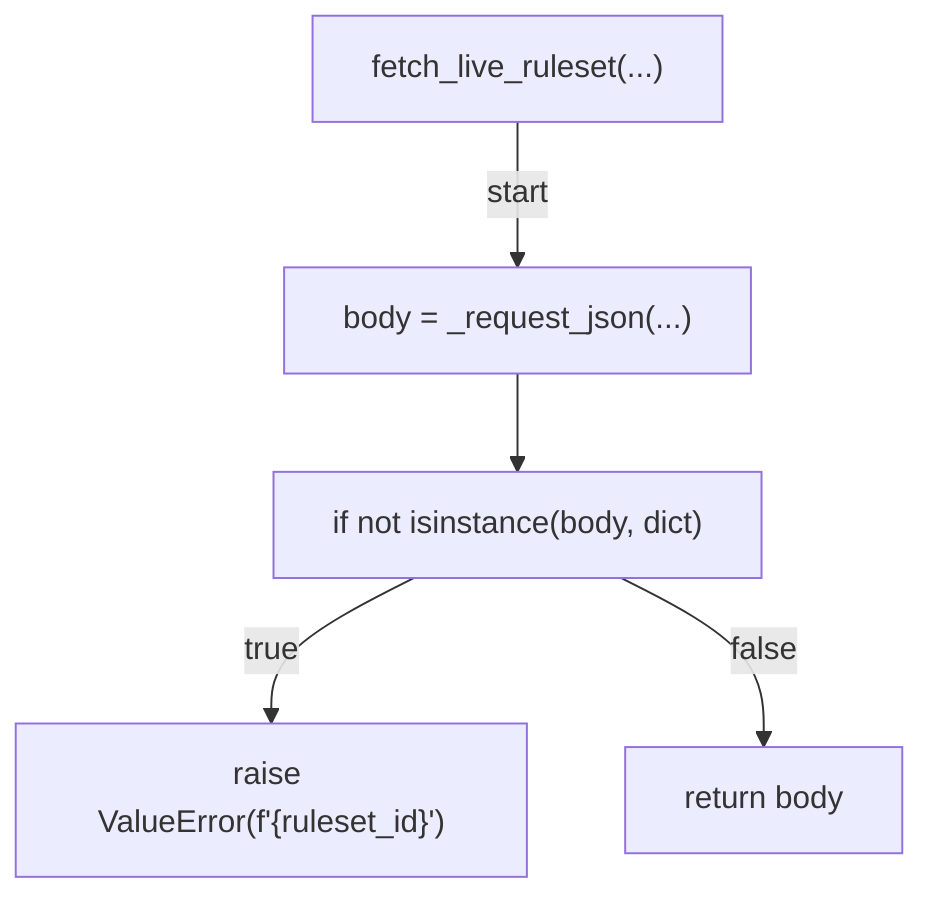
```mermaid
flowchart TD
    N001["fetch_live_ruleset(...)"]
    N002["body = _request_json(...)"]
    N003["if not isinstance(body, dict)"]
    N004["raise ValueError(f'<str>{ruleset_id}<str>')"]
    N005["return body"]
    N001 -->|"start"| N002
    N002 --> N003
    N003 -->|"true"| N004
    N003 -->|"false"| N005
```

## apply_call(...)

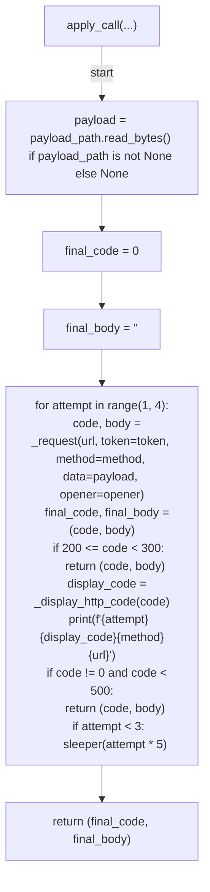
```mermaid
flowchart TD
    N001["apply_call(...)"]
    N002["payload = payload_path.read_bytes() if payload_path is not None else None"]
    N003["final_code = 0"]
    N004["final_body = '<str>'"]
    N005["for attempt in range(1, 4):
    code, body = _request(url, token=token, method=method, data=payload, opener=opener)
    final_code, final_body = (code, body)
    if 200 <= code < 300:
        return (code, body)
    display_code = _display_http_code(code)
    print(f'<str>{attempt}<str>{display_code}<str>{method}<str>{url}')
    if code != 0 and code < 500:
        return (code, body)
    if attempt < 3:
        sleeper(attempt * 5)"]
    N006["return (final_code, final_body)"]
    N001 -->|"start"| N002
    N002 --> N003
    N003 --> N004
    N004 --> N005
    N005 --> N006
```

## get_repo_setting(...)

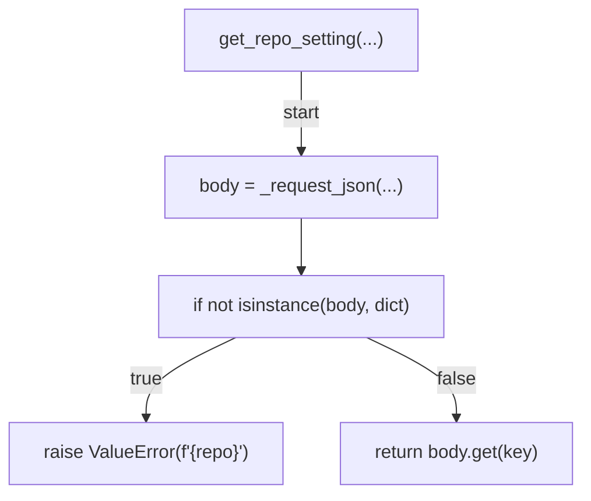
```mermaid
flowchart TD
    N001["get_repo_setting(...)"]
    N002["body = _request_json(...)"]
    N003["if not isinstance(body, dict)"]
    N004["raise ValueError(f'<str>{repo}<str>')"]
    N005["return body.get(key)"]
    N001 -->|"start"| N002
    N002 --> N003
    N003 -->|"true"| N004
    N003 -->|"false"| N005
```

## patch_repo_setting(...)

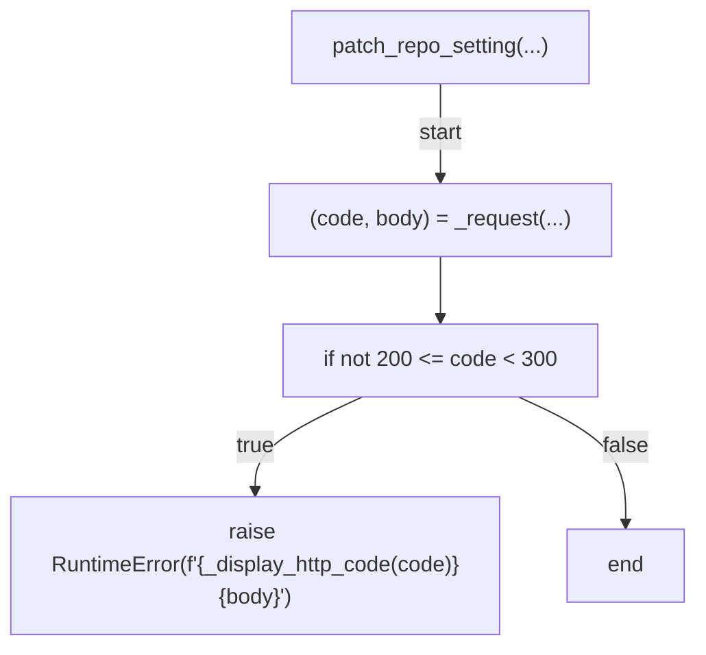
```mermaid
flowchart TD
    N001["patch_repo_setting(...)"]
    N002["(code, body) = _request(...)"]
    N003["if not 200 <= code < 300"]
    N004["raise RuntimeError(f'<str>{_display_http_code(code)}<str>{body}')"]
    N005["end"]
    N001 -->|"start"| N002
    N002 --> N003
    N003 -->|"true"| N004
    N003 -->|"false"| N005
```

## render_dispatch_header(...)

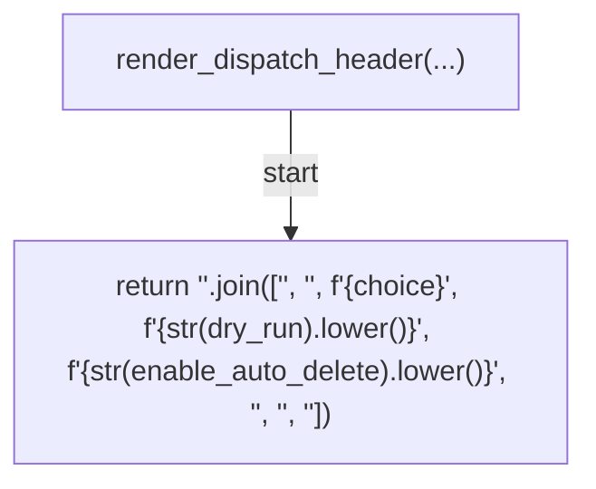
```mermaid
flowchart TD
    N001["render_dispatch_header(...)"]
    N002["return '<str>'.join(['<str>', '<str>', f'<str>{choice}<str>', f'<str>{str(dry_run).lower()}<str>', f'<str>{str(enable_auto_delete).lower()}<str>', '<str>', '<str>', '<str>'])"]
    N001 -->|"start"| N002
```

## plan_rulesets(...)

```mermaid
flowchart TD
    N001["plan_rulesets(...)"]
    N002["targets = select_targets(...)"]
    N003["live_rulesets = fetch_live_rulesets(...)"]
    N004["rows = [_dispatch_header_for(choice, dry_run, enable_auto_delete)]"]
    N005["planned = []"]
    N006["for file in targets:
    item, detail_rows = _plan_one_ruleset(file=file, repo=repo, sot_dir=sot_dir, live_rulesets=live_rulesets, token=token, opener=opener, pending_rows=rows, summary_file=summary_file)
    rows.extend(detail_rows)
    if dry_run:
        rows.append(render_summary_row(file, str(item['<str>']), int(item['<str>']), f\"<str>{item['<str>']}<str>\", item['<str>']))
    planned.append(item)"]
    N007["_append_summary(...)"]
    N008["return planned"]
    N001 -->|"start"| N002
    N002 --> N003
    N003 --> N004
    N004 --> N005
    N005 --> N006
    N006 --> N007
    N007 --> N008
```

## apply_rulesets(...)

```mermaid
flowchart TD
    N001["apply_rulesets(...)"]
    N002["targets = select_targets(...)"]
    N003["live_rulesets = fetch_live_rulesets(...)"]
    N004["_append_summary(...)"]
    N005["for file in targets:
    item, detail_rows = _plan_one_ruleset(file=file, repo=repo, sot_dir=sot_dir, live_rulesets=live_rulesets, token=token, opener=opener, pending_rows=[], summary_file=summary_file)
    if detail_rows:
        _append_summary(summary_file, detail_rows)
    action = str(item['<str>'])
    url = f'{API_ROOT}<str>{repo}<str>'
    if action == '<str>':
        url = f\"{url}<str>{item['<str>']}\"
    code, body = apply_call(method=action, url=url, payload_path=item['<str>'], token=token, opener=opener, sleeper=sleeper)
    if not 200 <= code < 300:
        display_code = _display_http_code(code)
        _append_summary(summary_file, ['<str>', f\"<str>{item['<str>']}<str>{display_code}<str>\", '<str>', body, '<str>'])
        print(f\"<str>{action}<str>{item['<str>']}<str>{display_code}<str>\")
        raise SystemExit(1)
    response = json.loads(body or '<str>')
    _append_summary(summary_file, [render_summary_row(str(item['<str>']), str(item['<str>']), int(item['<str>']), f'{action}<str>', response.get('<str>'))])"]
    N006["end"]
    N001 -->|"start"| N002
    N002 --> N003
    N003 --> N004
    N004 --> N005
    N005 --> N006
```

## auto_delete(...)

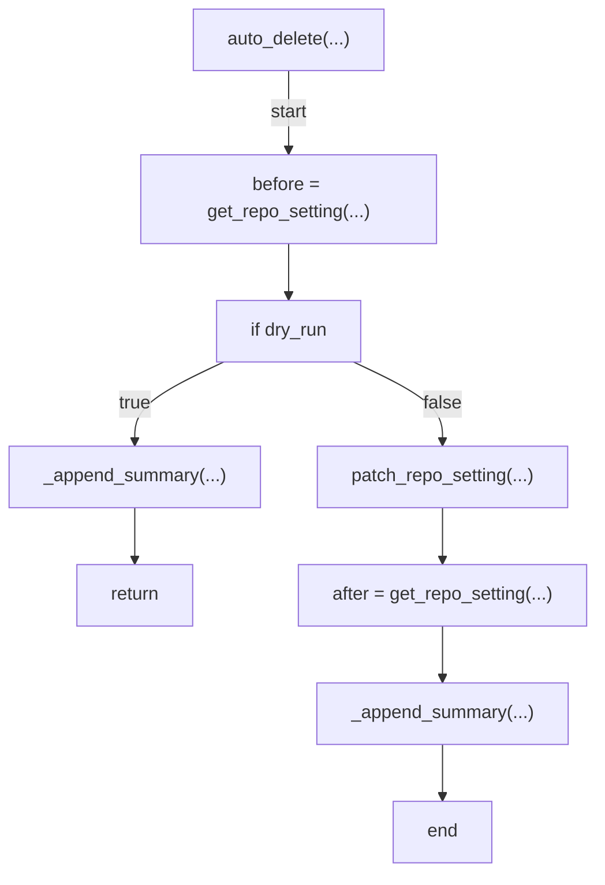
```mermaid
flowchart TD
    N001["auto_delete(...)"]
    N002["before = get_repo_setting(...)"]
    N003["if dry_run"]
    N004["_append_summary(...)"]
    N005["return"]
    N006["patch_repo_setting(...)"]
    N007["after = get_repo_setting(...)"]
    N008["_append_summary(...)"]
    N009["end"]
    N001 -->|"start"| N002
    N002 --> N003
    N003 -->|"true"| N004
    N004 --> N005
    N003 -->|"false"| N006
    N006 --> N007
    N007 --> N008
    N008 --> N009
```

## workflow_permissions_projection(...)

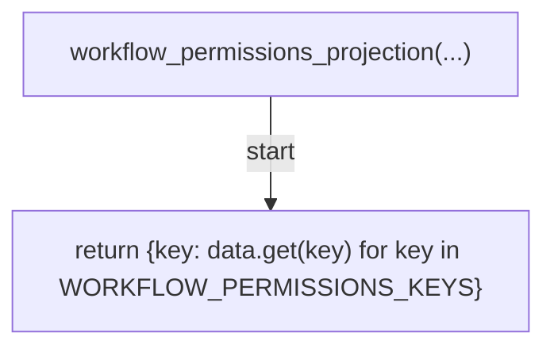
```mermaid
flowchart TD
    N001["workflow_permissions_projection(...)"]
    N002["return {key: data.get(key) for key in WORKFLOW_PERMISSIONS_KEYS}"]
    N001 -->|"start"| N002
```

## get_workflow_permissions(...)

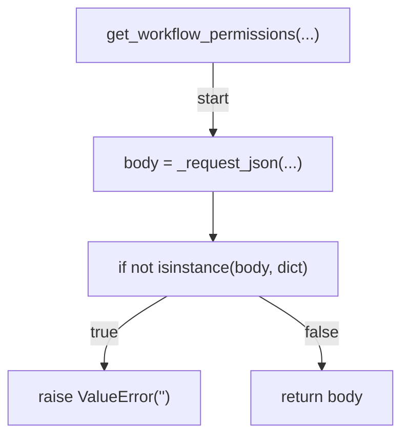
```mermaid
flowchart TD
    N001["get_workflow_permissions(...)"]
    N002["body = _request_json(...)"]
    N003["if not isinstance(body, dict)"]
    N004["raise ValueError('<str>')"]
    N005["return body"]
    N001 -->|"start"| N002
    N002 --> N003
    N003 -->|"true"| N004
    N003 -->|"false"| N005
```

## set_workflow_permissions(...)

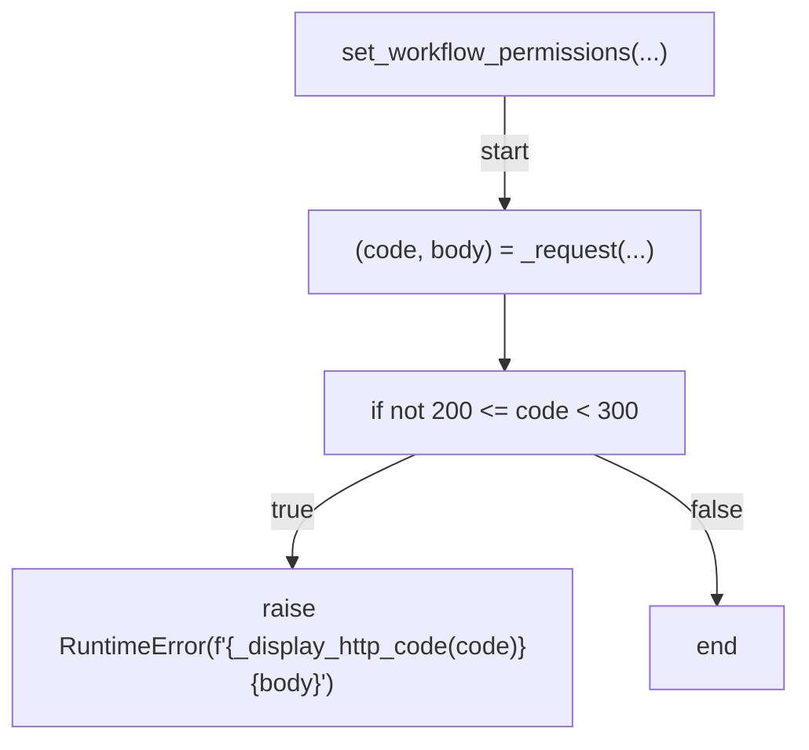
```mermaid
flowchart TD
    N001["set_workflow_permissions(...)"]
    N002["(code, body) = _request(...)"]
    N003["if not 200 <= code < 300"]
    N004["raise RuntimeError(f'<str>{_display_http_code(code)}<str>{body}')"]
    N005["end"]
    N001 -->|"start"| N002
    N002 --> N003
    N003 -->|"true"| N004
    N003 -->|"false"| N005
```

## workflow_permissions_diff(...)

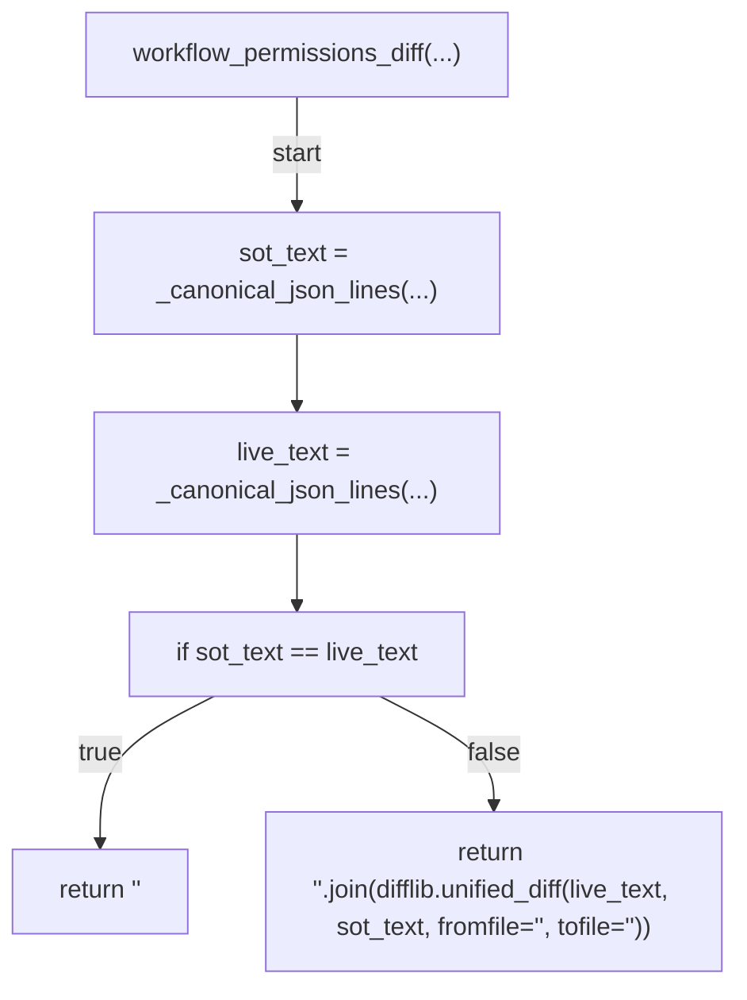
```mermaid
flowchart TD
    N001["workflow_permissions_diff(...)"]
    N002["sot_text = _canonical_json_lines(...)"]
    N003["live_text = _canonical_json_lines(...)"]
    N004["if sot_text == live_text"]
    N005["return '<str>'"]
    N006["return '<str>'.join(difflib.unified_diff(live_text, sot_text, fromfile='<str>', tofile='<str>'))"]
    N001 -->|"start"| N002
    N002 --> N003
    N003 --> N004
    N004 -->|"true"| N005
    N004 -->|"false"| N006
```

## apply_workflow_permissions(...)

```mermaid
flowchart TD
    N001["apply_workflow_permissions(...)"]
    N002["if mode not in ('plan', 'apply', 'drift')"]
    N003["raise ValueError(f'<str>{mode}')"]
    N004["sot = _read_workflow_permissions_sot(...)"]
    N005["live = get_workflow_permissions(...)"]
    N006["diff = workflow_permissions_diff(...)"]
    N007["proj_sot = workflow_permissions_projection(...)"]
    N008["proj_live = workflow_permissions_projection(...)"]
    N009["lines = ['<str>', f'<str>{mode}<str>', f'<str>{sot_path}<str>', f\"<str>{('<str>' if diff else '<str>')}<str>\"]"]
    N010["for key in WORKFLOW_PERMISSIONS_KEYS:
    lines.append(f'<str>{key}<str>{_json_scalar(proj_live[key])}<str>{_json_scalar(proj_sot[key])}<str>')"]
    N011["if diff"]
    N012["extend(...)"]
    N013["if mode in ('plan', 'drift')"]
    N014["_append_summary(...)"]
    N015["return 1 if mode == '<str>' and diff else 0"]
    N016["if not diff"]
    N017["append(...)"]
    N018["_append_summary(...)"]
    N019["return 0"]
    N020["set_workflow_permissions(...)"]
    N021["after = workflow_permissions_projection(...)"]
    N022["extend(...)"]
    N023["for key in WORKFLOW_PERMISSIONS_KEYS:
    lines.append(f'<str>{key}<str>{_json_scalar(after[key])}<str>')"]
    N024["_append_summary(...)"]
    N025["return 0"]
    N001 -->|"start"| N002
    N002 -->|"true"| N003
    N002 -->|"false"| N004
    N004 --> N005
    N005 --> N006
    N006 --> N007
    N007 --> N008
    N008 --> N009
    N009 --> N010
    N010 --> N011
    N011 -->|"true"| N012
    N012 --> N013
    N011 -->|"false"| N013
    N013 -->|"true"| N014
    N014 --> N015
    N013 -->|"false"| N016
    N016 -->|"true"| N017
    N017 --> N018
    N018 --> N019
    N016 -->|"false"| N020
    N020 --> N021
    N021 --> N022
    N022 --> N023
    N023 --> N024
    N024 --> N025
```

## _read_workflow_permissions_sot(...)

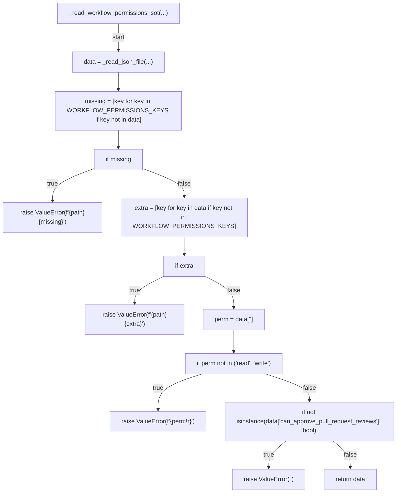
```mermaid
flowchart TD
    N001["_read_workflow_permissions_sot(...)"]
    N002["data = _read_json_file(...)"]
    N003["missing = [key for key in WORKFLOW_PERMISSIONS_KEYS if key not in data]"]
    N004["if missing"]
    N005["raise ValueError(f'{path}<str>{missing}')"]
    N006["extra = [key for key in data if key not in WORKFLOW_PERMISSIONS_KEYS]"]
    N007["if extra"]
    N008["raise ValueError(f'{path}<str>{extra}')"]
    N009["perm = data['<str>']"]
    N010["if perm not in ('read', 'write')"]
    N011["raise ValueError(f'<str>{perm!r}')"]
    N012["if not isinstance(data['can_approve_pull_request_reviews'], bool)"]
    N013["raise ValueError('<str>')"]
    N014["return data"]
    N001 -->|"start"| N002
    N002 --> N003
    N003 --> N004
    N004 -->|"true"| N005
    N004 -->|"false"| N006
    N006 --> N007
    N007 -->|"true"| N008
    N007 -->|"false"| N009
    N009 --> N010
    N010 -->|"true"| N011
    N010 -->|"false"| N012
    N012 -->|"true"| N013
    N012 -->|"false"| N014
```

## _dispatch_header_for(...)

```mermaid
flowchart TD
    N001["_dispatch_header_for(...)"]
    N002["return render_dispatch_header(choice=choice, dry_run=dry_run, enable_auto_delete=enable_auto_delete)"]
    N001 -->|"start"| N002
```

## _plan_one_ruleset(...)

```mermaid
flowchart TD
    N001["_plan_one_ruleset(...)"]
    N002["path = sot_dir / file"]
    N003["sot = _read_json_file(...)"]
    N004["name = str(...)"]
    N005["decision = decide_action(...)"]
    N006["match_count = int(...)"]
    N007["action = str(...)"]
    N008["live_id = decision['<str>']"]
    N009["if action == 'ambiguous'"]
    N010["append(...)"]
    N011["_append_summary(...)"]
    N012["print(...)"]
    N013["raise SystemExit(1)"]
    N014["rows = []"]
    N015["if action == 'PUT'"]
    N016["live = fetch_live_ruleset(...)"]
    N017["append(...)"]
    N018["return ({'<str>': file, '<str>': path, '<str>': name, '<str>': match_count, '<str>': action, '<str>': live_id}, rows)"]
    N001 -->|"start"| N002
    N002 --> N003
    N003 --> N004
    N004 --> N005
    N005 --> N006
    N006 --> N007
    N007 --> N008
    N008 --> N009
    N009 -->|"true"| N010
    N010 --> N011
    N011 --> N012
    N012 --> N013
    N009 -->|"false"| N014
    N014 --> N015
    N015 -->|"true"| N016
    N016 --> N017
    N017 --> N018
    N015 -->|"false"| N018
```

## _canonical_json_lines(...)

```mermaid
flowchart TD
    N001["_canonical_json_lines(...)"]
    N002["text = json.dumps(value, indent=2, sort_keys=True) + '<str>'"]
    N003["return text.splitlines(keepends=True)"]
    N001 -->|"start"| N002
    N002 --> N003
```

## _read_json_file(...)

```mermaid
flowchart TD
    N001["_read_json_file(...)"]
    N002["with path.open(encoding='<str>') as fp:
    body = json.load(fp)"]
    N003["if not isinstance(body, dict)"]
    N004["raise ValueError(f'{path}<str>')"]
    N005["return body"]
    N001 -->|"start"| N002
    N002 --> N003
    N003 -->|"true"| N004
    N003 -->|"false"| N005
```

## _append_summary(...)

```mermaid
flowchart TD
    N001["_append_summary(...)"]
    N002["mkdir(...)"]
    N003["with path.open('<str>', encoding='<str>') as fp:
    for line in lines:
        fp.write(line)
        fp.write('<str>')"]
    N004["end"]
    N001 -->|"start"| N002
    N002 --> N003
    N003 --> N004
```

## _request_json(...)

```mermaid
flowchart TD
    N001["_request_json(...)"]
    N002["(code, body) = _request(...)"]
    N003["if not 200 <= code < 300"]
    N004["raise RuntimeError(f'<str>{url}<str>{_display_http_code(code)}<str>{body}')"]
    N005["return json.loads(body)"]
    N001 -->|"start"| N002
    N002 --> N003
    N003 -->|"true"| N004
    N003 -->|"false"| N005
```

## _request(...)

```mermaid
flowchart TD
    N001["_request(...)"]
    N002["headers = {'<str>': f'<str>{token}', '<str>': '<str>', '<str>': API_VERSION}"]
    N003["if data is not None"]
    N004["headers['<str>'] = '<str>'"]
    N005["request = Request(...)"]
    N006["try"]
    N007["response = opener(...)"]
    N008["return (_response_status(response), _response_body(response))"]
    N009["except urllib.error.HTTPError"]
    N010["return (int(exc.code), exc.read().decode('<str>', errors='<str>'))"]
    N011["except urllib.error.URLError"]
    N012["return (0, str(exc.reason))"]
    N001 -->|"start"| N002
    N002 --> N003
    N003 -->|"true"| N004
    N004 --> N005
    N003 -->|"false"| N005
    N005 --> N006
    N006 -->|"try"| N007
    N007 --> N008
    N006 -->|"raises"| N009
    N009 --> N010
    N006 -->|"raises"| N011
    N011 --> N012
```

## _response_status(...)

```mermaid
flowchart TD
    N001["_response_status(...)"]
    N002["status = getattr(response, '<str>', None) or getattr(response, '<str>', None)"]
    N003["if status is None and hasattr(response, 'getcode')"]
    N004["status = getcode(...)"]
    N005["if status is None"]
    N006["return 0"]
    N007["return int(status)"]
    N001 -->|"start"| N002
    N002 --> N003
    N003 -->|"true"| N004
    N004 --> N005
    N003 -->|"false"| N005
    N005 -->|"true"| N006
    N005 -->|"false"| N007
```

## _response_body(...)

```mermaid
flowchart TD
    N001["_response_body(...)"]
    N002["try"]
    N003["data = read(...)"]
    N004["close = getattr(...)"]
    N005["if close is not None"]
    N006["close(...)"]
    N007["return data.decode('<str>', errors='<str>')"]
    N001 -->|"start"| N002
    N002 -->|"try"| N003
    N003 --> N004
    N004 --> N005
    N005 -->|"true"| N006
    N006 --> N007
    N005 -->|"false"| N007
```

## _display_http_code(...)

```mermaid
flowchart TD
    N001["_display_http_code(...)"]
    N002["return '<str>' if code == 0 else str(code)"]
    N001 -->|"start"| N002
```

## _json_scalar(...)

```mermaid
flowchart TD
    N001["_json_scalar(...)"]
    N002["return json.dumps(value)"]
    N001 -->|"start"| N002
```

## _env_token(...)

```mermaid
flowchart TD
    N001["_env_token(...)"]
    N002["import os"]
    N003["token = get(...)"]
    N004["if not token"]
    N005["print(...)"]
    N006["raise SystemExit(1)"]
    N007["return token"]
    N001 -->|"start"| N002
    N002 --> N003
    N003 --> N004
    N004 -->|"true"| N005
    N005 --> N006
    N004 -->|"false"| N007
```

## main(...)

```mermaid
flowchart TD
    N001["main(...)"]
    N002["parser = ArgumentParser(...)"]
    N003["sub = add_subparsers(...)"]
    N004["common = ArgumentParser(...)"]
    N005["add_argument(...)"]
    N006["add_argument(...)"]
    N007["ruleset_common = ArgumentParser(...)"]
    N008["add_argument(...)"]
    N009["add_argument(...)"]
    N010["add_argument(...)"]
    N011["plan = add_parser(...)"]
    N012["set_defaults(...)"]
    N013["apply = add_parser(...)"]
    N014["set_defaults(...)"]
    N015["auto = add_parser(...)"]
    N016["add_argument(...)"]
    N017["set_defaults(...)"]
    N018["wfperm = add_parser(...)"]
    N019["add_argument(...)"]
    N020["add_argument(...)"]
    N021["set_defaults(...)"]
    N022["args = parse_args(...)"]
    N023["try"]
    N024["func(...)"]
    N025["except ValueError"]
    N026["print(...)"]
    N027["return 1"]
    N028["except SystemExit"]
    N029["return int(exc.code or 0)"]
    N030["return 0"]
    N001 -->|"start"| N002
    N002 --> N003
    N003 --> N004
    N004 --> N005
    N005 --> N006
    N006 --> N007
    N007 --> N008
    N008 --> N009
    N009 --> N010
    N010 --> N011
    N011 --> N012
    N012 --> N013
    N013 --> N014
    N014 --> N015
    N015 --> N016
    N016 --> N017
    N017 --> N018
    N018 --> N019
    N019 --> N020
    N020 --> N021
    N021 --> N022
    N022 --> N023
    N023 -->|"try"| N024
    N023 -->|"raises"| N025
    N025 --> N026
    N026 --> N027
    N023 -->|"raises"| N028
    N028 --> N029
    N024 --> N030
```

## _cmd_plan(...)

```mermaid
flowchart TD
    N001["_cmd_plan(...)"]
    N002["plan_rulesets(...)"]
    N003["end"]
    N001 -->|"start"| N002
    N002 --> N003
```

## _cmd_apply(...)

```mermaid
flowchart TD
    N001["_cmd_apply(...)"]
    N002["apply_rulesets(...)"]
    N003["end"]
    N001 -->|"start"| N002
    N002 --> N003
```

## _cmd_auto_delete(...)

```mermaid
flowchart TD
    N001["_cmd_auto_delete(...)"]
    N002["auto_delete(...)"]
    N003["end"]
    N001 -->|"start"| N002
    N002 --> N003
```

## _cmd_workflow_permissions(...)

```mermaid
flowchart TD
    N001["_cmd_workflow_permissions(...)"]
    N002["rc = apply_workflow_permissions(...)"]
    N003["if rc != 0"]
    N004["raise SystemExit(rc)"]
    N005["end"]
    N001 -->|"start"| N002
    N002 --> N003
    N003 -->|"true"| N004
    N003 -->|"false"| N005
```
