# AST graph: scripts/sanitize_history.py

This file is generated from `scripts/sanitize_history.py` by `python3 scripts/script_ast_graph.py all-doc`. Do not edit it by hand: content under `docs/generated/scripts/` is owned by the post-merge automation (refs #1540); update the source script instead.

## sha256_hex(...)

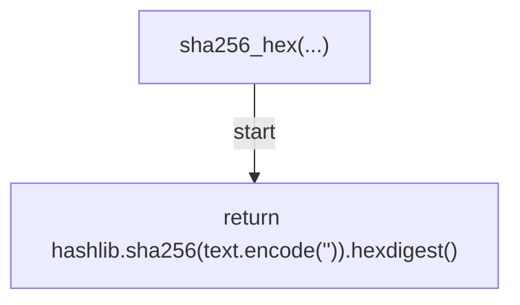

## load_translations(...)

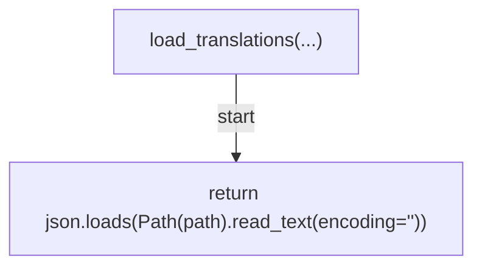

## load_backup(...)

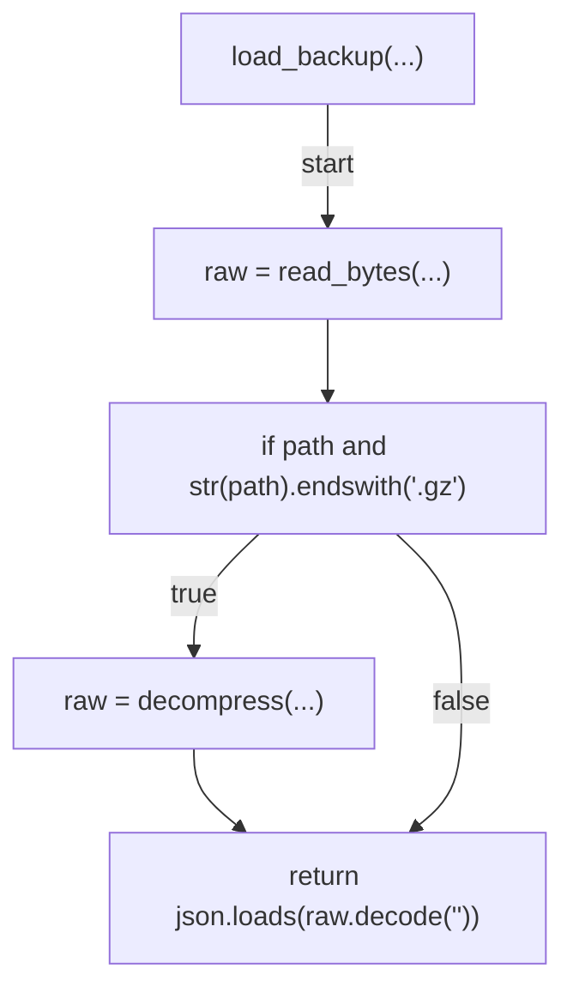

## index_backup(...)

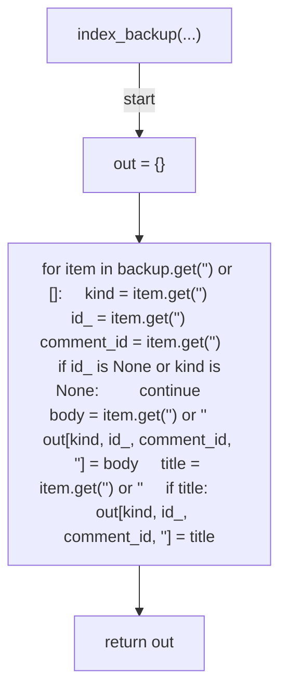

## item_endpoint(...)

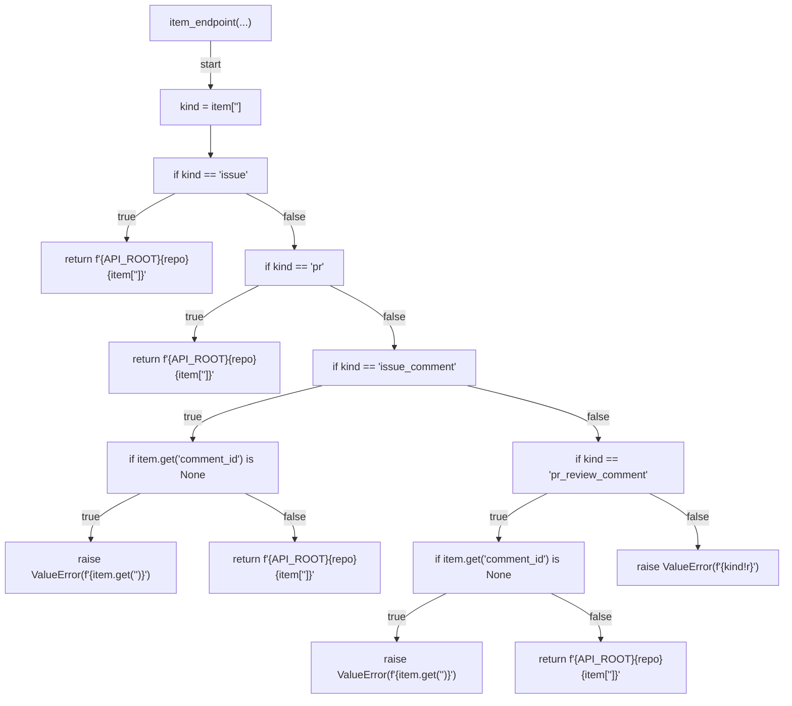

## is_excluded(...)

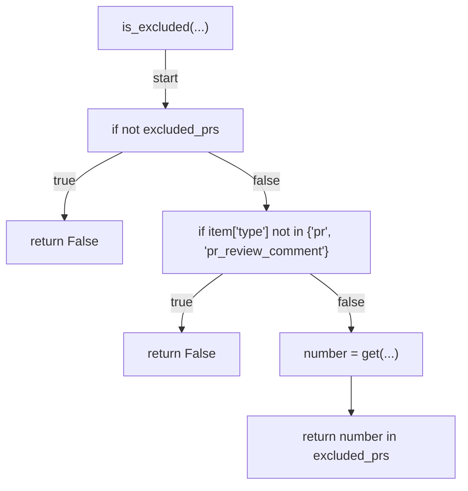

## classify_drift(...)

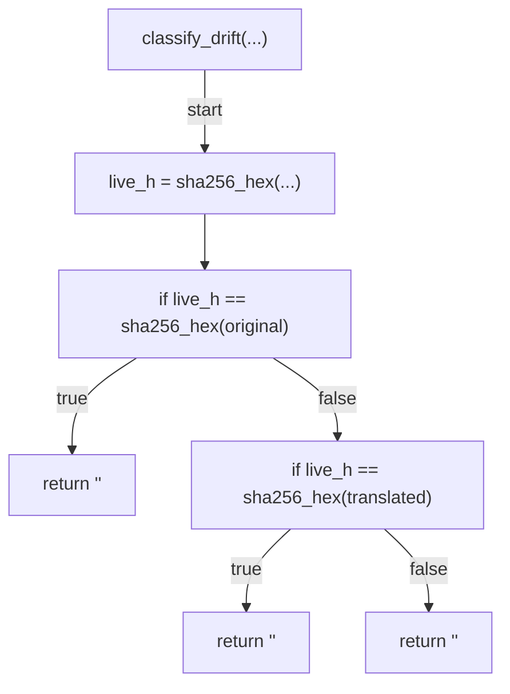

## parse_exclude_prs(...)

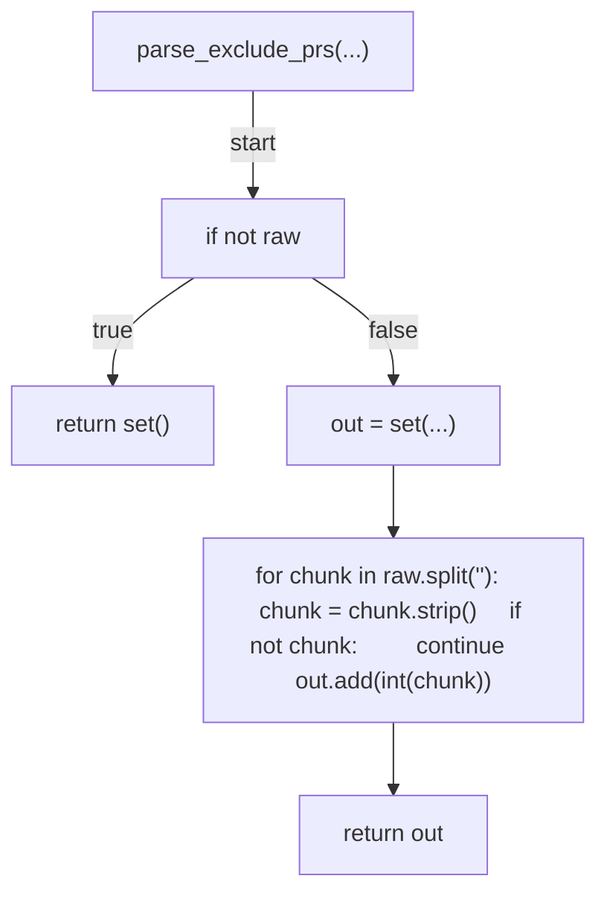

## fetch_live_field(...)

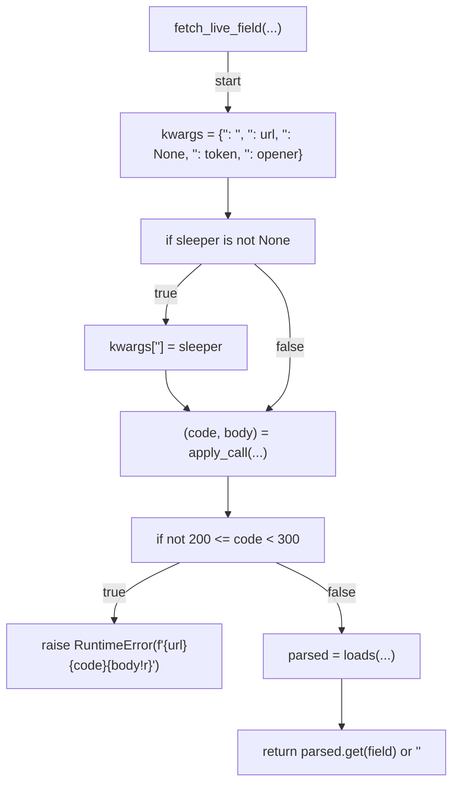

## patch_field(...)

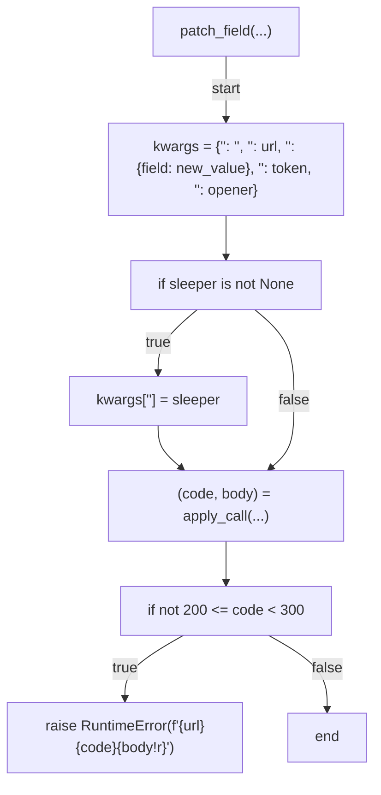

## iter_actionable(...)

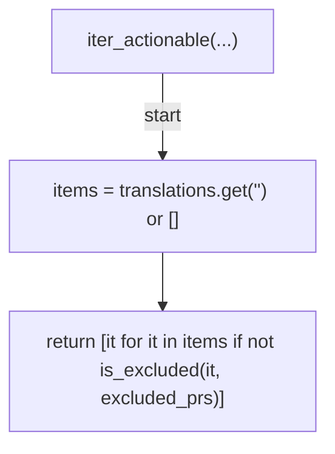

## run_apply(...)

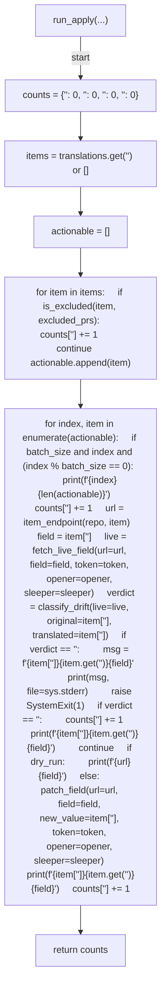

## run_plan(...)

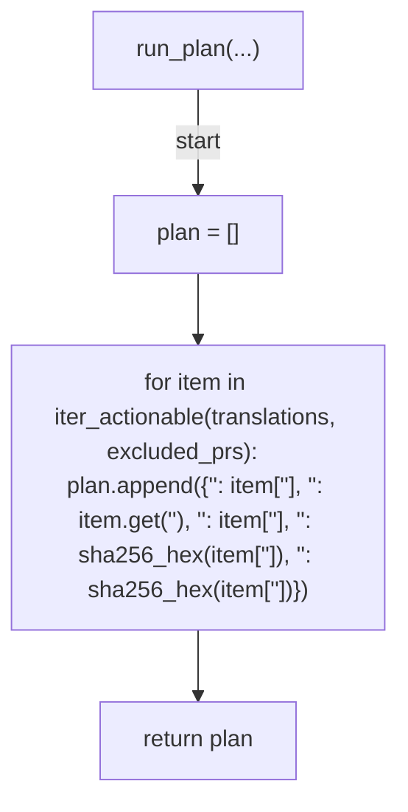

## cmd_plan(...)

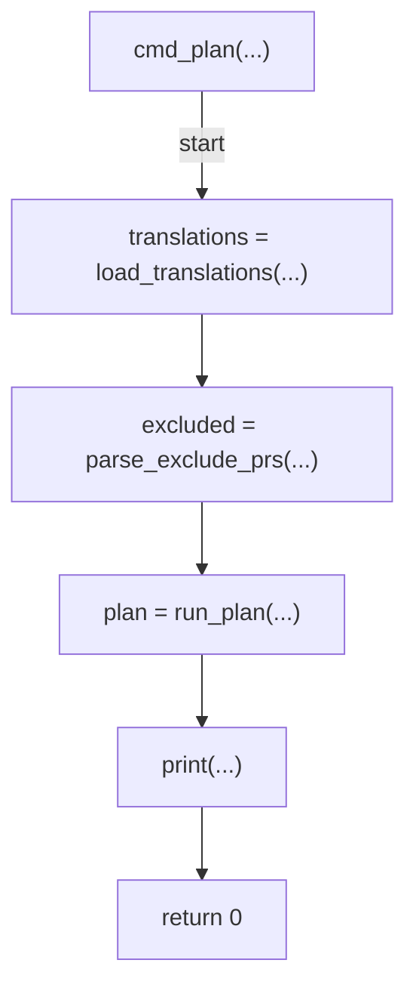

## cmd_apply(...)

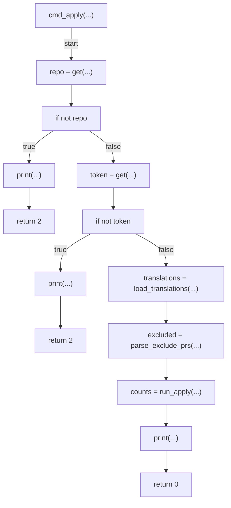

## cmd_restore(...)

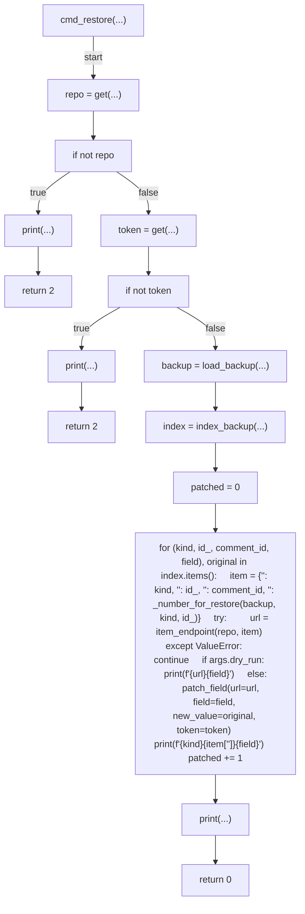

## _number_for_restore(...)

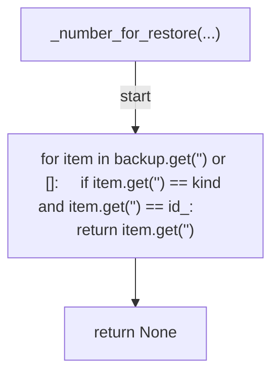

## build_parser(...)

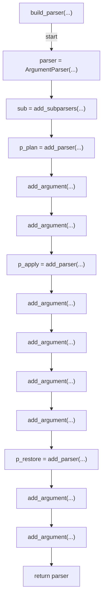

## main(...)

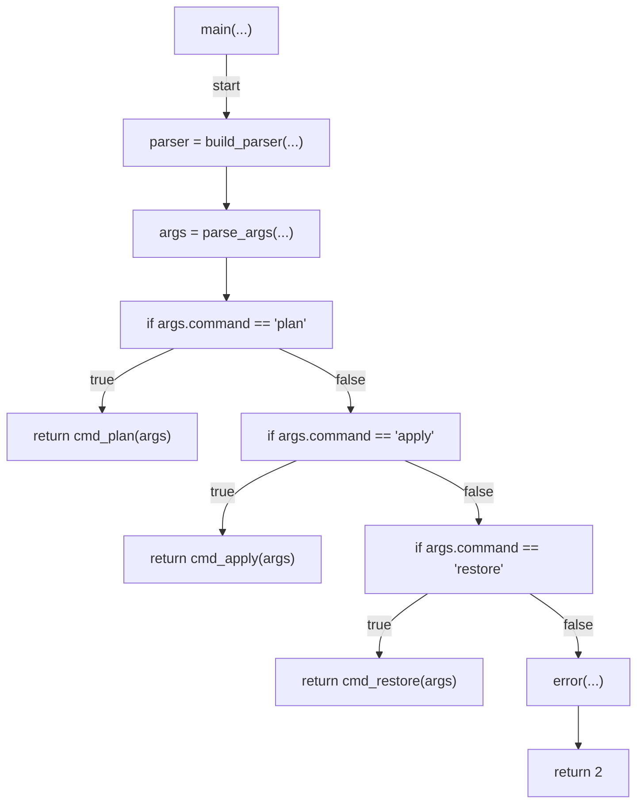
