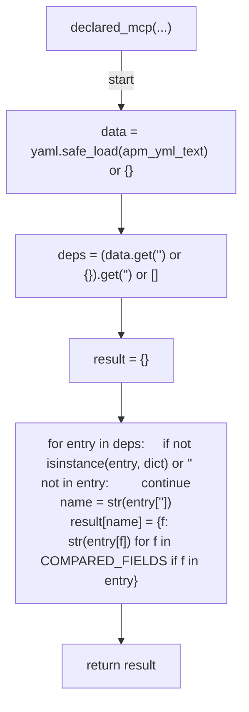
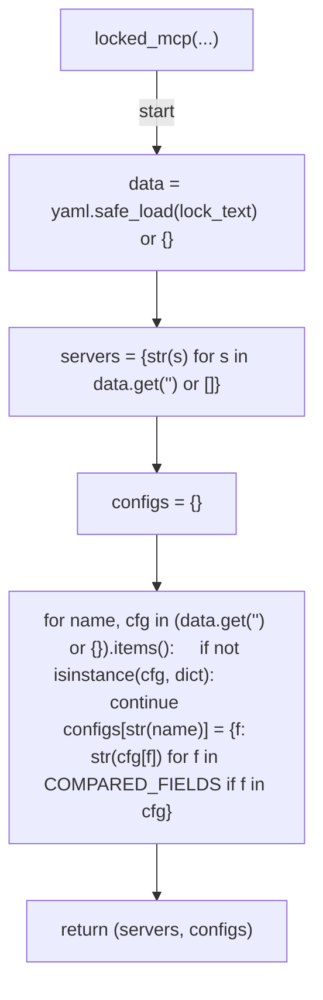
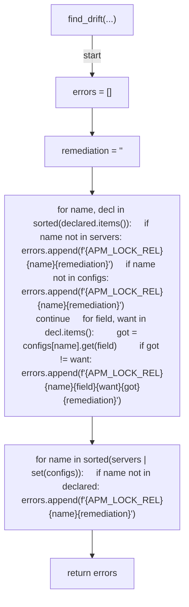
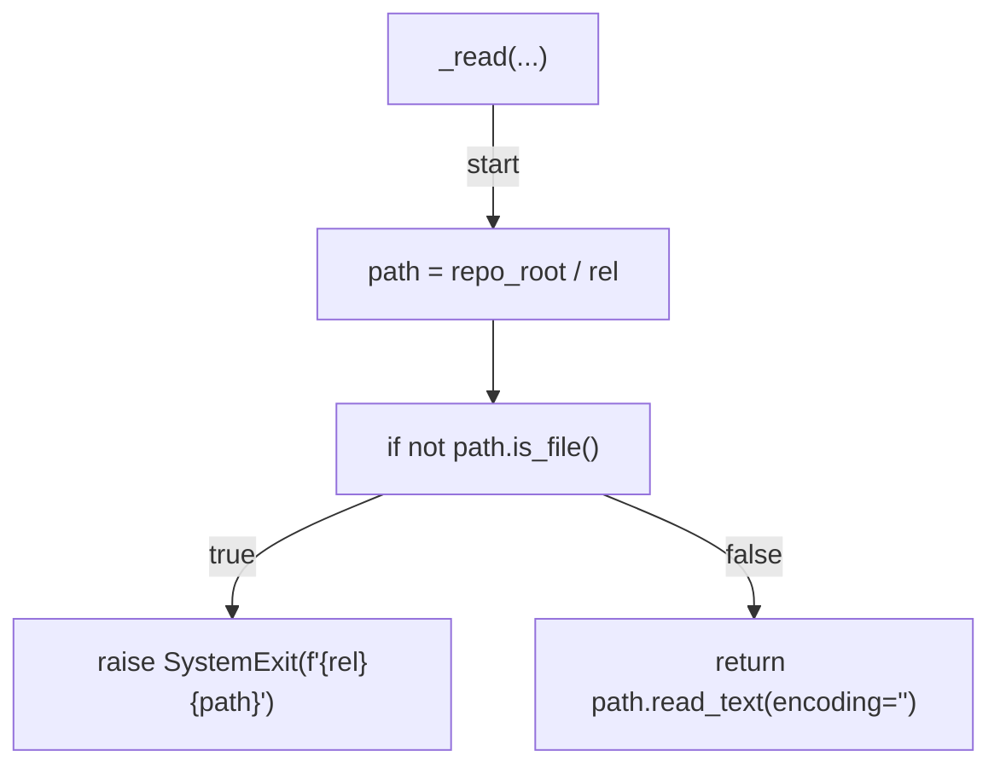
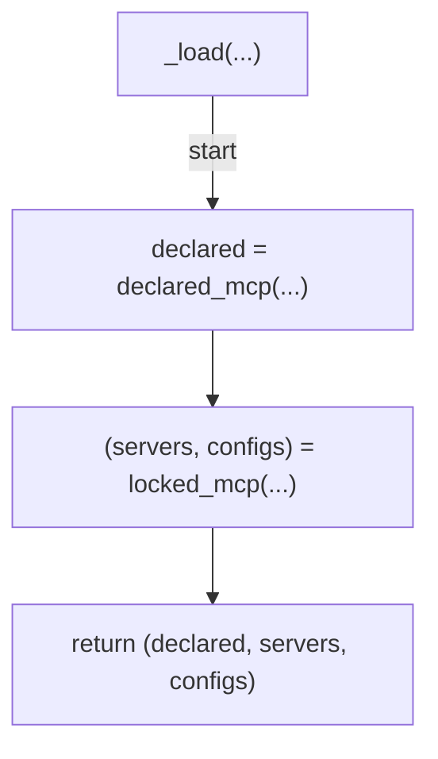
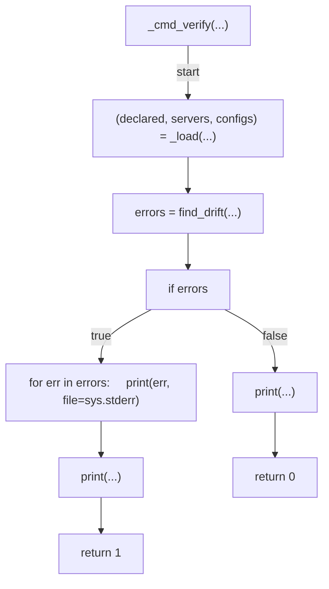
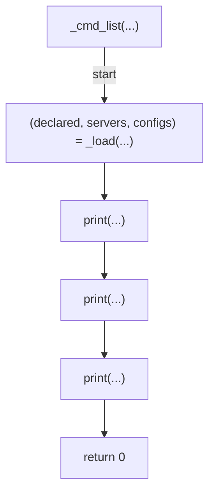
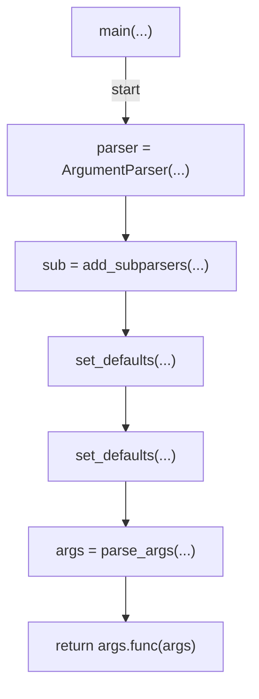

# AST graph: scripts/scan_apm_lock_drift.py

This file is generated from `scripts/scan_apm_lock_drift.py` by `python3 scripts/script_ast_graph.py all-doc`. Do not edit it by hand: content under `docs/generated/scripts/` is owned by the post-merge automation (refs #1540); update the source script instead.

## declared_mcp(...)

## locked_mcp(...)

## find_drift(...)

## _read(...)

## _load(...)

## _cmd_verify(...)

## _cmd_list(...)

## main(...)

