# AST graph: scripts/scan_area_path_coverage.py

This file is generated from `scripts/scan_area_path_coverage.py` by `python3 scripts/script_ast_graph.py all-doc`. Do not edit it by hand: content under `docs/generated/scripts/` is owned by the post-merge automation (refs #1540) -- update the source script instead.

## _run_git(...)

```mermaid
flowchart TD
    N001["_run_git(...)"]
    N002["completed = run_git(...)"]
    N003["if completed.returncode != 0"]
    N004["detail = strip(...)"]
    N005["raise RuntimeError(f\"<str>{'<str>'.join(args)}<str>{detail}\")"]
    N006["return completed.stdout"]
    N001 -->|"start"| N002
    N002 --> N003
    N003 -->|"true"| N004
    N004 --> N005
    N003 -->|"false"| N006
```

## load_policy(...)

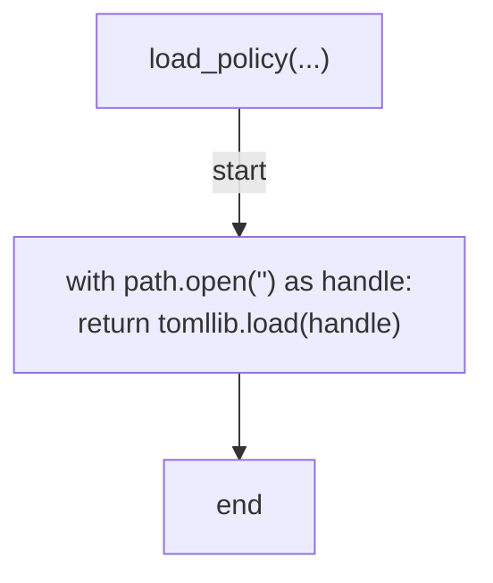

## declared_area_labels(...)

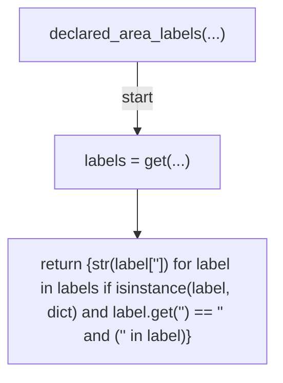

## area_path_entries(...)

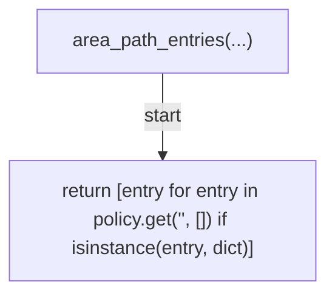

## mapped_areas(...)

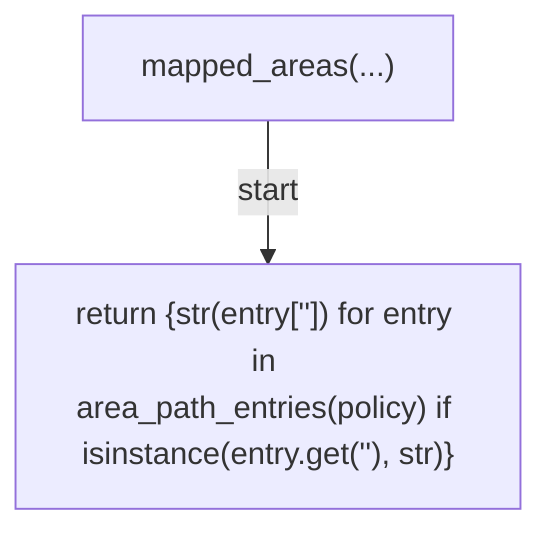

## glob_top_levels(...)

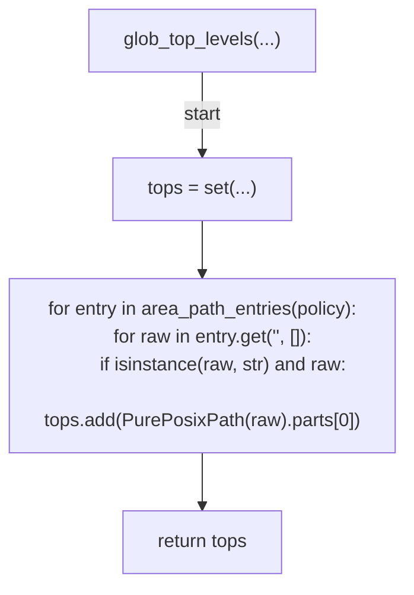

## tracked_top_level_dirs(...)

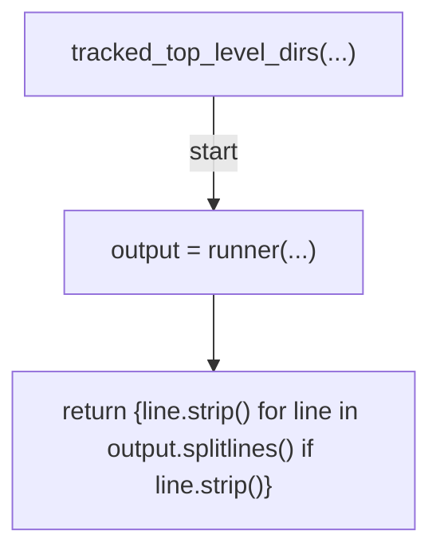

## _err(...)

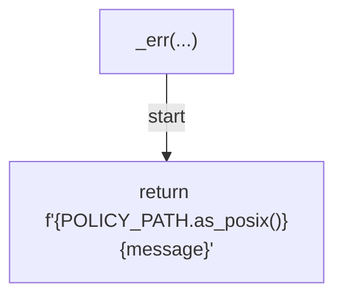

## verify_policy(...)

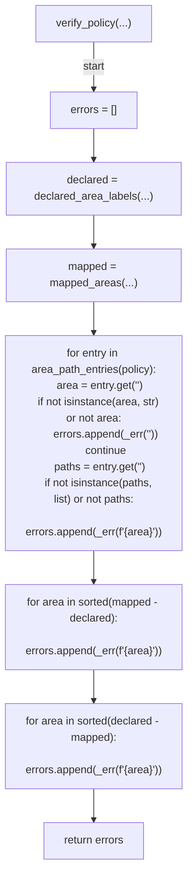

## verify_directory_coverage(...)

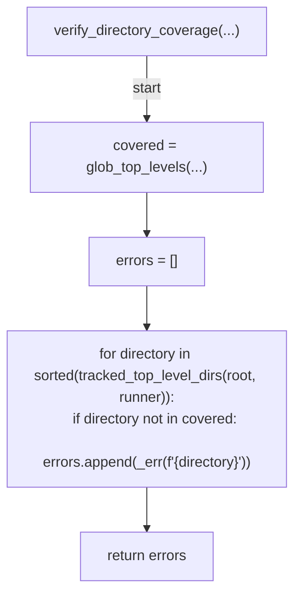

## verify(...)

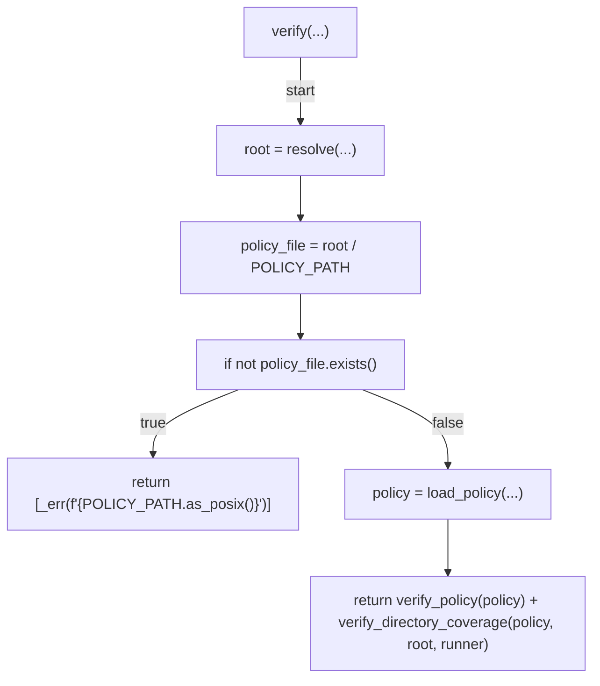

## main(...)

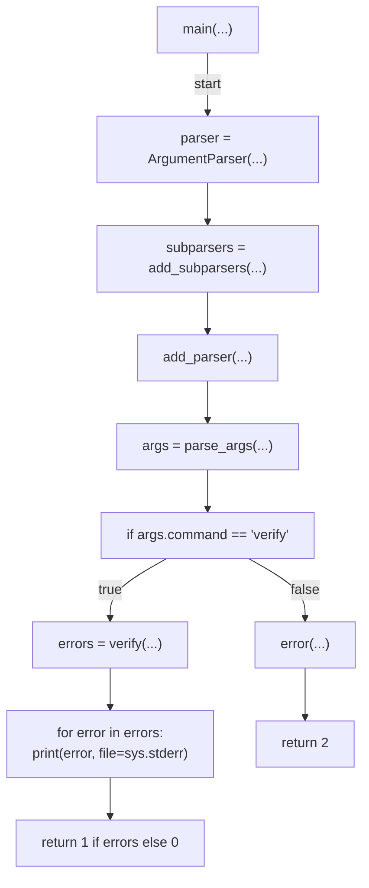
