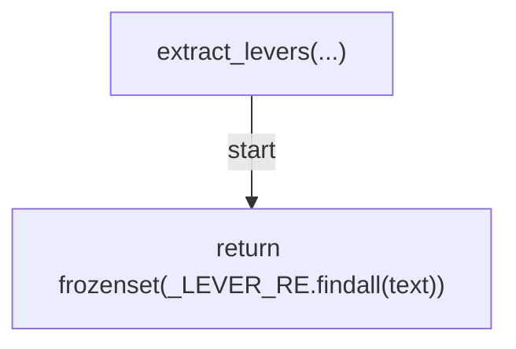
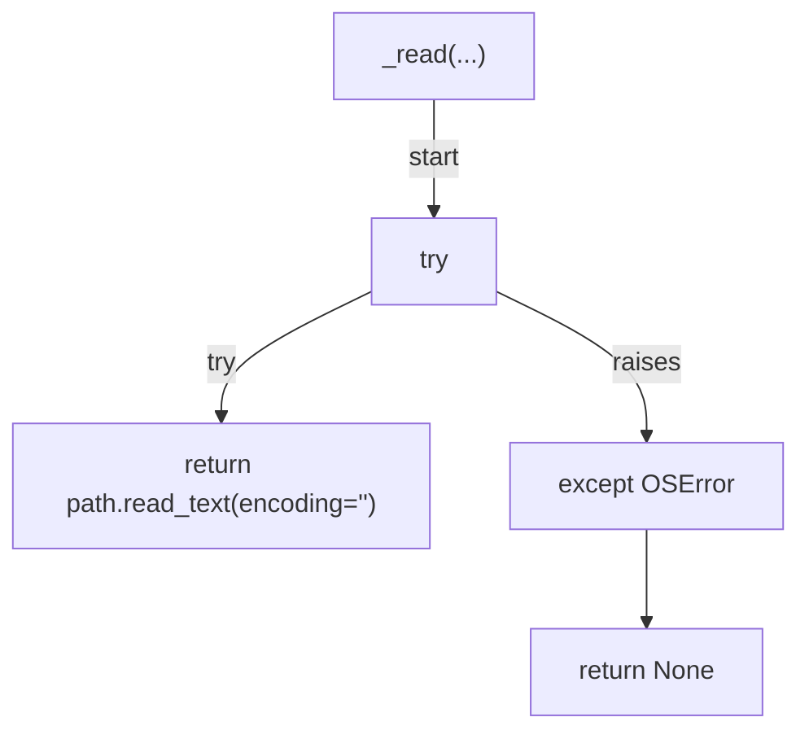
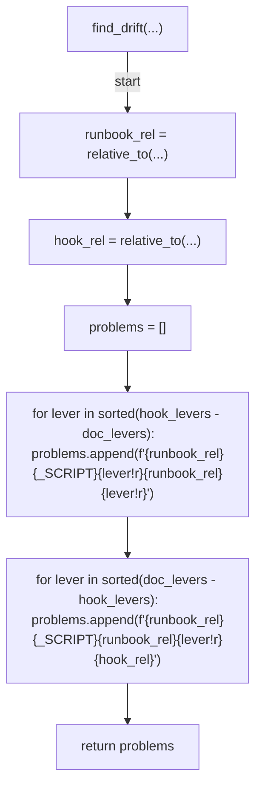
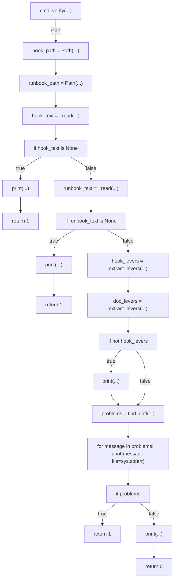
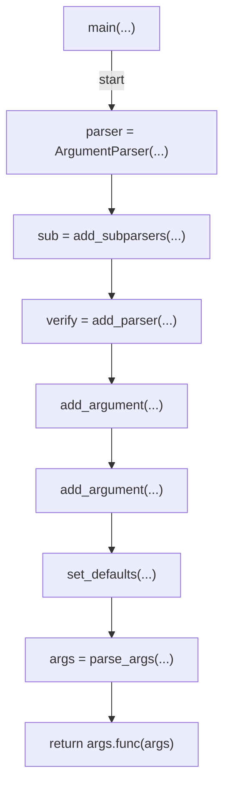

# AST graph: scripts/scan_bypass_lever_doc_drift.py

This file is generated from `scripts/scan_bypass_lever_doc_drift.py` by `python3 scripts/script_ast_graph.py all-doc`. Do not edit it by hand: content under `docs/generated/scripts/` is owned by the post-merge automation (refs #1540); update the source script instead.

## extract_levers(...)

## _read(...)

## find_drift(...)

## cmd_verify(...)

## main(...)

