# AST graph: scripts/scan_design_philosophy_drift.py

This file is generated from `scripts/scan_design_philosophy_drift.py` by `python3 scripts/script_ast_graph.py all-doc`. Do not edit it by hand: content under `docs/generated/scripts/` is owned by the post-merge automation (refs #1540) -- update the source script instead.

## normalize_label(...)

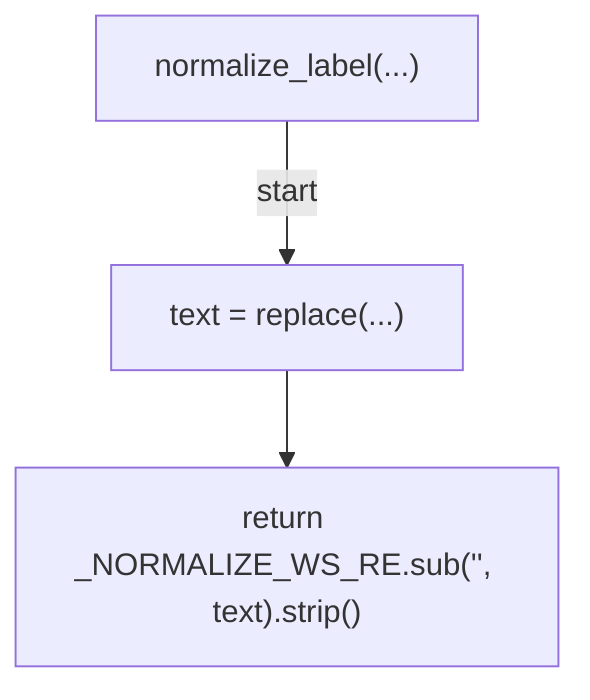

## parse_master_sections(...)

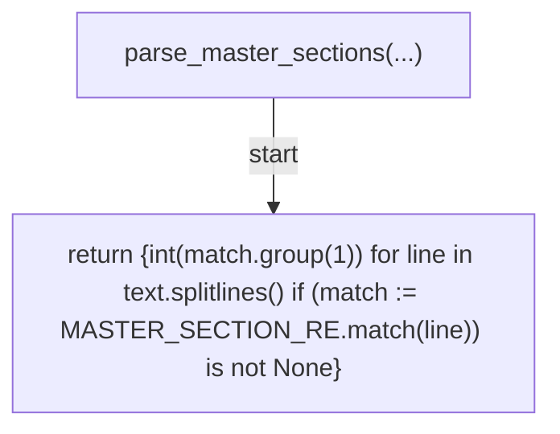

## extract_section_3(...)

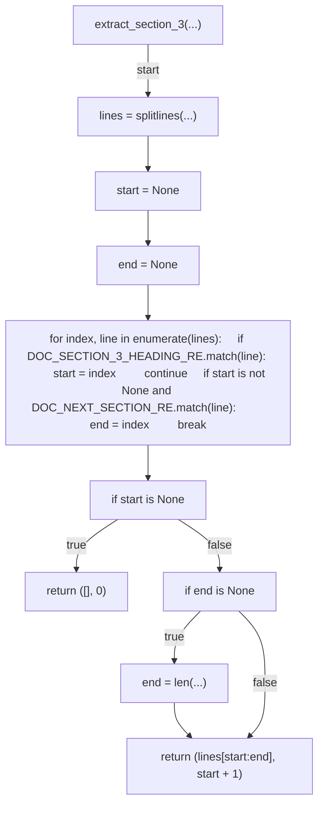

## parse_doc_matrix_rows(...)

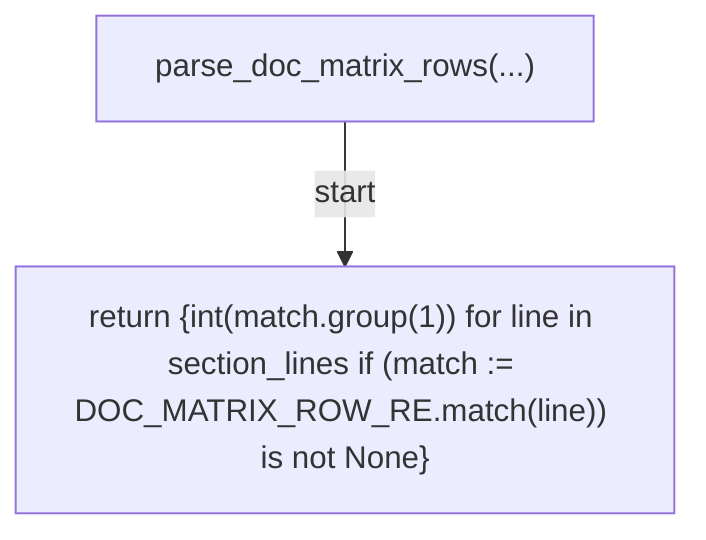

## parse_master_subtitles(...)

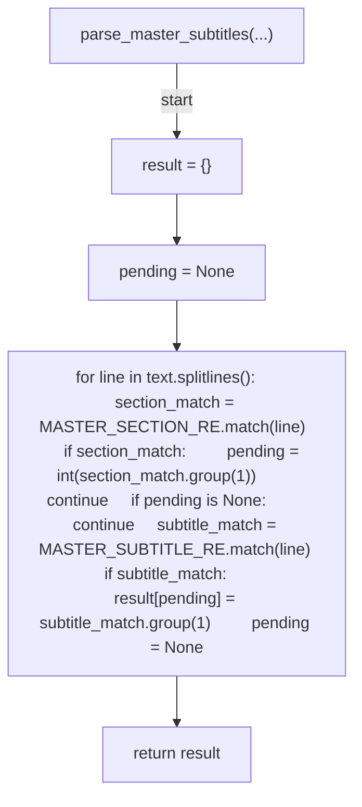

## parse_doc_row_labels(...)

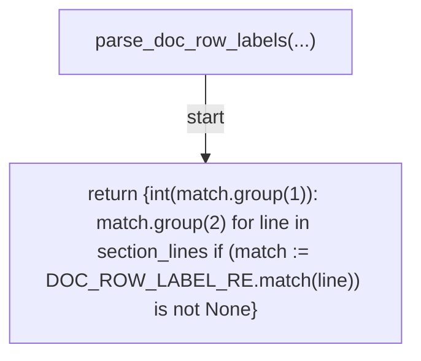

## parse_file_entries(...)

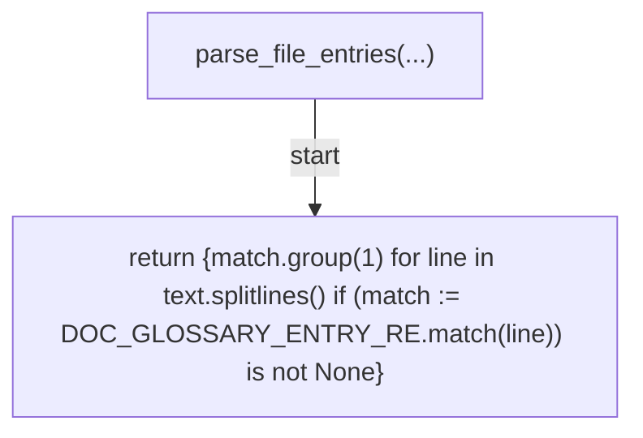

## parse_glossary_entries(...)

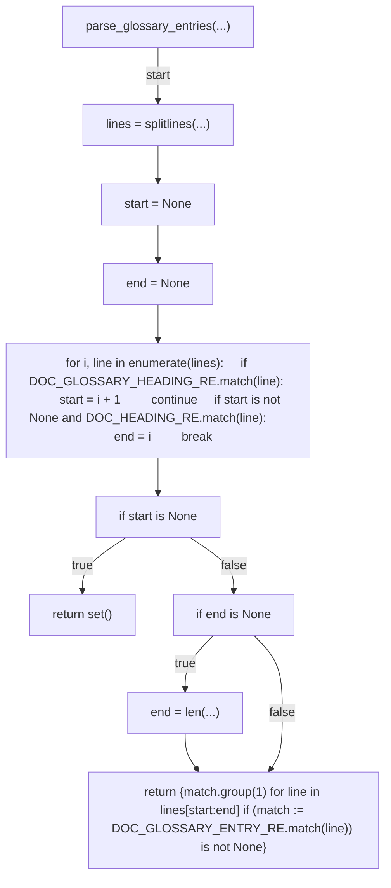

## parse_doc_wording_counts(...)

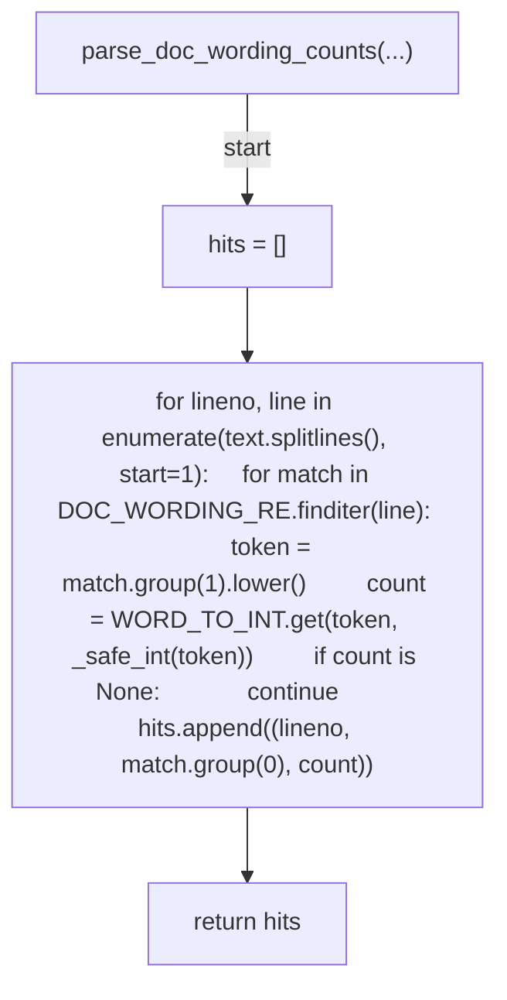

## _safe_int(...)

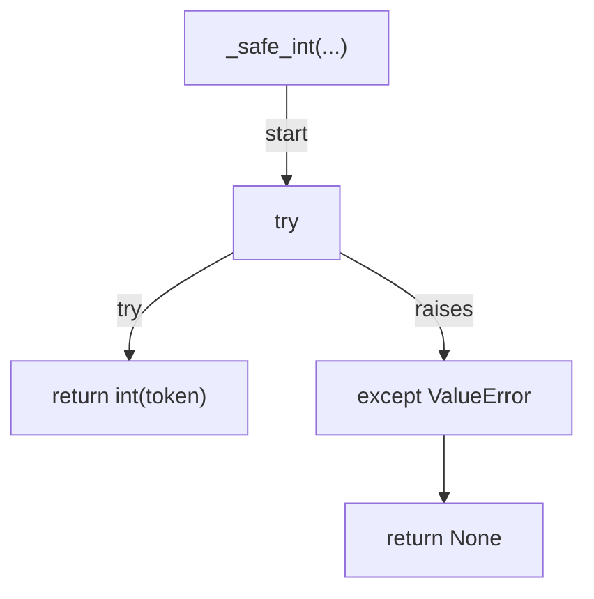

## _verify(...)

```mermaid
flowchart TD
    N001["_verify(...)"]
    N002["if not master_path.exists()"]
    N003["print(...)"]
    N004["return 1"]
    N005["if not doc_path.exists()"]
    N006["print(...)"]
    N007["return 1"]
    N008["if glossary_path is not None and (not glossary_path.exists())"]
    N009["print(...)"]
    N010["return 1"]
    N011["master_text = read_text(...)"]
    N012["doc_text = read_text(...)"]
    N013["master_sections = parse_master_sections(...)"]
    N014["if not master_sections"]
    N015["print(...)"]
    N016["return 1"]
    N017["expected = set(...)"]
    N018["if master_sections != expected"]
    N019["missing = sorted(...)"]
    N020["print(...)"]
    N021["return 1"]
    N022["(section_lines, section_offset) = extract_section_3(...)"]
    N023["if not section_lines"]
    N024["print(...)"]
    N025["return 1"]
    N026["matrix_rows = parse_doc_matrix_rows(...)"]
    N027["failures = 0"]
    N028["missing_in_doc = sorted(...)"]
    N029["if missing_in_doc"]
    N030["labels = join(...)"]
    N031["print(...)"]
    N032["failures += 1"]
    N033["extra_in_doc = sorted(...)"]
    N034["if extra_in_doc"]
    N035["labels = join(...)"]
    N036["print(...)"]
    N037["failures += 1"]
    N038["expected_count = max(...)"]
    N039["for lineno, phrase, count in parse_doc_wording_counts(doc_text):     if count != expected_count:         print(f'<str>{doc_path}<str>{lineno}<str>{phrase}<str>{count}<str>{expected_count}<str>', file=sys.stderr)         failures += 1"]
    N040["master_subtitles = parse_master_subtitles(...)"]
    N041["doc_row_labels = parse_doc_row_labels(...)"]
    N042["for n in sorted(master_sections & matrix_rows):     sub_text = master_subtitles.get(n)     label_text = doc_row_labels.get(n)     if sub_text is None or label_text is None:         continue     if normalize_label(sub_text) != normalize_label(label_text):         print(f'<str>{doc_path}<str>{section_offset}<str>{n}<str>{label_text}<str>{n}<str>{sub_text}<str>', file=sys.stderr)         failures += 1"]
    N043["if glossary_path is not None"]
    N044["glossary_entries = parse_file_entries(...)"]
    N045["glossary_ref = glossary_path"]
    N046["glossary_hint = f'<str>{glossary_path}<str>'"]
    N047["glossary_entries = parse_glossary_entries(...)"]
    N048["glossary_ref = doc_path"]
    N049["glossary_hint = f'<str>{doc_path}<str>'"]
    N050["missing_glossary = sorted(...)"]
    N051["if missing_glossary"]
    N052["labels = join(...)"]
    N053["print(...)"]
    N054["failures += 1"]
    N055["if failures"]
    N056["print(...)"]
    N057["return 1"]
    N058["print(...)"]
    N059["return 0"]
    N001 -->|"start"| N002
    N002 -->|"true"| N003
    N003 --> N004
    N002 -->|"false"| N005
    N005 -->|"true"| N006
    N006 --> N007
    N005 -->|"false"| N008
    N008 -->|"true"| N009
    N009 --> N010
    N008 -->|"false"| N011
    N011 --> N012
    N012 --> N013
    N013 --> N014
    N014 -->|"true"| N015
    N015 --> N016
    N014 -->|"false"| N017
    N017 --> N018
    N018 -->|"true"| N019
    N019 --> N020
    N020 --> N021
    N018 -->|"false"| N022
    N022 --> N023
    N023 -->|"true"| N024
    N024 --> N025
    N023 -->|"false"| N026
    N026 --> N027
    N027 --> N028
    N028 --> N029
    N029 -->|"true"| N030
    N030 --> N031
    N031 --> N032
    N032 --> N033
    N029 -->|"false"| N033
    N033 --> N034
    N034 -->|"true"| N035
    N035 --> N036
    N036 --> N037
    N037 --> N038
    N034 -->|"false"| N038
    N038 --> N039
    N039 --> N040
    N040 --> N041
    N041 --> N042
    N042 --> N043
    N043 -->|"true"| N044
    N044 --> N045
    N045 --> N046
    N043 -->|"false"| N047
    N047 --> N048
    N048 --> N049
    N046 --> N050
    N049 --> N050
    N050 --> N051
    N051 -->|"true"| N052
    N052 --> N053
    N053 --> N054
    N054 --> N055
    N051 -->|"false"| N055
    N055 -->|"true"| N056
    N056 --> N057
    N055 -->|"false"| N058
    N058 --> N059
```

## _cmd_verify(...)

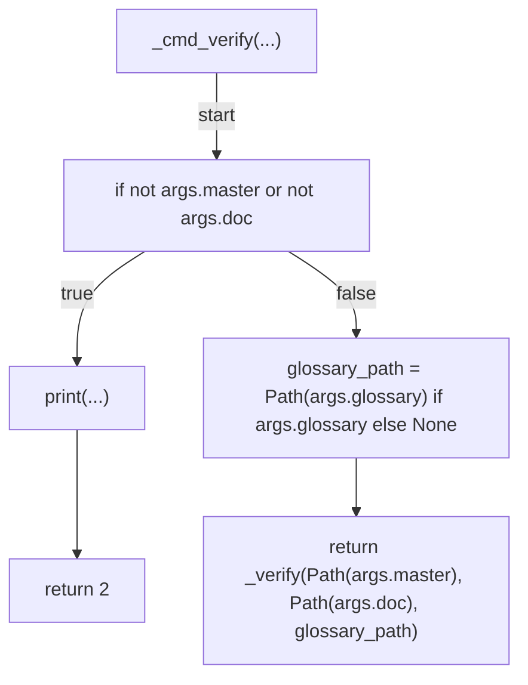

## resolve_base(...)

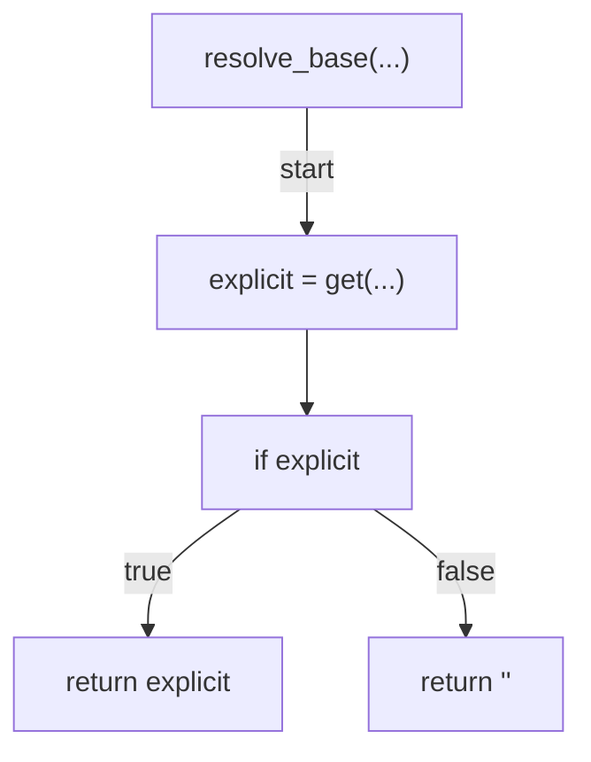

## changed_files(...)

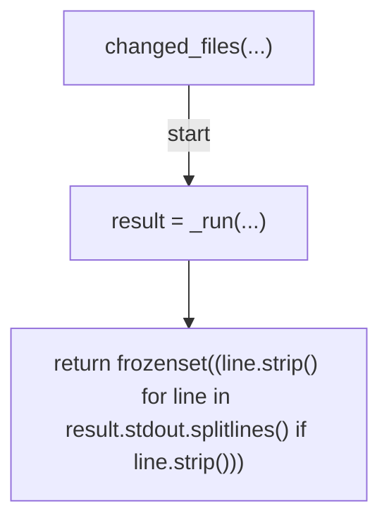

## has_matrix_ack(...)

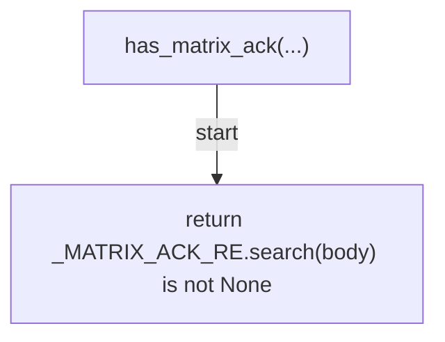

## evaluate_coupling(...)

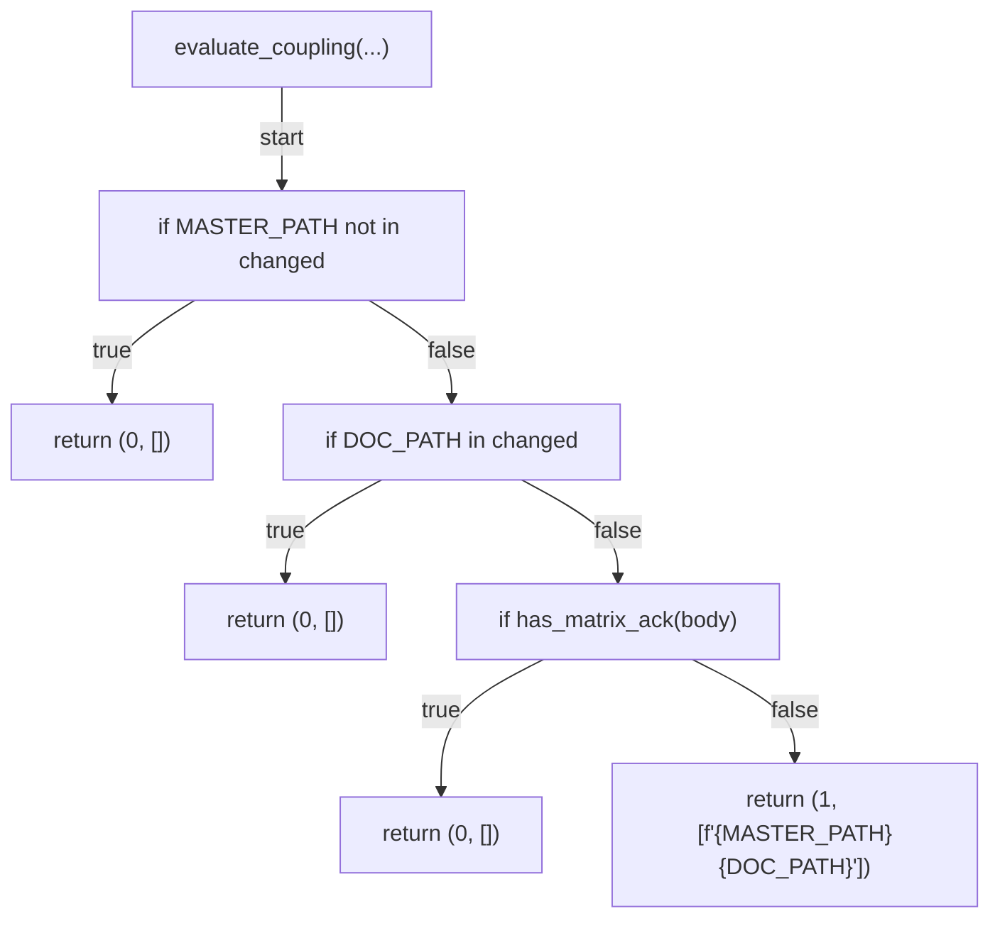

## _resolve_coupling_body(...)

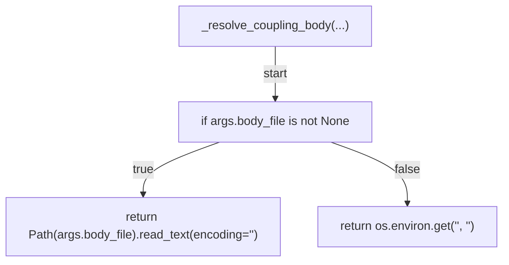

## _cmd_verify_coupling(...)

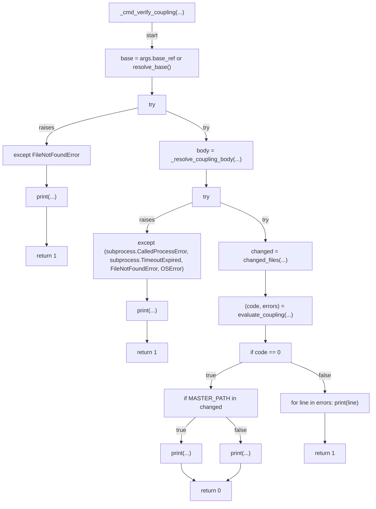

## _run(...)

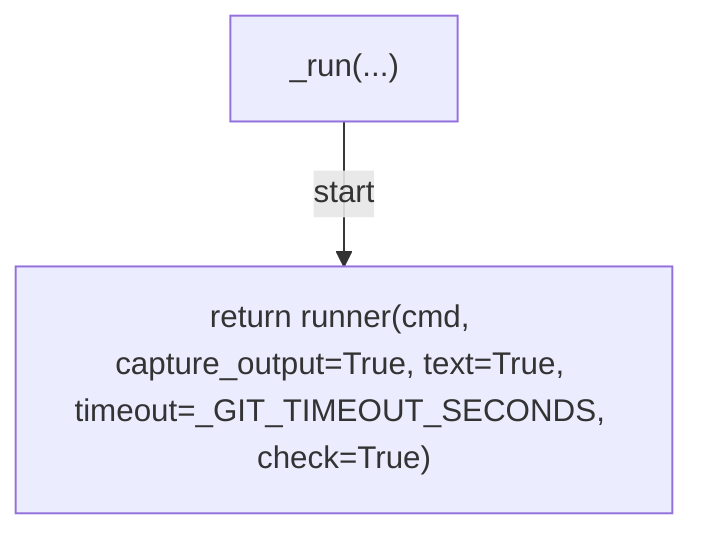

## _cmd_report(...)

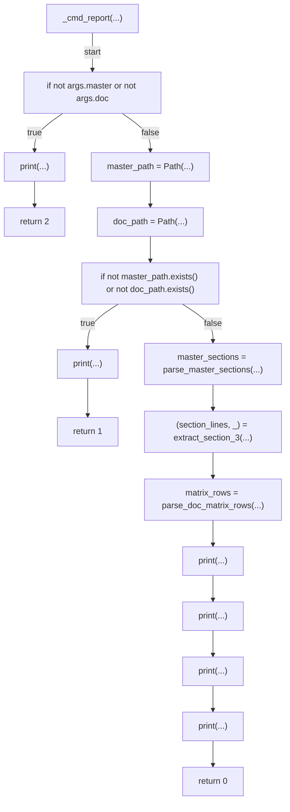

## main(...)

```mermaid
flowchart TD
    N001["main(...)"]
    N002["parser = ArgumentParser(...)"]
    N003["sub = add_subparsers(...)"]
    N004["p_verify = add_parser(...)"]
    N005["add_argument(...)"]
    N006["add_argument(...)"]
    N007["add_argument(...)"]
    N008["set_defaults(...)"]
    N009["p_report = add_parser(...)"]
    N010["add_argument(...)"]
    N011["add_argument(...)"]
    N012["set_defaults(...)"]
    N013["p_coupling = add_parser(...)"]
    N014["add_argument(...)"]
    N015["add_argument(...)"]
    N016["set_defaults(...)"]
    N017["args = parse_args(...)"]
    N018["return int(args.func(args))"]
    N001 -->|"start"| N002
    N002 --> N003
    N003 --> N004
    N004 --> N005
    N005 --> N006
    N006 --> N007
    N007 --> N008
    N008 --> N009
    N009 --> N010
    N010 --> N011
    N011 --> N012
    N012 --> N013
    N013 --> N014
    N014 --> N015
    N015 --> N016
    N016 --> N017
    N017 --> N018
```
