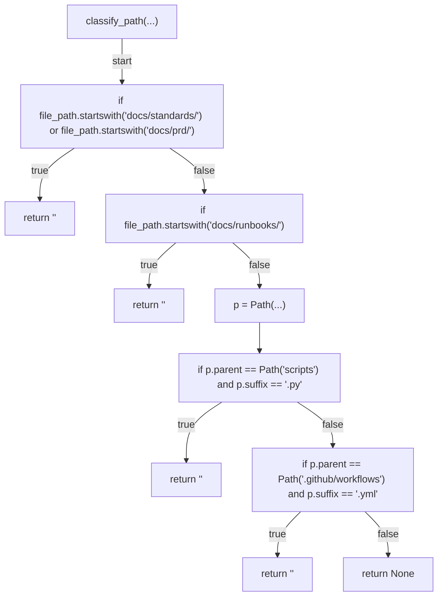
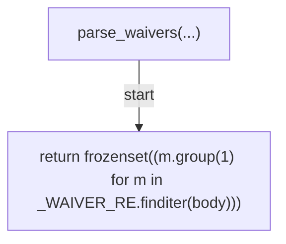
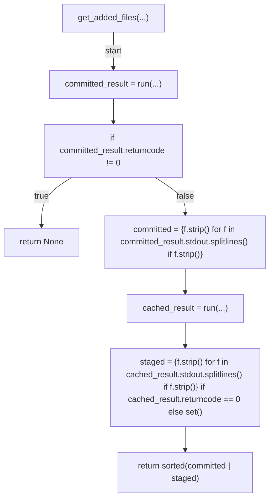
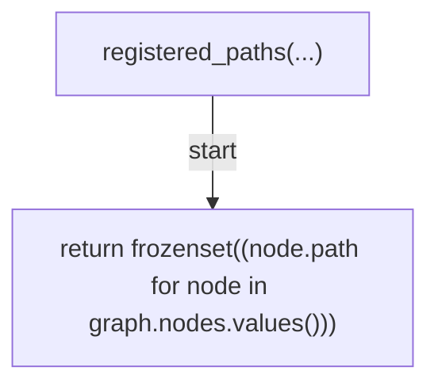
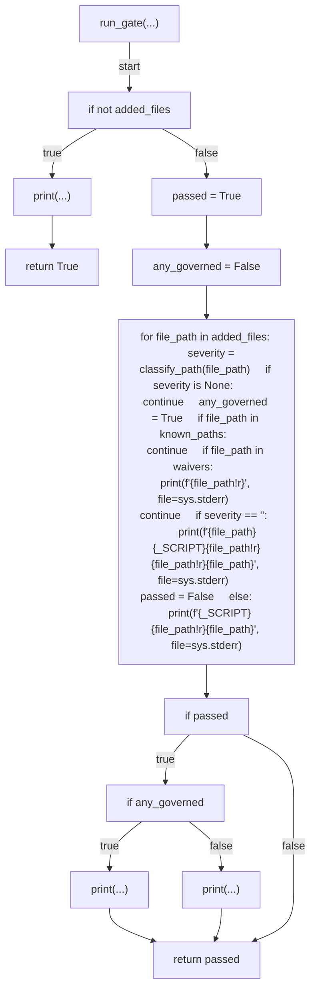
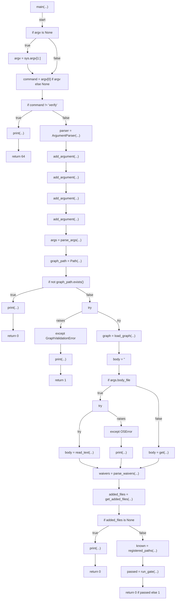

# AST graph: scripts/scan_doc_graph_registration.py

This file is generated from `scripts/scan_doc_graph_registration.py` by `python3 scripts/script_ast_graph.py all-doc`. Do not edit it by hand: content under `docs/generated/scripts/` is owned by the post-merge automation (refs #1540); update the source script instead.

## classify_path(...)

## parse_waivers(...)

## get_added_files(...)

## registered_paths(...)

## run_gate(...)

## main(...)

