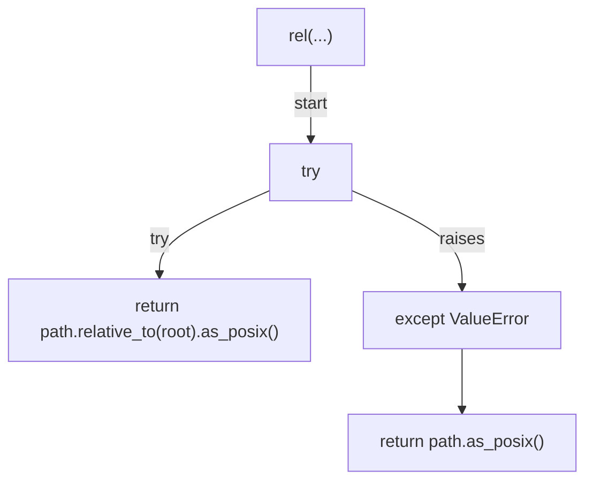
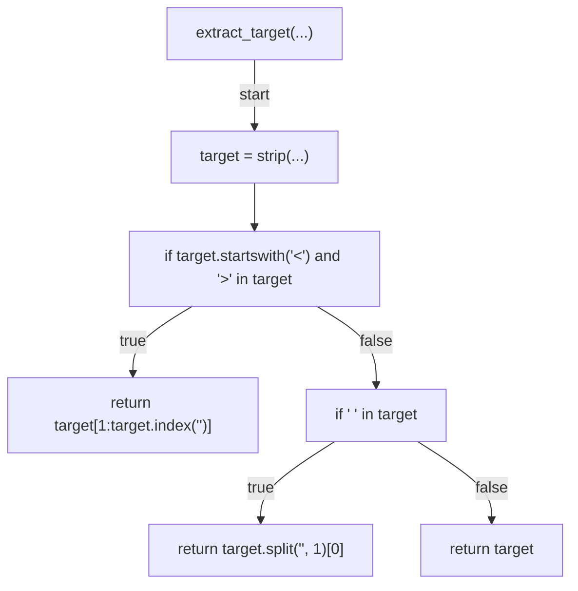
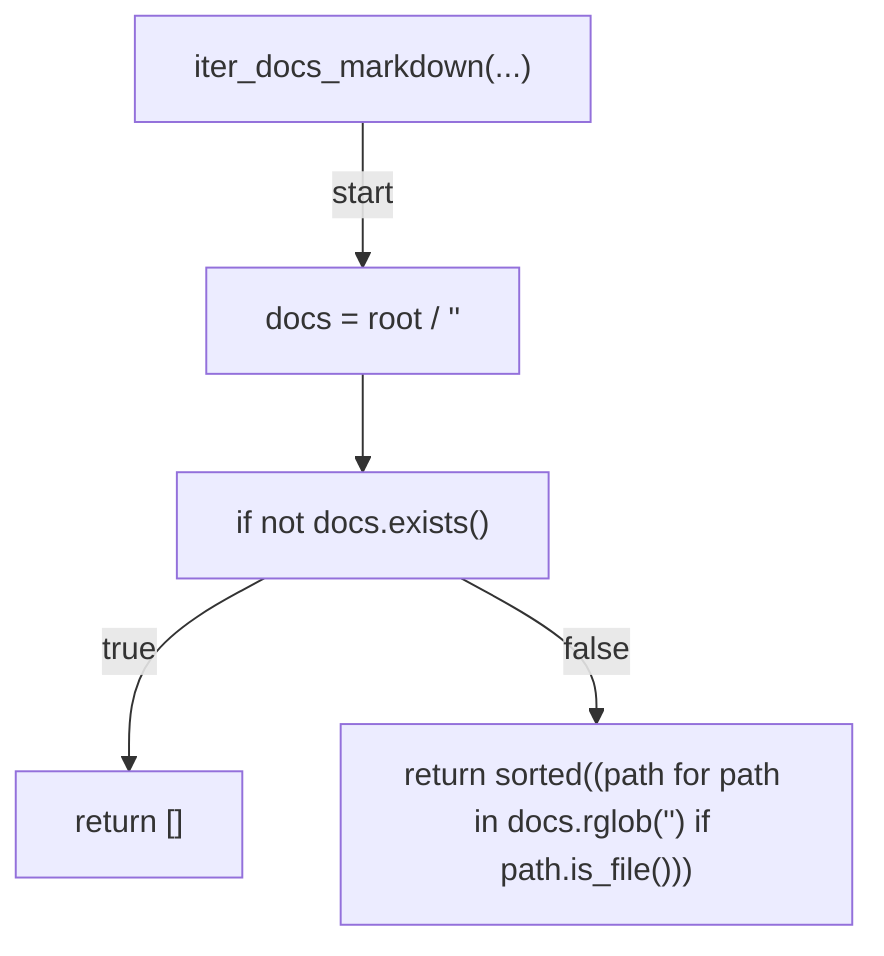
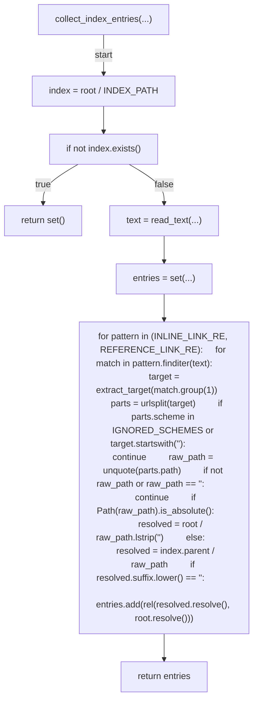
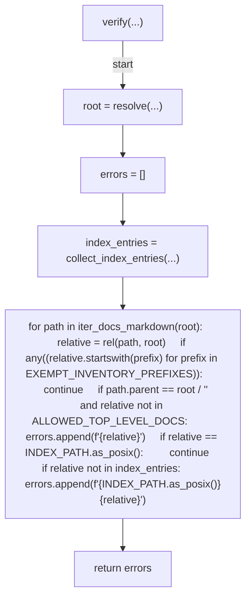
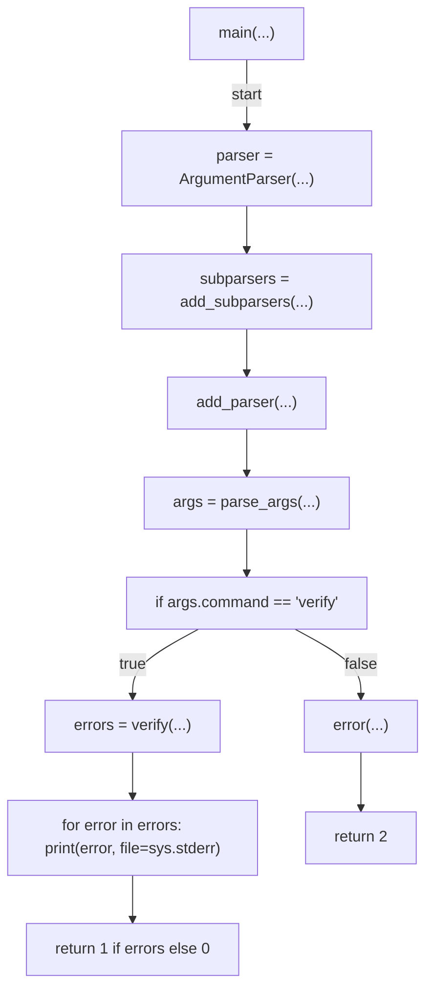

# AST graph: scripts/scan_docs_inventory.py

This file is generated from `scripts/scan_docs_inventory.py` by `python3 scripts/script_ast_graph.py all-doc`. Do not edit it by hand: content under `docs/generated/scripts/` is owned by the post-merge automation (refs #1540) -- update the source script instead.

## rel(...)

## extract_target(...)

## iter_docs_markdown(...)

## collect_index_entries(...)

## verify(...)

## main(...)

