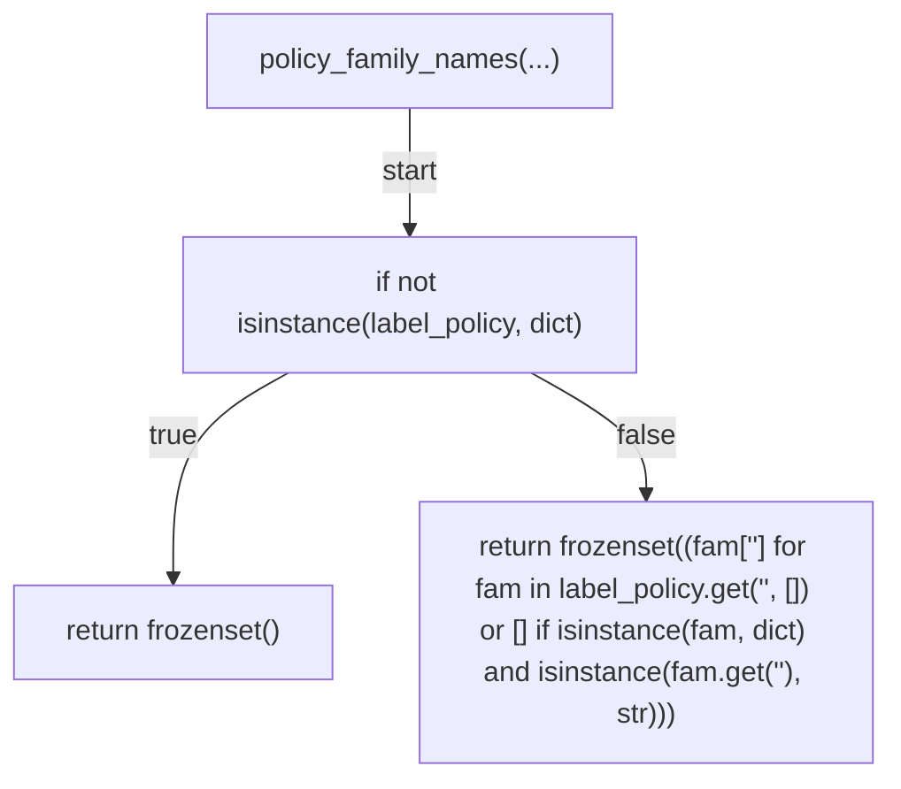
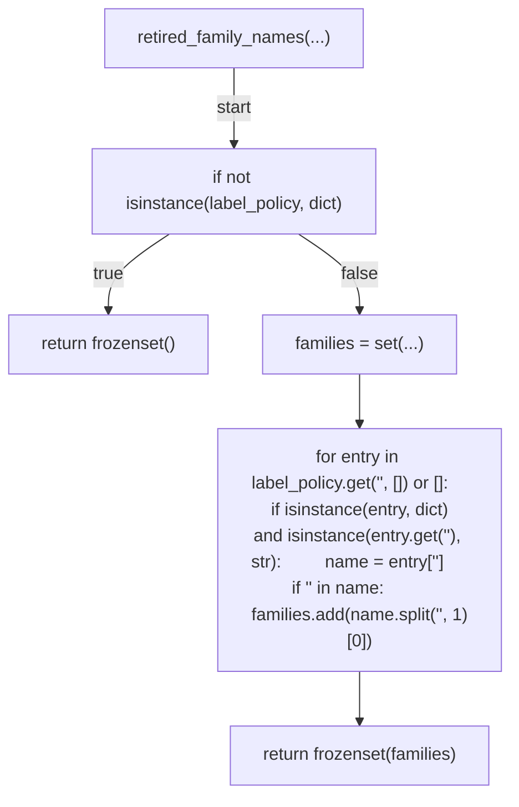
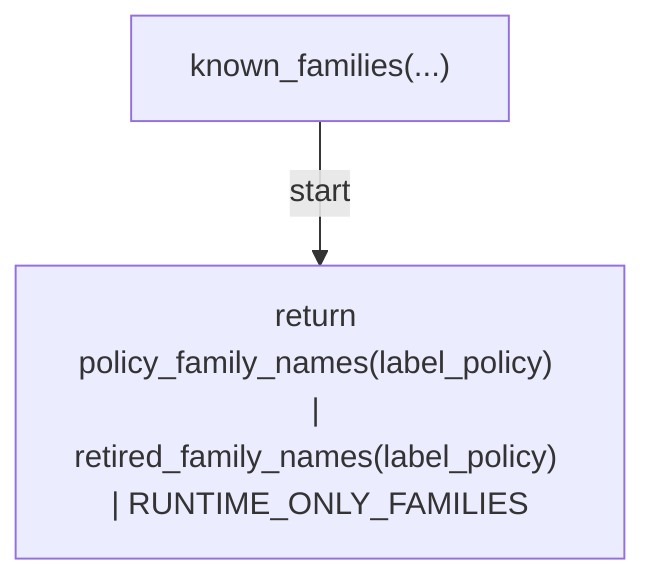
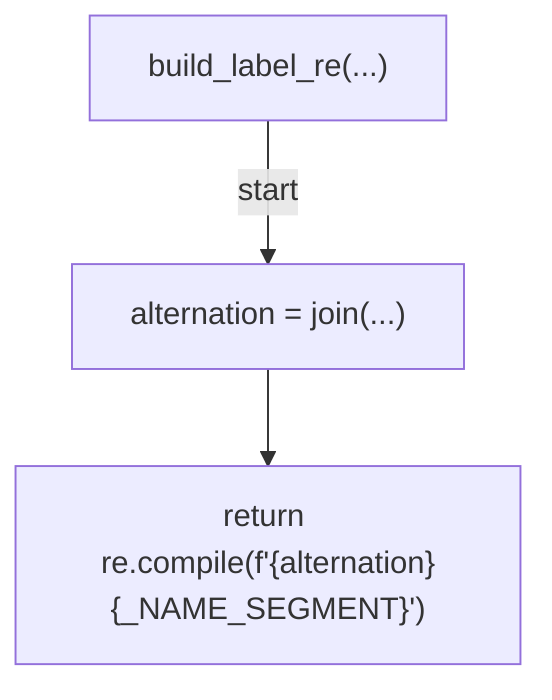
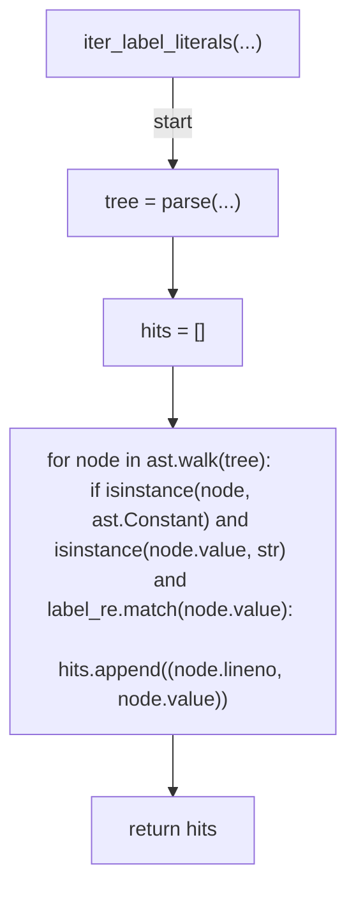
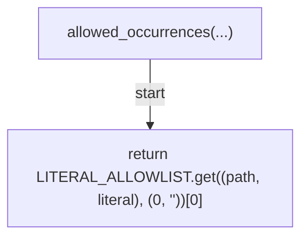
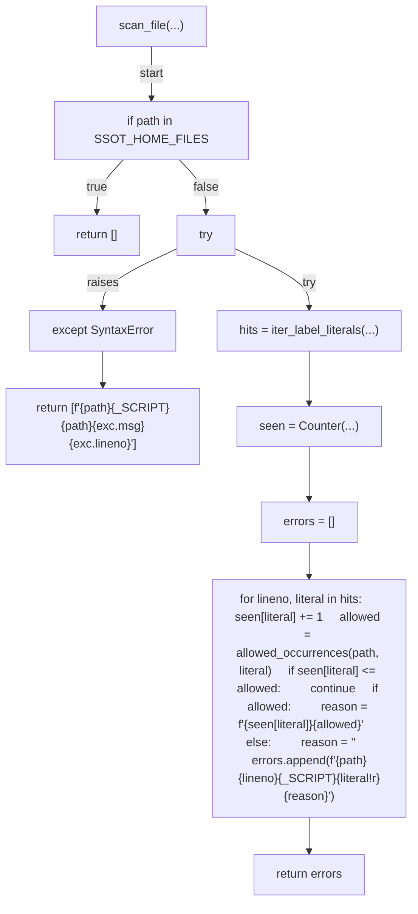
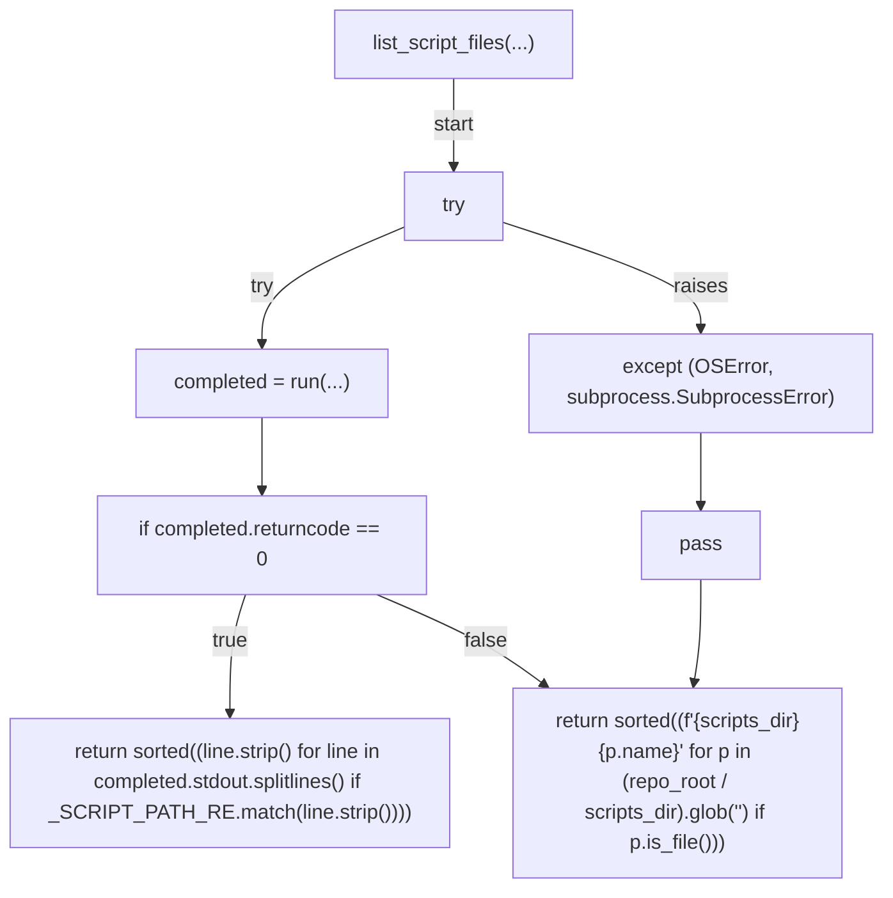
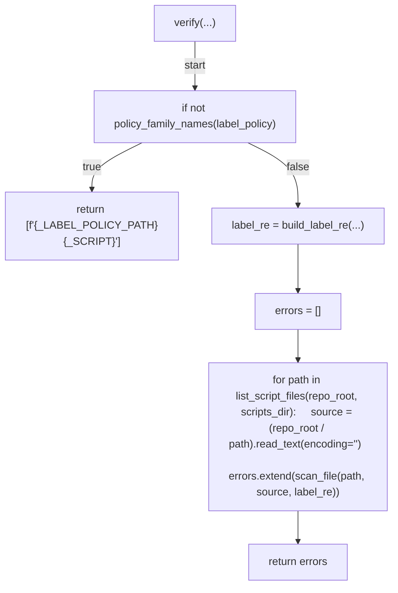
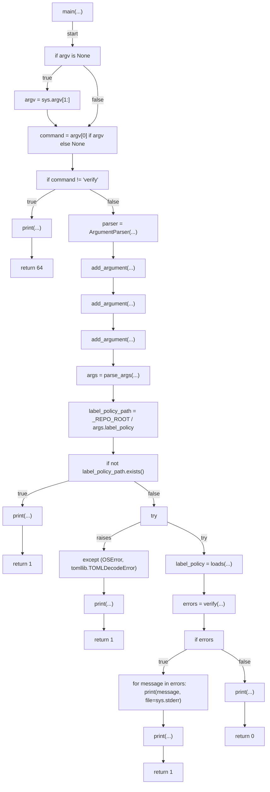

# AST graph: scripts/scan_hardcoded_label_literals.py

This file is generated from `scripts/scan_hardcoded_label_literals.py` by `python3 scripts/script_ast_graph.py all-doc`. Do not edit it by hand: content under `docs/generated/scripts/` is owned by the post-merge automation (refs #1540); update the source script instead.

## policy_family_names(...)

## retired_family_names(...)

## known_families(...)

## build_label_re(...)

## iter_label_literals(...)

## allowed_occurrences(...)

## scan_file(...)

## list_script_files(...)

## verify(...)

## main(...)

