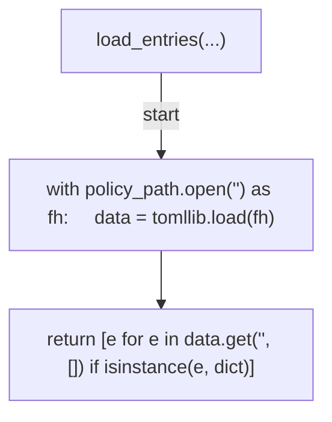
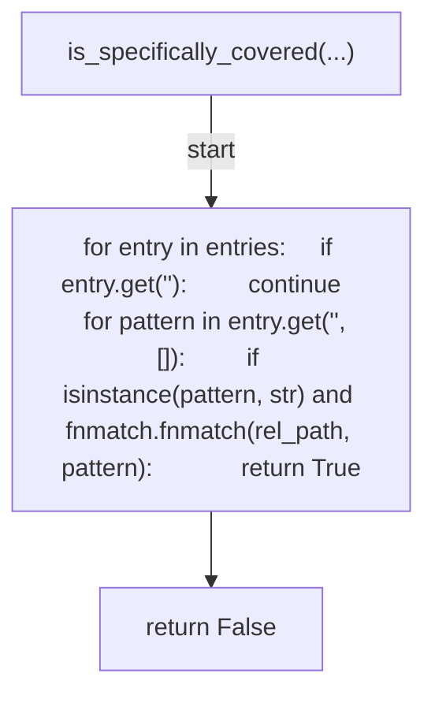
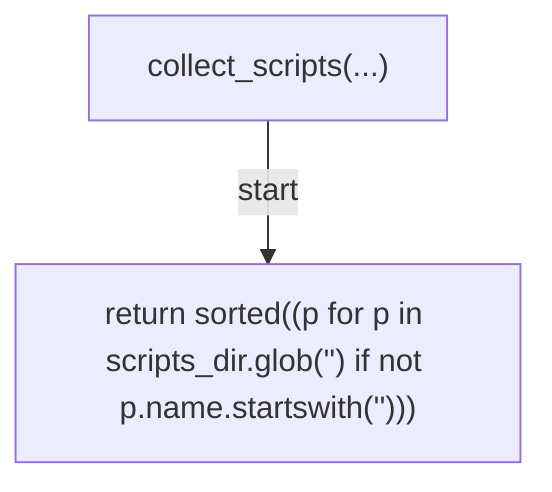
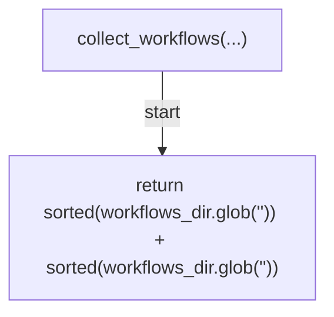
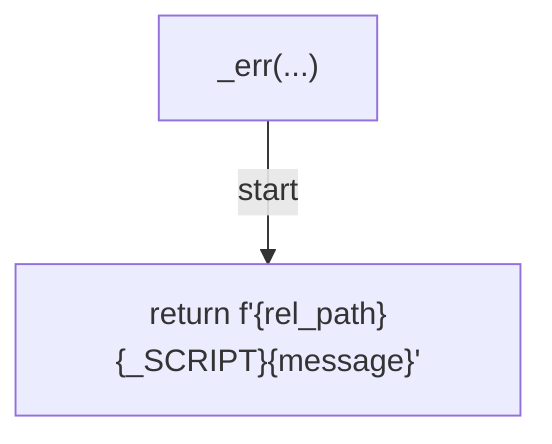
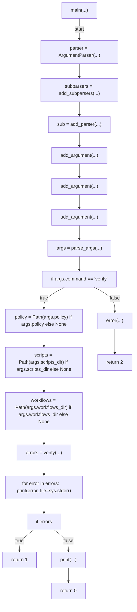

# AST graph: scripts/scan_harness_doc_coverage.py

This file is generated from `scripts/scan_harness_doc_coverage.py` by `python3 scripts/script_ast_graph.py all-doc`. Do not edit it by hand: content under `docs/generated/scripts/` is owned by the post-merge automation (refs #1540); update the source script instead.

## load_entries(...)

## is_specifically_covered(...)

## collect_scripts(...)

## collect_workflows(...)

## _err(...)

## verify(...)

```mermaid
flowchart TD
    N001["verify(...)"]
    N002["root = resolve(...)"]
    N003["if policy_path is None"]
    N004["policy_path = root / POLICY_PATH"]
    N005["if scripts_dir is None"]
    N006["scripts_dir = root / SCRIPTS_DIR"]
    N007["if workflows_dir is None"]
    N008["workflows_dir = root / WORKFLOWS_DIR"]
    N009["if not policy_path.exists()"]
    N010["print(...)"]
    N011["return []"]
    N012["entries = load_entries(...)"]
    N013["errors = []"]
    N014["files_to_check = []"]
    N015["if scripts_dir.exists()"]
    N016["extend(...)"]
    N017["if workflows_dir.exists()"]
    N018["extend(...)"]
    N019["covered_allowlisted = set(...)"]
    N020["for fpath in files_to_check:     rel = fpath.relative_to(root).as_posix()     specifically_covered = is_specifically_covered(rel, entries)     if specifically_covered:         if rel in COVERAGE_ALLOWLIST:             covered_allowlisted.add(rel)     elif rel in COVERAGE_ALLOWLIST:         pass     else:         errors.append(_err(rel, f'{rel!r}<str>{POLICY_PATH}<str>'))"]
    N021["all_rel = {f.relative_to(root).as_posix() for f in files_to_check}"]
    N022["for allowlisted_path in COVERAGE_ALLOWLIST:     if allowlisted_path in covered_allowlisted:         errors.append(_err(allowlisted_path, f'{allowlisted_path!r}<str>'))     elif allowlisted_path not in all_rel:         errors.append(_err(allowlisted_path, f'{allowlisted_path!r}<str>'))"]
    N023["return errors"]
    N001 -->|"start"| N002
    N002 --> N003
    N003 -->|"true"| N004
    N004 --> N005
    N003 -->|"false"| N005
    N005 -->|"true"| N006
    N006 --> N007
    N005 -->|"false"| N007
    N007 -->|"true"| N008
    N008 --> N009
    N007 -->|"false"| N009
    N009 -->|"true"| N010
    N010 --> N011
    N009 -->|"false"| N012
    N012 --> N013
    N013 --> N014
    N014 --> N015
    N015 -->|"true"| N016
    N016 --> N017
    N015 -->|"false"| N017
    N017 -->|"true"| N018
    N018 --> N019
    N017 -->|"false"| N019
    N019 --> N020
    N020 --> N021
    N021 --> N022
    N022 --> N023
```

## main(...)

