# AST graph: scripts/scan_hook_coverage_drift.py

This file is generated from `scripts/scan_hook_coverage_drift.py` by `python3 scripts/script_ast_graph.py all-doc`. Do not edit it by hand: content under `docs/generated/scripts/` is owned by the post-merge automation (refs #1540) -- update the source script instead.

## _extract_scripts_from_command(...)

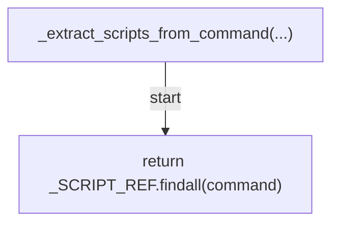

## _is_superpowers(...)

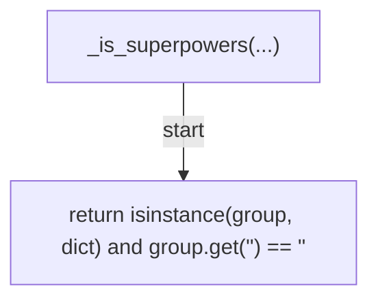

## _iter_commands(...)

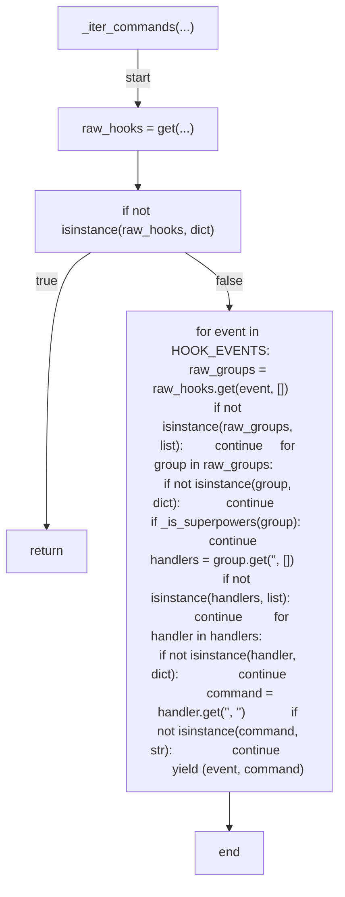

## _collect_hooks(...)

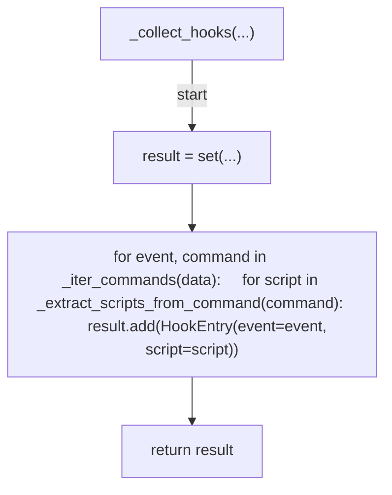

## collect_installers(...)

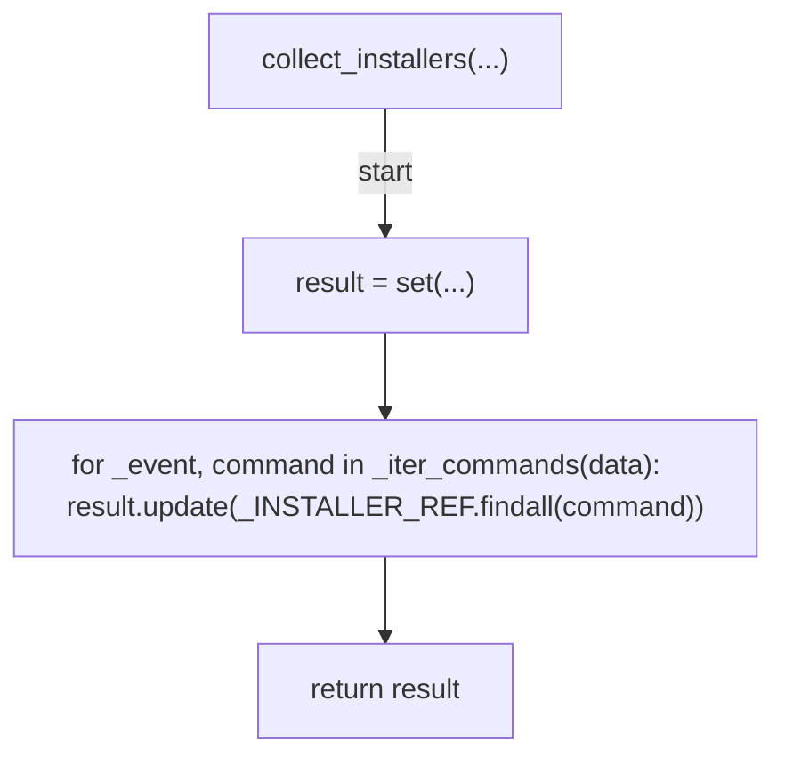

## collect_claude_hooks(...)

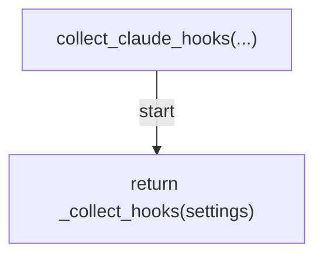

## collect_codex_hooks(...)

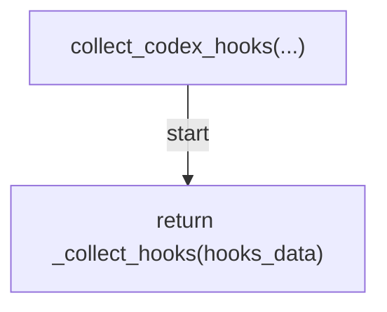

## find_drift(...)

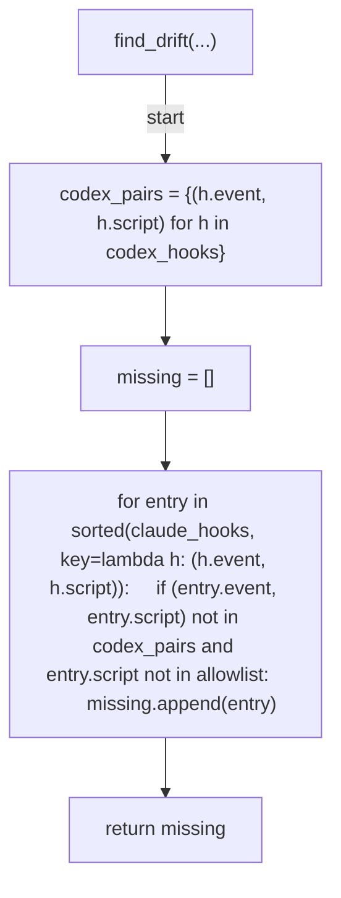

## validate_exemption(...)

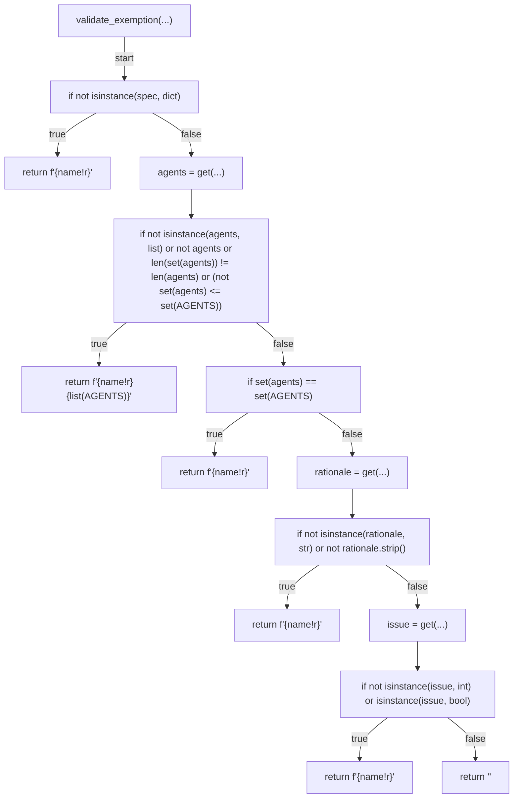

## find_installer_parity_violations(...)

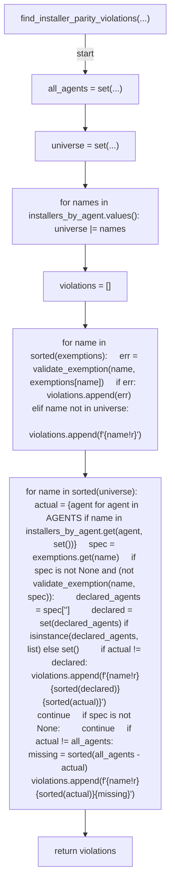

## cmd_verify(...)

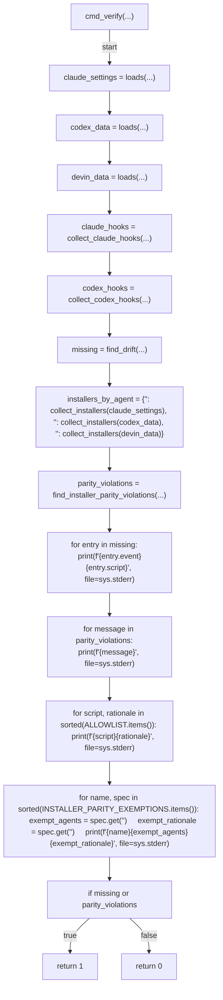

## main(...)

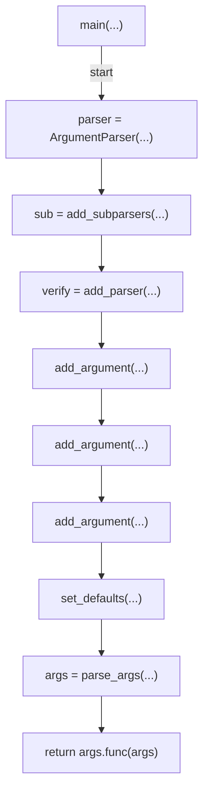
