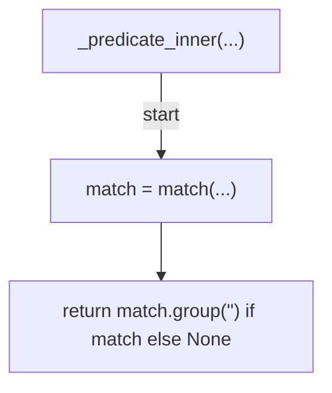
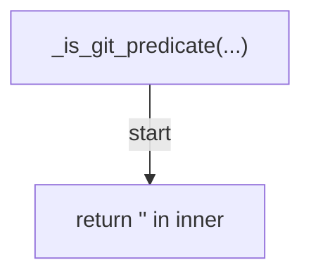
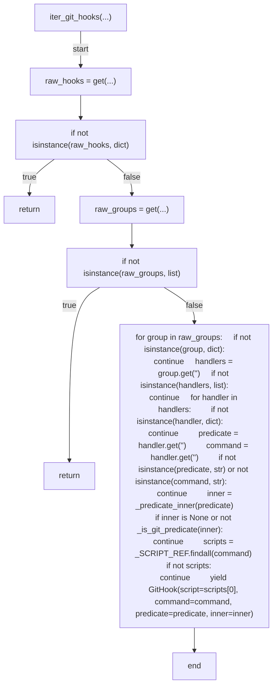
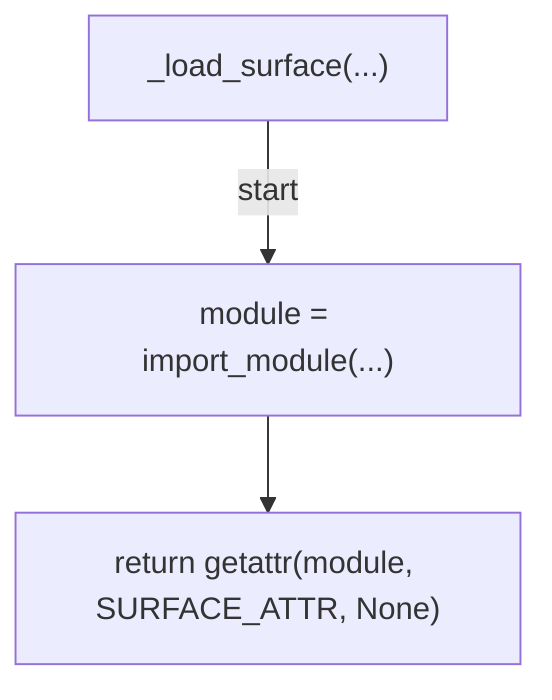
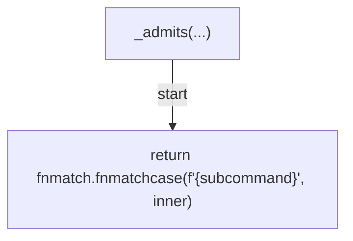
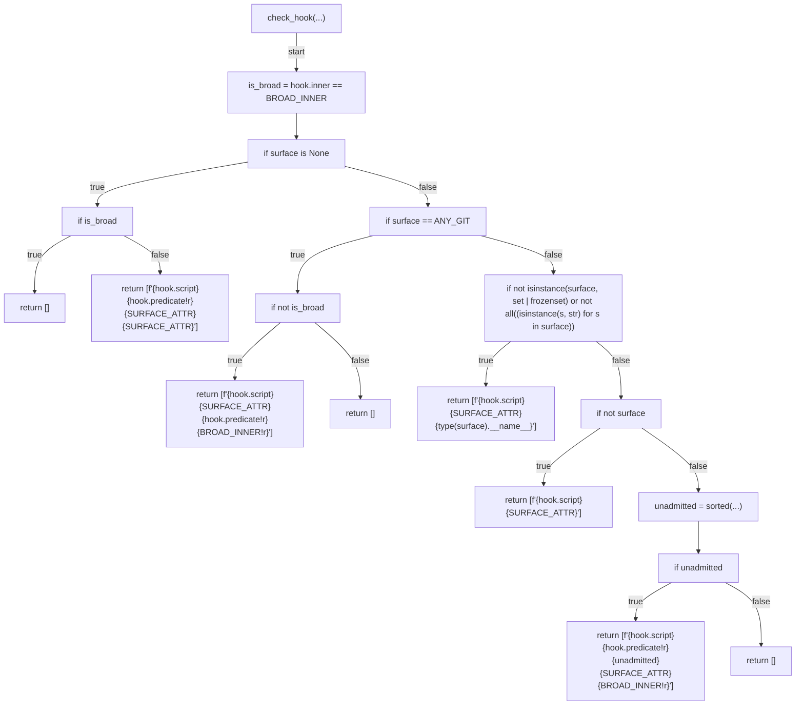
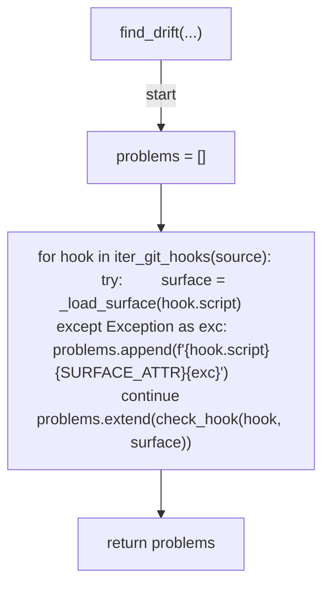
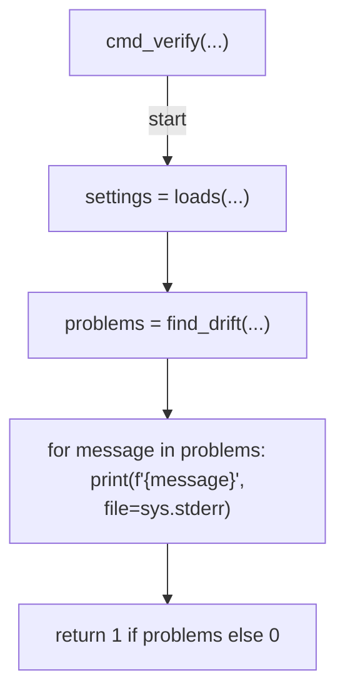
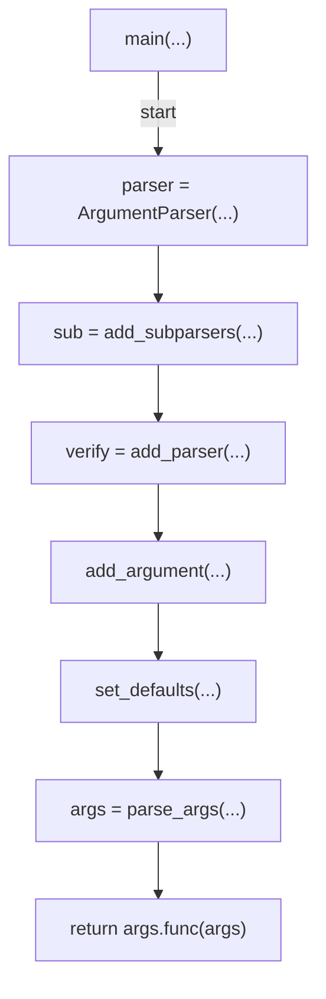

# AST graph: scripts/scan_hook_predicate_surface_drift.py

This file is generated from `scripts/scan_hook_predicate_surface_drift.py` by `python3 scripts/script_ast_graph.py all-doc`. Do not edit it by hand: content under `docs/generated/scripts/` is owned by the post-merge automation (refs #1540); update the source script instead.

## _predicate_inner(...)

## _is_git_predicate(...)

## iter_git_hooks(...)

## _load_surface(...)

## _admits(...)

## check_hook(...)

## find_drift(...)

## cmd_verify(...)

## main(...)

