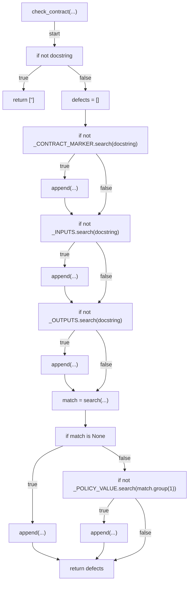
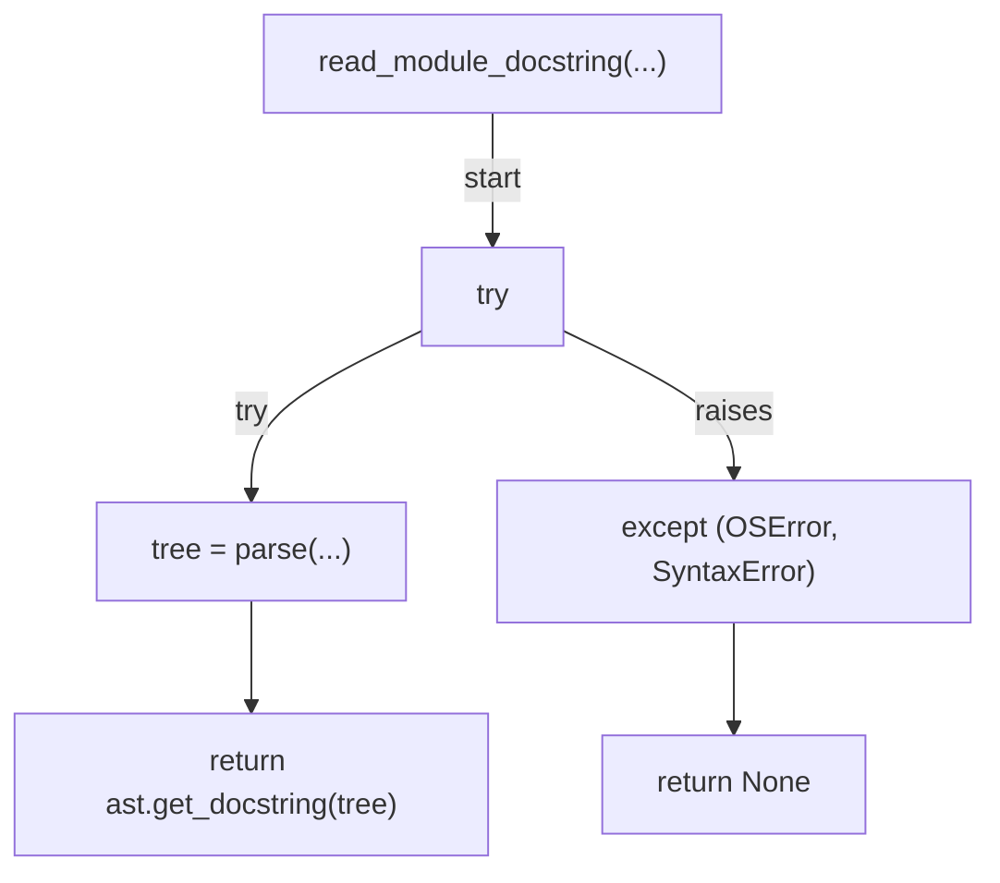
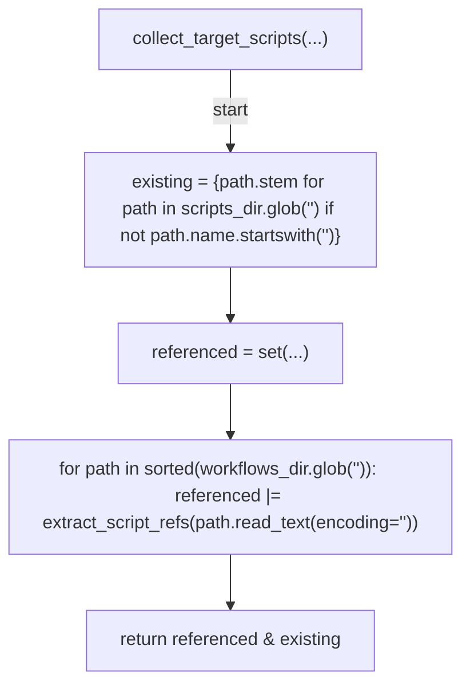
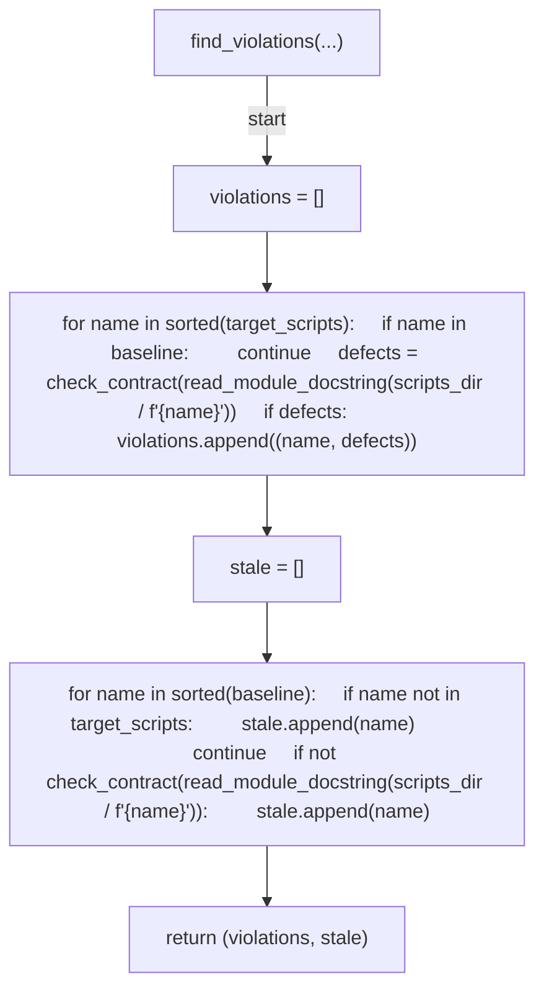
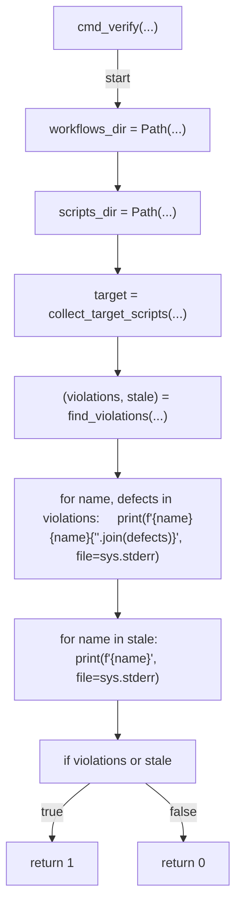
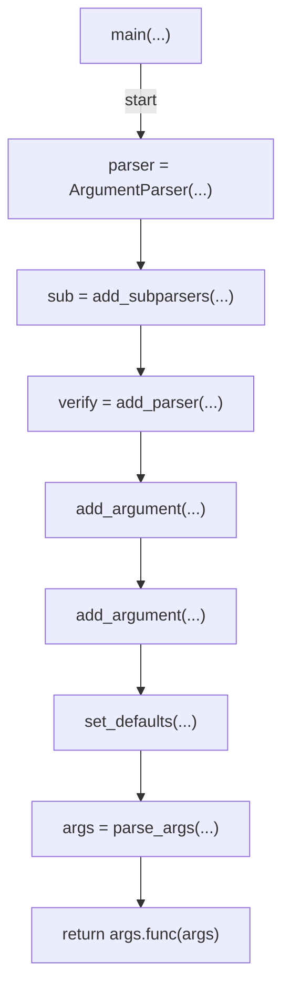

# AST graph: scripts/scan_input_contract_drift.py

This file is generated from `scripts/scan_input_contract_drift.py` by `python3 scripts/script_ast_graph.py all-doc`. Do not edit it by hand: content under `docs/generated/scripts/` is owned by the post-merge automation (refs #1540) -- update the source script instead.

## check_contract(...)

## read_module_docstring(...)

## collect_target_scripts(...)

## find_violations(...)

## cmd_verify(...)

## main(...)

